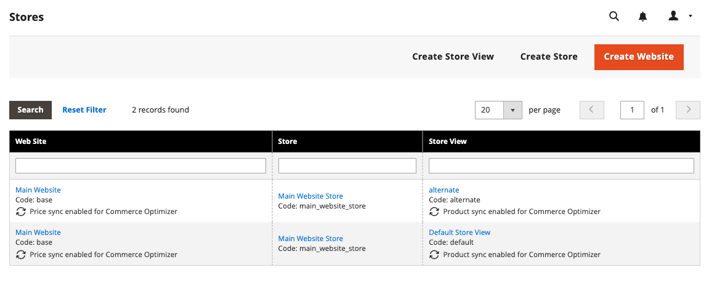

# Configurare il connettore per il Commerce B2B

I commercianti che utilizzano [!DNL Adobe Commerce] cataloghi B2B condivisi possono utilizzare [!DNL Adobe Commerce Optimizer Connector for B2B] per sincronizzare i dati e la configurazione del catalogo condiviso personalizzato con [!DNL Adobe Commerce Optimizer].

{{aco-integration-environment-alignment}}

## Requisiti per l’utilizzo dell’integrazione {#requirements-to-use-the-integration}

* Adobe Commerce 2.4.8+ con [Commerce B2B versione 1.5.3+](https://experienceleague.adobe.com/en/docs/commerce-admin/b2b/install) installato e abilitato.

* Licenza [!DNL Commerce Optimizer] con istanza sandbox predisposta.

* [Chiavi di autenticazione](https://experienceleague.adobe.com/en/docs/commerce-operations/installation-guide/prerequisites/authentication-keys) per scaricare il pacchetto meta del connettore tramite Composer.

* Accesso amministratore a un&#39;istanza [[!DNL Commerce Optimizer] sandbox](../optimizer/get-started.md).

L&#39;utente [!DNL Adobe Commerce] che configura l&#39;integrazione deve avere:

* Accesso amministratore all’amministrazione di Commerce.

* [Accesso alla riga di comando al  [!DNL Adobe Commerce] server applicazioni](https://experienceleague.adobe.com/en/docs/commerce-on-cloud/user-guide/project/user-access).

* Accesso per sviluppatori all&#39;organizzazione [IMS](https://experienceleague.adobe.com/en/docs/core-services/interface/administration/organizations?) in cui è stato eseguito il provisioning del progetto [!DNL Commerce Optimizer].

### Requisiti dell’applicazione

* Commerce cron e gli indicizzatori funzionano normalmente.
* I siti web e le visualizzazioni archivio richiesti identificati per l’esportazione.
* Cataloghi condivisi, assegnazioni aziendali, assortimento e prezzi B2B configurati o pronti per la configurazione in Adobe Commerce.

>[!BEGINSHADEBOX]

## Rimuovere le estensioni in conflitto {#remove-conflicting-extensions}

{{$include /help/_includes/aco-connector/remove-conflicting-extensions.md}}

>[!ENDSHADEBOX]

## Passaggi di configurazione {#configuration-steps}

Per abilitare [!DNL Adobe Commerce Optimizer Connector for B2B] e iniziare la sincronizzazione della configurazione personalizzata del catalogo condiviso da [!DNL Adobe Commerce] all&#39;istanza [!DNL Commerce Optimizer], eseguire la procedura seguente.

1. **[Installa il  [!DNL Adobe Commerce Optimizer Connector for B2B] pacchetto](#install-the-adobe-commerce-optimizer-connector-for-B2B-package)** utilizzando Composer per connettere l&#39;istanza [!DNL Adobe Commerce] a [!DNL Commerce Optimizer].

1. **[Personalizzare la configurazione di esportazione degli ambiti di Commerce](#data-export-and-scope-mapping)** dall&#39;amministratore.

1. **[Abilita l&#39;integrazione [!DNL Commerce Optimizer] ](#enable-the-adobe-commerce-optimizer-integration)**.

1. **[Verificare che la sincronizzazione dei dati funzioni](#verify-that-the-data-sync-is-working)**.

## Installa il pacchetto [!DNL Adobe Commerce Optimizer Connector for B2B] {#install-the-adobe-commerce-optimizer-connector-for-B2B-package}

[!DNL Adobe Commerce Optimizer Connector for B2B] viene consegnato come metapacchetto Composer disponibile per tutti i commercianti Commerce con una licenza attiva per [!DNL Commerce Optimizer].

### Passaggi per l’installazione

1. Aggiungi il modulo `adobe-commerce/commerce-data-export-aco-adapter-b2b` tramite Compositore:

   ```shell
   composer require adobe-commerce/commerce-data-export-aco-adapter-b2b
   ```

1. Distribuire le modifiche nell&#39;ambiente di staging [!DNL Adobe Commerce].

   Al termine della distribuzione, l&#39;opzione [!DNL Commerce Optimizer] è disponibile nel menu di amministrazione di Commerce. Seleziona **[!UICONTROL Commerce Optimizer]** per aprire l&#39;istanza di [!DNL Commerce Optimizer] direttamente dall&#39;amministratore di Commerce.

{{install-extension-links}}

### Esportazione dei dati e mappatura dell&#39;ambito

Seleziona i siti web e archivia le visualizzazioni da sincronizzare, quindi verifica i feed iniziali. Per B2B, il connettore utilizza gli ambiti abilitati quando proietta i dati del catalogo condiviso in [!DNL Commerce Optimizer].

* **Visualizzazione archivio** → origine catalogo con contenuto prodotto localizzato
* **Sito Web e gruppo di clienti** → listino prezzi per sito Web e gruppo di clienti
* **Catalogo condiviso** → la visualizzazione del catalogo privato protetto e i criteri applicati

Il catalogo condiviso definisce l’assortimento di prodotti e ogni vista store abilitata fornisce l’origine del catalogo localizzato. Il sito Web e il gruppo di clienti determinano il listino prezzi applicabile. Il connettore proietta ogni catalogo condiviso personalizzato per ogni visualizzazione store abilitata, pertanto non è necessario un’impostazione di ambito separata per la proiezione B2B.

Un catalogo condiviso personalizzato può generare più visualizzazioni di catalogo privato protette, una per ogni visualizzazione di archivio abilitata. Il catalogo condiviso pubblico predefinito non viene proiettato come vista di catalogo privato B2B. Per informazioni dettagliate sulla mappatura degli oggetti e sul flusso di autorizzazione runtime, vedere [Proiezione del catalogo condiviso B2B](b2b-shared-catalog-projection.md).

>[!IMPORTANT]
>
>La modifica delle impostazioni di esportazione attiva una reindicizzazione completa, che può richiedere molto tempo a seconda delle dimensioni del catalogo. Configura gli ambiti di Commerce prima di abilitare l’integrazione e avviare la sincronizzazione dati iniziale.

### Per modificare le impostazioni di esportazione dell&#39;ambito

1. In Amministrazione Commerce, vai a **[!UICONTROL Stores]** > **[!UICONTROL Settings]** > **[!UICONTROL All Stores]**.

1. Seleziona la visualizzazione del sito web o store che desideri configurare.

1. Nelle impostazioni dell&#39;utilità di esportazione **[!DNL Commerce Optimizer]**, utilizzare la casella di controllo per abilitare o disabilitare la sincronizzazione dei dati in base alle esigenze.

   {width="500" zoomable="yes"}

1. Salva le modifiche.

### Attivare e disattivare il comportamento

| Azione | Risultato |
| -------- | -------- |
| Disattiva una visualizzazione store | **La disabilitazione della sincronizzazione rimuove i dati del catalogo dalla vetrina B2B.** L&#39;origine del catalogo rimane in [!DNL Adobe Commerce Optimizer], ma tutti i dati sincronizzati vengono rimossi alla successiva esecuzione cron. |
| Disattiva e riattiva la visualizzazione dello store | La stessa origine del catalogo viene ripopolata con una risincronizzazione completa dei dati. |

### Monitorare le modifiche al catalogo condiviso B2B

Il connettore controlla se sono presenti modifiche ai cataloghi condivisi e alle assegnazioni aziendali. Quando rimuovi un catalogo condiviso in Commerce Admin, il connettore rimuove l’accesso alla relativa vista del catalogo privato dopo un periodo di tolleranza configurabile.

>[!NOTE]
>
>Il periodo di tolleranza per l’eliminazione è impostato automaticamente su sette giorni. Puoi modificarlo aggiornando la configurazione delle impostazioni di sincronizzazione della vista catalogo. Vedi la [configurazione dello stato di sincronizzazione della visualizzazione catalogo](catalog-view-sync-status.md#configure-aco-catalog-view-sync-settings).

## Abilita l&#39;integrazione di [!DNL Commerce Optimizer] {#enable-the-adobe-commerce-optimizer-integration}

Abilitare l&#39;integrazione e avviare la sincronizzazione dei dati eseguendo il comando CLI `aco:config:init`. Questo comando completa i passaggi seguenti:

1. Ottiene un token di accesso IMS utilizzando le credenziali fornite come argomenti della riga di comando.
1. Chiama il servizio Commerce Cloud Manager (CCM) in `https://ccm.api.commerce.adobe.com/api/v1/tenants/{tenantId}/owner/{orgId}` per convalidare il tenant ed estrarre l&#39;URL di acquisizione e l&#39;URL di [!DNL Commerce Optimizer] Studio.
1. Salva tutta la configurazione (segreto client crittografato) in `core_config_data`.
1. Pianifica la sincronizzazione completa iniziale invalidando tutti gli indicizzatori di feed [!DNL Commerce Optimizer].

{{aco-data-sync-processing-note}}

## Ottieni i dettagli di connessione richiesti

{{$include /help/_includes/aco-connector/connection-details.md}}

### Ottieni dettagli istanza [!DNL Commerce Optimizer]

{{$include /help/_includes/aco-connector/configure-connection.md}}

## Verifica che la sincronizzazione dei dati funzioni {#verify-that-the-data-sync-is-working}

{{$include /help/_includes/aco-connector/verify-optimizer-data-sync.md}}

## Passaggi successivi

1. **Monitorare la proiezione della visualizzazione del catalogo B2B**

Dopo la sincronizzazione iniziale dei feed, utilizza [Stato sincronizzazione visualizzazione catalogo](catalog-view-sync-status.md) per verificare le visualizzazioni del catalogo privato previste, i criteri, i riferimenti al listino prezzi e la configurazione della chiave di accesso con restrizioni. Per il modello di proiezione e il flusso di autorizzazione runtime, vedere [Proiezione catalogo condiviso B2B](b2b-shared-catalog-projection.md).

1. **Configura una vetrina Commerce su[!DNL Edge Delivery Services]**

   Per connettere la vetrina all&#39;istanza [!DNL Commerce Optimizer] e iniziare a distribuire esperienze e-commerce personalizzate, segui la [documentazione di configurazione della vetrina](https://experienceleague.adobe.com/en/tools/commerce-storefront/setup/){target="_blank"}.
