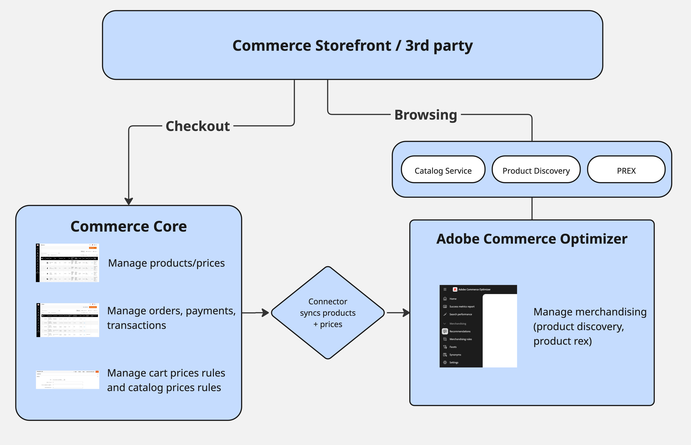

# [!DNL Adobe Commerce Optimizer Connector]

[!DNL Adobe Commerce Optimizer Connector] è un&#39;integrazione nativa di prima parte tra [!DNL Adobe Commerce] (cloud o locale) e [!DNL Adobe Commerce Optimizer]. Sincronizza i dati del catalogo e dei prezzi dagli archivi di [!DNL Adobe Commerce] in [!DNL Adobe Commerce Optimizer] in modo da poter:

- Potenti **Consigli e individuazione dei prodotti basati sull&#39;intelligenza artificiale**
- Esegui **storefront headless ad alte prestazioni** (inclusi gli storefront Commerce basati su [!DNL Edge Delivery Services])
- Analizza **prima e dopo** KPI e integrità della sincronizzazione dati in un&#39;unica posizione

[!DNL Adobe Commerce] rimane il tuo sistema di record per prodotti, prezzi e struttura del catalogo. [!DNL Adobe Commerce Optimizer] diventa il tuo livello di esperienza e merchandising, fornendo risultati rapidi e rilevanti per qualsiasi vetrina o canale connesso.

## Vantaggi chiave {#key-benefits}

| Beneficio | Che cosa significa per te |
| --- | --- |
| **Nessun connettore personalizzato da compilare** | Utilizza un’integrazione supportata di prima parte invece di scrivere e mantenere feed e script personalizzati. |
| **Time to value più rapido con[!DNL Adobe Commerce Optimizer]** | Attiva Ricerche IA, consigli e vetrine headless sopra la distribuzione [!DNL Adobe Commerce] esistente. |
| **Allineato con ambiti Commerce** | Mappa automaticamente siti Web, visualizzazioni dello store e gruppi di clienti in [!DNL Adobe Commerce Optimizer] costrutti di catalogo (origini catalogo e listini prezzi). |
| **Visibilità operativa** | Monitora lo stato di integrità dei feed, gli orari dell&#39;ultima sincronizzazione e lo stato per SKU da una visualizzazione [!UICONTROL Data Feed Sync Status] dedicata. |
| **Percorso pronto per il futuro verso SaaS** | Fornisce un percorso di migrazione graduale da Commerce sul cloud o on-premise a [!DNL Adobe Commerce as a Cloud Service] + [!DNL Adobe Commerce Optimizer], senza riformattazione. |

## Architettura del connettore {#connector-architecture}

Nel diagramma seguente viene illustrata l&#39;architettura end-to-end del connettore, da [!DNL Adobe Commerce] a [!DNL Adobe Commerce Optimizer] e in uscita verso gli storefront e i sistemi di pagamento.

{width="700" zoomable="yes"}

In questa architettura:

- [!DNL Adobe Commerce] (su cloud o on-premise) è il sistema del produttore di record e feed
- Il connettore esporta i feed di catalogo, prezzo e categoria
- [!DNL Adobe Commerce Optimizer] acquisisce e normalizza i dati di feed nelle origini di catalogo, nei listini prezzi e nelle visualizzazioni di catalogo
- Storefront (Commerce storefront su [!DNL Edge Delivery Services] o build headless personalizzate) chiama [!DNL Adobe Commerce Optimizer] API GraphQL per l&#39;individuazione e i consigli e chiama [!DNL Adobe Commerce] o un&#39;altra piattaforma di terze parti connessa per le operazioni di carrello e pagamento

Basato su [[!DNL SaaS Data Export]](/help/data-export/overview.md), il connettore mappa i feed raccolti nel formato [!DNL Catalog Data Ingestion API] e gestisce l&#39;autenticazione e l&#39;invio. Per informazioni sul comportamento della sincronizzazione, sul controllo dell&#39;ambito e sulla gestione degli errori, vedere [Pipeline di sincronizzazione del connettore](/help/aco-connector/connector-sync-pipeline.md).

## Funzionamento del connettore con [!DNL Adobe Commerce] {#how-the-connector-works-with-adobe-commerce}

[!DNL Adobe Commerce Optimizer Connector] supporta la sincronizzazione del catalogo B2C. Sincronizza i feed di catalogo e di determinazione prezzi da un&#39;istanza [!DNL Adobe Commerce] e esegue il mapping delle visualizzazioni dello store, dei siti Web e dei gruppi di clienti alle origini del catalogo e ai listini prezzi in [!DNL Adobe Commerce Optimizer]. Non sincronizza la configurazione del catalogo condiviso B2B o dell’assegnazione della società. Dopo la sincronizzazione, configurare le visualizzazioni e i criteri del catalogo in [!DNL Adobe Commerce Optimizer] Studio.

![Mappatura dei dati di [!DNL Adobe Commerce] su [!DNL Adobe Commerce Optimizer]](./assets/storeview-to-catalogview-mapping.png){width="750" zoomable="yes"}

### Mappatura del catalogo di base

Il connettore mappa i dati del catalogo [!DNL Adobe Commerce] al modello di catalogo [!DNL Adobe Commerce Optimizer]:

- **Visualizzazione archivio → Origini catalogo**. Ogni visualizzazione archivio diventa un&#39;origine catalogo separata in [!DNL Adobe Commerce Optimizer]. Tale origine include attributi di prodotto localizzati ed eventuali dati specifici della vista archivio.
- **Siti Web → Listini prezzi**: ogni sito Web [!DNL Adobe Commerce] è associato a uno o più listini prezzi in [!DNL Adobe Commerce Optimizer]. La determinazione dei prezzi del sito Web e la determinazione dei prezzi del gruppo di clienti vengono esportate come listini prezzi e inserimenti di prezzi.
- **Gruppo di clienti → Inserimenti nel listino prezzi** — [!DNL Adobe Commerce] vengono visualizzati come inserimenti aggiuntivi nei listini prezzi pertinenti.

Dopo che il connettore ha sincronizzato i dati del catalogo, configurare il modello di merchandising in [!DNL Adobe Commerce Optimizer] Studio. Ad esempio, configura:

- **Visualizzazioni catalogo e criteri** per sottoinsiemi specifici per area geografica, marchio o cliente
- **Individuazione prodotto** per regole di ricerca, facet e merchandising
- **[!DNL Product Recommendations]**

### Comportamento del connettore B2B {#b2b-shared-catalog-projection-specification}

[!DNL Adobe Commerce Optimizer Connector for B2B] estende il connettore di base con una proiezione unidirezionale della configurazione del catalogo condiviso B2B e dell&#39;assegnazione della società in esperienze di catalogo protette. [!DNL Adobe Commerce] rimane la fonte di verità per i dati di catalogo e di determinazione prezzi; il connettore B2B si basa sul catalogo di base e sulla sincronizzazione dei prezzi e gestisce le proiezioni generate dal connettore.

Per la mappatura della proiezione, il flusso di autorizzazione runtime e il limite di protezione, vedere [Proiezione del catalogo condiviso B2B](b2b-shared-catalog-projection.md). Per le istruzioni di installazione, vedere [Introduzione al connettore B2B](/help/aco-connector/get-started-b2b-shared-catalogs.md).

>[!NOTE]
>
>Per informazioni dettagliate sulla configurazione di [!DNL Adobe Commerce Optimizer], vedere [[!DNL Adobe Commerce Optimizer] Strumenti di merchandising](/help/optimizer/overview.md#quick-tour).

## Flussi di lavoro tipici {#typical-workflows}

Questi flussi di lavoro descrivono la configurazione e l&#39;utilizzo di [!DNL Adobe Commerce Optimizer Connector] da parte dei team. Per informazioni dettagliate su come impostare l&#39;integrazione e abilitare questi flussi di lavoro, vedere [Introduzione](/help/aco-connector/get-started.md).

### Configurazione iniziale {#initial-setup}

Consulta [Passaggi di configurazione](/help/aco-connector/get-started.md#configuration-steps) nella _Guida introduttiva_.

### Sincronizzazione dei dati in corso {#ongoing-sync}

Dopo la configurazione iniziale, il connettore supporta:

- **Sincronizzazione catalogo completa** per la migrazione iniziale o modifiche strutturali di grandi dimensioni
- **Sincronizzazioni delta** per aggiornamenti continui quando cambiano prodotti o prezzi
- **Risincronizza comandi** per la sincronizzazione dei feed di destinazione

Per informazioni sul comportamento di sincronizzazione automatica, le pianificazioni dei cron e la gestione degli errori, vedere [Pipeline di sincronizzazione del connettore](/help/aco-connector/connector-sync-pipeline.md). Prima di una sincronizzazione completa del catalogo o di un aggiornamento di grandi dimensioni, utilizzare [Stimare il volume dei dati e il tempo di sincronizzazione](/help/aco-connector/reference/estimate-data-volume-sync-time.md) per pianificare la tempistica ed evitare interruzioni del sito.

I seguenti feed sono disponibili per [!DNL Adobe Commerce Optimizer Connector]:

- `products` - dati prodotti
- `productAttributes` - metadati per attributi prodotto
- `priceBooks` - listini prezzi
- `prices` - prezzi dei prodotti
- `categories` - dati categorie

Per ulteriori dettagli, vedi i seguenti argomenti:

- Verificare la sincronizzazione dei dati del catalogo e risincronizzare manualmente i feed del connettore: [Gestisci sincronizzazione](/help/aco-connector/data-sync-status.md)
- Per le operazioni di risincronizzazione CLI [!DNL Adobe Commerce], vedere [Sincronizzare i feed utilizzando Commerce CLI](/help/data-export/data-export-cli-commands.md)
- [[!DNL Adobe Commerce Optimizer Connector] moduli ed endpoint di feed](/help/aco-connector/reference/connector-reference.md)
- [Mappatura dei campi per i feed del connettore](/help/aco-connector/reference/field-mapping.md)

### Configurare merchandising e vetrine {#merchandising-storefronts}

Quando i dati di [!DNL Adobe Commerce] saranno disponibili in [!DNL Adobe Commerce Optimizer], utilizza [[!DNL Adobe Commerce Optimizer] Studio](/help/optimizer/overview.md#quick-tour) per collegare le esperienze di merchandising e vetrina al catalogo sincronizzato. I passaggi successivi tipici includono:

- **Visualizzazioni e criteri catalogo**: per il connettore di base, definire sottoinsiemi specifici per area geografica, marchio o cliente e regole di accesso dal menu [!UICONTROL Store setup]. Per limitare gli utenti che possono eseguire query in una visualizzazione catalogo, vedere [Visualizzazioni catalogo privato](/help/optimizer/setup/private-catalog-view.md)
- **Individuazione prodotti e consigli**: configurare ricerca, facet, regole di merchandising, sinonimi e unità di consigli nel menu [!UICONTROL Merchandising]. Il comportamento di ricerca e consigli è gestito in [!DNL Adobe Commerce Optimizer]; le impostazioni [!DNL Live Search] e [!DNL Product Recommendations] dell&#39;amministratore [!DNL Adobe Commerce] non sono più applicabili a questi flussi
- **Connessioni storefront** - Punta gli storefront Commerce su [!DNL Edge Delivery Services] o build headless di terze parti al tenant [!DNL Adobe Commerce Optimizer], alla vista catalogo e agli endpoint API Merchandising corretti. Per le integrazioni headless personalizzate, consulta [Integrazione headless storefront](/help/aco-connector/headless-storefront.md). Per un esempio di integrazione di terze parti, vedere [Salesforce Commerce Connector per [!DNL Adobe Commerce Optimizer]](/help/optimizer/developer/salesforce-connector.md)
- **Estrai**: mantieni il carrello, l&#39;estrazione, la gestione degli ordini e gli account cliente su [!DNL Adobe Commerce] o su una piattaforma di terze parti connessa. Utilizza [!DNL App Builder] e [!DNL API Mesh] per la consegna del carrello quando necessario

Per istruzioni dettagliate sulla configurazione, consulta [Introduzione](/help/aco-connector/get-started.md) e [[!DNL Adobe Commerce Optimizer] Strumenti di merchandising](/help/optimizer/overview.md#quick-tour).

## Scenari supportati {#supported-scenarios}

La base [!DNL Adobe Commerce Optimizer Connector] supporta i commercianti B2C con [!DNL Adobe Commerce] in implementazioni cloud e locali che desiderano adottare [!DNL Adobe Commerce Optimizer] senza ricreare il back-end.

[!DNL Adobe Commerce Optimizer Connector for B2B] separato estende il connettore di base per sincronizzare la configurazione del catalogo condiviso e proiettare automaticamente i cataloghi condivisi personalizzati come viste di catalogo private. Per informazioni dettagliate, vedere [Proiezione del catalogo B2B](b2b-shared-catalog-projection.md).

**Casi d&#39;uso comuni:**

- **Migrazione della vetrina ad Edge Delivery**
Mantieni il backend [!DNL Adobe Commerce] esistente, sposta PLP/Search/PDP in [!DNL Edge Delivery Services] storefront con tecnologia [!DNL Adobe Commerce Optimizer].

- **Scalabilità delle prestazioni di catalogo e ricerca**
Offload dell&#39;indicizzazione del catalogo e della ricerca in [!DNL Adobe Commerce Optimizer] servizi SaaS (Software as a Service) mantenendo la proprietà del prodotto e del prezzo in [!DNL Adobe Commerce].

## Responsabilità e prerequisiti per l’attuazione {#responsibilities-prerequisites}

[!DNL Adobe Commerce] è il sistema di registrazione per prodotti, prezzi e gruppi di clienti. Apportare le modifiche in [!DNL Adobe Commerce] e il connettore le sincronizza in [!DNL Adobe Commerce Optimizer].

**[!DNL Adobe Commerce Optimizer]è responsabile di:**

- Modellazione catalogo (origini catalogo, listini prezzi, viste catalogo, criteri)
- Individuazione dei prodotti e raccomandazioni
- Metriche di Storefront, dashboard di sincronizzazione dati e rapporti sulle metriche di successo

**Il connettore non:**

- Modifica [!DNL Adobe Commerce] carrello, pagamento o flussi di ordini
- Provisioning automatico dei progetti storefront (Commerce Storefront / [!DNL Edge Delivery Services] handle di strumenti che)

**Prima di iniziare:**

- Verificare che [!DNL Adobe Commerce] soddisfi i requisiti minimi di versione e [!DNL Adobe Commerce Optimizer Connector]. Per ulteriori dettagli, vedere [Introduzione](/help/aco-connector/get-started.md#requirements-to-use-the-integration).
- Assicurati di disporre dell’accesso all’organizzazione IMS, di un’istanza [!DNL Adobe Commerce Optimizer] e delle credenziali e dei dettagli dell’area geografica necessari.

>[!MORELIKETHIS]
>
> - [Introduzione a  [!DNL Adobe Commerce Optimizer Connector]](/help/aco-connector/get-started.md): configurare l&#39;integrazione e abilitare i flussi di lavoro chiave.
> - [Pipeline di sincronizzazione del connettore](/help/aco-connector/connector-sync-pipeline.md): comprendere il meccanismo di sincronizzazione, l&#39;inizializzazione e la gestione degli errori.
> - [Gestisci sincronizzazione](/help/aco-connector/data-sync-status.md): verifica la sincronizzazione dei dati del catalogo e i feed di risincronizzazione manualmente.
> - [Mappatura dei campi per i feed del connettore](/help/aco-connector/reference/field-mapping.md) — Rivedi la mappatura dei dati a livello di campo per tutti i feed.
> - [Risoluzione dei problemi di scenari](/help/aco-connector/troubleshooting/troubleshooting-scenarios.md) — Risoluzione dei problemi di configurazione errata o di risultati di sincronizzazione imprevisti.
> - [Note sulla versione](/help/aco-connector/release-notes.md) — Esamina gli aggiornamenti del connettore e i problemi noti.
