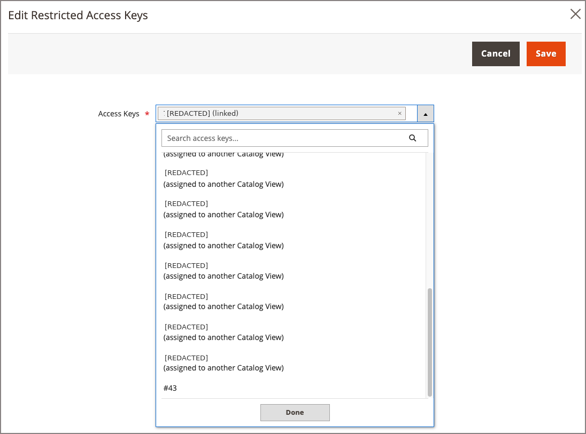

# Gestire le chiavi di accesso con restrizioni per i cataloghi condivisi B2B

[!BADGE Private Beta]{type=Caution tooltip="Richiede l’estensione B2B del connettore Adobe Commerce Optimizer, attualmente in versione beta privata."}

Se utilizzi [!DNL Adobe Commerce] cataloghi B2B condivisi con [!DNL Adobe Commerce Optimizer Connector B2B extension], l&#39;estensione genera e assegna automaticamente la prima chiave di accesso con restrizioni al momento della creazione di una vista catalogo. Utilizzare la pagina [!UICONTROL Restricted Access Keys] dell&#39;amministratore di Commerce per visualizzare tale chiave e per creare, assegnare o eliminare chiavi aggiuntive.

{width="800" zoomable="yes"}

>[!NOTE]
>
>Per gestire le chiavi create manualmente per casi di utilizzo non B2B, ad esempio portali partner, vedere [Chiavi di accesso con restrizioni](/help/optimizer/setup/restricted-access-keys.md#create-a-restricted-access-key).

## Accedere alla pagina {#access-the-page}

Dall&#39;amministratore di Commerce, passa a **[!UICONTROL System]** > **[!UICONTROL Data Transfer]** > **[!UICONTROL Restricted Access Keys]**.

È possibile assegnare una chiave alla vista catalogo dalla griglia Catalogo condiviso o dalla griglia Società. Vedi [Assegnare le chiavi a una vista di catalogo condiviso B2B](#assign-keys-to-a-shared-catalog-view).

>[!NOTE]
>
>Per un riferimento ai campi di questa pagina, [Gestione chiavi di accesso con restrizioni](https://experienceleague.adobe.com/it/docs/commerce-admin/systems/data-transfer/data-sync/catalog-view-sync/restricted-access-keys){target="_blank"} nella *Guida per l&#39;amministratore di Commerce*.—>

## Quando è necessario più del tasto automatico {#when-you-need-more-than-the-automatic-key}

La chiave automatica generata da [!DNL Adobe Commerce Optimizer Connector B2B extension] copre la maggior parte dei cataloghi condivisi B2B senza richiedere alcuna azione da parte dell&#39;utente. Gestisci autonomamente le chiavi in questi casi:

- **Rotazione di una chiave**—Crea una nuova chiave, assegnala alla vista catalogo insieme a quella esistente, conferma che funziona, quindi elimina la chiave precedente. La rotazione automatica non è ancora disponibile.
- **Impossibile collegare una chiave**. Se [Stato sincronizzazione visualizzazione catalogo](catalog-view-sync-status.md) mostra una deriva relativa alla chiave, provare a salvare di nuovo l&#39;assegnazione della visualizzazione catalogo per riprovare il collegamento non riuscito. Se il problema persiste, eseguire [!UICONTROL Reconcile & Repair] per ripristinare la chiave o lo stato prima di creare una sostituzione. Creare una chiave di sostituzione solo se è scaduta o se l&#39;errore è irreversibilmente irreversibile.
- **Trova una chiave pubblica**. Nella pagina Chiavi di accesso limitate, selezionare **[!UICONTROL View Public Key]** per visualizzare e copiare la chiave pubblica di una chiave.

A una vista catalogo possono essere assegnate fino a tre chiavi alla volta. Durante la rotazione delle chiavi, [!DNL Adobe Commerce Optimizer] accetta i token firmati da qualsiasi chiave non scaduta assegnata. Non è previsto alcun passaggio manuale per impostare una chiave &quot;attiva&quot;.

## Creare una chiave

Nella pagina [!UICONTROL Restricted Access Keys], creare una chiave selezionando **[!UICONTROL Create Key]**.

Commerce genera una nuova coppia di chiavi e contiene la chiave privata. La tabella Chiavi di accesso con restrizioni viene aggiornata con una nuova voce di chiave che mostra l&#39;ID di chiave univoco. Utilizzare [!UICONTROL Key ID] quando si assegna la chiave a una visualizzazione catalogo.

La chiave pubblica non è registrata con [!DNL Adobe Commerce Optimizer] finché non viene assegnata a una visualizzazione catalogo. Dopo la registrazione, la voce della tabella Chiave di accesso limitato viene aggiornata per mostrare l&#39;assegnazione del catalogo e la data di scadenza.

## Assegnare le chiavi a una vista catalogo proiettata da un catalogo condiviso B2B {#assign-keys-to-a-shared-catalog-view}

Assegnare o annullare l&#39;assegnazione delle chiavi dalla vista catalogo dall&#39;account società o dalla pagina del catalogo condiviso, non dalla griglia principale [!UICONTROL Restricted Access Keys].

Una vista catalogo deve avere almeno una chiave e può averne al massimo tre.

- Se si tenta di assegnare una quarta chiave, viene visualizzato un messaggio di errore quando si tenta di salvare il valore: `A Catalog View can have at most 3 access keys.`
- Se una vista catalogo dispone di una sola chiave, non è possibile eliminarla o annullarne l&#39;assegnazione.

Per aggiornare la configurazione della chiave di visualizzazione del catalogo, puoi accedervi dalla pagina dell’account della società o dalla pagina del catalogo condiviso.

>[!BEGINTABS]

>[!TAB Gestione chiavi da un account aziendale]

1. Dall&#39;amministratore di Commerce, apri la pagina dell&#39;azienda (**[!UICONTROL Customers]** > **[!UICONTROL Companies]**).

1. Nella colonna [!UICONTROL Action] per la società, selezionare [!UICONTROL Edit].

1. Per visualizzare l&#39;elenco delle visualizzazioni di catalogo proiettate dal catalogo condiviso assegnato alla società, espandere la sezione _[!UICONTROL Catalog Views]_.

Nella scheda sono elencate le viste catalogo proiettate dal catalogo condiviso, incluse le chiavi assegnate.

1. Nella colonna [!UICONTROL Actions] per la visualizzazione catalogo da aggiornare, selezionare **[!UICONTROL Edit Restricted Access Keys]**.

   {width="500" zoomable="yes"}

1. Per assegnare una chiave, selezionare l&#39;elenco a discesa **[!UICONTROL Access Keys]**. Quindi, seleziona una chiave non assegnata da [!UICONTROL key ID], ad esempio `#42`. Quindi fare clic su [!UICONTROL Done] per assegnarlo alla visualizzazione del catalogo.

   Le chiavi già assegnate a un’altra vista catalogo vengono etichettate di conseguenza.

1. Per rimuovere un token di accesso, rimuoverlo dal campo [!UICONTROL Access Tokens] selezionando il controllo `x` nell&#39;etichetta della chiave.

1. Per salvare e applicare gli aggiornamenti della configurazione, selezionare **[!UICONTROL Save]**.

>[!TAB Gestione chiavi da un catalogo condiviso]

1. Dall&#39;amministratore di Commerce, apri la pagina del catalogo condiviso (**[!UICONTROL Catalog]** > **[!UICONTROL Shared catalogs]**).

1. Nella colonna [!UICONTROL Action] per la condivisione, scegliere **[!UICONTROL General Settings]** dal menu [!UICONTROL Select].

1. Per visualizzare l&#39;elenco delle visualizzazioni catalogo proiettate dal catalogo condiviso, selezionare **[!UICONTROL Catalog Views]** dal menu [!UICONTROL Shared Catalog Information].

Nella pagina [!UICONTROL Catalog Views] sono elencati l&#39;ID di visualizzazione catalogo, la visualizzazione archivio associata e la chiave di accesso per ogni visualizzazione catalogo.

1. Nella colonna [!UICONTROL Actions] per la visualizzazione catalogo da aggiornare, selezionare **[!UICONTROL Edit Restricted Access Keys]**.

   {width="500" zoomable="yes"}

1. Per assegnare una chiave, selezionare l&#39;elenco a discesa **[!UICONTROL Access Keys]**. Selezionare quindi una chiave non assegnata in base al titolo predefinito, ad esempio `#42`. Quindi fare clic su [!UICONTROL Done] per assegnarlo alla visualizzazione del catalogo.

   Le chiavi già assegnate a un’altra vista catalogo vengono etichettate di conseguenza.

1. Per rimuovere un token di accesso, rimuoverlo dal campo [!UICONTROL Access Tokens] selezionando il controllo `x` nell&#39;etichetta della chiave.

1. Per salvare e applicare gli aggiornamenti della configurazione, selezionare **[!UICONTROL Save]**.

>[!ENDTABS]

## Gestire la scadenza e il rinnovo della chiave

È possibile configurare la durata predefinita delle chiavi per le chiavi ad accesso limitato. Il valore determina la data di scadenza impostata quando l&#39;estensione [!DNL Adobe Commerce Optimizer Connector B2B] genera la chiave iniziale o quando si crea manualmente una nuova chiave.

La data di scadenza viene visualizzata nella colonna [!UICONTROL Expires At] della pagina [!UICONTROL Restricted Access Keys].

Per modificare la durata, passare a **[!UICONTROL Stores]** > [!UICONTROL Settings] > **[!UICONTROL Configuration]** > **[!UICONTROL Services]** > **[!UICONTROL ACO Restricted Access Keys]**. Nella pagina [!UICONTROL Provisioning], aggiornare il campo **[!UICONTROL Default Key Expiry (days)]**. La durata predefinita della chiave di sistema è inizialmente impostata per un periodo prolungato (~100 anni). Assicurati di aggiornarlo a un valore corrispondente ai criteri di sicurezza.

### Rinnovo chiave

Quando una chiave scade entro 10 giorni, la pagina [!UICONTROL Restricted Access Keys] mostra un&#39;icona di avviso accanto alla voce corrispondente. Se non si rinnova la chiave prima della scadenza, la vista catalogo diventa inaccessibile finché non si assegna una nuova chiave.

È possibile creare e assegnare una nuova chiave in qualsiasi momento e rimuovere quella precedente dopo aver verificato che la nuova chiave funziona.

## Limitazioni note

La rotazione automatica dei tasti non è ancora disponibile.

>[!MORELIKETHIS]
>
> - [Gestisci chiavi di accesso con restrizioni](https://experienceleague.adobe.com/it/docs/commerce-admin/systems/data-transfer/data-sync/catalog-view-sync/restricted-access-keys){target="_blank"} — Riferimento completo al campo per questa pagina, nella *Guida per l&#39;amministratore di Commerce* —>
> - [Monitora sincronizzazione visualizzazione catalogo](catalog-view-sync-status.md) — Controlla le visualizzazioni catalogo protette da queste chiavi
> - [Visualizzazioni catalogo privato](/help/optimizer/setup/private-catalog-view.md) — Scopri cos’è una visualizzazione catalogo privato gestita dal connettore
> - [Chiavi di accesso limitate](/help/optimizer/setup/restricted-access-keys.md): scopri come funziona il flusso di chiavi manuale basato su ACO Studio per i casi di utilizzo non B2B
