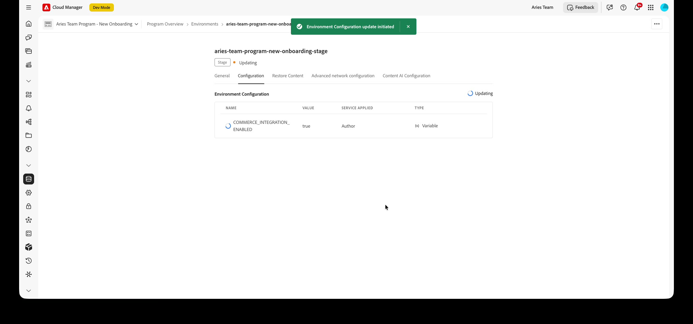
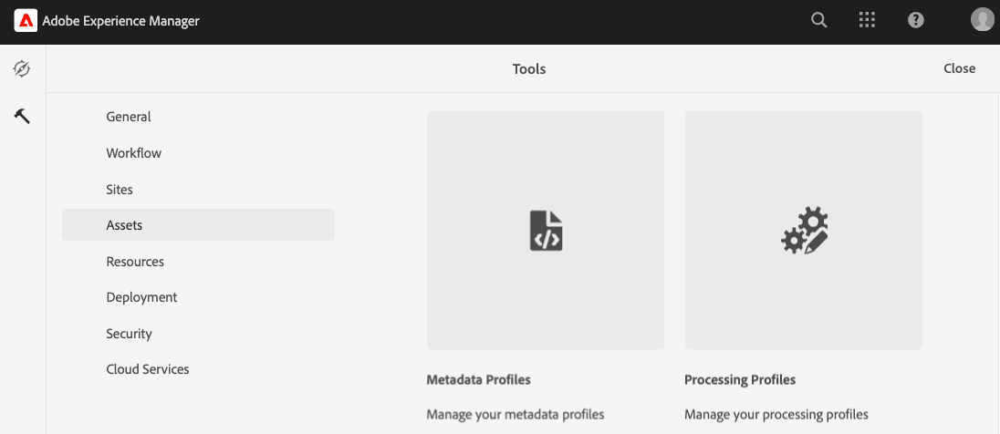

# Configurare il progetto AEM Assets

In questo argomento viene descritto come configurare il progetto AEM Assets in modo che lo spazio dei nomi, lo schema dei metadati e la scheda [!UICONTROL Commerce] di Commerce siano disponibili nell&#39;ambiente di authoring AEM. Per informazioni in background su queste risorse, vedi [Metadati Commerce in AEM Assets](../metadata.md).

Puoi configurare il progetto AEM Assets in due modi:

* [!BADGE Consigliato]{type=Positive} **Onboarding self-service**: nelle versioni di AEM `2026.5.26309` e successive, abilita l&#39;integrazione in Cloud Manager impostando una variabile di ambiente e attivando Dynamic Media con funzionalità OpenAPI. Non è richiesta alcuna distribuzione di codice personalizzato. Vedere [Abilitare l&#39;integrazione di Commerce (self-service)](#enable-aem-commerce-self-service).

* **Configurazione manuale**: distribuire il pacchetto `assets-commerce` tramite una pipeline Cloud Manager. Utilizzare questi passaggi manuali quando è necessario distribuire il codice pacchetto personalizzato o se si utilizza una versione di AEM precedente a `2026.5.26309`. Consulta [Installare manualmente il pacchetto assets-commerce](#install-the-assets-commerce-package-manually).

>[!TIP]
>
>Puoi controllare la versione corrente di AEM dal menu in alto a destra: **[!UICONTROL Help]** > **[!UICONTROL About AEM]**.

## Abilitare l’integrazione con Commerce (self-service) {#enable-aem-commerce-self-service}

[!BADGE Versione supportata]{type=Informative tooltip="Supportato"} di AEM `2026.5.26309` e successive.

Nelle versioni di AEM supportate, abilita l’integrazione di Commerce da Cloud Manager senza distribuire alcun codice personalizzato. Il provisioning dello spazio dei nomi, dello schema dei metadati e della scheda **[!UICONTROL Commerce]** di Commerce viene eseguito automaticamente quando si abilita l&#39;integrazione nel servizio Author.

### Prerequisiti self-service

* [Accesso al programma AEM Cloud Manager e agli ambienti](https://experienceleague.adobe.com/it/docs/experience-manager-cloud-service/content/onboarding/journey/cloud-manager#access-sysadmin-bo) con i ruoli Responsabile del programma e Responsabile della distribuzione.

* Un programma AEM nella versione `2026.5.26309` o successiva.

* L&#39;**ID organizzazione IMS** per l&#39;istanza di Commerce.

  Sia l’istanza di Commerce che l’ambiente di authoring di AEM Assets devono trovarsi nella stessa organizzazione IMS.

### Passaggio 1: creare il programma e gli ambienti

La creazione di un programma in Cloud Manager è un processo di creazione guidata singolo: il programma e i relativi ambienti sono configurati in più passaggi e salvati insieme alla fine.

1. In Cloud Manager, selezionare **[!UICONTROL Add Program]**.

1. Scegliere **[!UICONTROL Set up for production]**, immettere il nome di un programma, quindi selezionare **[!UICONTROL Continue]**.

1. Nel passaggio **[!UICONTROL Solutions & Add-ons]**, seleziona le soluzioni e i componenti aggiuntivi necessari per il progetto, incluso **[!UICONTROL Dynamic Media]**, quindi seleziona **[!UICONTROL Continue]**.

   {width="600" zoomable="yes"}

1. Nel passaggio **[!UICONTROL Add Environment]**, immetti i nomi per gli ambienti **Produzione** e **Gestione temporanea**, quindi seleziona un&#39;area geografica.

   {width="600" zoomable="yes"}

1. Selezionare **[!UICONTROL Save]** per creare il programma con i relativi ambienti.

### Passaggio 2: abilitare la variabile di integrazione Commerce

In Cloud Manager, apri l’ambiente creato nel passaggio 1, quindi:

1. Selezionare la scheda **[!UICONTROL Configuration]**.

1. Aggiungi una variabile di ambiente con i seguenti valori, quindi seleziona **[!UICONTROL Add]** e **[!UICONTROL Save]**:

   | Campo | Valore |
   |---|---|
   | Nome | `COMMERCE_INTEGRATION_ENABLED` |
   | Valore | `true` |
   | Servizio applicato | Autore |
   | Tipo | Variabile |

   {width="600" zoomable="yes"}

   L’ambiente viene aggiornato per applicare la configurazione. Attendere che lo stato dell&#39;ambiente torni a **[!UICONTROL Running]**.

### Passaggio 3: attivare Dynamic Media con le funzionalità OpenAPI

1. Nella scheda dell&#39;ambiente **[!UICONTROL General]**, individuare **[!UICONTROL Dynamic Media]**.

1. Accanto alle *funzionalità OpenAPI disponibili*, selezionare **[!UICONTROL Click to activate]**.

   {width="600" zoomable="yes"}

   L&#39;attivazione viene eseguita in background. Al termine, l’ambiente è pronto per l’integrazione con Commerce.

   >[!NOTE]
   >
   > Se **[!UICONTROL Click to activate]** non è disponibile, apri un ticket di supporto per abilitare Dynamic Media con funzionalità OpenAPI.

### Passaggio 4: Convalidare la configurazione

Passa all&#39;**ambiente di authoring AEM Assets** e apri qualsiasi risorsa. Modificare le proprietà e verificare che lo schema metadati predefinito includa la scheda **[!UICONTROL Commerce]** e che i campi **[!UICONTROL Product Data]** e **[!UICONTROL Eligible for Commerce]** siano visibili.

## Installare manualmente il pacchetto assets-commerce

>[!NOTE]
>
> Utilizzare questo metodo manuale per distribuire il codice del pacchetto personalizzato o se si utilizza AEM release precedenti a `2026.5.26309`. Nelle versioni supportate, utilizza [Abilita l&#39;integrazione Commerce (self-service)](#enable-aem-commerce-self-service).

### Prerequisiti

Per distribuire il codice del pacchetto `assets-commerce` nell&#39;ambiente AEM Assets as a Cloud Service AEM, sono necessarie le risorse e le autorizzazioni seguenti:

* [Accesso al programma e agli ambienti AEM Assets Cloud Manager](https://experienceleague.adobe.com/it/docs/experience-manager-cloud-service/content/onboarding/journey/cloud-manager#access-sysadmin-bo) con i ruoli Responsabile del programma e Responsabile della distribuzione.

* [ambiente di sviluppo AEM locale](https://experienceleague.adobe.com/it/docs/experience-manager-learn/cloud-service/local-development-environment-set-up/overview) e familiarità con il processo di sviluppo locale AEM.

* Comprendere la struttura del progetto [AEM](https://experienceleague.adobe.com/it/docs/experience-manager-cloud-service/content/implementing/developing/aem-project-content-package-structure) e come distribuire pacchetti di contenuti personalizzati con Cloud Manager.

* L&#39;**ID organizzazione IMS** per l&#39;istanza di Commerce. Sia l’istanza di Commerce che l’ambiente di authoring di AEM Assets devono essere nella stessa organizzazione IMS.

* Per abilitare [Dynamic Media con funzionalità OpenAPI](https://experienceleague.adobe.com/it/docs/experience-manager-cloud-service/content/assets/dynamicmedia/dynamic-media-open-apis/dynamic-media-open-apis-overview#enable-dynamic-media-open-apis):

>[!BEGINTABS]

>[!TAB Visualizzazioni prodotto]

[!BADGE Solo SaaS]{type=Positive url="https://experienceleague.adobe.com/it/docs/commerce/user-guides/product-solutions" tooltip="Applicabile solo ai progetti Adobe Commerce as a Cloud Service e Adobe Commerce Optimizer (infrastruttura SaaS gestita da Adobe)."} Dynamic Media con funzionalità OpenAPI è self-service per gli elementi visivi di prodotto basati su AEM Assets.

1. Passa al Cloud Manager.

1. Seleziona l’ambiente desiderato.

1. Abilita **Dynamic Media con funzionalità OpenAPI**.

   Se il pulsante **Dynamic Media con funzionalità OpenAPI** non è attivo, aprire un ticket di supporto.

>[!TAB AEM Assets]

[!BADGE Solo PaaS]{type=Informative tooltip="Applicabile solo ai progetti Adobe Commerce on Cloud (infrastruttura PaaS gestita da Adobe)."} In AEM as a Cloud Service, invia un ticket di supporto Adobe con queste informazioni:

* Title: Abilita Dynamic Media OpenAPI per integrare completamente Adobe Commerce con AEM Assets

   * Contenuto del ticket di supporto:

      * **[!UICONTROL AEM Program ID]**
      * **[!UICONTROL Adobe Commerce URL]**
      * **[!UICONTROL AEM Environment ID]**
      * **[!UICONTROL IMS Org ID]**

Dopo aver inviato il ticket di supporto, Adobe abilita Dynamic Media con funzionalità OpenAPI nell’ambiente Cloud Services e condivide i dettagli, come l’ID client IMS, per consentire all’utente di procedere con l’integrazione.

>[!ENDTABS]

### Passaggi per l’installazione

1. Passa a AEM Cloud Manager, seleziona un programma e [crea ambienti di produzione e di staging](https://experienceleague.adobe.com/it/docs/experience-manager-cloud-service/content/onboarding/journey/create-environments#creating-environments) che desideri integrare con Adobe Commerce.

1. [Clona l&#39;archivio Git gestito da Adobe](https://experienceleague.adobe.com/it/docs/experience-manager-cloud-service/content/sites/administering/site-creation/quick-site/retrieve-access#repo-access) per il programma selezionato.

   {width="600" zoomable="yes"}

   In Cloud Manager **Pipeline**, selezionare **[!UICONTROL Access Repo Info]** per aprire **[!UICONTROL Repository Info]**. Copia il valore **[!UICONTROL URL]** o **[!UICONTROL Git command line]**, genera una password di accesso, se necessario, quindi clona localmente con il client Git.

1. Da GitHub scaricare il codice del pacchetto dall&#39;[archivio Commerce di AEM Assets](https://github.com/ankumalh/assets-commerce).

1. Dall&#39;[ambiente di sviluppo AEM locale](https://experienceleague.adobe.com/it/docs/experience-manager-learn/cloud-service/local-development-environment-set-up/overview), copia manualmente il codice scaricato nell&#39;archivio gestito Adobe esistente.

1. In tutti i file `filter.xml` e `pom.xml` del progetto, sostituisci tutte le occorrenze di &lt;my-app> con il nome dell&#39;app.

   >[!NOTE]
   >
   > In alternativa, puoi installare il codice personalizzato nella configurazione del progetto AEM Assets come pacchetto **Maven**.

1. Apporta le modifiche e invia il ramo di sviluppo locale all’archivio Git di Cloud Manager.

1. Configura una [pipeline di distribuzione](https://experienceleague.adobe.com/it/docs/experience-manager-cloud-service/content/sites/administering/site-creation/quick-site/pipeline-setup#create-front-end-pipeline) oppure verifica che la pipeline possa distribuire modifiche all&#39;ambiente selezionato.

   {width="600" zoomable="yes"}

   Quando la pipeline esiste, apri il menu delle azioni (**...**) a **[!UICONTROL Run]**, **[!UICONTROL Edit]**, **[!UICONTROL View/Edit variables]** o altre azioni. Consulta la documentazione della pipeline Cloud Manager collegata in precedenza.

1. Da AEM Cloud Manager, [aggiorna l&#39;ambiente AEM utilizzando la pipeline per distribuire il codice](https://experienceleague.adobe.com/it/docs/experience-manager-cloud-service/content/implementing/using-cloud-manager/deploy-code#deploying-code-with-cloud-manager).

1. Vai a una risorsa e modificane le proprietà per convalidare le modifiche:

   * Lo schema metadati predefinito include la scheda **Commerce**.

   * Sono visibili gli SKU del prodotto e i campi `Eligible for Commerce`.

### La scheda Commerce non è visibile nelle proprietà

Se la scheda **Commerce** non viene visualizzata nelle proprietà, è necessario completare manualmente i passaggi seguenti nell&#39;editor schema metadati:

1. Passa all’editor schema metadati.

1. Seleziona **Modifica** per modificare il modulo schema metadati predefinito.

1. Creare una scheda **Commerce** e selezionarla.

1. Trascina e rilascia il componente **Product** nella scheda **Commerce** e mappalo sulla proprietà `commerce:skus`.

1. Selezionare la casella di controllo **mostra ruoli** e **mostra ordine**.

1. Trascina e rilascia un componente **checkbox** nella scheda **Commerce** e mapparlo sulla proprietà `commerce:isCommerce`. Definisci **Sì** e **No** come opzioni.

Se riscontri altri problemi, crea un [ticket di supporto](https://experienceleague.adobe.com/it/docs/commerce-knowledge-base/kb/help-center-guide/magento-help-center-user-guide#submit-ticket) o contatta il rappresentante commerciale per l&#39;integrazione di AEM Assets.

## Configurare un profilo di metadati (facoltativo)

Nell’ambiente di authoring di AEM Assets, imposta i valori predefiniti per i metadati delle risorse Commerce creando un profilo di metadati. Per utilizzare automaticamente queste impostazioni predefinite, applica il nuovo profilo alle cartelle di AEM Asset. Questa configurazione semplifica l’elaborazione delle risorse riducendo i passaggi manuali.

Quando configuri il profilo di metadati, devi configurare solo i seguenti componenti:

* Aggiungi una scheda Commerce. Questa scheda abilita le impostazioni di configurazione specifiche di Commerce aggiunte dal modello.

* Aggiungere il campo `Eligible for Commerce` alla scheda Commerce.

Il componente Interfaccia utente dati prodotto viene aggiunto automaticamente in base al modello.

### Definire il profilo di metadati

1. Accedi all’ambiente di authoring di Adobe Experience Manager.

1. Dall’area di lavoro di Adobe Experience Manager, vai all’area di lavoro Amministrazione contenuto authoring per AEM Assets facendo clic sull’icona Adobe Experience Manager.

   {width="600" zoomable="yes"}

1. Apri gli strumenti di amministrazione selezionando l’icona a forma di martello.

   {width="600" zoomable="yes"}

1. Aprire la pagina di configurazione del profilo facendo clic su **[!UICONTROL Metadata Profiles]**.

1. **[!UICONTROL Create]** un profilo di metadati per l&#39;integrazione Commerce.

   {width="600" zoomable="yes"}

1. Aggiungi una scheda per i metadati di Commerce.

   1. A sinistra, fare clic su **[!UICONTROL Settings]**.

   1. Fare clic su **[!UICONTROL +]** nella sezione scheda e quindi specificare **[!UICONTROL Tab Name]**, `Commerce`.

1. Aggiungi il campo `Eligible for Commerce` al modulo.

   {width="600" zoomable="yes"}

   * Fare clic su **[!UICONTROL Build form]**.

   * Trascina il campo `Single Line text` nel modulo.

   * Aggiungere il testo `Eligible for Commerce` per l&#39;etichetta facendo clic su **[!UICONTROL Field Label]**.

   * Nella scheda Impostazioni, aggiungere il testo dell&#39;etichetta a **Etichetta campo**.

   * Impostare il testo segnaposto su `yes`.

   * Nel campo **[!UICONTROL Map to Property]**, copia e incolla il seguente valore

     ```terminal
     ./jcr:content/metadata/commerce:isCommerce
     ```

1. Facoltativo. Per sincronizzare automaticamente le risorse Commerce approvate quando vengono caricate nell&#39;ambiente AEM Assets, impostare su `approved` il valore predefinito per il campo _[!UICONTROL Review Status]_&#x200B;della scheda `Basic`.

1. Salva l’aggiornamento.

### Applicare il profilo di metadati alla cartella di origine delle risorse di Commerce

1. Dalla pagina **[!UICONTROL Metadata Profiles]**, seleziona il profilo di integrazione di Commerce.

1. Dal menu Azioni, selezionare **[!UICONTROL Apply Metadata Profiles to Folders]**.

1. Seleziona la cartella contenente le risorse Commerce.

   Crea una cartella Commerce se non esiste.

1. Selezionare **[!UICONTROL Apply]**.

## Passaggi successivi

* [!BADGE Solo PaaS]{type=Informative tooltip="Applicabile solo ai progetti Adobe Commerce on Cloud (infrastruttura PaaS gestita da Adobe)."} [Installa pacchetti Adobe Commerce](configure-commerce.md).

* [!BADGE Solo SaaS]{type=Positive url="https://experienceleague.adobe.com/it/docs/commerce/user-guides/product-solutions" tooltip="Applicabile solo ai progetti Adobe Commerce as a Cloud Service e Adobe Commerce Optimizer (infrastruttura SaaS gestita da Adobe)."} [Configura l&#39;integrazione dall&#39;amministratore](setup-synchronization.md).
