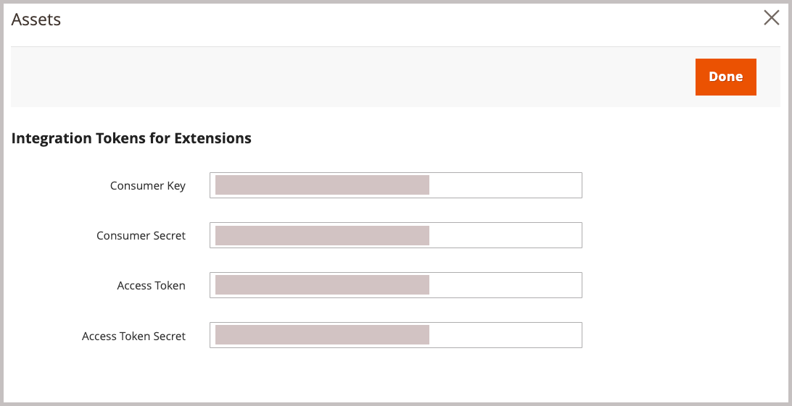

# Installare pacchetti Adobe Commerce

Questa integrazione per Commerce consente la sincronizzazione delle risorse tra Adobe Commerce e Adobe Experience Manager Assets (AEM Assets). L’estensione fornisce un set di strumenti e servizi per gestire immagini di prodotti, video e altre risorse multimediali su entrambe le piattaforme.

Aggiungere questa estensione all&#39;ambiente Commerce installando l&#39;estensione PHP `aem-assets-integration`. È inoltre necessario abilitare Adobe I/O Events per Commerce e generare le credenziali necessarie per la comunicazione e i flussi di lavoro tra Adobe Commerce e Adobe Experience Manager Assets.

**Requisiti di accesso**

Per abilitare l’integrazione di Commerce con AEM Assets sono necessari i seguenti ruoli e autorizzazioni.

- [Amministratore progetto cloud Commerce](https://experienceleague.adobe.com/en/docs/commerce-cloud-service/user-guide/project/user-access) - Installa le estensioni richieste e configura il server applicazioni Commerce dall&#39;amministratore o dalla riga di comando.

   - Accedi a [repo.magento.com](https://repo.magento.com/admin/dashboard) per installare l&#39;estensione.

     Per generare le chiavi e ottenere i diritti necessari, vedere [Ottenere le chiavi di autenticazione](https://experienceleague.adobe.com/en/docs/commerce-operations/installation-guide/prerequisites/authentication-keys). Per le installazioni cloud, consulta la [Guida di Commerce sull&#39;infrastruttura cloud](https://experienceleague.adobe.com/en/docs/commerce-cloud-service/user-guide/develop/authentication-keys)

- [Amministratore Commerce](https://experienceleague.adobe.com/en/docs/commerce-admin/start/guide-overview): aggiorna la configurazione dell&#39;archivio e gestisci gli account utente di Commerce.

>[!TIP]
>
> È possibile configurare Adobe Commerce per l&#39;utilizzo dell&#39;autenticazione [Adobe IMS](https://experienceleague.adobe.com/en/docs/commerce-admin/start/admin/ims/adobe-ims-config).

## Flusso di lavoro di installazione e configurazione

Installa il pacchetto Adobe Commerce e prepara l’ambiente Commerce completando le seguenti attività:

1. [Installare l&#39;estensione AEM Assets Integration for Commerce (`aem-assets-integration`)](#install-the-aem-assets-integration-extension).

1. [Configura Commerce Services Connector](#configure-the-commerce-services-connector) per connettere l&#39;istanza Adobe Commerce e i servizi che consentono la trasmissione dei dati tra Adobe Commerce e AEM Assets.

1. [Configurare Adobe I/O Events per Commerce](#configure-adobe-io-events-for-commerce)

1. [Ottenere le credenziali di autenticazione per l’accesso API](#get-authentication-credentials-for-api-access)

## Installare l’estensione per l’integrazione di AEM Assets

Installa la versione più recente dell&#39;estensione per l&#39;integrazione di AEM Assets (`aem-assets-integration`) in un&#39;istanza di Adobe Commerce con versione Adobe Commerce 2.4.5+. L&#39;estensione viene distribuita come metapacchetto del compositore dall&#39;archivio [repo.magento.com](https://repo.magento.com/admin/dashboard).

>[!BEGINTABS]

>[!TAB Infrastruttura cloud]

Utilizzare questo metodo per installare l&#39;estensione [!DNL AEM Assets Integration] in un&#39;istanza di Commerce Cloud.

1. Sulla workstation locale, passa alla directory del progetto per il progetto Adobe Commerce su infrastruttura cloud.

   >[!NOTE]
   >
   >Per informazioni sulla gestione locale degli ambienti di progetto Commerce, vedere [Gestione dei rami con CLI](https://experienceleague.adobe.com/en/docs/commerce-cloud-service/user-guide/develop/cli-branches) nella _Guida utente di Adobe Commerce on Cloud Infrastructure_.

1. Consulta il ramo dell’ambiente da aggiornare utilizzando Adobe Commerce Cloud CLI.

   ```shell
   magento-cloud environment:checkout <environment-id>
   ```

1. Aggiungi l’estensione AEM Assets Integration for Commerce.

   ```shell
   composer require "magento/aem-assets-integration" "<version-tbd>" --no-update
   ```

1. Aggiornare le dipendenze del pacchetto.

   ```shell
   composer update "magento/aem-assets-integration"
   ```

1. Modifiche al codice di commit e push per i file `composer.json` e `composer.lock`.

1. Aggiungere, eseguire il commit e inviare le modifiche al codice per i file `composer.json` e `composer.lock` all&#39;ambiente cloud.

   ```shell
   git add -A
   git commit -m "Install AEM Assets Integration extension for Adobe Commerce"
   git push origin <branch-name>
   ```

   Inviando gli aggiornamenti si avvia il [processo di distribuzione cloud di Commerce](https://experienceleague.adobe.com/en/docs/commerce-cloud-service/user-guide/develop/deploy/process) per applicare le modifiche. Controllare lo stato della distribuzione dal [registro distribuzione](https://experienceleague.adobe.com/en/docs/commerce-cloud-service/user-guide/develop/test/log-locations#deploy-log).

>[!TAB Locale]

Utilizzare questo metodo per installare l&#39;estensione [!DNL AEM Assets Integration] per un&#39;istanza locale.

1. Utilizza Composer per aggiungere al progetto l’estensione AEM Assets Integration for Commerce:

   ```shell
   composer require "magento/aem-assets-integration" --no-update
   ```

1. Aggiorna le dipendenze e installa l’estensione:

   ```shell
   composer update  "magento/aem-assets-integration"
   ```

1. Aggiorna Adobe Commerce:

   ```shell
   bin/magento setup:upgrade
   ```

1. Cancella la cache:

   ```shell
   bin/magento cache:clean
   ```

>[!TIP]
>
> Durante la distribuzione in produzione, è consigliabile non cancellare il codice compilato per risparmiare tempo. Eseguire sempre il backup del sistema prima di apportare modifiche.

>[!ENDTABS]

## Configurare Commerce Services Connector

>[!NOTE]
>
> L&#39;installazione di Commerce Services Connector è un processo unico necessario per utilizzare [i servizi SaaS di Adobe Commerce](https://experienceleague.adobe.com/en/docs/commerce/user-guides/integration-services/saas#availableservices). Se il connettore è già stato configurato per un altro servizio, è possibile visualizzare la configurazione esistente dall&#39;amministratore di Commerce selezionando **[!UICONTROL Systems]** > [!UICONTROL Services] > **[!UICONTROL Commerce Services Connector]**.

Per trasmettere i dati tra l&#39;istanza di Adobe Commerce e i servizi che abilitano l&#39;integrazione di AEM Assets, configurare Commerce Services Connector dall&#39;amministratore (**[!UICONTROL System]** > [!UICONTROL Services] > **[!UICONTROL Commerce Services Connector]**).

{width="600" zoomable="yes"}

Immetti i seguenti valori nella configurazione

- Chiavi API di produzione e sandbox per l’autenticazione
- Nome dello spazio dati (identificatore SaaS) per l’archiviazione cloud sicura
- ID organizzazione IMS in cui viene eseguito il provisioning degli ambienti Commerce e AEM Assets

Per istruzioni dettagliate, guarda il [video sulla configurazione di Commerce Services Connector](https://experienceleague.adobe.com/en/docs/commerce-learn/tutorials/admin/adobe-commerce-services/configure-adobe-commerce-services-connector#configuration-faqs) e la documentazione di [Commerce Services Connector](../../landing/saas.md#organizationid).

Quando salvi la configurazione, il sistema genera gli ID del progetto SaaS e del database per il tuo ambiente. Questi valori sono necessari per abilitare la sincronizzazione delle risorse tra Adobe Commerce e AEM Assets.

## Configurare Adobe I/O Events per Commerce

L’integrazione di AEM Assets utilizza il servizio Adobe I/O Events per inviare dati evento personalizzati tra l’istanza di Commerce e Experience Cloud. I dati dell’evento vengono utilizzati per coordinare i flussi di lavoro per l’integrazione AEM Assets.

Prima di configurare Adobe I/O Events, verifica la configurazione del processo RabbitMQ e cron per il progetto Commerce:

- Verificare che RabbitMQ sia abilitato e in ascolto degli eventi.
   - [Configurazione di RabbitMQ per Adobe Commerce locale](https://experienceleague.adobe.com/en/docs/commerce-cloud-service/user-guide/configure/service/rabbitmq)
   - [Configurazione di RabbitMQ per Adobe Commerce sull&#39;infrastruttura cloud](https://experienceleague.adobe.com/en/docs/commerce-cloud-service/user-guide/configure/service/rabbitmq)
   - Verificare che [processi cron siano abilitati](https://developer.adobe.com/commerce/extensibility/events/configure-commerce/#check-cron-and-message-queue-configuration). Sono necessari processi Cron per la comunicazione e i flussi di lavoro per l’integrazione AEM Assets.

>[!NOTE]
>
> Per i progetti in Commerce versione 2.4.5, è necessario [installare i moduli Adobe I/O](https://developer.adobe.com/commerce/extensibility/events/installation/#install-adobe-io-modules-on-commerce). In Commerce versione 2.4.6+, questi moduli vengono caricati automaticamente. Per l’integrazione di AEM Assets per Commerce, è sufficiente installare i moduli. La configurazione di App Builder non è richiesta.


### Abilita framework eventi Commerce

Abilita il framework degli eventi da Commerce Admin.

>[!NOTE]
>
>La configurazione di App Builder è necessaria solo se prevedi di utilizzare una strategia di corrispondenza personalizzata per sincronizzare le risorse tra Commerce e AEM Assets.

1. Dall&#39;amministratore, passare a **[!UICONTROL Stores]** > [!UICONTROL Settings] > **[!UICONTROL Configuration]** > **[!UICONTROL Adobe Services]** > **Adobe I/O Events**.

1. Espandere **[!UICONTROL Commerce events]**.

1. Imposta **[!UICONTROL Enabled]** su `Yes`.

   {width="600" zoomable="yes"}

1. Immettere il nome della società esercente in **[!UICONTROL Merchant ID]** e il nome dell&#39;ambiente nei campi **[!UICONTROL Environment ID]**. Utilizzare solo caratteri alfanumerici e trattini bassi per impostare questi valori.

>[!BEGINSHADEBOX]

**Configura VCL personalizzato per bloccare le richieste**

Se si utilizza un frammento VCL personalizzato per bloccare richieste in ingresso sconosciute, potrebbe essere necessario includere l&#39;intestazione HTTP `X-Ims-Org-Idheader` per consentire le connessioni in ingresso dal servizio AEM Assets Integration for Commerce.

>[!TIP]
>
> Puoi utilizzare il modulo Fastly CDN per creare un ACL di Edge con un elenco di indirizzi IP che desideri bloccare.

Il seguente codice snippet VCL personalizzato (formato JSON) mostra un esempio con un&#39;intestazione di richiesta `X-Ims-Org-Id`.

```json
{
  "name": "blockbyuseragent",
  "dynamic": "0",
  "type": "recv",
  "priority": "5",
  "content": "if ( req.http.X-ims-org ~ \"<YOUR-IMS-ORG>\" ) {error 405 \"Not allowed\";}"
}
```

Prima di creare uno snippet basato su questo esempio, esaminare i valori per determinare se è necessario apportare modifiche:

- `name`: nome dello snippet VCL. Questo esempio utilizza il nome `blockbyuseragent`.

- `dynamic`: imposta la versione dello snippet. Questo esempio utilizza `0`. Per informazioni dettagliate sul modello dati, vedere [Frammenti VCL](https://www.fastly.com/documentation/reference/api/vcl-services/snippet/).

- `type`: specifica il tipo di snippet VCL, che determina la posizione del snippet nel codice VCL generato. Questo esempio utilizza `recv`. Per l&#39;elenco dei tipi di snippet, vedere [Fastly VCL snippet reference](https://www.fastly.com/documentation/reference/api/#api-section-snippet)

- `priority`: determina quando viene eseguito lo snippet VCL. In questo esempio viene utilizzata la priorità `5` per eseguire immediatamente e verificare se una richiesta dell&#39;amministratore proviene da un indirizzo IP consentito.

- `content`: snippet di codice VCL da eseguire, che controlla l&#39;indirizzo IP del client. Se l&#39;IP si trova nell&#39;ACL di Edge, l&#39;accesso viene bloccato con un errore `405 Not allowed` per l&#39;intero sito Web. A tutti gli altri indirizzi IP client è consentito l&#39;accesso.

Per informazioni dettagliate sull&#39;utilizzo dei snippet VCL per bloccare le richieste in ingresso, vedere [VCL personalizzato per bloccare le richieste](https://experienceleague.adobe.com/en/docs/commerce-cloud-service/user-guide/cdn/custom-vcl-snippets/fastly-vcl-blocking) nella _Guida di Commerce sull&#39;infrastruttura cloud_.

>[!ENDSHADEBOX]

## Ottenere le credenziali di autenticazione per l’accesso API

L’integrazione di AEM Assets per Commerce richiede le credenziali di autenticazione OAuth per consentire l’accesso API all’istanza di Commerce. Queste credenziali sono necessarie per autenticare le richieste API durante la gestione delle risorse tramite l’integrazione AEM Assets.

Per generare le credenziali, aggiungi l’integrazione all’istanza di Commerce e attivala.

### Aggiungere l’integrazione all’ambiente Commerce

1. Dall&#39;amministratore, vai a **Sistema** > Estensioni > **Integrazioni**, quindi fai clic su **Aggiungi nuova integrazione**.

1. Immetti informazioni sull’integrazione.

   Nella sezione **General**, specifica solo l&#39;integrazione **Name** e **Email**. Utilizza l’e-mail per un account Adobe IMS con accesso all’organizzazione in cui vengono distribuiti Commerce e Experience Manager Assets.

   {width="600" zoomable="yes"}

1. Verificare l&#39;identità facendo clic su **Conferma identità**.

   Il sistema verifica la tua identità autenticandosi su Experience Cloud con il tuo Adobe Id.

1. Configurare le risorse API.

   1. Nel pannello sinistro fare clic su **[!UICONTROL API]**.

   1. Selezionare la risorsa multimediale esterna **[!UICONTROL Catalog > Inventory > Products > External Media]**.

      {width="600" zoomable="yes"}

1. Fare clic su **[!UICONTROL Save]**.

### Genera credenziali OAuth

Nella pagina Integrazioni, genera le credenziali di autenticazione OAuth facendo clic su **Attiva** per l&#39;integrazione Assets. Queste credenziali sono necessarie per registrare il progetto Commerce con il servizio Motore regole di Assets e per inviare richieste API per gestire le risorse tra Adobe Commerce e AEM Assets.

1. Dalla pagina Integrazioni, generare le credenziali facendo clic su **[!UICONTROL Activate]**.

   {width="600" zoomable="yes"}

1. Se prevedi di utilizzare l’API, salva le credenziali per la chiave consumer e il token di accesso per configurare l’autenticazione nel client API.

   {width="600" zoomable="yes"}

1. Fare clic su **[!UICONTROL Done]**.

>[!NOTE]
>
>Puoi anche generare le credenziali di autenticazione utilizzando le API di Adobe Commerce. Per informazioni dettagliate su questo processo e ulteriori informazioni sull&#39;autenticazione basata su OAuth per Adobe Commerce, vedi [Autenticazione basata su OAuth](https://developer.adobe.com/commerce/webapi/get-started/authentication/gs-authentication-oauth/) nella documentazione di Adobe Developer.

## Passaggio successivo

- [Configurare l’integrazione dall’amministratore di Commerce](setup-synchronization.md)
