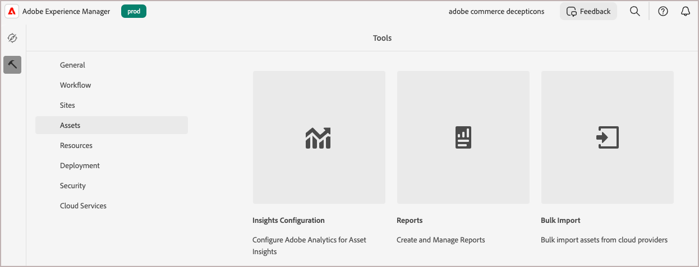
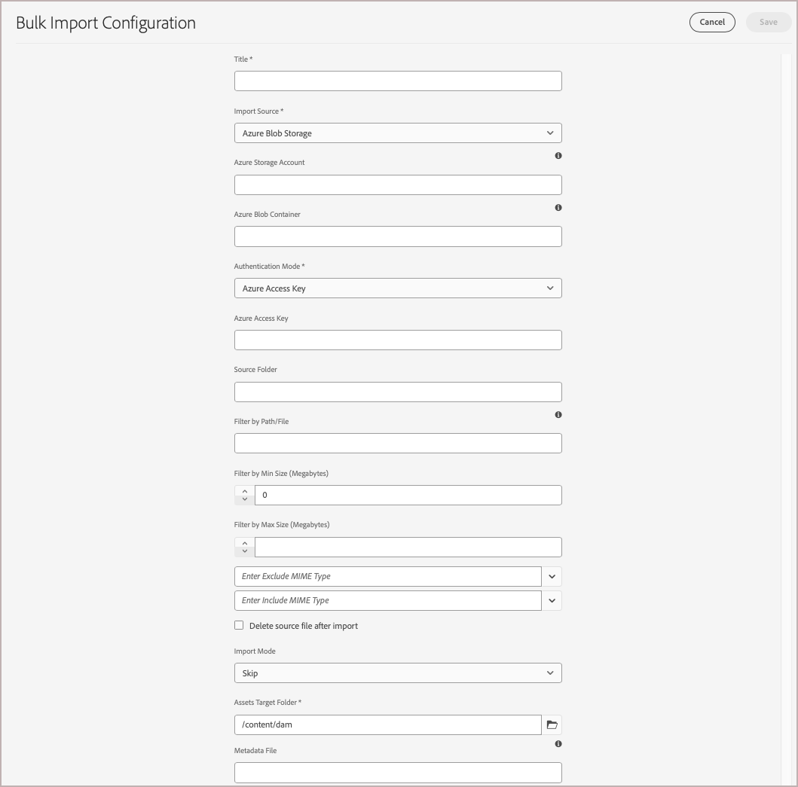

# Migrare i file multimediali a AEM Assets DAM

Sia Adobe Commerce che Adobe Experience Manager (AEM) forniscono funzionalità integrate per semplificare la migrazione di file multimediali da Commerce a AEM Assets **Digital Asset Management System (DAM)**. È inoltre possibile eseguire la migrazione di file multimediali da altre origini.

## Prerequisiti

| Categoria | Requisito |
|----------|-------------|
| **Requisiti di sistema** | <ul><li>Ambiente AEM as a Cloud Service fornito con AEM Assets</li><li>Capacità di stoccaggio sufficiente</li><li>Larghezza di banda di rete per trasferimenti di file di grandi dimensioni</li></ul> |
| **Accesso e autorizzazioni richiesti** | <ul><li>Accesso amministratore ad AEM Assets as a Cloud Service</li><li>Accesso al sistema di origine in cui sono archiviati i file multimediali (Adobe Commerce o sistema esterno)</li><li>Autorizzazioni appropriate per accedere ai servizi di archiviazione cloud</li></ul> |
| **Account archiviazione cloud** | <ul><li>Account di archiviazione AWS S3 o Azure Blob</li><li>Configurazione contenitore/bucket privato</li><li>Credenziali di autenticazione</li></ul> |
| **Contenuto Source** | <ul><li>File multimediali organizzati pronti per la migrazione</li><li>File immagine e video nei formati <a href="https://experienceleague.adobe.com/it/docs/experience-manager-cloud-service/content/assets/file-format-support#image-formats"> supportati da AEM Assets</a>.</li><li>Risorse pulite e duplicate</li></li> |
| **Preparazione metadati** | <ul><li><a href="https://experienceleague.adobe.com/it/docs/commerce-admin/content-design/aem-asset-management/getting-started/aem-assets-configure-aem">Profilo metadati AEM Assets configurato per le risorse Commerce</a></li><li>Valori metadati mappati per ogni risorsa</li><li>Editor file CSV (ad esempio, Microsoft Excel)</li></ul> |

## Best practice per la migrazione

1. Cura le risorse prima della migrazione rimuovendo il contenuto inutilizzato e duplicato.

1. Organizza le risorse in modo logico per dimensione, formato o caso d’uso.

1. È consigliabile suddividere le migrazioni di grandi dimensioni in batch più piccoli.

1. Pianificare le importazioni ad alta intensità di risorse durante le ore di minore utilizzo.

1. Convalida la mappatura dei metadati prima dell’importazione completa.

## Flusso di lavoro di migrazione

Segui il flusso di lavoro di migrazione per esportare i file multimediali da Adobe Commerce o da un altro sistema esterno e importarli in AEM Assets DAM.

### Passaggio 1: esportare il contenuto dall&#39;origine dati esistente

[!BADGE Solo PaaS]{type=Informative tooltip="Applicabile solo ai progetti Adobe Commerce on Cloud (infrastruttura PaaS gestita da Adobe)."}

Per i commercianti Adobe Commerce, il **modulo di archiviazione remota** può facilitare le importazioni e le esportazioni di file multimediali. Questo modulo consente alle aziende di archiviare e gestire i file multimediali utilizzando servizi di archiviazione remota come AWS S3. Per configurare l&#39;archiviazione remota per l&#39;istanza di Commerce, vedere [Configurare l&#39;archiviazione remota](https://experienceleague.adobe.com/it/docs/commerce-operations/configuration-guide/storage/remote-storage/remote-storage-aws-s3) nella **Guida alla configurazione di Commerce**.

Se hai file multimediali archiviati all&#39;esterno di Adobe Commerce, caricali direttamente in una delle [origini dati](https://experienceleague.adobe.com/it/docs/experience-manager-cloud-service/content/assets/assets-view/bulk-import-assets-view#prerequisites) supportate da AEM as a Cloud Service.

### Passaggio 2: creare un file CSV per la mappatura dei metadati

Crea un file CSV che mappa ogni file multimediale sui relativi dati di prodotto Commerce. Scegliere uno dei metodi seguenti:

* **Adobe Commerce (PaaS)**: utilizza il comando CLI per generare automaticamente il file CSV dal catalogo
* Creare manualmente il file CSV

#### Esportare i metadati tramite CLI

[!BADGE Solo PaaS]{type=Informative tooltip="Applicabile solo ai progetti Adobe Commerce on Cloud (infrastruttura PaaS gestita da Adobe)."}

Utilizza il comando CLI di integrazione di AEM Assets per generare automaticamente un file CSV di metadati che include URL di immagini, posizioni e ruoli dai file multimediali del prodotto memorizzati nel progetto Commerce.

1. Elenca i comandi disponibili per verificare che il modulo di integrazione di AEM Assets sia installato:

   ```bash
   bin/magento list aem
   ```

   I comandi di estensione personalizzati vengono visualizzati in `aem` all&#39;inizio dell&#39;elenco dei comandi.

1. Esegui il comando di esportazione dei metadati con il prefisso del percorso AEM:

   ```bash
   bin/magento aem:assets:export:csv <AEM-path-prefix>
   ```

   `<AEM-path-prefix>` è il percorso della cartella di base in cui verranno archiviate le risorse in AEM Assets DAM (ad esempio, `/content/dam/commerce/`).

   ```bash
   bin/magento aem:assets:export:csv /content/dam/commerce/
   ```

   In questo modo viene creato un file `metadata.csv` nella directory `var/export` contenente gli URL dell&#39;immagine, le posizioni e i ruoli per ogni risorsa prodotto nel catalogo Commerce.

#### Creare il file CSV manualmente

Per i file multimediali memorizzati all’esterno di Adobe Commerce, crea manualmente il file CSV. Le intestazioni di colonna **devono corrispondere** ai nomi di campo configurati nel [profilo metadati AEM Assets](configure-aem.md). Dopo aver creato il file, compila le righe con i valori di metadati per ciascun file multimediale.

| Metadati | Descrizione | Valore |
|-------|-------------|--------|
| assetPath | Percorso completo in cui la risorsa verrà memorizzata nell’archivio AEM Assets.<br><br>Utilizzare il percorso per creare sottocartelle per organizzare le risorse di Commerce, ad esempio `content/dam/commerce/<brand>/<type>`. | `/content/dam/commerce/<sub-folder>/..<filename>` |
| commerce:positions | Posizione/ordine della risorsa nelle gallerie di prodotti | Valori numerici multipli separati da barre verticali (&quot;Number: multi&quot;) |
| commerce:isCommerce | Flag che indica se la risorsa è utilizzata in Commerce | `Yes` |
| commerce:skus | SKU di prodotto associati a questa risorsa | Più valori stringa separati da barre verticali (Stringa: multipli) |
| commerce:roles | I ruoli o i tipi di immagini per la risorsa (ad esempio, `thumbnail`, `main image`, `swatch`) | Più valori separati da punto e virgola (ad esempio, &quot;miniatura; immagine; swatch_image; small_image&quot;) |

+++Codice CSV

Utilizza questo codice CSV di esempio per creare il file in un editor di codice o in un’applicazione per fogli di calcolo come Microsoft Excel.

```csv
assetPath,commerce:positions{{Number: multi}},commerce:isCommerce{{String}},commerce:skus{{String: multi}},commerce:roles{{String: multi}}
/content/dam/commerce/sample1.jpg,1,Yes,sku1,thumbnail; image; swatch_image; small_image
/content/dam/commerce/sample2.jpg,1|1|1,Yes,sku1|sku2|sku3,thumbnail; image; swatch_image; small_image|image|image; small_change
```

+++

### Passaggio 3: importare in blocco Assets in AEM Assets

Dopo aver creato il file di mappatura dei metadati, utilizza lo strumento AEM Assets Bulk Import per importare le risorse.

Di seguito è riportata una panoramica generale sull&#39;utilizzo dello strumento.

1. [Accedi all&#39;ambiente di authoring AEM Assets as a Cloud Service](https://experienceleague.adobe.com/it/docs/experience-manager-cloud-service/content/onboarding/journey/aem-users#login-aem).

1. Dalla vista Strumenti di Experience Manager, seleziona **[!UICONTROL Assets]** > **[!UICONTROL Bulk Import]**.

   {width="600" zoomable="yes"}

1. In Configurazioni di importazione in blocco, selezionare **[!UICONTROL Create]** per aprire il modulo di configurazione.

   {width="600" zoomable="yes"}

1. Imposta e salva la configurazione.

   Sono necessari:

   * Credenziali di autenticazione per l’origine dati
   * Cartella di destinazione in AEM Assets in cui verranno archiviati i file importati
   * Facoltativo. Informazioni sui tipi MIME, le dimensioni del file e altri parametri per personalizzare la configurazione di importazione
   * Percorso del file CSV di mappatura metadati caricato nell’istanza di archiviazione Cloud.

   Per i passaggi dettagliati, consulta [Configurare lo strumento Importazione in blocco](https://experienceleague.adobe.com/it/docs/experience-manager-cloud-service/content/assets/manage/add-assets#configure-bulk-ingestor-tool) nella *Guida utente di AEM Assets as a Cloud Service*.

1. Dopo aver salvato la configurazione, utilizzare gli strumenti di importazione in blocco per testare ed eseguire l&#39;operazione di importazione.

>[!MORELIKETHIS]
>
> [Demo video strumento di importazione in blocco](https://experienceleague.adobe.com/it/docs/experience-manager-cloud-service/content/assets/manage/add-assets#asset-bulk-ingestor)
> [Suggerimenti, best practice e limitazioni](https://experienceleague.adobe.com/it/docs/experience-manager-cloud-service/content/assets/manage/add-assets#tips-limitations)
> [Carica o acquisisci risorse tramite API](https://experienceleague.adobe.com/it/docs/experience-manager-cloud-service/content/assets/admin/developer-reference-material-apis#asset-upload)
