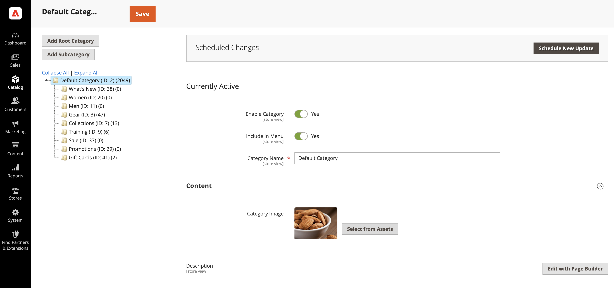

# Gestire le risorse multimediali di Commerce

<!--In ACAP-844, this topic was linked to from the Commerce Admin products images and videos when the Assets integration is enabled. If the URL to the topic changes, be sure to add a redirect.-->

Dopo l’abilitazione dell’integrazione di AEM Assets per Commerce, puoi gestire i seguenti tipi di file multimediali:

* Immagini del prodotto
* Immagini del contenuto
* Video sui prodotti
* Immagini di categorie

## Immagini del prodotto

Quando l’integrazione è abilitata, la gestione delle immagini è centralizzata all’interno del sistema Digital Asset Management (DAM). Adobe Commerce funziona quindi come un canale di coinvolgimento chiave, garantendo che solo le immagini approvate e di alta qualità vengano utilizzate nelle vetrine. Questa configurazione migliora la coerenza del brand, riduce al minimo lo sforzo manuale e semplifica gli aggiornamenti dei contenuti, eliminando la necessità per i commercianti di caricare o gestire manualmente le immagini in Adobe Commerce.

### Visualizzare immagini di prodotto in Adobe Commerce

Le immagini dei prodotti vengono estratte automaticamente da AEM Assets in base a regole di corrispondenza preconfigurate:

1. Nella barra laterale _Admin_, passa a **[!UICONTROL Catalog]** > **[!UICONTROL Products]**.

1. Seleziona un prodotto.

1. Apri la sezione **Immagini e video**.

   {width="600" zoomable="yes"}

   >[!NOTE]
   >
   > Un messaggio indica che l&#39;integrazione è abilitata, rendendo questa sezione di **sola lettura** in quanto la gestione delle immagini è centralizzata in DAM.

### Gestire le immagini dei prodotti in AEM Assets

Per gestire le immagini relative al prodotto, tutte le modifiche devono essere apportate direttamente in **AEM Assets**. Questo processo è completamente automatizzato, garantendo che tutte le modifiche siano sincronizzate con Adobe Commerce senza richiedere l’intervento manuale.

### SLA di sincronizzazione

Per ulteriori informazioni su questo argomento, controllare [Sincronizzazione SLA](get-started/setup-synchronization.md#synchronization-sla).

## Immagini del contenuto

Adobe Commerce fornisce Page Builder come **sistema di gestione dei contenuti (CMS)** per i commercianti che non utilizzano il set di strumenti di Adobe Experience Manager (AEM). Per migliorare la creazione di contenuti, la nostra integrazione sfrutta [AEM Asset Selector](synchronize/asset-selector-integration.md), consentendo agli addetti al marketing di accedere e incorporare direttamente le immagini da **DAM**. In questo modo nella creazione dei contenuti vengono utilizzate solo immagini approvate e di alta qualità, eliminando la necessità di storage ridondante in Adobe Commerce.

### Utilizzo del selettore risorse di AEM nel Page Builder

[!BADGE Solo PaaS]{type=Informative tooltip="Applicabile solo ai progetti Adobe Commerce on Cloud (infrastruttura PaaS gestita da Adobe)."} Per utilizzare il **Selettore risorse AEM** per incorporare le immagini:

1. Passa a qualsiasi sezione di **Adobe Commerce Admin** che supporta `content enrichment` utilizzando **Page Builder**.

1. Apri [Page Builder](https://developer.adobe.com/commerce/frontend-core/page-builder/){target=_blank}.

   Sarà disponibile un nuovo tipo di supporto denominato **risorsa AEM**.

1. Trascina e rilascia il tipo di file multimediale AEM Asset in un blocco di contenuto.

1. Quando richiesto, specifica le credenziali per accedere a DAM.

1. Seleziona un’immagine da DAM e inseriscila direttamente nel contenuto.

L&#39;associazione all&#39;immagine selezionata verrà archiviata in Adobe Commerce come URL diretto che punta a **Dynamic Media**, assicurandosi che:

* I file di immagine non devono essere memorizzati in Adobe Commerce.

* Gli addetti al marketing lavorano esclusivamente con le risorse approvate da DAM.

* I contenuti rimangono coerenti e aggiornati in tutti i punti di contatto dei clienti.

>[!TIP]
>
> [DA.live (Document Authoring)](https://experienceleague.adobe.com/developer/commerce/storefront/merchants/storefront-builder/#dalive-document-authoring){target=_blank} fornisce anche un selettore di risorse per arricchire i dati.

## Video sui prodotti

Adobe Commerce funge da canale di coinvolgimento chiave per le risorse digitali. Dopo l&#39;abilitazione dell&#39;integrazione di AEM Assets, la gestione video è centralizzata all&#39;interno di **DAM**, garantendo coerenza, conformità e distribuzione ottimizzata tra gli store commerce.

### Gestire i video sui prodotti

1. Nella barra laterale _Admin_, passa a **[!UICONTROL Catalog]** > **[!UICONTROL Products]**.

1. Seleziona un prodotto.

1. Apri la sezione **Immagini e video**.

   {width="600" zoomable="yes"}

   >[!NOTE]
   >
   > Un messaggio indica che l&#39;integrazione è abilitata, rendendo questa sezione **di sola lettura**, poiché i video sono controllati in AEM Assets.

### Associare video in AEM Assets

1. In AEM Assets, individua il video da associare a un prodotto.

1. Collega il video a uno o più prodotti in Adobe Commerce.

1. L’integrazione sincronizza automaticamente l’associazione, visualizzando il lettore video Dynamic Media direttamente sulla vetrina. Questo elimina la necessità per i commercianti di gestire le configurazioni di riproduzione video.

### Supporto solo per video API-First

Attualmente, l’integrazione supporta i video tramite API e consente ai partner di recuperare i video a livello di programmazione.

>[!WARNING]
>
> Per impostazione predefinita, i video non sono ancora integrati nelle soluzioni vetrina Adobe Commerce esistenti.

Questa integrazione consente ai commercianti di gestire facilmente i video dei prodotti in modo scalabile e ottimizzato, sfruttando AEM Assets e Dynamic Media per una distribuzione fluida.

### SLA di sincronizzazione

Per ulteriori informazioni su questo argomento, controllare [Sincronizzazione SLA](get-started/setup-synchronization.md#synchronization-sla).

## Immagini di categorie

Adobe Commerce consente ai commercianti di associare le immagini alle categorie di prodotti, per creare una vetrina visivamente coinvolgente. L&#39;integrazione di AEM Assets sfrutta AEM Asset Selector per consentire agli addetti al marketing di selezionare direttamente le risorse dal **Digital Asset Management System (DAM)**. In questo modo, vengono utilizzate solo le immagini approvate ed elimina la necessità di memorizzarle in Adobe Commerce, mantenendo coerenza ed efficienza su tutti i canali di coinvolgimento.

### Usa Selettore risorse di AEM per le immagini delle categorie

Dopo aver configurato [AEM Asset Selector](synchronize/asset-selector-integration.md), puoi utilizzarlo per aggiungere risorse al contenuto delle categorie del catalogo.

1. Nella barra laterale _Admin_, passa a **[!UICONTROL Catalog]** > **[!UICONTROL Categories]**.

1. Selezionare la categoria da aggiornare.

1. Espandere il  nella sezione **[!UICONTROL Content]**.

1. Nella sezione **[!UICONTROL Content]**, individua il *campo immagine* associato alla categoria.

   {width="600" zoomable="yes"}

1. Fare clic su **[!UICONTROL Select from Assets]** per modificare l&#39;immagine della categoria.

   {width="600" zoomable="yes"}

1. Scegli un’immagine dal Selettore risorse di AEM.

   {width="600" zoomable="yes"}

1. Fare clic su **[!UICONTROL Save]** e continuare.

   Per ulteriori informazioni sulla creazione di una categoria, vedere [Completare il contenuto della categoria](https://experienceleague.adobe.com/en/docs/commerce-admin/catalog/categories/create/category-create#step-3-complete-the-category-content) nella **Guida alla gestione del catalogo di Commerce**.

## Aggiornare una risorsa

Dopo aver aggiornato e approvato una risorsa in AEM Assets, gli aggiornamenti vengono inviati automaticamente ad Adobe Commerce utilizzando la funzionalità di corrispondenza automatica. Questo processo viene attivato all’approvazione della risorsa. Per fare in modo che tutte le modifiche finali e gli aggiornamenti dei metadati siano inclusi, assicurati di rielaborare la risorsa prima di approvarla.

Per informazioni dettagliate, consulta la seguente documentazione di AEM Assets.

* [Rielaborazione delle risorse digitali](https://experienceleague.adobe.com/en/docs/experience-manager-cloud-service/content/assets/manage/reprocessing)

* [Approva una risorsa](https://experienceleague.adobe.com/en/docs/experience-manager-cloud-service/content/assets/dynamicmedia/dynamic-media-open-apis/approve-assets)
