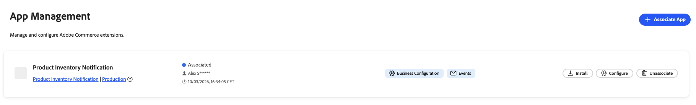

# Gestione dell’app

Un App Manager associa un’applicazione App Builder alla relativa istanza Commerce. Il rendering dei moduli di configurazione viene eseguito in modo dinamico in base allo schema dell’app, pertanto non è necessario alcuno sviluppo personalizzato dell’interfaccia di amministrazione. App Manager configura le impostazioni tramite moduli generati automaticamente da Commerce.

{width="500" zoomable="yes"}

## Prerequisiti

Prima di associare un’app, assicurati di disporre dei seguenti elementi:

| Requisito | Descrizione |
|-------------|-------------|
| **Accesso amministratore** | Amministratore Commerce con autorizzazioni [!DNL App Management] |
| **App implementata** | Applicazione App Builder distribuita nella tua organizzazione e pronta per la connessione |
| **Accesso organizzazione** | Accesso all’organizzazione Adobe in cui è distribuita l’app |

## Esercitazione

Guarda questo video per scoprire come associare un’app a un’istanza Commerce e configurare le impostazioni.

>[!VIDEO](https://video.tv.adobe.com/v/3478944)

## Associare un’app

Il processo di associazione importa siti web, store e visualizzazioni dello store da Commerce e crea il collegamento tra l’app e l’istanza Commerce.

Per collegare l’applicazione App Builder a un’istanza Commerce:

1. Passa a **[!UICONTROL Apps]** > **[!UICONTROL App Management]**.

1. Fare clic su **[!UICONTROL Associate App]**.

   {width="500" zoomable="yes"}

1. Selezionare **[!UICONTROL Project]** dall&#39;elenco.

1. Selezionare **[!UICONTROL Workspace]**.

1. Fare clic su **[!UICONTROL Associate]**.

   {width="500" zoomable="yes"}

>[!WARNING]
>
>Se la sincronizzazione dell&#39;ambito non riesce, l&#39;associazione viene comunque completata. È possibile sincronizzare manualmente gli ambiti in un secondo momento dalla vista **[!UICONTROL Manage Scopes]** nella configurazione dell&#39;app associata.

## Configurare le impostazioni

Dopo aver associato un&#39;app nella visualizzazione [!DNL App Management], configurarne le impostazioni tramite il modulo:

1. Fai clic su **[!UICONTROL Configure]** nell&#39;app associata.

1. Nel modulo vengono visualizzate le impostazioni configurabili dell’app.

1. Modificare i valori in base alle esigenze.

1. Fare clic su **[!UICONTROL Save]**.

### Configurazione specifica per ambito

Utilizza la configurazione specifica dell’ambito quando siti web, store o viste store diverse richiedono impostazioni univoche. Ad esempio, è possibile abilitare una funzione solo per una specifica area geografica o vista store oppure utilizzare impostazioni diverse per marchio. Le impostazioni in un ambito inferiore sovrascrivono quelle degli ambiti superiori.

Per ignorare i valori globali a un livello di ambito specifico:

1. Fare clic su **[!UICONTROL Change Scope]**.

1. Selezionare un ambito dall&#39;elenco.

1. Modificare i valori per questo ambito.

1. Fare clic su **[!UICONTROL Save]**.

## Gestisci ambiti

Accedi a **[!UICONTROL Manage Scopes]** dalla schermata dei dettagli dell&#39;app per gestire la gerarchia dell&#39;ambito per la tua app.

{width="500" zoomable="yes"}

| Azione | Descrizione |
|--------|-------------|
| **[!UICONTROL Add root scope]** | Aggiungi un ambito che si applica solo all&#39;app. |
| **[!UICONTROL Sync Commerce scopes]** | Aggiornare l&#39;elenco dei siti Web, dei negozi e delle visualizzazioni dello store da Commerce dopo averli aggiunti o modificati. |
| **[!UICONTROL Import scopes]** | Importa gli ambiti in blocco da un file. |

## Annullare l’associazione di un’app

Annulla l’associazione di un’app quando non è più necessaria e connessa all’istanza di Commerce. Ad esempio, potrebbe essere necessario ritirare un’integrazione, passare a un’area di lavoro diversa o pulire le configurazioni di test.

>[!WARNING]
>
> L’annullamento dell’associazione rimuove tutti i valori di configurazione per questa istanza. Questa operazione non può essere annullata.

Per rimuovere un’app da un’istanza di Commerce:

1. Passa a **[!UICONTROL Apps]** > **[!UICONTROL App Management]**.

1. Fai clic su **[!UICONTROL Unassociate]** nell&#39;app.

1. Conferma l’azione.

## Documentazione correlata

* [Risoluzione dei problemi [!DNL App Management]](troubleshooting.md)—Risolvi i problemi comuni relativi all&#39;associazione e alla configurazione dell&#39;app.
