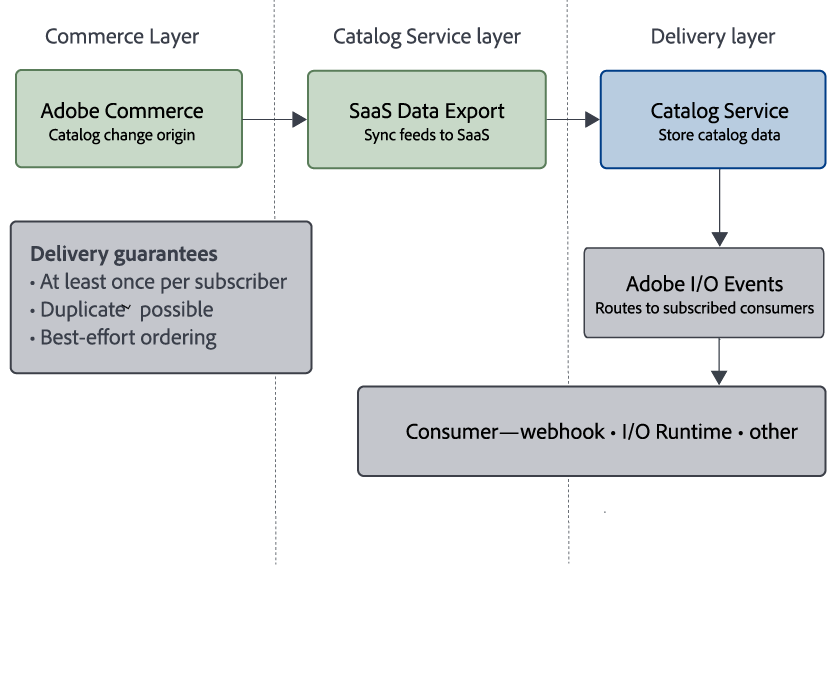

# Eventi catalogo e guida all&#39;integrazione di [!DNL Adobe I/O Events]

Gli eventi del catalogo sono notifiche generate automaticamente che descrivono le modifiche del catalogo supportate rese disponibili tramite [!DNL Catalog Service]. Consentono flussi di lavoro basati su eventi quali:

* Mantenimento della sincronizzazione tra cache o servizi esterni e aggiornamenti del catalogo.
* Attivazione di processi a valle quando cambiano prodotti, varianti, prezzi o categorie.
* Attivazione dei casi d&#39;uso di Experience Edge e [!DNL Edge Delivery Services] che richiedono aggiornamenti quasi in tempo reale del catalogo.

Per il percorso end-to-end da [!DNL Adobe Commerce] ai consumatori dell&#39;evento, vedi [Consegna degli eventi tramite [!DNL Adobe I/O Events]](#event-delivery-through-adobe-io-events).

## Tipi di evento supportati {#supported-event-types}

Gli eventi del catalogo si concentrano sulle modifiche rilevanti per la vetrina esposte tramite [!DNL Adobe Developer Console]. Le seguenti sottoscrizioni sono attualmente supportate.

| Abbonamento | Eventi |
| --- | --- |
| Aggiornamento del prodotto | Modifiche alla creazione, all&#39;aggiornamento e all&#39;eliminazione dei prodotti disponibili tramite [!DNL Catalog Service] |
| Aggiornamento prezzo | Creazione, aggiornamento ed eliminazione del prezzo delle modifiche che influiscono sui dati del catalogo della vetrina |

Ogni evento include:

* Identificatore di evento che descrive il tipo di modifica.
* Contesto di entità e ambiente, ad esempio ID istanza e SKU.
* Un payload che descrive l’entità modificata e le informazioni rilevanti sull’ambito.


## Esempio di payload di eventi

**Evento ProductUpdated**

```json
{
  "imsOrgId": "aaa-0",
  "instanceId": "instance-9",
  "eventCode": "productUpdated",
  "sku": "1234",
  "links": [
    {"type":  "variantOf", "sku": "5678"}
   ],
  "scope": [
    { "storeViewCode": "US-us" },
    { "storeViewCode": "FR-fr" },
    { "storeViewCode": "DE-de" }
  ]
}
```

**Evento PriceUpdated**

```json
{
  "imsOrgId": "aaa-0",
  "instanceId": "instance-9",
  "eventCode": "priceUpdated",
  "sku": "1234",
  "scope": [
    {
      "websiteCode": "website1",
      "customerGroupCode": "customer-group-code1"
    },
    {
      "websiteCode": "website2",
      "customerGroupCode": "customer-group-code2"
    }
  ]
}
```

## Consegna degli eventi tramite [!DNL Adobe I/O Events] {#event-delivery-through-adobe-io-events}

[!DNL Adobe I/O Events] distribuisce gli eventi del catalogo alle integrazioni. Il diagramma seguente mostra il flusso di alto livello delle modifiche del catalogo da [!DNL Adobe Commerce] a [!DNL Catalog Service] e [!DNL Adobe I/O Events] ai consumatori abbonati:



I passaggi seguenti spiegano più dettagliatamente ogni handoff:

1. **Adobe Commerce → Catalog Service**

[!DNL Adobe Commerce] esporta i dati del catalogo in [!DNL Catalog Service] utilizzando le estensioni SaaS Data Export supportate.

1. **Elaborazione servizio catalogo**

   * [!DNL Catalog Service] elabora le modifiche al catalogo supportate e le prepara per la consegna dell&#39;evento.

1. **Servizio catalogo → Adobe I/O Events**

* Gli eventi catalogo sono pubblicati in [!DNL Adobe I/O Events].
* Gli utenti possono effettuare l&#39;abbonamento utilizzando il journal, i webhook, [!DNL Adobe I/O Runtime], Amazon EventBridge o altri meccanismi di consegna supportati.

[!DNL Adobe I/O Events] fornisce:

* *Consegna almeno una volta* per sottoscrittore (sono possibili eventi duplicati).
* Nessuna garanzia di ordini per le consegne.

I consumatori devono gestire gli eventi duplicati e la consegna fuori servizio. Per informazioni sull&#39;implementazione, vedere [Idempotenza](#idempotency).

## Casi d’uso {#use-cases}

Puoi utilizzare gli eventi Catalogo in più scenari.

### Consegna statica di siti e edge

* Rigenera o invalida le pagine di catalogo e i frammenti di vetrina quando i dati del catalogo cambiano.
* Evitare il polling frequente di [!DNL Catalog Service] API.

### Ricerca indicizzazione e caching

* Attiva aggiornamenti incrementali negli indici di ricerca a valle.
* Aggiorna i livelli della cache o le viste esterne del catalogo quando i dati di prodotto o categoria cambiano.

### Integrazione con sistemi esterni

* Inoltra le modifiche al catalogo a sistemi esterni come PIM, motori di determinazione prezzi o altri sistemi line-of-business.
* Mantieni sincronizzate le applicazioni downstream senza accesso diretto al database.

### Monitoraggio e osservabilità

Combina gli eventi del catalogo con il monitoraggio esistente (ad esempio, [!DNL Grafana] e [!DNL Prometheus]) in:

* Monitorare la velocità effettiva degli eventi.
* Rileva anomalie nel volume di aggiornamento del catalogo.

## Abilita eventi catalogo {#enable-catalog-events}

Per abilitare gli eventi del catalogo end-to-end, segui la procedura riportata di seguito.

>[!PREREQUISITES]
>
>Prima di abilitare gli eventi catalogo, assicurati di disporre dei seguenti elementi:
>
>* Ambiente Adobe Commerce supportato con [!DNL Catalog Service] abilitato.
>* [La connessione [!DNL Adobe I/O] è configurata per Adobe Commerce](https://developer.adobe.com/commerce/extensibility/events/configure-commerce).
>* Accesso a [!DNL Adobe Developer Console] nella stessa organizzazione IMS in cui è stato eseguito il provisioning dell’ambiente Commerce.
>* Per verificare la sincronizzazione con i servizi SaaS di Commerce, utilizzare **[!UICONTROL Data Management Dashboard]** in Admin.
>* Per la verifica del dashboard sono necessari i consigli di prodotto v6.0, [!DNL Live Search] v4.1.0+ o [!DNL Catalog Service] v1.17+. Adobe consiglia di aggiornare il progetto Commerce alle versioni più recenti supportate di questi servizi. Per le versioni precedenti del servizio, utilizzare [Sincronizzazione catalogo](https://experienceleague.adobe.com/en/docs/commerce/user-guides/data-services/catalog-sync) per verificare la sincronizzazione.


>[!NOTE]
>
>Per utilizzare gli eventi del catalogo, configurare innanzitutto l&#39;ambiente Commerce per [!DNL Adobe I/O Events], quindi registrare una sottoscrizione eventi in [!DNL Adobe Developer Console].
>
>Se l&#39;ambiente non viene visualizzato in [!DNL Adobe Developer Console] dopo la configurazione, verifica di aver effettuato l&#39;accesso all&#39;organizzazione IMS corretta e che l&#39;account disponga dell&#39;accesso richiesto. Se l’ambiente non viene ancora visualizzato, contatta il supporto Adobe.

### Verifica dati catalogo {#verify-catalog-data}

Verificare che [!DNL Catalog Service] disponga dei dati del catalogo correnti dell&#39;istanza di [!DNL Commerce] prima di eseguire la configurazione. Gli eventi catalogo dipendono dal completamento di [!DNL SaaS Data Export] in due fasi. Confermare **entrambi**:

1. Conferma l&#39;esportazione di **feed da Commerce**.

   Dall&#39;amministratore [!DNL Adobe Commerce], aprire la pagina [Stato sincronizzazione feed dati](https://experienceleague.adobe.com/en/docs/commerce-admin/systems/data-transfer/data-sync/data-feed-sync-status) (**[!UICONTROL System]** > **[!UICONTROL Data Transfer]** > **[!UICONTROL Data Feed Sync Status]**) e confermare che l&#39;ultimo stato di esportazione è stato completato correttamente per ogni feed [!DNL Catalog Service].

1. Conferma **sincronizzazione riuscita con i servizi Commerce connessi** dall&#39;amministratore [!DNL Adobe Commerce].

   Dall&#39;amministratore [!DNL Adobe Commerce], apri [Data Management Dashboard](https://experienceleague.adobe.com/en/docs/commerce-admin/systems/data-transfer/data-sync/data-dashboard) (**[!UICONTROL System]** > **[!UICONTROL Data Transfer]** > **[!UICONTROL Data Management Dashboard]**) e verifica che i dati dei prodotti sincronizzati includano i prodotti previsti.

### Registrati e abbonati a [!DNL Adobe I/O Events] {#register-events}

Definisci gli eventi Commerce a cui abbonarti, quindi registrali nel progetto.

Se l&#39;istanza non è inclusa nell&#39;elenco di selezione, non è connessa a [!DNL Adobe I/O]. Per istruzioni su come risolvere il problema, consulta [Configurare la [!DNL Adobe I/O] connessione](https://developer.adobe.com/commerce/extensibility/events/configure-commerce#configure-the-adobe-io-connection) nella documentazione di *Adobe Commerce Developer*.

1. Da [!DNL Adobe Developer Console], accedi alla stessa organizzazione IMS utilizzata per il progetto Commerce.

1. Crea un progetto per Commerce Catalog Events o aggiungi l’API degli eventi a un progetto esistente.

   * Seleziona **[!UICONTROL APIs and services]** nella navigazione superiore.

   * Nella pagina **[!UICONTROL Browse APIs and services]**, selezionare la scheda **[!UICONTROL Events]**.

   * Trova rapidamente le API degli eventi del catalogo Commerce. Digitare _Catalogo_ nella casella di ricerca oppure filtrare in base al prodotto **[!UICONTROL Commerce]**.

   * Sulla scheda **[!UICONTROL Commerce Catalog Events]**, seleziona **[!UICONTROL Project]**.

   {width="600" zoomable="yes"}

1. Configurare la registrazione degli eventi.

   Seleziona l&#39;istanza Commerce da cui ricevere le notifiche degli eventi. Quindi, selezionare **[!UICONTROL Next]**.

   {width="600" zoomable="yes"}

1. Scegli gli eventi a cui abbonarti.

   Selezionare le sottoscrizioni di eventi supportate che si desidera ricevere, ad esempio **[!UICONTROL Product Update]** o **[!UICONTROL Price Update]**. Quindi, selezionare **[!UICONTROL Next]**.

   {width="600" zoomable="yes"}

1. Aggiungi credenziali server-to-server OAuth.

   Immetti **[!UICONTROL Credential name]**. Quindi, selezionare **[!UICONTROL Next]**.

1. Immettere **[!UICONTROL Event registration name]** e **[!UICONTROL Event registration description]**. Quindi, selezionare **[!UICONTROL Next]**.

1. Nella schermata di registrazione finale, accetta il consumer predefinito, l’API di inserimento nel journal.

   Il consumatore API di inserimento nel journal predefinito consente di verificare la registrazione degli eventi e confermare che gli eventi vengono consegnati. Se hai già configurato un consumer di azioni webhook o [!DNL Adobe I/O Runtime], selezionalo qui. In caso contrario, modifica la registrazione dell’evento in un secondo momento, quando il consumatore sarà pronto.

   {width="600" zoomable="yes"}

1. Selezionare **[!UICONTROL Complete registration]**.

### Configurare il consumer di eventi {#configure-consumer}

1. Configurare un consumatore, ad esempio:

   * Endpoint di webhook
   * Azione [!DNL Adobe I/O Runtime]
   * Un’altra destinazione supportata

1. Se non hai selezionato un consumatore durante la registrazione, modifica la registrazione dell’evento per aggiungere i dettagli del consumatore.

   * Da [!DNL Adobe Developer Console], modifica il progetto. Quindi, seleziona la registrazione dell’evento creata.

   * Nella pagina dei dettagli di registrazione dell&#39;evento, selezionare **[!UICONTROL Edit Events Registration]**.

   * Selezionare **[!UICONTROL Next]** fino a quando non si raggiunge la schermata di selezione del consumatore. Quindi, seleziona il consumatore configurato.

   * Aggiorna il consumatore alla destinazione configurata. Quindi, selezionare **[!UICONTROL Save configured events]**.

### Convalidare il flusso di eventi {#validate-event-flow}

Gli eventi catalogo sono abilitati per il tuo ambiente. Quando i dati del catalogo cambiano in [!DNL Commerce], gli aggiornamenti passano attraverso [!DNL Catalog Service] a [!DNL Adobe I/O Events] e il consumatore che ha effettuato l&#39;abbonamento riceve l&#39;evento di catalogo corrispondente. Rivedi [Limiti e best practice](#limits-and-best-practices) prima di creare integrazioni di produzione.
1. Apportare una semplice modifica al catalogo supportata, ad esempio aggiornare il nome di un prodotto o modificare un prezzo.

1. Conferma i seguenti risultati:

   * La modifica è visibile tramite [!DNL Catalog Service] API.
   * Il consumatore [!DNL Adobe I/O Events] riceve il prodotto o l&#39;evento di prezzo corrispondente.


## Limiti e best practice {#limits-and-best-practices}

Per creare eventi di catalogo, segui queste best practice.

### Idempotenza {#idempotency}

[!DNL Adobe I/O Events] può inviare lo stesso evento catalogo più di una volta e gli eventi per un singolo prodotto possono arrivare fuori servizio. Progettare i consumatori in modo che siano idempotenti:

* Utilizzo di ID entità con un campo versione o timestamp.
* Ignorare in modo sicuro le notifiche duplicate per la stessa modifica.

### Throughput e contropressione

I cataloghi di grandi dimensioni con tassi di aggiornamento elevati possono generare un volume di eventi significativo. Assicurati che:

* I consumatori possono elaborare gli eventi al picco di velocità effettiva.
* Se necessario, puoi utilizzare il buffering, la gestione in batch o le code.

### Sicurezza e isolamento

* [!DNL Adobe I/O Events] applica *isolamento tenant*.
* L’organizzazione riceve gli eventi solo per i propri ambienti e adesioni.

### Evoluzione dello schema

I payload degli eventi del catalogo seguono lo stesso modello concettuale delle API [!DNL Catalog Service]. Per mantenere la compatibilità con la modalità di inoltro:

* Se possibile, evita un’applicazione rigorosa dello schema.
* Ignora i campi sconosciuti invece di generare un errore.

## Risolvere i problemi relativi agli eventi catalogo {#troubleshoot-catalog-events}

Se gli eventi del catalogo sono mancanti o in ritardo, segui questi passaggi.

1. **Verifica dati Catalog Service**

   [Utilizza l&#39;API [!DNL Catalog Service] API](https://developer.adobe.com/commerce/webapi/graphql/schema/catalog-service/queries/) per verificare che la modifica al catalogo sia stata archiviata correttamente.

1. **Verifica[!DNL SaaS Data Export]**

   Gli eventi catalogo richiedono dati correnti in [!DNL Catalog Service]. Confermare entrambe le fasi del percorso di esportazione:

   * **Esportazione feed da Commerce**. Nella pagina [Stato sincronizzazione feed dati](https://experienceleague.adobe.com/en/docs/commerce-admin/systems/data-transfer/data-sync/data-feed-sync-status) o in `var/log/saas-export.log`, confermare che [!DNL Catalog Service] feed sono stati esportati correttamente da [!DNL Commerce].

   * **Sincronizza con i servizi SaaS di Commerce connessi**. Nel [Dashboard di gestione dati](https://experienceleague.adobe.com/en/docs/commerce-admin/systems/data-transfer/data-sync/data-dashboard), [Sincronizzazione catalogo](https://experienceleague.adobe.com/en/docs/commerce/user-guides/data-services/catalog-sync) o nei registri di esportazione, verificare che i dati siano stati sincronizzati correttamente in [!DNL Catalog Service].

   Per la risoluzione dei problemi relativi ai processi di esportazione e sincronizzazione, vedere [Sincronizzare i dati con l&#39;esportazione dei dati SaaS](../data-export/data-sync-manage.md) e [Registrazione e risoluzione dei problemi](../data-export/troubleshooting/logging.md).

1. **Convalida [!DNL Adobe I/O Events] configurazione**

   Conferma che:

   * Sei connesso all&#39;organizzazione IMS corretta in [!DNL Adobe Developer Console].
   * Il provider **[!UICONTROL Commerce Catalog Events]** è abilitato.
   * Il provider **[!UICONTROL Commerce Catalog Events]** e l&#39;ambiente previsti sono visibili.
   * La sottoscrizione è attiva.
   * Il consumer di endpoint, azione o diario può ricevere ed elaborare eventi di test.

1. **Contatta il supporto Adobe**

   All&#39;apertura di un ticket di supporto, selezionare il motivo del problema corrispondente all&#39;**applicazione Adobe Commerce** e includere le informazioni seguenti:

   * Dettagli di Catalog Service (ambiente, area geografica).
   * Dettagli sottoscrizione [!DNL Adobe I/O Events].
   * Tempo approssimativo e descrizione degli eventi mancanti.

   Per ulteriori informazioni, consulta [Ticket di supporto](https://experienceleague.adobe.com/en/docs/support-resources/adobe-support-tools-guide/adobe-commerce-support/adobe-commerce-help-center-user-guide#support-case).

>[!MORELIKETHIS]
>
>
>* [Onboarding e installazione](installation.md)
>* [Introduzione a Catalog Service](get-started.md)
>* [Sincronizzare i dati con l&#39;esportazione dei dati SaaS](../data-export/data-sync-manage.md)
>* [Recupera i dati del catalogo con l&#39;API GraphQL](https://developer.adobe.com/commerce/webapi/graphql/schema/catalog-service/queries/){target="_blank"}
>* [[!DNL Catalog Service] e Mesh API](mesh.md)
>* [Configura la [!DNL Adobe I/O] connessione](https://developer.adobe.com/commerce/extensibility/events/configure-commerce#configure-the-adobe-io-connection){target="_blank"}
>* [[!DNL Adobe I/O Events]](https://developer.adobe.com/events/docs/guides/){target="_blank"}
