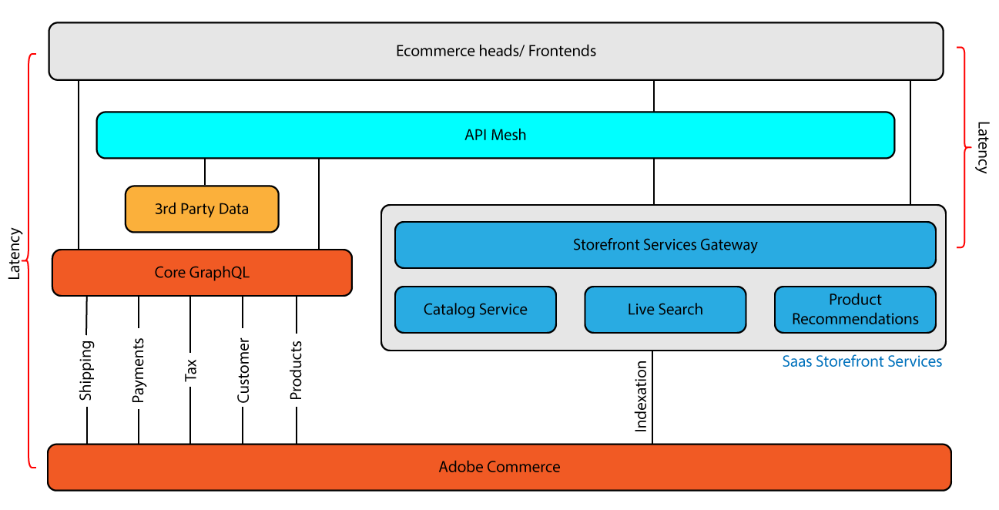

# [!DNL Catalog Service and API Mesh]

La rete API [per Adobe Developer App Builder](https://developer.adobe.com/graphql-mesh-gateway/gateway/overview/) consente agli sviluppatori di integrare API private o di terze parti e altre interfacce con i prodotti Adobe tramite Adobe I/O Runtime.



Per utilizzare Mesh API con Catalog Service, è necessario connettere Mesh API all&#39;istanza, quindi aggiungere l&#39;origine Mesh API [CommerceCatalogServiceGraph](https://github.com/adobe/api-mesh-sources/blob/main/connectors/) che fornisce la configurazione per la connessione al Catalog Service.

## Connetti e configura Mesh API.

1. Connetti Mesh API all&#39;istanza di Adobe Commerce seguendo le istruzioni per [creare un Mesh](https://developer.adobe.com/graphql-mesh-gateway/gateway/create-mesh/) nella _Guida per gli sviluppatori di Mesh API_.

   Se è la prima volta che usi Mesh API, completa il [processo Guida introduttiva](https://developer.adobe.com/graphql-mesh-gateway/mesh/basic/) prima di creare la mesh.

1. Creare un file JSON, ad esempio `variables.json`, contenente la chiave API di Catalog Service per il progetto utilizzando il formato seguente.

   ```json
   {
       "CATALOG_SERVICE_API_KEY":"your_api_key"
   }
   ```

1. Aggiungere l&#39;origine `CommerceCatalogServiceGraph` alla rete utilizzando [Adobe I/O Extensible CLI](https://developer.adobe.com/graphql-mesh-gateway/mesh/basic/#install-the-aio-cli).

   ```bash
   aio api-mesh source install "CommerceCatalogServiceGraph" -f variables.json
   ```

   L&#39;opzione `-f variables.json` fornisce il valore della chiave API Catalog Service necessario per aggiornare la configurazione.

Dopo aver eseguito questo comando, il servizio catalogo deve essere in esecuzione tramite la rete API. Utilizzare il comando `aio api-mesh get` per visualizzare la configurazione della rete aggiornata.

## Esempi di API Mesh

API Mesh consente agli utenti di utilizzare sorgenti di dati esterne per migliorare l’istanza di Adobe Commerce. Può anche essere utilizzato per configurare dati Commerce esistenti per abilitare nuove funzionalità.

### Abilita prezzi livello

In questo esempio, l’API Mesh viene utilizzata per abilitare i prezzi a livello in Adobe Commerce.
Sostituire i valori `name`, `endpoint` e `x-api-key`.

```json
{
  "meshConfig": {
    "sources": [
      {
        "name": "<Commerce Instance Name>",
        "handler": {
          "graphql": {
            "endpoint": "<Adobe Commerce GraphQL endpoint>"
          }
        },
        "transforms": [
            {
                "prefix": {
                    "includeRootOperations": true,
                    "value": "Core_"
                }
            }
        ]
      },
      {
        "name": "CommerceCatalogServiceGraph",
        "handler": {
          "graphql": {
            "endpoint": "https://commerce.adobe.io/catalog-service/graphql/",
            "operationHeaders": {
              "Magento-Store-View-Code": "{context.headers['magento-store-view-code']}",
              "Magento-Website-Code": "{context.headers['magento-website-code']}",
              "Magento-Store-Code": "{context.headers['magento-store-code']}",
              "Magento-Environment-Id": "{context.headers['magento-environment-id']}",
              "Magento-Customer-Group": "{context.headers['magento-customer-group']}"
            },
            "schemaHeaders": {
              "x-api-key": "<YOUR API-KEY>"
            }
          }
        }
      }
    ],
    "additionalTypeDefs": "extend interface ProductView {\n  price_tiers: [Core_TierPrice]\n}\n extend type SimpleProductView {\n  price_tiers: [Core_TierPrice]\n}\n extend type ComplexProductView {\n  price_tiers: [Core_TierPrice]\n}\n",
    "additionalResolvers": [
        {  
            "targetTypeName": "ProductView",
            "targetFieldName": "price_tiers",
            "sourceName": "MagentoStageCore",
            "sourceTypeName": "Query",
            "sourceFieldName": "Core_products",
            "requiredSelectionSet": "{\n    items {\n  sku\n    price_tiers {\n        quantity,\n        final_price {\n          value\n          currency\n        }\n      }\n    }\n  }",
            "sourceArgs": {
                "filter.sku.eq": "{root.sku}"
            },
            "result": "items[0].price_tiers"
        },
        {  
            "targetTypeName": "SimpleProductView",
            "targetFieldName": "price_tiers",
            "sourceName": "MagentoStageCore",
            "sourceTypeName": "Query",
            "sourceFieldName": "Core_products",
            "requiredSelectionSet": "{\n    items {\n  sku\n    price_tiers {\n        quantity,\n        final_price {\n          value\n          currency\n        }\n      }\n    }\n  }",
            "sourceArgs": {
                "filter.sku.eq": "{root.sku}"
            },
            "result": "items[0].price_tiers"
        },
        {  
            "targetTypeName": "ComplexProductView",
            "targetFieldName": "price_tiers",
            "sourceName": "MagentoStageCore",
            "sourceTypeName": "Query",
            "sourceFieldName": "Core_products",
            "requiredSelectionSet": "{\n    items {\n  sku\n    price_tiers {\n        quantity,\n        final_price {\n          value\n          currency\n        }\n      }\n    }\n  }",
            "sourceArgs": {
                "filter.sku.eq": "{root.sku}"
            },
            "result": "items[0].price_tiers"
        }
    ]
   }
}
```

Una volta configurata, esegui una query sulla rete per la determinazione dei prezzi su più livelli:

```graphql
query {
  products(skus: ["24-MB04"]) {
    sku
    description
    price_tiers {
        quantity
        final_price {
          value
          currency
        }
      }
    ... on SimpleProductView {
      id
       
      price {
        final {
          amount {
            value
          }
        }
      }
    }
  }
}
```

### Ottieni un ID entità

Questa Mesh aggiunge `entityId` all&#39;interfaccia ProductView. Sostituire i valori `name`, `endpoint` e `x-api-key`.

```json
{
    "meshConfig": {
      "sources": [
        {
          "name": "<Commerce Instance Name>",
          "handler": {
            "graphql": {
              "endpoint": "<Adobe Commerce GraphQL endpoint>"
            }
          },
          "transforms": [
              {
                  "prefix": {
                      "includeRootOperations": true,
                        "value": "Core_"
                  }
              }
          ]
        },
        {
          "name": "CommerceCatalogServiceGraph",
          "handler": {
            "graphql": {
              "endpoint": "https://catalog-service.adobe.io/graphql",
              "operationHeaders": {
                "Magento-Store-View-Code": "{context.headers['magento-store-view-code']}",
                "Magento-Website-Code": "{context.headers['magento-website-code']}",
                "Magento-Store-Code": "{context.headers['magento-store-code']}",
                "Magento-Environment-Id": "{context.headers['magento-environment-id']}",
                "x-api-key": "<YOUR_CATALOG_SERVICE_API_KEY>",
                "Magento-Customer-Group": "{context.headers['magento-customer-group']}"
              },
              "schemaHeaders": {
                "x-api-key": "<YOUR_CATALOG_SERVICE_API_KEY>"
              }
            }
          }
        }
      ],
      "additionalTypeDefs": "extend interface ProductView {\n  entityId: String\n}\n extend type SimpleProductView {\n  entityId: String\n}\n extend type ComplexProductView {\n  entityId: String\n}\n",
      "additionalResolvers": [
        {  
            "targetTypeName": "ComplexProductView",
            "targetFieldName": "entityId",
            "sourceName": "MagentoCore",
            "sourceTypeName": "Query",
            "sourceFieldName": "Core_products",
            "requiredSelectionSet": "{ sku\n }",
            "sourceSelectionSet": "{\n    items {\n  sku\n uid\n  }\n    }",
            "sourceArgs": {
                "filter.sku.eq": "{root.sku}"
            },
            "result": "items[0].uid",
            "resultType": "String"
          },
          {
            "targetTypeName": "SimpleProductView",
            "targetFieldName": "entityId",
            "sourceName": "MagentoCore",
            "sourceTypeName": "Query",
            "sourceFieldName": "Core_products",
            "requiredSelectionSet": "{ sku\n }",
            "sourceSelectionSet": "{\n items {\n  sku\n uid\n }}",
            "sourceArgs": {
                "filter.sku.eq": "{root.sku}"
            },
            "result": "items[0].uid",
            "resultType": "String"
          }
      ]
    }
  }
```

È ora possibile eseguire una query su `entityId`:

```graphql
query {
  products(skus: ["MH07"]){
    sku
    name
    id
    entityId
  }
}
```
