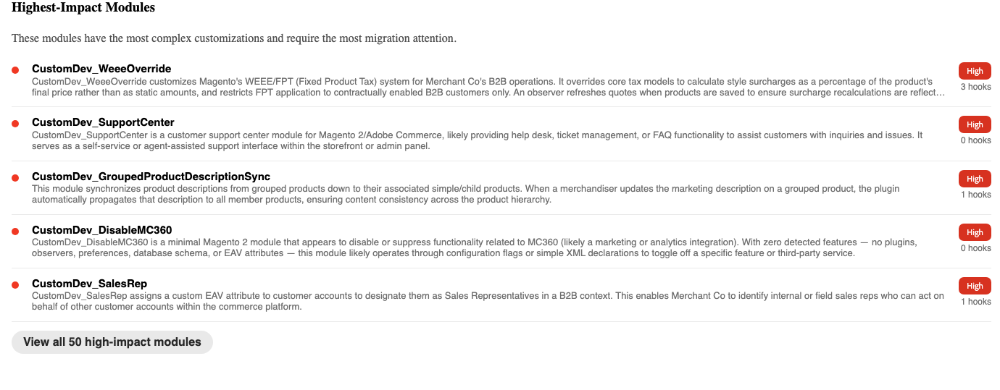

# Valutazione della migrazione

>[!IMPORTANT]
>
> La valutazione della migrazione è disponibile solo durante la migrazione di [!DNL Adobe Commerce on Cloud Infrastructure] o [!DNL Adobe Commerce on-premises] progetti in [!DNL Adobe Commerce as a Cloud Service].

Una valutazione della migrazione Commerce è un’analisi automatizzata dell’implementazione Adobe Commerce esistente. Gli strumenti di Adobe scansionano la base di codice di Commerce e producono un rapporto strutturato che elenca tutto ciò che è stato creato, personalizzato o modificato. Il report indica quindi come le personalizzazioni apportate alla base di codice influiscono sulla migrazione a [!DNL Adobe Commerce as a Cloud Service].

Il rapporto viene consegnato come file HTML che puoi aprire con qualsiasi browser. Non è richiesto alcun accesso all’ambiente di produzione, tranne che per la condivisione iniziale della base di codice del progetto.

**La valutazione fornisce:**

- Un inventario completo di ogni modulo personalizzato nel tuo negozio, organizzato per tipo e livello di impatto
- Una valutazione della complessità della migrazione (alta, Medium o bassa) calcolata da metriche predittive dei rischi
- Una visualizzazione prioritaria delle aree di backend e storefront con il massimo impatto che richiedono una pianificazione della migrazione
- Descrizione di ciascun modulo personalizzato che puoi utilizzare come input diretto per gli strumenti per sviluppatori AI di Adobe

## Informazioni sul report di valutazione della migrazione

Il report è organizzato in tre schede: **[!UICONTROL Summary]**, **[!UICONTROL Module Reports]** e **[!UICONTROL Report Reliability]**.

>[!NOTE]
>
>Non tutte le sezioni del rapporto sono valide per ogni punto vendita. La valutazione è progettata per essere completa su tutti i possibili tipi di personalizzazione e driver di complessità, ma il tuo archivio dispone solo di un sottoinsieme delle sezioni elencate qui.

## Scheda Riepilogo

La scheda **[!UICONTROL Summary]** fornisce una panoramica dei segnali chiave organizzati in queste aree:

- Complessità della migrazione
- Suddivisione tipo di file
- Moduli ad impatto maggiore
- Driver di migrazione
- Suddivisione personalizzazione

### Complessità della migrazione

La sezione Complessità della migrazione contiene la valutazione complessiva del tuo archivio. Spiega come è stato calcolato il punteggio ed evidenzia i fattori di rischio principali.

**Punteggio complessità e complessità della migrazione**

{width="600" zoomable="yes"}

Il Punteggio complessità pondera ogni input in base alla difficoltà della migrazione. Il punteggio è mappato su una valutazione della complessità della migrazione utilizzando soglie fisse:

| Valutazione | Intervallo punteggio | Approccio di migrazione tipico |
| --- | --- | --- |
| Basso | 150 o inferiore | Migrazione standard: migrazione diretta con il coordinamento dei fornitori di servizi di pagamento e migrazione dei dati come flussi di lavoro paralleli. |
| Medium | 151 - 375 | Migrazione modulare: migrazione in segmenti, con valutazione di moduli personalizzati ad alto impatto. |
| Alta | Oltre 375 | Migrazione graduale, con una durata probabile di 12-24 mesi. |

**Proporzioni moduli personalizzati**

{width="600" zoomable="yes"}

La percentuale di moduli creati appositamente per l’implementazione. Una proporzione maggiore richiede il controllo e la migrazione di una maggiore quantità di codice personalizzato. La percentuale media di moduli personalizzati del cliente è di circa il 62%.

>[!TIP]
>
>Il rapporto modulo personalizzato è un segnale di ambito, non di complessità. Un negozio con moduli personalizzati all&#39;80% isolati e a basso rischio potrebbe essere più facile da migrare rispetto a un negozio con moduli personalizzati a rischio del 40% più alto. Utilizza il Punteggio complessità e il numero di conflitti a catena per valutare le difficoltà. Utilizza le proporzioni del modulo personalizzato per stimare il volume.

**Suddivisione tipo file**

{width="600" zoomable="yes"}

Elenco del numero di file nella base di codice, organizzati per tipo.

**Moduli Ad Alto Impatto**

{width="600" zoomable="yes"}

Un elenco curato dei moduli specifici nel tuo store che richiedono la maggiore attenzione alla migrazione. Questi moduli sono spesso moduli che interagiscono con il pagamento, il pagamento o la gestione degli ordini. Ogni modulo ad alto impatto ha bisogno di un proprio piano di migrazione. Questo elenco è il miglior punto di partenza per le conversazioni con il tuo team tecnico.

### Complessità della vetrina

{width="600" zoomable="yes"}

La sezione Complessità vetrina evidenzia lo sforzo necessario per migrare il livello di presentazione front-end del negozio. Questo flusso di lavoro è distinto dalla migrazione del codice back-end e viene gestito dagli sviluppatori front-end, che in genere richiedono conversazioni di pianificazione separate.

>[!NOTE]
>
>Uno store può avere una bassa complessità di back-end e una elevata complessità di vetrina. Rivedi sempre entrambe le sezioni prima di definire l’ambito dello sforzo di migrazione.

- Tema personalizzato: lo spazio dei nomi del tema personalizzato del negozio (ad esempio, BrandName_Theme). La presenza di un tema personalizzato indica che è necessaria una ricostruzione completa del tema per [!DNL Adobe Commerce as a Cloud Service]. Ogni archivio valutato con uno spazio dei nomi tema personalizzato deve pianificare un flusso di lavoro di migrazione front-end dedicato.

- Blocchi totali: il numero di file di blocchi e modelli (.phtml) presenti nell’archivio. I blocchi sono gli artefatti primari di rendering lato server, ciascuno dei quali rappresenta un’attività di migrazione discreta.

| Conteggio blocchi | Impegno |
| --- | --- |
| Inferiore a 100 | Linea di base - sforzo standard |
| 100 - 300 | Medium: pianificare un&#39;ondata front-end strutturata |
| Oltre 300 | Alta - Assegna priorità come flusso di lavoro dedicato |

### Driver di migrazione

{width="600" zoomable="yes"}

La sezione Driver di migrazione mostra i principali fattori che determinano la valutazione della complessità.

| Driver | Definizione |
| --- | --- |
| Ingombro di personalizzazione | Volume complessivo del codice personalizzato relativo all’implementazione totale |
| Plug-in e osservatori | Codice che intercetta il comportamento della piattaforma di base in fase di runtime |
| Preferenze di classe | Un fragile pattern di personalizzazione, che sostituisce completamente le classi principali e si interrompe automaticamente con gli aggiornamenti |
| Modello dati | Strutture di database personalizzate e modificate |
| Integrazioni | Sistemi esterni collegati al negozio |

Ogni driver viene visualizzato con uno sforzo Alto, Medium o Basso. Risolvere i problemi relativi ai driver con il punteggio più alto durante l&#39;ambito e la pianificazione.

### Modello dati

{width="600" zoomable="yes"}

Nella sezione Modello dati viene visualizzato un conteggio di tabelle personalizzate, modifiche alle tabelle del database di base [!DNL Adobe Commerce] e attributi critici Entity-Attribute-Value (EAV).

Le modifiche della tabella di base sono la categoria più difficile da migrare, perché creano dipendenze da una versione specifica dello schema della piattaforma e hanno un impatto elevato nella formula del punteggio di complessità.

>[!TIP]
>
>Se il rapporto elenca più di 15 modifiche alla tabella principale, pianifica un flusso di lavoro di migrazione dei dati dedicato prima di definire l’ambito della migrazione del modulo back-end.

## Suddivisione personalizzazione

{width="600" zoomable="yes"}

La sezione Dettaglio personalizzazione fornisce metriche dettagliate per ogni categoria di personalizzazione nel tuo store.

>[!NOTE]
>
>Non tutte le sottosezioni vengono visualizzate in ogni rapporto, ma solo le categorie rilevate nella base di codice.
>
>Le sottosezioni che interessano il livello di presentazione front-end sono un flusso di lavoro distinto dalla migrazione del codice back-end e in genere richiedono conversazioni di pianificazione separate.
>
>Uno store può avere una bassa complessità di back-end e un&#39;elevata complessità di front-end. Rivedi sempre le sottosezioni relative al backend e alla vetrina prima di definire l’ambito della migrazione.

### XML layout

Il numero di file XML di layout e il numero totale di operazioni. XML layout definisce la struttura di ogni pagina, inclusi i blocchi visualizzati, i contenitori in cui vengono visualizzati e i tipi di pagina in cui si trovano.

Un numero elevato di file con molte operazioni segnala una significativa personalizzazione della struttura della pagina che deve essere riprogettata.

### Sostituzioni handle core

Il numero di posizioni in cui l&#39;XML di layout sostituisce un handle di pagina [!DNL Adobe Commerce] principale (ad esempio, `checkout_cart_index` o `catalog_product_view`). Le sostituzioni degli handle core sono il segnale di layout a più alto rischio perché modificano la struttura della pagina a livello di piattaforma e richiedono una ricostruzione esplicita.

| Sovrascrivi numero | Impegno |
| --- | --- |
| 0 | Nessuna sostituzione del layout di base |
| 1-3 | Rischio di runtime: ogni sostituzione richiede una ricostruzione del layout esplicita |
| 4 o più | Critico: pianificazione di uno sprint di migrazione layout dedicato |

### Blocchi

Numero di file di blocco e modello (`.phtml`) nell&#39;archivio. I blocchi sono gli artefatti primari di rendering lato server. Ogni blocco rappresenta un&#39;attività di migrazione discreta.

| Conteggio blocchi | Impegno |
| --- | --- |
| Inferiore a 100 | Linea di base - sforzo standard |
| 100 - 300 | Medium: pianificare un&#39;ondata front-end strutturata |
| Oltre 300 | Alta - Assegna priorità come flusso di lavoro dedicato |

### Blocchi ad alto rischio

Blocchi che toccano i percorsi di rendering core, ad esempio il rendering di checkout, la visualizzazione del carrello e superfici front-end simili. Qualsiasi blocco ad alto rischio richiede una valutazione individuale della migrazione prima della pianificazione.

### Temi e modelli e-mail

Lo spazio dei nomi del tema personalizzato dell&#39;archivio, ad esempio `BrandName_Theme`. La presenza di un tema personalizzato indica che è necessaria una ricostruzione completa del tema. Ogni archivio valutato con uno spazio dei nomi tema personalizzato deve pianificare un flusso di lavoro di migrazione front-end dedicato.

### Sostituzioni modello (core modificato)

Numero di modelli `.phtml` di base [!DNL Adobe Commerce] che sono stati sostituiti. Ogni sostituzione di un modello di base crea una dipendenza da una versione specifica del modello. Gli aggiornamenti di Platform che modificano il modello interrompono l’override in modo silenzioso.

### È richiesta la migrazione di destinazione

[!DNL Adobe Commerce as a Cloud Service] utilizza un&#39;architettura modulare dei componenti di rilascio per le superfici vetrina, inclusi checkout, carrello e dettagli prodotto. Le personalizzazioni di queste superfici devono essere ricreate come componenti del menu a discesa. Queste personalizzazioni possono coprire un’ampia gamma di funzionalità, ad esempio l’aggiunta di passaggi di pagamento personalizzati, la modifica della logica di visualizzazione del carrello o l’estensione della pagina dei dettagli del prodotto.

Il campo [!UICONTROL Drop-in migration required] indica le aree di vetrina che richiedono la ricompilazione.

>[!IMPORTANT]
>
>Se **Estrai** è elencato come requisito di migrazione per l&#39;eliminazione, pianifica un flusso di lavoro dedicato per l&#39;estrazione. Si tratta dell&#39;attività di migrazione della vetrina più complessa e business-critical.

## Scheda Report modulo

{width="600" zoomable="yes"}

La scheda **[!UICONTROL Module Reports]** contiene una voce dedicata per ogni modulo personalizzato presente nell&#39;archivio. Condividi queste informazioni con il tuo team tecnico.

Per ogni modulo, il rapporto visualizza:

| Nome campo | Definizione |
| --- | --- |
| Funzionamento | Descrizione dello scopo e della funzione aziendale del modulo personalizzato |
| Livello di impatto | **Alto**, **Medium** o **Basso** impatto in base al comportamento di e-commerce toccato dal modulo |
| Numero hook | Il numero di webhook, che indica quante posizioni questo modulo intercetta il comportamento della piattaforma di base |
| Raccomandazioni per la migrazione | **Ricostruisci**, **Refactoring**, **Sostituisci** con una funzionalità nativa o **Rimuovi** |
| Dipendenze | Con quali altri moduli interagisce questo modulo, che possono informare la sequenza di migrazione |

**Flusso di lavoro**

1. Filtra prima i moduli **ad alto impatto**. Questi fattori determinano il massimo impegno e i maggiori costi di migrazione.
1. Per ogni modulo personalizzato, determina le risposte alle seguenti domande:
   - Questo modulo è ancora utilizzato attivamente?
   - È possibile sostituire il modulo con una funzionalità nativa [!DNL Adobe Commerce as a Cloud Service]?
   - Se il modulo deve essere ricostruito, quali funzionalità deve fornire la funzionalità sostitutiva?
1. Identifica i moduli personalizzati che possono essere ritirati o sostituiti. Ciascuno riduce l’ambito di migrazione prima che venga scritto qualsiasi codice.
1. Copiare la descrizione di ogni modulo personalizzato con il consiglio di migrazione **Ricostruisci**. Queste descrizioni possono essere fornite direttamente agli strumenti per sviluppatori AI di Adobe. Per ulteriori informazioni, consulta [Strumenti per sviluppatori AI per l&#39;estensibilità di Commerce](#ai-developer-tools-for-commerce-extensibility).

## Riferimento: termini chiave

| Termine | Definizione |
| --- | --- |
| **Modulo** | Pacchetto di funzionalità personalizzato e autonomo. Il tuo negozio può contenere da venti moduli a centinaia di moduli. |
| **Plug-in (intercettore)** | Codice che intercetta una funzione Commerce e ne modifica il comportamento prima, durante o dopo l’esecuzione. |
| **Osservatore** | Codice che ascolta un evento specifico della piattaforma, ad esempio &quot;ordine effettuato&quot;, ed esegue una logica personalizzata quando tale evento viene attivato. |
| **Preferenza (sostituzione classe)** | Un tipo di personalizzazione fragile che sostituisce completamente una classe Commerce principale, che si interrompe automaticamente quando la piattaforma aggiorna tale classe. |
| **Conflitto catena** | Quando due o più plug-in intercettano la stessa funzione e uno non passa il controllo al successivo. In questo modo le funzionalità non funzioneranno più in modo silenzioso, senza alcun messaggio di errore. |
| **Modifica tabella core** | Modifica strutturale delle tabelle di database integrate di Commerce che crea una dipendenza irreversibile da una versione specifica dello schema della piattaforma. Questi presentano il peso più alto nella formula Punteggio complessità. |
| **Valore-Attributo-Entità (EAV)** | Un campo personalizzato flessibile aggiunto ai prodotti o ai clienti, ad esempio un campo personalizzato &quot;periodo di garanzia&quot;. Un numero elevato di EAV aumenta la complessità della migrazione dei dati. |
| **Densità hook** | Numero medio di plug-in e osservatori per modulo. Una densità più elevata significa che la personalizzazione è più strettamente collegata alla piattaforma principale. |
| **Consegna** | [!DNL Adobe Commerce's] approccio modulare ai componenti della vetrina (incluse le pagine di checkout, carrello e dettagli prodotto). Il comportamento di estrazione personalizzato su [!DNL Adobe Commerce on Cloud Infrastructure] o [!DNL Adobe Commerce on Premises] in genere richiede una ricompilazione dell&#39;eliminazione su [!DNL Adobe Commerce as a Cloud Service]. |
| **App Builder** | Piattaforma di estendibilità out-of-process di Adobe e metodo consigliato per creare funzionalità personalizzate, sostituendo le estensioni PHP in-process. |
| **XML layout** | File di configurazione che definiscono quali blocchi vengono visualizzati su quali pagine. Il layout XML personalizzato deve essere riprogettato per la struttura di pagina [!DNL Adobe Commerce as a Cloud Service's]. |
| **Sostituzione handle core** | Personalizzazione XML di layout che modifica globalmente una struttura di pagina principale di Commerce. che presentano il layout più rischioso per la migrazione. |

## Strumenti per sviluppatori AI per l’estensibilità di Commerce

È possibile utilizzare le descrizioni dei moduli nella scheda **[!UICONTROL Module Reports]** come richieste per gli strumenti per sviluppatori di IA di Adobe. Gli strumenti consentono di creare e distribuire un&#39;estensione sostitutiva compatibile con [!DNL Adobe Commerce as a Cloud Service].

### Informazioni fornite dagli strumenti

Gli strumenti per sviluppatori di IA per l&#39;analisi di [Adobe per l&#39;estensibilità di Commerce](https://developer.adobe.com/commerce/extensibility/developer-agent/) includono due funzionalità principali.

- Server MCP [!DNL Adobe Commerce] [!DNL App Builder]: integrazione MCP (Model Context Protocol) che connette gli assistenti di codifica AI direttamente alla documentazione [!DNL Adobe Commerce], alle API e ai modelli di sviluppo App Builder. Gli sviluppatori possono descrivere ciò che desiderano generare e il server MCP fornisce generazione di codice compatibile con Commerce, indicazioni sull&#39;architettura e automazione della distribuzione all&#39;interno dell&#39;IDE.
- Competenze agente: competenze IA predefinite che coprono pattern di estensibilità comuni di Commerce, come API REST, estensioni di pagamento, componenti di vetrina e integrazioni basate su eventi. Le abilità guidano l&#39;intelligenza artificiale attraverso i passaggi di architettura, implementazione, test e distribuzione specifici di [!DNL Adobe Commerce as a Cloud Service] e [!DNL App Builder].

#### Installare gli strumenti di intelligenza artificiale

Per istruzioni complete e configurazioni IDE specifiche, consulta [installazione degli strumenti per sviluppatori di IA](https://developer.adobe.com/commerce/extensibility/developer-agent/coding-tools).

**Prerequisiti:** Node.js 22.x, npm 9.0.0 o versione successiva, Adobe I/O CLI.

Comando Installa:

```bash
aio commerce extensibility tools-setup
```

### Creare prompt dal rapporto di valutazione

Sebbene la valutazione fornisca un blueprint per lo sviluppo, gli strumenti di intelligenza artificiale consentono al team di iniziare a creare immediatamente, prima che venga finalizzato un piano di migrazione completo.

1. Apri la scheda **[!UICONTROL Module Reports]** e trova un modulo ad alto impatto con un consiglio di **Ricostruzione**.
1. Leggi la descrizione del modulo, ad esempio:

```shell-session
Manages custom shipping rate calculations based on customer account tier and order    weight thresholds.
```

1. Apri l’IDE, ad esempio GitHub Copilot, Cursore o Claude con il server MCP di estensibilità Commerce abilitato.
1. Utilizza la descrizione del modulo per richiedere all’agente di intelligenza artificiale.
1. Rivedi l&#39;applicazione [!DNL App Builder] su cui è stato eseguito lo scaffolding e ripeti con l&#39;agente per perfezionare l&#39;implementazione.

## Passaggi successivi

1. Apri la scheda **[!UICONTROL Summary]**. Rivedi Complessità della migrazione e Moduli dal massimo impatto, quindi controlla le sottosezioni Dettaglio personalizzazione. Se il tuo negozio ha un tema personalizzato, blocchi ad alto rischio o un Checkout Drop-in elencato, pianifica un flusso di lavoro front-end parallelo insieme alla migrazione back-end.
1. Condividi la scheda **[!UICONTROL Module Reports]** con il tuo team tecnico o partner di sviluppo. Chiedi loro di contrassegnare eventuali moduli personalizzati non più utilizzati attivamente o che potrebbero essere sostituiti da una funzionalità [!DNL Adobe Commerce as a Cloud Service].
1. Inizia a creare le personalizzazioni. Utilizza le descrizioni del modulo come input dello strumento di intelligenza artificiale per iniziare a scaffolding con estensioni compatibili.
1. Pianifica una chiamata dettagliata con il team del tuo account Adobe. Adobe può esaminare i risultati con te, rispondere a qualsiasi domanda su moduli specifici e segnali di vetrina e aiutarti a mappare l’approccio alla migrazione per il tuo profilo di complessità.

## Risorse

- [!DNL Adobe Commerce as a Cloud Service]
   - [Panoramica](../overview.md)
   - [Panoramica sulla migrazione](./overview.md)
   - [Esercitazione sull’estensione delle valutazioni](../tutorials/ratings-extension.md)
   - [Esercitazione sul metodo di spedizione](../tutorials/shipping-method-extension.md)
- Estensibilità
   - [Panoramica](https://developer.adobe.com/commerce/extensibility/)
   - [Strumenti per sviluppatori AI](https://developer.adobe.com/commerce/extensibility/developer-agent/)
      - [Best practice](https://developer.adobe.com/commerce/extensibility/developer-agent/best-practices)
      - [Configurazione](https://developer.adobe.com/commerce/extensibility/developer-agent/coding-tools)
      - [Abilità e prompt](https://developer.adobe.com/commerce/extensibility/developer-agent/skills-and-prompts)
      - [Casi d’uso](https://developer.adobe.com/commerce/extensibility/developer-agent/use-cases)
   - [Panoramica di App Builder](https://developer.adobe.com/app-builder/docs/intro_and_overview/)
   - [App Builder per Adobe Commerce](https://experienceleague.adobe.com/it/docs/commerce-learn/tutorials/extensibility/adobe-developer-app-builder/introduction-to-app-builder)
   - Starter kit
      - [Kit di avvio per integrazione back-end](https://developer.adobe.com/commerce/extensibility/starter-kit/integration/)
      - [Kit di avvio per il pagamento](https://developer.adobe.com/commerce/extensibility/starter-kit/checkout/)
- Sviluppo storefront
   - [Panoramica](https://experienceleague.adobe.com/developer/commerce/storefront/?lang=it)
   - [Competenze di IA per la vetrina](https://experienceleague.adobe.com/developer/commerce/storefront/boilerplate/ai-agent-skills/?lang=it)

>[!TIP]
>
>Contatta l’account manager della soluzione per richiedere una valutazione della migrazione dell’istanza esistente.
