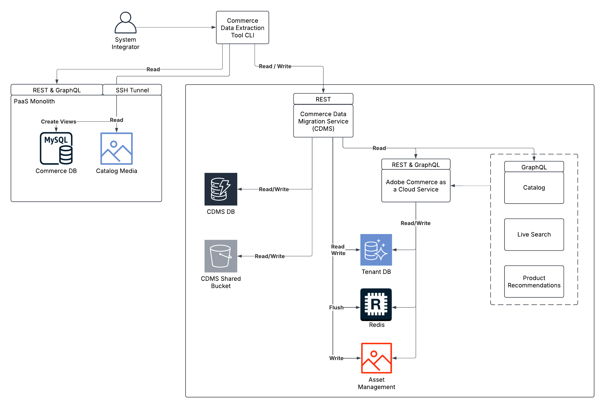

# Strumento di migrazione dati in blocco

Lo strumento di migrazione di massa dei dati segue un’architettura distribuita che consente una migrazione sicura ed efficiente dei dati dagli ambienti PaaS agli ambienti SaaS. Questo strumento è progettato per consentire ai responsabili dell&#39;implementazione della soluzione di migrare i dati da un&#39;istanza esistente di Adobe Commerce on Cloud (PaaS) a [!DNL Adobe Commerce as a Cloud Service] (SaaS). Per ulteriori informazioni sul processo di migrazione, vedere [Panoramica sulla migrazione](./overview.md).

>[!NOTE]
>
>Lo strumento di migrazione dei dati in blocco supporta solo la migrazione dei dati di e-commerce di prime parti. La migrazione dei dati personalizzati non è attualmente supportata.

L’immagine seguente descrive l’architettura e i componenti chiave per l’utilizzo dello strumento Bulk Data Migration.



## Flusso di lavoro di migrazione

Il flusso di lavoro di migrazione dei dati in blocco è costituito dai seguenti passaggi:

1. Imposta un nuovo ambiente per la migrazione.
1. Copia i dati dal vecchio sistema.
1. Sposta i dati nel nuovo sistema.
1. Rendi il catalogo dei prodotti disponibile nel nuovo sistema.
1. Verifica che i dati siano stati migrati correttamente.

Le sezioni seguenti descrivono in dettaglio questi passaggi.

## Accedere allo strumento di migrazione dei dati in blocco

Lo strumento di migrazione dei dati in blocco è disponibile come segue:

- **T4 2025** (non ancora disponibile) - Dopo la versione iniziale dello strumento di migrazione dati in blocco, potrai accedervi inviando un ticket di supporto.
- **T4 2025** (non ancora disponibile) - Dopo il rilascio pubblico dello strumento di migrazione dati in blocco, sarà accessibile da questa pagina.

## Creare un ambiente di destinazione

Il Solution Implementer (SI) crea un ambiente di destinazione per la migrazione. Questo ambiente viene utilizzato per archiviare i dati migrati dall’istanza di origine.

Innanzitutto, [crea una nuova istanza  [!DNL Adobe Commerce as a Cloud Service] (SaaS)](../getting-started.md#create-an-instance).

### Configura strumento di estrazione

Lo strumento di estrazione viene utilizzato per estrarre i dati dall’istanza di origine.

1. Scarica lo strumento di estrazione dal collegamento fornito da Adobe.
1. Imposta le seguenti variabili di ambiente nello strumento di estrazione:
   - Dettagli di connessione al database MySQL esistente
   - ID tenant di destinazione per l&#39;istanza [!DNL Adobe Commerce as a Cloud Service]
   - Le tue credenziali IMS, tra cui:
      - ID client
      - Segreto client
      - Ambiti IMS
      - URL IMS: l’URL di base. Ad esempio, `https://ims-na1.adobelogin.com/`.
      - ID organizzazione IMS

   Per ambiti IMS e altri valori, seleziona il tipo OAuth nella sezione **Credenziali** all&#39;interno del progetto in [Adobe Developer Console](https://developer.adobe.com/console/). Ulteriori informazioni sono fornite nel file `.example.env` incluso con lo strumento di estrazione.

### Estrai dati

Prima di eseguire lo strumento di estrazione, l’implementatore della soluzione deve stabilire un tunnel SSH per il database PaaS utilizzando:

```bash
magento-cloud tunnel:open
```

Quindi esegui lo strumento di estrazione, che:

1. Connettiti al database PaaS, analizzane lo schema e confrontalo con i dettagli dello schema del tenant SaaS.
1. Genera un piano di estrazione e trasformazione basato sugli elementi dello schema comuni tra PaaS e SaaS.
1. Estrai i dati utilizzando Catalog Data Management Service (CDMS).

### Carica dati

Esegui lo strumento di caricamento dati fornito da Adobe. Questo strumento:

1. Connettersi al database tenant SaaS utilizzando un account di migrazione.
1. Genera un piano di caricamento.
1. Esegui il piano, spostando i dati nel database del tenant SaaS in batch.
1. Elabora i file multimediali del catalogo e trasferiscili nell&#39;ambiente di destinazione.
1. Svuota la cache Redis SaaS e invalida gli indici di database per il tenant.

### Acquisizione dei dati del catalogo

Dopo il caricamento dei dati, i dati del catalogo passano automaticamente dal database tenant SaaS a Catalog Service.

Catalog Service condivide questi dati con Live Search e Product Recommendations. Non è richiesto alcun intervento manuale per questo processo. I dati saranno disponibili in tutti i servizi al termine dell’acquisizione.

### Verifica dell’integrità dei dati

Dopo la migrazione, CDMS esegue i seguenti controlli automatici di integrità dei dati per garantire l’accuratezza e la completezza dei dati migrati:

**Verifica basata su API**

Durante la verifica, CDMS confronta le risposte REST e API di GraphQL da query eseguite in precedenza con i record corrispondenti dell’istanza di destinazione. Eventuali discrepanze sono visibili nello stato di migrazione.

**Verifica a livello di database**

Durante la verifica, CDMS conta il numero di record estratti e confronta tale numero con la quantità di record caricati.

**Verifica su richiesta (facoltativa)**

È inoltre possibile attivare manualmente la verifica completa di tutti i record di sistema:

>[!NOTE]
>
>Questo processo richiede molte risorse e deve essere utilizzato solo in ambienti sandbox.

La verifica completa comprende:

- Verifica completa basata su API utilizzando tutte le risposte API REST e GraphQL pre-estratte
- Rapporto dettagliato di eventuali incongruenze riscontrate
