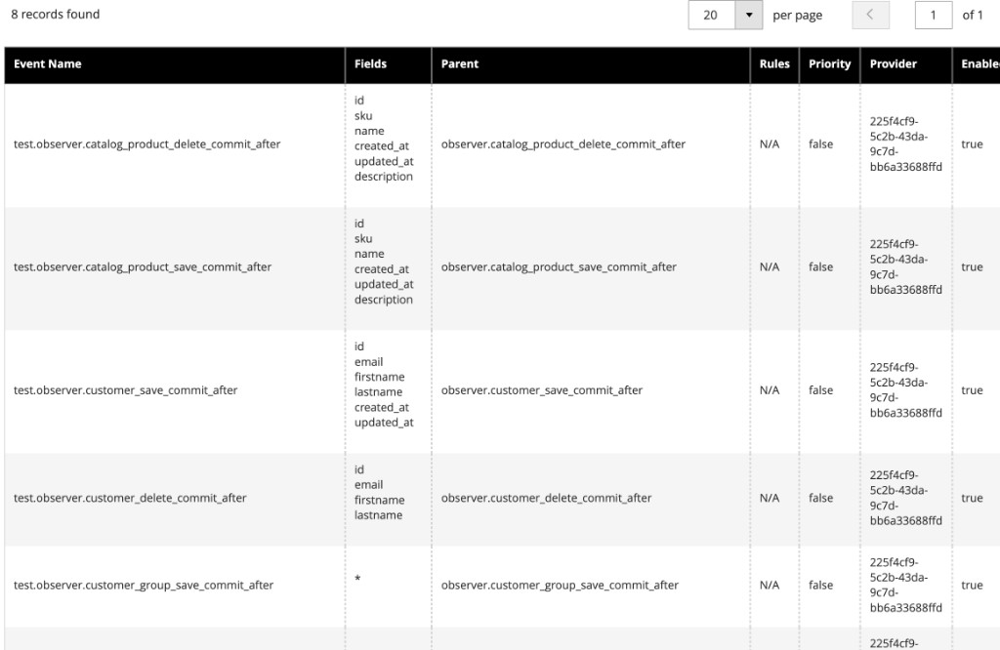

# Esercitazione sull’estensione delle notifiche in-stock

Questa esercitazione ti guida attraverso la creazione di un&#39;estensione di notifica in-stock per [!DNL Adobe Commerce as a Cloud Service] utilizzando [!DNL Adobe App Builder] e strumenti di sviluppo assistiti da IA. L’estensione consente agli acquirenti di abbonarsi a prodotti esauriti e ricevere una notifica quando il prodotto è di nuovo disponibile.

Vengono create due parti:

- **Estensione App Builder**: API REST per la gestione degli abbonamenti esauriti (creazione, lettura, eliminazione) con rilevamento back-in-stock basato su eventi e pianificato.
- **Integrazione vetrina**: modulo di abbonamento nella pagina dettagli prodotto (PDP) visualizzato solo quando il prodotto o la variante selezionati non sono disponibili.

>[!NOTE]
>
>Gli agenti di IA non sono deterministici. I prompt, le domande e gli output di questa esercitazione sono esempi. Il tuo agente può produrre domande, requisiti o proposte di architettura diversi. Utilizza gli esempi in questa esercitazione per indirizzare l’agente verso un risultato simile.

Prima di iniziare, completa i [prerequisiti](./tutorial-prerequisites.md). Questa esercitazione utilizza il **kit di avvio dell&#39;integrazione**. Verificare di averlo già clonato e di aver completato i passaggi di configurazione descritti nella pagina prerequisiti.

## Verificare i prerequisiti

Verifica che siano installati i seguenti prerequisiti:

```bash
# Check Node.js version (should be 22.x.x)
node --version

# Check npm version (should be 9.0.0 or higher)
npm --version

# Check Git installation
git --version

# Check Bash shell installation
bash --version
```

Se uno dei comandi precedenti non restituisce i risultati previsti, consultare i [prerequisiti](./tutorial-prerequisites.md).

Inoltre, verifica quanto segue:

- È presente un&#39;istanza [!DNL Adobe Commerce as a Cloud Service] con dati di prodotto. Consulta [Istanze del servizio Commerce Cloud](https://experienceleague.adobe.com/it/docs/commerce/cloud-service/overview){target="_blank"}.
- Si dispone di un progetto vetrina connesso all&#39;istanza [!DNL Commerce]. In caso contrario, seguire i passaggi descritti in [Creare una vetrina](https://experienceleague.adobe.com/developer/commerce/storefront/get-started/create-storefront/?lang=it){target="_blank"}.
- CLI `aem` installato:

  ```bash
  npm install -g @adobe/aem-cli
  ```

## Sviluppo delle estensioni

Questa sezione descrive come sviluppare un&#39;estensione di notifica in-stock per [!DNL Adobe Commerce as a Cloud Service] utilizzando strumenti di sviluppo assistiti da IA. L’estensione fornisce un’API REST per la gestione degli abbonamenti e rileva quando i prodotti tornano a magazzino tramite eventi Commerce e un controllo pianificato.

1. Passa alle impostazioni MCP nell’agente di codifica.

   Ad esempio, in Cursore, vai a **[!UICONTROL Cursor]** > **[!UICONTROL Settings]** > **[!UICONTROL Cursor Settings]** > **[!UICONTROL Tools & MCP]**. Verificare che il set di strumenti `commerce-extensibility` sia abilitato senza errori. Se vengono visualizzati degli errori, disattiva e attiva la serie di strumenti.

   >[!NOTE]
   >
   >Quando si lavora con strumenti di sviluppo assistiti da intelligenza artificiale, è probabile che il codice e le risposte generate dall’agente presentino variazioni naturali.
   >Se riscontri problemi con il codice, chiedi all&#39;agente di aiutarti a eseguirne il debug.

1. Se hai aggiunto della documentazione al contesto del cursore, disattivala.

   Passa a **[!UICONTROL Cursor]** > **[!UICONTROL Settings]** > **[!UICONTROL Cursor Settings]** > **[!UICONTROL Indexing & Docs]** ed elimina la documentazione elencata.

### Passaggio 1: fornire il prompt iniziale

Richiedi all’agente di intelligenza artificiale di iniziare l’implementazione. Dire all&#39;agente di fermarsi e porre domande ti aiuta a gestire l&#39;implementazione in anticipo.

Immetti il seguente prompt nella finestra di chat dell&#39;agente:

```shell-session
Implement an Adobe Commerce as a Cloud Service extension to handle out-of-stock notifications for products.

The service should provide REST API endpoints for basic create, read, update, and delete (CRUD) operations on out-of-stock notifications, allowing storefronts to manage notifications for specific product SKUs.

Back-in-stock is detected by an inventory or product event or a scheduled action that checks Commerce API and then calls the REST API to send the notification.

STOP and ask me any clarifying questions you have about the requirements before you do any work.
```

>[!TIP]
>
>Dire all&#39;agente di INTERROMPERE e porre domande prima di procedere ti aiuta a gestire l&#39;implementazione nelle prime fasi del processo. Questo processo assicura che i presupposti chiave e i requisiti mancanti vengano identificati in anticipo ed è necessario per avviare il flusso di lavoro guidato in questa esercitazione.

### Passaggio 2: Rispondere alle domande dell&#39;agente

L’agente restituisce una serie di domande necessarie prima di poter iniziare a formare una soluzione. Nell&#39;esempio seguente vengono illustrate domande e risposte tipiche. Il tuo agente può porre domande diverse, ma gli argomenti sono in genere gli stessi.

**Domande dell&#39;agente di esempio:**

1. **API REST — host e consumatori** — L&#39;API REST CRUD deve far parte di questa app App Builder (ad esempio, azioni web su Adobe I/O Runtime) che le vetrine chiamano? Chi lo chiamerà (EDS Storefront, custom/headless storefront, o entrambi)? Hai bisogno di un accesso CORS o pubblico (non autenticato) oppure i chiamanti useranno chiavi API, OAuth o token Commerce?
1. **Modello dati** — Cosa deve rappresentare una &quot;notifica&quot;? Identificatore cliente (solo e-mail o anche ID cliente)? Identificatore del prodotto (solo SKU o SKU + visualizzazione punto vendita)? Lo stesso cliente può abbonarsi più volte allo stesso SKU o gli abbonamenti devono essere deduplicati?
1. **Rilevamento back-in-stock: evento vs. pianificato** - Desideri il rilevamento basato su eventi (reagire a un evento di inventario/prodotto di Commerce), il rilevamento pianificato (un&#39;azione pianificata che controlla periodicamente le scorte) o entrambi? Cosa significa &quot;inviare la notifica&quot; (chiamare un webhook esterno, inviare un’e-mail o registrarlo)?
1. **Back-in-stock — origine Commerce** — Si dispone di un nome di evento preferito o la progettazione deve utilizzare qualsiasi evento di inventario/aggiornamento stock fornito da Commerce? Per i controlli pianificati, quale API deve essere utilizzata per ottenere lo stato delle scorte in base allo SKU?
1. **Persistenza e multi-tenancy**: `aio-lib-state` è il posto giusto per mantenere gli abbonamenti o si dispone di un archivio esterno? Il progetto deve presupporre più tenant o tenant singolo?
1. **Semantica e ciclo di vita CRUD**. Eliminare significa annullare l&#39;abbonamento? Hai bisogno di un aggiornamento? Dopo l’invio di una notifica di back-in-stock, l’abbonamento deve essere rimosso automaticamente o contrassegnato come notificato?
1. **Non funzionante** — Eventuali limiti di tariffa o abbonamenti massimi da applicare? È necessario soddisfare i requisiti di conformità (doppio consenso, flag di consenso)?

**Risposte di esempio:**

```shell-session
1. The CRUD REST API should be part of thie App Builder app. It will be called by the EDS Storefront. For this implementation there is no need for API keys or security tokens.
2. For this initial implementation the customer identifier will be the email, product is identified by SKU, customer emails should not be able to subscribe to the same SKU multiple times.
3. Implement both. For now instead of sending the notification, log it so I can audit in the Adobe Developer Console.
4. Research and use what the best event to use that commerce already provides. Research the simplest way to get the stock status by SKU.
5. Use the aio-lib-state. Single tenant for now
6. Delete means cancel subscription. Skip Update, it does not apply for this service. After subscription is sent, it should be marked as notified or removed so it won't send again until the user subscribes again.
7. No limits. Implement minimal compliance requirements.
```

>[!NOTE]
>
>Il tuo agente potrebbe porre domande diverse. Utilizza queste risposte come guida per indirizzare l’agente verso lo stesso risultato funzionale: un’API REST con abbonamenti e-mail e SKU, rilevamento back-in-stock basato su eventi e pianificato, persistenza di `aio-lib-state` e notifiche basate su log.

### Passaggio 3: verifica dei requisiti e dell’architettura

L&#39;agente genera i requisiti e i documenti dell&#39;architettura da esaminare. Verifica che i requisiti corrispondano alle risposte fornite e che l’architettura copra:

- Un’azione REST API per il CRUD della sottoscrizione (creazione, lettura, aggiornamento ed eliminazione)
- Gestore back-in-stock basato su eventi attivato dagli eventi di inventario di Commerce
- Azione di archiviazione pianificata come fallback
- Persistenza con `aio-lib-state`

>[!NOTE]
>
>Gli agenti di IA non sono deterministici e i loro comportamenti variano a seconda del modello e dell’IDE. È possibile che vengano visualizzate domande diverse che producono un diverso insieme di requisiti e architettura. In tal caso, prima di procedere, prova a dirigere l’agente in una direzione tale che l’implementazione corrisponda strettamente a quanto illustrato in questa esercitazione.

### Passaggio 4: selezionare un piano di implementazione

L’agente ti offre la possibilità di creare un piano di implementazione dettagliato o di completare un’implementazione diretta.

- Se si desidera un piano revisionabile che può essere eseguito in fasi con maggiore controllo, selezionare la prima opzione.
- Se desideri che l&#39;agente esegua l&#39;implementazione completa con un intervento minimo, seleziona la seconda opzione.

### Passaggio 5: distribuire, integrare e sottoscrivere eventi

Dopo aver completato l’implementazione, l’agente esegue i passaggi successivi per distribuire l’app, integrare l’istanza di Commerce e abbonarsi agli eventi utilizzando i seguenti comandi:

1. Distribuisci l&#39;estensione:

   ```bash
   aio app deploy
   ```

1. Esegui lo script di onboarding per registrare il provider di eventi con Commerce:

   ```bash
   npm run onboard
   ```

1. Iscriviti agli eventi Commerce:

   ```bash
   npm run commerce-event-subscribe
   ```

1. Convalida la sottoscrizione dell’evento.

   Passa all&#39;istanza di Commerce e apri **[!UICONTROL System]** > **[!UICONTROL Event Subscriptions]**.

   Dovresti visualizzare una tabella di record di eventi.

   {width="600" zoomable="yes"}

   {width="600" zoomable="yes"}

### Passaggio 6: testare l’estensione

Chiedi all&#39;agente di fornire i passaggi di test. Poiché si tratta di un servizio API, puoi richiedere istruzioni dalla riga di comando:

```shell-session
Give me step by step instructions to test the API service from the command line.
```

Segui i passaggi forniti dall’agente. Negli esempi seguenti vengono illustrati i comandi di test tipici.

**Iscrizione a uno SKU:**

```bash
API_URL="https://<your-runtime-url>/api/v1/web/notify-out-of-stock/api"; curl -X POST "$API_URL" \
  -H "Content-Type: application/json" \
  -d '{"email":"test@example.com","sku":"ADB153"}'
```

La risposta è simile a:

```json
{
  "createdAt": "2026-03-06T22:11:00.308Z",
  "email": "test@example.com",
  "id": "b3353bf5-1007-4b10-989d-430892dd4a66",
  "sku": "ADB153"
}
```

**Elenca tutte le sottoscrizioni:**

```bash
curl -X GET "$API_URL"
```

La risposta restituisce un elenco di tutte le sottoscrizioni attive:

```json
{
  "subscriptions": [
    {
      "createdAt": "2026-03-06T22:11:00.308Z",
      "email": "test@example.com",
      "id": "b3353bf5-1007-4b10-989d-430892dd4a66",
      "sku": "ADB153"
    }
  ]
}
```

**Verifica del flusso di back-in-stock:**

1. Dalla tua istanza di Commerce, modifica un prodotto per il quale hai creato un abbonamento.
1. Impostare lo stato del magazzino del prodotto su **[!UICONTROL Out of Stock]**.
1. Attendere circa un minuto e riportare lo stato delle scorte a **[!UICONTROL In Stock]**.

   {width="600" zoomable="yes"}

1. Attendi circa cinque minuti prima che l’evento venga attivato e inviato al servizio.

1. Da [!DNL Adobe Developer Console], passa alla sezione dei registri di App Builder.

   {width="600" zoomable="yes"}

1. Nei registri, verifica che siano presenti voci che confermano l’elaborazione dell’evento e che sia stata identificata la coppia di abbonamento SKU e-mail corretta.

   {width="600" zoomable="yes"}

>[!TIP]
>
>Puoi chiedere all’agente cosa cercare nei registri per verificare che l’azione di notifica sia stata registrata correttamente. Puoi anche copiare e incollare le voci di registro per fare in modo che l’agente effettui la verifica.

Dopo i processi dell’evento back-in-stock, la richiesta dell’elenco degli abbonamenti deve restituire una voce in meno, perché l’abbonamento notificato viene rimosso.

### Crea il contratto di assistenza

Una volta completata l&#39;implementazione del servizio, chiedere all&#39;agente di creare un contratto di assistenza per il lavoro della vetrina:

```shell-session
Create an API service contract for the Out of Stock notification service and its endpoints. Ensure that the service contract is clear and detailed enough for a frontend developer to implement the storefront UI integration without needing to ask additional questions about the API. Name this file OUT_OF_STOCK_NOTIFICATION_CONTRACT.md
```

Copia questo file nel progetto storefront in modo che l&#39;agente storefront possa farvi riferimento.

## Connetti alla vetrina

Questa sezione ti guida attraverso l&#39;implementazione della parte storefront dell&#39;estensione di notifica in-stock utilizzando [!DNL Edge Delivery Services] e strumenti di sviluppo assistiti da IA. Aggiungi un modulo di abbonamento alla pagina dei dettagli del prodotto (PDP) che viene visualizzata solo quando il prodotto o la variante selezionati è esaurito.

>[!NOTE]
>
>I prompt forniti sono punti di partenza. Anche se puoi utilizzarli senza modifiche, puoi considerare di parlare naturalmente con l&#39;agente.
>
>Quando si lavora con strumenti di sviluppo assistiti da intelligenza artificiale, il codice e le risposte generate dall’agente hanno sempre varianti naturali.
>
>Se riscontri problemi con il codice, chiedi all&#39;agente di aiutarti a eseguirne il debug.

### Prerequisiti per la vetrina

Prima di avviare l’integrazione con la vetrina, verifica di disporre dei seguenti elementi:

- Progetto vetrina connesso all&#39;istanza [!DNL Commerce]
- Strumenti di intelligenza artificiale per vetrina Commerce [installati utilizzando CLI](./tutorial-prerequisites.md#install-the-storefront-ai-tools)
- Il file `OUT_OF_STOCK_NOTIFICATION_CONTRACT.md` copiato nel tuo progetto storefront

### Passaggio 1: Convalidare l’ambiente

Apri il file `config.json` e verifica che i valori per `commerce-core-endpoint` e `commerce-endpoint` puntino all&#39;endpoint GraphQL [!DNL Adobe Commerce as a Cloud Service].

```json
"commerce-core-endpoint": "https://na1-sandbox.api.commerce.adobe.com/<your-instance-id>/graphql",
"commerce-endpoint": "https://na1-sandbox.api.commerce.adobe.com/<your-instance-id>/graphql",
```

### Passaggio 2: specificare il prompt iniziale

Se il contratto di assistenza è già presente nel progetto, richiedi all’agente di creare l’interfaccia utente nella pagina dei dettagli del prodotto. Utilizza la modalità **Piano**, se disponibile nell&#39;agente, per impedire che l&#39;agente proceda senza un piano.

```shell-session
Analyze @OUT_OF_STOCK_NOTIFICATION_CONTRACT.md. Add a form for subscribing to a notification for when a product is back in stock. Place this form on the product details page, underneath the add to cart and wishlist button. The form only displays when a product is out of stock. 

Use the project manager skill to plan this implementation.
```

>[!TIP]
>
>La richiesta specifica di utilizzare l’abilità di project manager attiva il flusso di lavoro graduale che consente di gestire l’implementazione nelle prime fasi del processo. Questo processo assicura che i presupposti chiave e i requisiti mancanti siano identificati in anticipo e dà all&#39;agente l&#39;opportunità di presentarti dettagli e requisiti che potresti non aver pensato di fornire nel prompt originale.

### Passaggio 3: rispondere alle domande di pianificazione

L&#39;agente restituisce una serie di domande a cui deve rispondere prima di poter iniziare a creare una soluzione. Nell&#39;esempio seguente vengono illustrate domande e risposte tipiche. Il tuo agente può porre domande diverse, ma gli argomenti sono in genere gli stessi.

**Domande dell&#39;agente di esempio:**

1. **URL di base API** — In che modo la vetrina deve ottenere l&#39;URL di base API per la notifica esaurito? Le opzioni possono includere un blocco di configurazione (ad esempio, una tabella con `out-of-stock-api-base-url`), segnaposto globali, variabili di ambiente o un altro approccio.
1. **Copia** — L&#39;implementazione deve utilizzare segnaposto per i messaggi di errore e di successo (ad esempio, per la localizzazione) o utilizzare l&#39;inglese statico per questa implementazione?
1. **Dopo aver effettuato l&#39;abbonamento**, il modulo deve essere nascosto e visualizzato solo &quot;Sei abbonato&quot; (A), deve essere visibile ma disabilitato e deve contenere un messaggio di operazione riuscita (B) o un altro comportamento (C)?
1. **Prodotti configurabili**: la visibilità del modulo deve essere basata sul valore `inStock` della variante selezionata, in modo che il modulo venga visualizzato quando la variante selezionata è esaurita?

**Risposte di esempio:**

```shell-session
1. Global placeholder with baseurl value of `https://<your-runtime-url>/api/v1/web/notify-out-of-stock/api`
2. Use placeholders with static English fallback
3. B
4. Use selected variant's inStock value
```

>[!NOTE]
>
>Sostituisci `<your-runtime-url>` con l&#39;URL [!DNL Adobe I/O Runtime] effettivo dalla distribuzione di App Builder.
>
>Il tuo agente potrebbe porre domande diverse. Utilizza queste risposte come guida:
>
>- Utilizza un segnaposto globale per l’URL di base dell’API in modo che possa essere modificato senza modifiche al codice.
>- Utilizza i segnaposto per la copia rivolta all’utente con l’inglese statico come fallback.
>- Dopo un abbonamento riuscito, mantieni il modulo visibile ma disabilitato con un messaggio di successo sopra di esso.
>- Per i prodotti configurabili, utilizza il valore `inStock` della variante selezionata per controllare la visibilità del modulo.

### Passaggio 4: verifica dei requisiti e dell’architettura

L&#39;agente aggiorna il documento sui requisiti che è possibile esaminare. Verifica che:

- Il modulo viene visualizzato solo quando il prodotto o la variante selezionata è esaurito.
- Il modulo viene posizionato sotto i pulsanti add-to-cart e wishlist sul PDP.
- L’integrazione API utilizza l’URL di base di un segnaposto globale.
- Gli stati di successo e di errore vengono gestiti in base al contratto (201, 409, 400, 503/500).

>[!NOTE]
>
>Gli agenti di IA non sono deterministici e i loro comportamenti variano a seconda del modello e dell’IDE. È possibile che vengano visualizzate domande diverse che producono un diverso insieme di requisiti e architettura. In tal caso, prima di procedere, prova a dirigere l’agente in una direzione tale che l’implementazione corrisponda strettamente a quanto illustrato in questa esercitazione.

Durante la **Fase 2 (Pianificazione dell&#39;architettura)**, l&#39;agente cerca la documentazione e la base di codice prima di proporre un&#39;architettura. L&#39;agente dovrà:

- Cerca nella documentazione di [!DNL Commerce] contenitori di rilascio PDP, slot e payload di eventi.
- Analizzare la directory `blocks` e la cartella `scripts/initializers/` per rilevare il codice esistente relativo a PDP.
- Esplora le definizioni TypeScript per i contenitori disponibili e le forme contesto slot.

L’agente presenta quindi le opzioni dell’architettura. Rivedi il piano e ordina all&#39;agente di procedere.

### Passaggio 5: selezionare un piano di implementazione

L’agente ti offre la possibilità di creare un piano di implementazione dettagliato o di completare un’implementazione diretta.

- Se si desidera un piano revisionabile che può essere eseguito in fasi con maggiore controllo, selezionare la prima opzione.
- Se desideri che l&#39;agente esegua l&#39;implementazione completa con un intervento minimo, seleziona la seconda opzione.

Durante la **fase 4 (implementazione)**, l&#39;agente genera il codice in base all&#39;architettura scelta. A seconda dell’approccio, l’agente utilizza diverse competenze specializzate:

- **Modellazione contenuto:** Se è necessario un nuovo blocco, l&#39;agente progetta una struttura di contenuto compatibile con l&#39;autore.
- **Sviluppo del blocco:** L&#39;agente crea i file di blocco in base alle convenzioni di [!DNL Edge Delivery Services], incluse le funzioni di decorazione JavaScript, gli stili CSS con ambito, le etichette ARIA per l&#39;accessibilità e la gestione dello stato di caricamento e di errore.
- **Personalizzazione dell&#39;eliminazione:** Se l&#39;architettura utilizza la personalizzazione degli slot, l&#39;agente importa il contenitore corretto, utilizza uno slot verificato accanto al titolo del prodotto e si abbona agli eventi dei dati del prodotto per lo SKU corrente.

Guarda il codice generato e fai domande o reindirizza l’agente secondo necessità.

### Passaggio 6: avviare il server e testare

Dopo che l&#39;agente ha completato l&#39;implementazione, avviare il server di sviluppo e verificare il modulo.

1. Avvia il server di sviluppo locale:

   ```bash
   npm run start
   ```

1. In un browser, passa a una pagina di prodotto esaurita. Ad esempio:

   ```shell-session
   http://localhost:3000/products/<out-of-stock-product-slug>/<sku>
   ```

1. Verifica che il modulo di abbonamento venga visualizzato sotto i pulsanti aggiungi al carrello e lista dei desideri.

Puoi eseguire test manuali o chiedere all’agente di utilizzare le funzionalità del browser per eseguire test per tuo conto:

```shell-session
Run complete browser testing. Use the following out of stock product 'http://localhost:3000/products/<out-of-stock-product-slug>/<sku>'
```

{width="600" zoomable="yes"}

### Passaggio 7: Pulire

Dopo aver saltato o completato il test, l&#39;agente ti chiede di procedere alla fase finale di **pulizia**. Una volta confermata, l’agente archivia tutti gli artefatti della documentazione creati durante l’implementazione.

## Risoluzione dei problemi

Se riscontri problemi durante l’esercitazione, utilizza i seguenti suggerimenti:

- **Errori API:** utilizza CLI per inviare richieste all&#39;API direttamente per verificare i comportamenti. Ad esempio, utilizza `curl` per eseguire il test di ogni endpoint in modo indipendente.
- **Errori agente:** Copia e incolla i messaggi di errore in una sessione di chat agente per facilitare il debug dei problemi. L’agente può diagnosticare problemi comuni, come variabili di ambiente mancanti o azioni non configurate correttamente.
- **Pipeline eventi:** Se gli eventi back-in-stock non si attivano, verifica di aver completato i passaggi di onboarding e di abbonamento agli eventi. Verificare che `workspace.json` si trovi nella posizione corretta e che il modulo Commerce Events sia abilitato.
- **Payload di stato Stock:** Commerce può inviare `is_in_stock` come stringa (`"1"`) invece di un valore booleano (`true`). Se il gestore back-in-stock non si attiva, chiedi all’agente di controllare il codice del consumatore per eventuali confronti rigorosi tra i tipi e di aggiornarlo per gestire entrambi i formati.

## Riepilogo esercitazione

Di seguito è riportato un riepilogo degli argomenti trattati in questa esercitazione:

- **Sviluppo estensione:** descrizione di nuove funzionalità per un agente di IA e generazione di un&#39;API REST funzionante con operazioni CRUD tramite [!DNL App Builder].
- **Architettura basata su eventi:** configurazione di eventi Commerce e un&#39;azione pianificata per rilevare quando i prodotti tornano a magazzino.
- **Test e distribuzione locali:** Verifica dell&#39;API con `curl` e distribuzione tramite [!DNL Adobe I/O CLI].
- **Contratti di servizio:** creazione di contratti API che collegano estensioni back-end e implementazioni storefront.
- **Integrazione graduale della vetrina:** Utilizzo di requisiti, architettura e implementazione tramite competenze basate sull&#39;intelligenza artificiale.
- **Integrazione con l&#39;eliminazione:** Aggiunta di un modulo di abbonamento al PDP utilizzando [!DNL Adobe Commerce] contenitori e slot per l&#39;eliminazione.

## Passaggi successivi

Utilizza i seguenti suggerimenti per estendere il servizio di notifica in-stock:

- **Invia notifiche reali:** Sostituisci la notifica basata sul registro con un servizio e-mail come [!DNL Adobe Campaign] o un provider di terze parti.
- **Aggiungi una pagina di gestione delle sottoscrizioni:** Crea una pagina di vetrina in cui gli acquirenti possono visualizzare e annullare le sottoscrizioni attive.
- **Supporto di distribuzioni multi-tenant:** Estendere la gestione dello stato per supportare più tenant Commerce in una singola app App Builder.
- **Aggiungi limite di velocità:** Per evitare abusi, implementa i limiti di velocità nell&#39;API della sottoscrizione.
