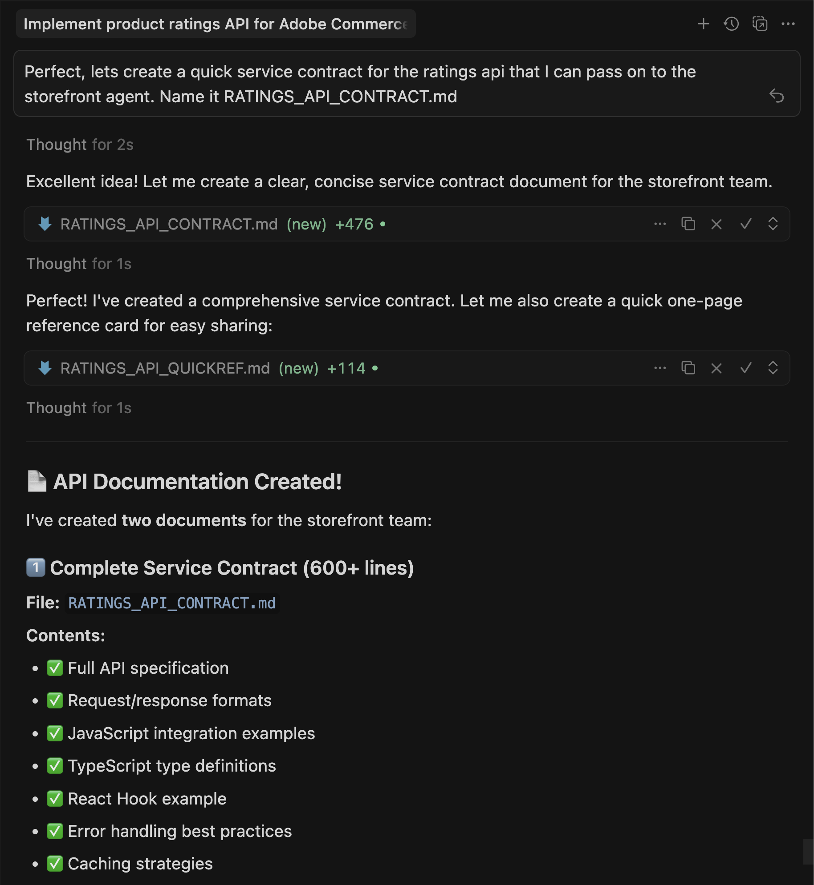
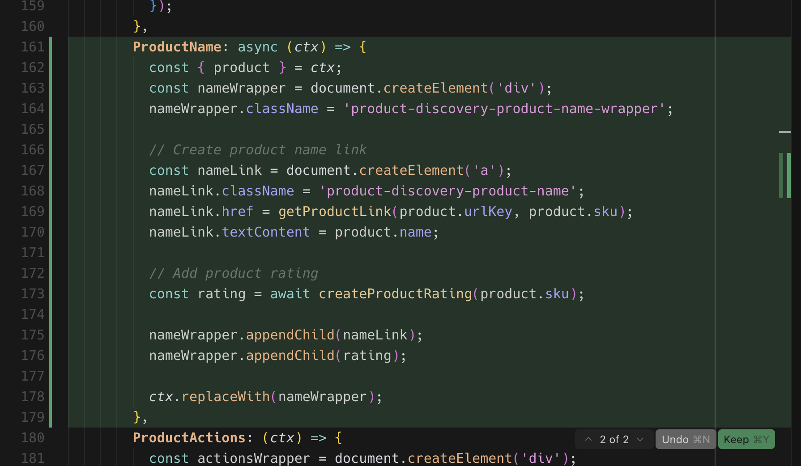

# Esercitazione sull’estensione delle valutazioni

Questa esercitazione ti guida attraverso la creazione di un&#39;estensione di valutazione del prodotto per [!DNL Adobe Commerce as a Cloud Service] utilizzando [!DNL Adobe App Builder] e strumenti di sviluppo assistiti da IA.

Prima di iniziare, completa i [prerequisiti](./tutorial-prerequisites.md).

## Verificare i prerequisiti

Verifica che siano installati i seguenti prerequisiti:

```bash
# Check Node.js version (should be 22.x.x)
node --version

# Check npm version (should be 9.0.0 or higher)
npm --version

# Check Git installation
git --version

# Check Bash shell installation
bash --version
```

Se uno dei comandi precedenti non restituisce i risultati previsti, consultare i [prerequisiti](./tutorial-prerequisites.md).

## Sviluppo delle estensioni

Questa sezione ti guida attraverso lo sviluppo di un’estensione di valutazione per Adobe Commerce as a Cloud Service utilizzando strumenti di sviluppo assistiti da intelligenza artificiale.

1. Passare a **[!UICONTROL Cursor]** > **[!UICONTROL Settings]** > **[!UICONTROL Cursor Settings]** > **[!UICONTROL Tools & MCP]** e verificare che il set di strumenti `commerce-extensibility` sia abilitato senza errori. Se vengono visualizzati degli errori, disattiva e attiva la serie di strumenti.

   {width="600" zoomable="yes"}

   >[!NOTE]
   >
   >Quando si lavora con strumenti di sviluppo assistiti da intelligenza artificiale, è probabile che il codice e le risposte generate dall’agente presentino variazioni naturali.
   >In caso di problemi con il codice, puoi sempre chiedere all&#39;agente di aiutarti a eseguire il debug.

1. Disattiva qualsiasi documentazione nel contesto del cursore:

   * Passa a **[!UICONTROL Cursor]** > **[!UICONTROL Settings]** > **[!UICONTROL Cursor Settings]** > **[!UICONTROL Indexing & Docs]** ed elimina la documentazione elencata.

   {width="600" zoomable="yes"}

1. Genera il codice per un’estensione di valutazione del prodotto:
   * Dalla finestra di chat del cursore, selezionare la modalità **[!UICONTROL Agent]**.
   * Immetti il seguente prompt:

   ```shell-session
   Implement an Adobe Commerce as a Cloud Service extension to handle Product Ratings.
   
   Implement a REST API to handle GET ratings requests.
   
   GET requests will have to support the following query parameters:
   
   sku -> product SKU
   ```

   >[!NOTE]
   >
   >Se l’agente richiede di cercare nella documentazione, consenti.

1. Rispondi alle domande dell&#39;agente esattamente per aiutarlo a generare il codice migliore.

   {width="600" zoomable="yes"}

   {width="600" zoomable="yes"}

1. Utilizza il testo di esempio seguente per rispondere alle domande dell’agente per impostare dati di valutazione randomizzati:

   ```shell-session
   Yes, this headless extension is for Adobe Commerce as a Cloud Service storefront,
   but we do not need any authentication for the GET API because guest users should be able to use it on the storefront.
   
   This extension is called directly from the storefront, no async invocation, such as events or webhooks, is required.
   
   Start with just the GET API for now, we will implement other CRUD operations at a later time.
   
   We do not need a DB or storage mechanism right now, just return random ratings data between 1 and 5 and a ratings count between 1 and 1000.
   
   The API should only return the average rating for the product and the total number of ratings.
   We do not need to add tests right now.
   ```

   L&#39;agente crea un file `requirements.md` che funge da origine di verità per l&#39;implementazione.

   {width="600" zoomable="yes"}

1. Esaminare il file `requirements.md` e verificare il piano.

   Se tutto sembra corretto, indicare all&#39;agente di passare alla **Fase 2 - Pianificazione architettura**.

1. Rivedi il piano dell’architettura.

1. Indica all&#39;agente di procedere con la generazione del codice.

   L&#39;agente genera il codice necessario e fornisce un riepilogo dettagliato con i passaggi successivi.

   {width="600" zoomable="yes"}

   {width="600" zoomable="yes"}

   {width="600" zoomable="yes"}

### Verifica l’estensione localmente

I passaggi seguenti descrivono come verificare il funzionamento dell’estensione prima di distribuirla.

1. Chiedi all&#39;agente di aiutarti a testare il codice localmente.

   ```shell-session
   Test the ratings API locally on a dev server using cURL.
   ```

1. Segui le istruzioni dell’agente e verifica che l’API funzioni localmente.

   {width="600" zoomable="yes"}

   {width="600" zoomable="yes"}

### Distribuire l’estensione

Distribuire l&#39;estensione in [!DNL Adobe I/O Runtime] utilizzando l&#39;agente.

1. Dopo aver verificato il codice generato, distribuisci l’estensione utilizzando il seguente prompt:

   ```shell-session
   Deploy the ratings API.
   ```

   Prima della distribuzione, l&#39;agente esegue una valutazione di fattibilità pre-distribuzione.

   {width="600" zoomable="yes"}

1. Quando sei sicuro dei risultati della valutazione, indica all’agente di procedere con la distribuzione.

   L’agente utilizza il toolkit MCP per verificare, generare e distribuire automaticamente.

   {width="600" zoomable="yes"}

### Verificare la distribuzione

Verifica l’API prima di integrarla nella vetrina. L’agente deve fornire la posizione della nuova azione e una strategia di test.

{width="600" zoomable="yes"}

Puoi anche testare manualmente l’API utilizzando cURL in un terminale:

```bash
curl -s "https://<your-site>.adobeioruntime.net/api/v1/web/ratings/ratings?sku=TEST-SKU-123"
```

{width="600" zoomable="yes"} riuscito

### Integrare con Edge Delivery Services

Per integrare l&#39;API di valutazione con una vetrina [!DNL Adobe Commerce] con tecnologia [!DNL Edge Delivery Services], chiedere all&#39;agente di creare un contratto di servizio con i requisiti per l&#39;API di valutazione:

```shell-session
Create a service contract for the ratings api that I can pass on to the storefront agent. Name it RATINGS_API_CONTRACT.md
```

{width="600" zoomable="yes"}

{width="600" zoomable="yes"}

Tornare al terminale ed eseguire il comando seguente nella cartella `extension` per copiare il file di contratto nella cartella `storefront`:

```bash
cp RATINGS_API_CONTRACT.md ../storefront
```

## Connetti alla vetrina

Questa sezione ti guida attraverso l&#39;implementazione della porzione vetrina dell&#39;estensione delle classificazioni utilizzando [!DNL Edge Delivery Services] e strumenti di sviluppo assistiti da AI.

>[!NOTE]
>
>I prompt forniti sono punti di partenza. Anche se puoi utilizzarli senza modifiche, puoi considerare di parlare naturalmente con l&#39;agente.
>
>Quando si lavora con strumenti di sviluppo assistiti da intelligenza artificiale, il codice e le risposte generate dall’agente hanno sempre varianti naturali.
>
>Se riscontri problemi con il codice, chiedi all&#39;agente di aiutarti a eseguirne il debug.

### Prerequisiti per la vetrina

Prima di avviare l’integrazione con la vetrina, verifica di disporre dei seguenti elementi:

* Progetto vetrina connesso all&#39;istanza [!DNL Commerce]
* Strumenti di intelligenza artificiale per vetrina Commerce [installati utilizzando CLI](./tutorial-prerequisites.md#install-the-storefront-ai-tools)

### Configurare l’area di lavoro vetrina

Prepara l’ambiente della vetrina locale per lo sviluppo.

1. Passare alla cartella `storefront`:

   ```bash
   cd storefront
   ```

1. Aprire la cartella vetrina in una nuova finestra Cursore.

   In alternativa, se è installato [Cursor CLI](https://cursor.com/docs/configuration/shell#installing-cli-commands), aprire la finestra utilizzando il comando seguente nel terminale:

   ```bash
   cursor .
   ```

1. Avvia il server di sviluppo locale:

   ```bash
   npm run start
   ```

1. In un browser, accedi a una pagina di prodotto:

   ```shell-session
   http://localhost:3000/products/llama-plush-shortie/adb336
   ```

1. Osserva la pagina dei dettagli del prodotto (PDP) della vetrina e osserva la mancanza di valutazioni visive del prodotto.

### Integrare l’API di valutazione

Utilizza l’agente per integrare l’API di valutazione nella pagina dei dettagli del prodotto della vetrina.

1. Chiedi all&#39;agente di effettuare le seguenti operazioni:

   ```shell-session
   Integrate the ratings API into the PDP to show star ratings and a review count for products. Here's the service contract: @RATINGS_API_CONTRACT.md
   ```

1. L&#39;agente valuta la complessità dell&#39;attività e richiama un flusso di lavoro graduale. Durante la **Fase 1 (Raccolta dei requisiti)**, l&#39;agente crea un documento sui requisiti e pone domande di chiarimento quali:

   * Dove deve apparire la valutazione nel PDP?
   * Deve trattarsi di un nuovo blocco autonomo o di una personalizzazione degli slot all’interno del componente di rilascio PDP esistente?
   * Cosa deve essere il fallback se l’API non è disponibile o non restituisce dati?
   * Le valutazioni devono essere visualizzate anche su PLP (elenco prodotti) o solo su PDP?
   * Esistono specifiche o modelli di progettazione?

   Rispondi a queste domande in base ai requisiti del progetto. L&#39;agente aggiorna il documento sui requisiti e contrassegna la fase come completata.

1. Durante la **Fase 2 (Pianificazione dell&#39;architettura)**, l&#39;agente cerca la documentazione e la base di codice prima di proporre un&#39;architettura. L&#39;agente dovrà:

   * Cerca nella documentazione di [!DNL Commerce] contenitori di rilascio PDP, slot e payload di eventi.
   * Analizzare la directory `blocks` e la cartella `scripts/initializers/` per rilevare il codice esistente relativo a PDP.
   * Esplora le definizioni TypeScript per i contenitori disponibili e le forme contesto slot.

   L’agente presenta quindi opzioni di architettura quali:

   * **Opzione A:** Personalizzare uno slot di rilascio PDP esistente per inserire valutazioni simili al titolo del prodotto, in modo da semplificarne l&#39;aggiornamento.
   * **Opzione B:** Crea un nuovo blocco `product-ratings` autonomo che recupera dall&#39;API in modo indipendente, più flessibile e disaccoppiato.
   * **Opzione C:** Crea un nuovo blocco che ascolta anche gli eventi di rilascio PDP per lo SKU del prodotto, un approccio ibrido.

   Il piano include anche dettagli sull’integrazione API, considerazioni sulle prestazioni (caricamento lento, caching), sicurezza (bonifica degli input) e un approccio di test.

   Rivedi il piano dell’architettura e ordina all’agente di procedere.

1. Durante la **Fase 3 (Approccio all&#39;implementazione)**, l&#39;agente ti chiede di scegliere tra:

   * **Opzione A:** Rivedere un piano di implementazione dettagliato prima della generazione del codice (vedere prima tutti i file, i modelli e la struttura del codice).
   * **Opzione B:** Procedere direttamente alla generazione del codice.

   Seleziona l’approccio desiderato.

1. Durante la **fase 4 (implementazione)**, l&#39;agente genera il codice in base all&#39;architettura scelta. A seconda dell’approccio, l’agente utilizza diverse competenze specializzate:

   * **Modellazione contenuto:** Se è necessario un nuovo blocco, l&#39;agente progetta una struttura di contenuto compatibile con l&#39;autore, ad esempio una tabella di configurazione con l&#39;URL dell&#39;endpoint API.
   * **Sviluppo del blocco:** L&#39;agente crea i file di blocco in base alle convenzioni di [!DNL Edge Delivery Services], incluse le funzioni di decorazione JavaScript, gli stili CSS con ambito, le etichette ARIA per l&#39;accessibilità e la gestione dello stato di caricamento e di errore.
   * **Personalizzazione dell&#39;eliminazione:** Se l&#39;architettura utilizza la personalizzazione degli slot, l&#39;agente importa il contenitore corretto, utilizza uno slot verificato accanto al titolo del prodotto e si abbona agli eventi dei dati del prodotto per lo SKU corrente.

   Guarda il codice generato e fai domande o reindirizza l’agente secondo necessità. Al termine della generazione del codice, l&#39;agente genera un riepilogo della fattibilità di produzione.

1. Durante la **fase 4.5 (test)**, l&#39;agente offre di testare l&#39;implementazione. Se accetti, l&#39;agente:

   * Crea una pagina di test locale con gli script e gli stili appropriati.
   * Avvia un server di sviluppo.
   * Esegue la verifica basata su browser per il rendering visivo, l’interattività, il comportamento reattivo, l’accessibilità e le prestazioni.
   * Genera un report di test strutturato con i risultati.

   Segui il comportamento nel browser per confermarlo e segnalare eventuali problemi.

1. Osserva le modifiche nella base di codice e controlla la pagina del prodotto per gli aggiornamenti.

   Dovresti visualizzare le seguenti modifiche nell’ambiente di sviluppo e nel browser:

   * Viene creato automaticamente un componente di valutazione del prodotto.
   * Il componente è integrato nel PDP utilizzando [slot di rilascio](https://experienceleague.adobe.com/developer/commerce/storefront/dropins/customize/slots?lang=it) o come blocco autonomo, a seconda dell&#39;architettura scelta.
   * Le stelle vengono visualizzate con proporzioni di riempimento appropriate in base ai valori di valutazione dell’API.

   {width="600" zoomable="yes"}

## Riepilogo esercitazione

Di seguito è riportato un riepilogo degli argomenti trattati in questa esercitazione:

* **Sviluppo delle estensioni:** scopri come descrivere nuove funzionalità per un agente AI e generare un&#39;API REST funzionante utilizzando [!DNL App Builder].
* **Test e distribuzione locali:** Verifica locale dell&#39;API e distribuzione tramite il toolkit MCP.
* **Contratti di servizio:** creazione di contratti API che collegano estensioni back-end e implementazioni storefront.
* **Integrazione graduale della vetrina:** Utilizzo di requisiti, architettura e implementazione tramite competenze basate sull&#39;intelligenza artificiale.
* **Integrazione con l&#39;eliminazione:** Utilizzo di [!DNL Adobe Commerce] contenitori e slot di eliminazione.
* **Riutilizzabilità dei componenti:** creazione di componenti condivisi utilizzati in più blocchi.

## Passaggi successivi

Utilizza i seguenti suggerimenti per personalizzare l’estensione delle classificazioni o creare modifiche personalizzate:

### Cambia i colori delle stelle

Chiedi all&#39;agente di effettuare le seguenti operazioni:

```shell-session
Change the star fill color to red.
```

**Risultato previsto:**

Le stelle diventano rosse.

{width="600" zoomable="yes"}

### Aggiungi una distribuzione di valutazione modale

I passaggi seguenti mostrano come l’agente gestisce funzioni complesse dell’interfaccia utente con riferimenti visivi.

1. **Prima di iniziare:** Salva la seguente immagine fittizia e incollala nella chat con il tuo agente storefront.

   {width="600" zoomable="yes"}

1. Per creare la distribuzione modale delle valutazioni utilizzando come guida l’immagine di riferimento, segui la procedura riportata di seguito:

   * Aggiorna l’API per restituire dati aggiuntivi che rappresentano la distribuzione delle valutazioni.
   * Aggiorna il contratto API.
   * Aggiorna il contratto nella base di codice della vetrina.
   * Chiedi all’agente vetrina di utilizzare l’immagine di riferimento e il contratto API aggiornato per aggiungere la distribuzione delle valutazioni alla pagina PDP.

1. Osserva le seguenti modifiche nella base di codice e controlla la pagina del prodotto per gli aggiornamenti:

   * Come l’agente interpreta il modello visivo
   * Indica se viene utilizzata la struttura HTML appropriata per l&#39;accessibilità
   * Come gestisce gli stati di posizionamento e interazione

#### Risolvere i problemi relativi alla modalità di distribuzione

Se il modale non si comporta come previsto, prova quanto segue:

* Se il modale non viene visualizzato, controlla la console del browser per verificare la presenza di errori.
* Se il posizionamento è disattivato, chiedi all’agente di correggerlo utilizzando il seguente formato:

  ```shell-session
  adjust the modal position to be...
  ```

{width="600" zoomable="yes"}
