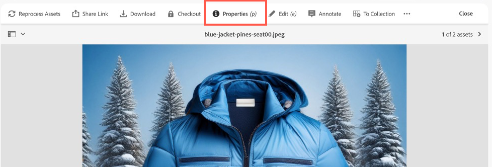

# Casi d’uso

{{accs-early-access}}

I seguenti casi d&#39;uso illustrano le funzionalità di base e gli scenari aziendali supportati da [!DNL Adobe Commerce as a Cloud Service], consentendo di accelerare lo sviluppo e avviare esperienze di forte impatto.

In caso di problemi, consulta la sezione [Risoluzione dei problemi](#troubleshooting).

## Prerequisiti

Prima di provare a eseguire uno di questi casi d&#39;uso, è necessario soddisfare i seguenti prerequisiti:

1. [Crea la tua istanza di Cloud Service](./getting-started.md#create-an-instance) utilizzando le seguenti opzioni:
   1. Seleziona [!UICONTROL **Sandbox**] nel menu a discesa [!UICONTROL **Ambiente**].
   1. Seleziona [!UICONTROL **Adobe Store**] nel menu a discesa [!UICONTROL **Dati di prova**].
1. [Accedi al tuo account Adobe Experience Cloud](https://experience.adobe.com)
1. [Configura la vetrina di Cloud Service](./storefront.md) utilizzando le seguenti opzioni:
   1. Selezionare [!UICONTROL `adobe-commerce/adobe-demo-store`] per il modello.
   1. Selezionare [!UICONTROL **Scegli un&#39;istanza disponibile (Mesh -> SaaS)**] per il metodo di connessione.

## Flusso di lavoro di cassa

Questo flusso di lavoro illustra il processo di pagamento per un cliente che acquista un prodotto dal negozio e come confermare l’ordine in qualità di amministratore.

### Abilita servizi di pagamento

1. In Amministrazione Commerce, passa a [!UICONTROL **Impostazioni**] > [!UICONTROL **Metodi di pagamento**].

1. Nella sezione [!UICONTROL **Configurazione generale**] immettere `Payment Services Sandbox ID` e `Payment Services Sandbox Key`. Puoi ottenere questi ID seguendo i passaggi descritti in [Onboarding sandbox](../payment-services/sandbox.md#sandbox-onboarding)

1. Imposta il menu a discesa [!UICONTROL **Abilita**] su [!UICONTROL **Sì**].

1. Fai clic su [!UICONTROL **Salva configurazione**].

### Acquistare un prodotto

1. Vai alla [vetrina](./storefront.md) creata nei prerequisiti.

1. Trova e seleziona un prodotto. Effettuare le selezioni di personalizzazione necessarie. Quindi fai clic su [!UICONTROL **Aggiungi al carrello**].

   {width="600" zoomable="yes"}

1. Seleziona l’icona del carrello per visualizzare il carrello.

   {width="600" zoomable="yes"}

1. Fai clic su [!UICONTROL **Estrai**].

   {width="600" zoomable="yes"}

1. Immettere i recapiti e le informazioni di spedizione richiesti. È possibile utilizzare informazioni fittizie per questo ordine.

1. Per effettuare il pagamento, selezionare [!UICONTROL **Assegno/vaglia postale**]. Se desideri utilizzare una carta di credito, utilizza una delle [carte di prova fornite da Paypal](https://developer.paypal.com/tools/sandbox/card-testing/#link-teststaticcardnumbers). Puoi utilizzarli con qualsiasi data di scadenza futura e qualsiasi CVC.

   {width="600" zoomable="yes"}

   {width="600" zoomable="yes"}

1. Fai clic su [!UICONTROL **Inserisci ordine**].

### Conferma l’ordine

1. Aprire Amministrazione Commerce: `<your store URL>/admin`.

1. Accedi con il tuo Adobe ID.

1. Passa a [!UICONTROL **Vendite**] > [!UICONTROL **Ordini**].

   {width="600" zoomable="yes"}

1. Cercare l&#39;ordine effettuato e confermare i dettagli.

   {width="600" zoomable="yes"}

## Aggiornare il contenuto della vetrina

Crea, modifica e pubblica i contenuti direttamente nella vetrina.

1. Apri la [vetrina](./storefront.md) creata nei prerequisiti.

1. Apri Storefront Builder. Passando a `https://da.live/#/<GitHub User Name>/<Repository Name>/main/da/index.md`.

1. Apri la pagina [!UICONTROL **Indice**].

1. Sotto il blocco Carosello, inserisci un nuovo titolo modificando la riga &quot;Demo di benvenuto in Adobe Store&quot;.

1. Fare clic sull&#39;icona Invia e fare clic su [!UICONTROL **Anteprima**].

1. Rivedi la pagina di anteprima e fai clic su [!UICONTROL **Pubblica**].

1. Aggiorna la pagina vetrina e conferma che le modifiche sono ora attive.

## Esperienza contestuale

La funzione di sperimentazione contestuale di Adobe Commerce consente di creare e gestire esperimenti nella vetrina per testare contenuti e configurazioni diversi.

### Prerequisiti

* Installa l&#39;estensione [AEM Sidekick](https://www.aem.live/docs/sidekick)

1. In Storefront Builder, selezionare la pagina indice e fare clic su [!UICONTROL **Copia**].

1. Crea una cartella [!UICONTROL **experiment**] nella cartella principale facendo clic sul pulsante [!UICONTROL **New**] e selezionando [!UICONTROL **Cartella**].

1. Creare una cartella denominata **1234** nella cartella [!UICONTROL **experiment**].

1. Incollare le due copie della pagina indice nella cartella **1234**.

1. Apri ogni pagina e rinominala &quot;homev1&quot; e &quot;homev2&quot;. Questi sono i tuoi [sfidanti](https://www.aem.live/docs/experimentation#create-your-challenger-page).

1. Modifica ogni pagina in modo che includa contenuti diversi. Ad esempio, modifica l’immagine protagonista o il testo. Devi essere in grado di identificare le differenze tra ciascuna pagina.

1. Pubblicate tutte le vostre pagine sfidanti.

1. Apri la pagina di controllo, la pagina di indice originale.

1. Aggiungi un nuovo blocco con il titolo [!UICONTROL **metadati**].

1. Aggiungi le seguenti informazioni alle righe del blocco di metadati

   * Titolo - Adobe Commerce
   * Descrizione: un negozio web
   * Esperimento - 1234
   * Varianti esperimento
      * `https://<your-site>.aem.live/experiments/1234/indexv1`
      * `https://<your-site>.aem.live/experiments/1234/indexv2`

   {width="600" zoomable="yes"}

1. Apri una finestra di navigazione in incognito o privata e passa alla pagina principale.

1. Chiudere la finestra di esplorazione privata e ripetere il passaggio precedente. Ogni volta che apri la pagina, viene visualizzata una variante casuale creata.

## Migliora il contenuto della vetrina

Con AEM Assets, Adobe Express e Firefly, ora puoi apportare rapidamente modifiche alle immagini visualizzate nella vetrina con un flusso di lavoro semplice e autonomo.

### Prerequisiti

* Richiede l’accesso ad AEM Assets, Adobe Express e Adobe Firefly.

### Personalizzare lo sfondo di un’immagine

Considera uno scenario in cui desideri modificare rapidamente lo sfondo di un’immagine di prodotto. La combinazione di Adobe Commerce, AEM Assets e Adobe Express consente di apportare questa modifica in pochi semplici passaggi.

1. Apri [storefront](./storefront.md) creato nei prerequisiti e passa a un elemento che desideri modificare. Prendi nota dello SKU degli articoli o del codice prodotto.

1. Apri [!UICONTROL AEM Assets] selezionandolo in [Adobe Experience Cloud](https://experience.adobe.com/#/home).

   {width="600" zoomable="yes"}

1. Fare clic su [!UICONTROL Assets].

   {width="600" zoomable="yes"}

1. Cerca l&#39;elemento per **SKU** o **Codice prodotto**.

1. Seleziona l&#39;elemento da modificare e fai clic su [!UICONTROL **Apri in Adobe Express**].

   {width="600" zoomable="yes"}

1. Nel pannello [!UICONTROL **Immagine**], seleziona [!UICONTROL **Inserisci oggetto**].

   {width="600" zoomable="yes"}

1. Nella casella di testo, descrivere l&#39;immagine che si desidera aggiungere. Ad esempio, &quot;pini innevati&quot;.

   {width="600" zoomable="yes"}

1. Regolare [!UICONTROL Brush size] e disegnare dove si desidera aggiungere l&#39;immagine generata. In questo esempio, disegnare intorno all&#39;oggetto esistente per selezionare lo sfondo.

1. Fai clic su [!UICONTROL **Genera**] per visualizzare i risultati.

1. Scegliere tra i diversi risultati selezionando l&#39;opzione desiderata e facendo clic su [!UICONTROL **Mantieni**].

1. Fai clic su [!UICONTROL **Il tuo contenuto**] per tornare all&#39;editor di immagini.

1. Fai clic su [!UICONTROL **Salva**] per specificare il tipo di immagine.

1. Fai di nuovo clic su [!UICONTROL **Salva**] per salvare le modifiche.

1. Nella finestra di dialogo [!UICONTROL **Salva risorsa**], seleziona la [!UICONTROL **cartella di destinazione**] di Commerce.

   {width="600" zoomable="yes"}

1. Fai clic su [!UICONTROL **Salva come nuova risorsa**] per salvare l&#39;immagine.

#### Aggiungere l’immagine a Commerce AEM Assets

1. Dal [pannello di navigazione](https://experienceleague.adobe.com/it/docs/experience-manager-cloud-service/content/sites/authoring/basic-handling#navigation-panel) di AEM as a Cloud Service, seleziona **Assets** > **File** > **Commerce** e fai clic sulla risorsa creata nella sezione precedente.

   {width="600" zoomable="yes"}

1. Fare clic su [!UICONTROL **Proprietà**].

   {width="600" zoomable="yes"}

1. Selezionare la scheda [!UICONTROL **Commerce**].

   {width="600" zoomable="yes"}

1. Verificare che [!UICONTROL **esista in Adobe Commerce?Campo**] impostato su [!UICONTROL **Sì**].

1. Fai clic su [!UICONTROL **Aggiungi**] e immetti lo SKU del prodotto a cui desideri aggiungere la risorsa.

   {width="600" zoomable="yes"}

1. Selezionare la posizione per la risorsa e il tipo di risorsa.

1. Selezionare la scheda [!UICONTROL **Base**] e modificare la scheda [!UICONTROL **Stato revisione**] in [!UICONTROL **Approvato**].

   {width="600" zoomable="yes"}

1. Fai clic su [!UICONTROL **Salva e chiudi**].

#### Conferma l’immagine in Commerce

1. In Adobe Commerce [!UICONTROL **Admin**], passa a [!UICONTROL **Catalog**] > [!UICONTROL **Products**].

1. Seleziona il prodotto a cui hai aggiunto l’immagine nella sezione precedente.

1. Espandi la sezione [!UICONTROL **Immagini e video**].

   {width="600" zoomable="yes"}

1. Conferma che l’immagine sia ora disponibile nell’elenco delle immagini.

1. Torna alla vetrina e passa alla pagina del prodotto modificato.

1. Confermare la visualizzazione della nuova immagine.

   {width="600" zoomable="yes"}

## Genera varianti

Le varianti di generazione di Adobe Commerce sfruttano l’intelligenza artificiale generativa per automatizzare la generazione di contenuti di alta qualità, ottimizzare i messaggi e pubblicare facilmente le risorse nella vetrina.

### Genera testo

1. Apri il tuo sito di vetrina utilizzando [Universal Editor](https://experienceleague.adobe.com/it/docs/experience-manager-cloud-service/content/implementing/developing/universal-editor/introduction).

1. Selezionare il blocco di testo da modificare.

1. Nel pannello [!UICONTROL **Proprietà**], fai clic su [!UICONTROL **Genera varianti**].

1. Fare clic sul pulsante [!UICONTROL **Genera**].

1. Seleziona o personalizza il testo generato.

1. Fai clic su [!UICONTROL **Pubblica**] per aggiornare la vetrina.

### Generare contenuti e immagini

1. Apri [Genera varianti](https://experienceleague.adobe.com/it/docs/experience-manager-cloud-service/content/generative-ai/generate-variations)

1. Selezionare il modello [!UICONTROL **Banner principale**].

1. Nella casella di testo [!UICONTROL **Spiega interazione utente**], immetti: &quot;Esperienza che i dipendenti e i partner di Adobe acquistino attrezzatura a marchio Adobe!&quot;.

1. Nell&#39;URL [!UICONTROL **per la conoscenza del dominio**], immetti **www.adobestore.com**.

1. Fai clic su [!UICONTROL **Genera**].

1. Seleziona una variante di contenuto e fai clic su [!UICONTROL **Genera immagine**].

1. Dal menu a discesa [!UICONTROL **Dimensioni immagine**], selezionare [!UICONTROL **Widescreen (16:9)**].

1. Dal menu a discesa [!UICONTROL **Tipo di contenuto**], selezionare [!UICONTROL **Foto**].

1. Per l&#39;immagine di riferimento [!UICONTROL **Style**], seleziona il banner dell&#39;archivio Adobe esistente.

1. Selezionare l&#39;immagine generata da utilizzare e fare clic su [!UICONTROL **Salva**].

1. Ripetete questo processo con altre immagini di riferimento per generare più varianti.

## Risoluzione dei problemi

Utilizza i seguenti suggerimenti per risolvere eventuali problemi riscontrati durante il tentativo di eseguire queste esercitazioni.

* Per istruzioni su comandi o flag:
   1. Eseguire `aio --help` per visualizzare tutti i comandi e i flag disponibili.
   1. Per comandi specifici, utilizzare il flag `--help`. Ad esempio:
      * `aio console --help`
      * `aio commerce –help`

* Se riscontri problemi di accesso non validi:
   1. Esegui `aio config clear `.
   1. Esegui `aio auth login –-force `.
   1. Accedi al browser.
   1. Seleziona il tuo profilo.
   1. Tornare al terminale per continuare.

* Se il comando `init` non riesce:
   1. Esegui `aio api-mesh delete`.
   1. Rieseguire `aio commerce init`.

* Se si è selezionata l&#39;organizzazione, il progetto o l&#39;area di lavoro errati prima di eseguire il comando `init`:
   1. Esegui `aio console org select`.
   1. Esegui `aio console project select`.
   1. Esegui `aio console workspace select`.

* Se hai selezionato un tenant non valido:
   1. Annullare l&#39;esecuzione CLI corrente premendo **Ctrl-C**.
   1. Esegui `aio commerce init`.

* Se riscontri un’installazione Mesh API non valida:
   * Esegui `aio api-mesh update mesh-config.json`.
