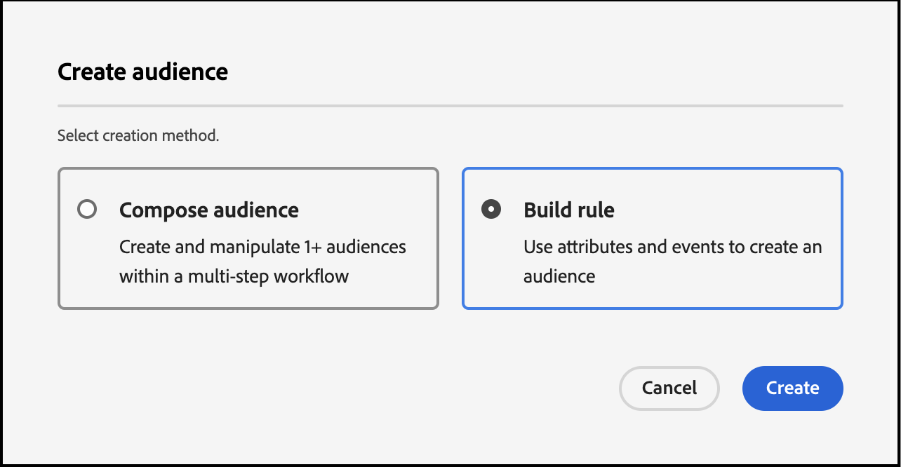
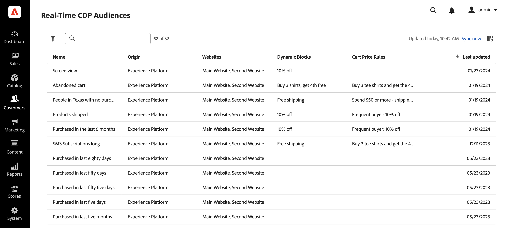

# Crea tipi di pubblico in Real-Time CDP utilizzando i dati evento [!DNL Commerce]

Utilizza i dati evento acquisiti dall&#39;archivio [!DNL Commerce] per creare tipi di pubblico in Real-Time CDP. I dati acquisiti si basano sul comportamento di navigazione, sugli acquisti precedenti, sugli attributi del profilo, sulle tendenze di conversione o abbandono, sullo stato di fedeltà, sul valore elevato e basso per il cliente e su altro ancora.

## Quali dati devo prendere in considerazione per l’utilizzo?

Crea tipi di pubblico in Real-Time CDP utilizzando dati provenienti da eventi di vetrina, back office e profilo.

| Tipi di dati | Dati storefront (eventi comportamentali) | Dati di back office (eventi lato server) | Profilo cliente e dati dei segmenti |
|---|---|---|---|
| **Definizione** | Clic o azioni eseguite dai clienti sul sito. | Informazioni sul ciclo di vita e dettagli di ciascun ordine (passato e corrente). | Chi sono i tuoi acquirenti e a quali segmenti si qualificano. |
| **Eventi acquisiti da Adobe Commerce** | `productPageView` `addToCart` | `placeOrder` `orderplaced` `orderLineItemRefunded` `order Canceled` `order history` | `createAccount` `editAccount` `Profile Record` |

## Quali sono stati i risultati ottenuti dagli altri clienti?

I clienti Adobe [!DNL Commerce] hanno ottenuto un impatto significativo sul business attivando tipi di pubblico incorporati in Real-Time CDP e distribuendoli alla loro istanza [!DNL Commerce].

Un retailer di abbigliamento globale e multi-brand ha ottenuto:

- Una fonte di verità con 10 milioni di profili cliente unificati
- Oltre 40 tipi di pubblico univoci di &quot;clienti ad alto intento&quot; creati per interagire con i diversi canali

Una società di bevande globale ha raccolto:

- 98 milioni di profili cliente da oltre 100 paesi

## Iniziamo

In questo articolo imparerai a:

- Creazione di un pubblico in Real-Time CDP in base ai dati [!DNL Commerce] raccolti dagli eventi
- Attiva il pubblico per l&#39;archivio [!DNL Commerce]
- Utilizza il pubblico in [!DNL Commerce] per informare una regola del prezzo del carrello

>[!IMPORTANT]
>
>Completa le attività descritte in questo articolo utilizzando il tuo ambiente sandbox [!DNL Commerce]. In questo modo, i dati dell’evento di vetrina e di back office inviati ad Experience Platform non diluiscono i dati dell’evento di produzione.

### Prerequisiti

Prima di iniziare, assicurati:

- È stato eseguito il provisioning per utilizzare Real-Time CDP. In caso di dubbi, rivolgiti all’integratore di sistemi o al team di sviluppo che gestisce progetti e ambienti.
- Hai [installato](install.md) e [configurato](connect-data.md) l&#39;estensione [!DNL Data Connection] in [!DNL Commerce].
- Hai [confermato](connect-data.md#confirm-that-event-data-is-collected) che i dati dell&#39;evento [!DNL Commerce] stanno arrivando al server Edge di Experience Platform.

### &#x200B;1. Creare un pubblico

Un pubblico è un insieme di clienti che condividono comportamenti o caratteristiche simili. In questo esercizio creerai un pubblico che qualifichi le persone interessate a un particolare prodotto del tuo negozio.

Per semplificare questo esercizio, utilizzare i dati evento dell&#39;evento `productPageView`. Questo evento acquisisce i dettagli del prodotto visualizzato, ad esempio nome del prodotto, SKU, prezzo e così via.

Utilizza questi dati evento per specificare che il pubblico include persone che hanno almeno un evento &quot;Visualizzazioni prodotto&quot; in cui lo SKU (identificatore prodotto) è uguale a un prodotto specifico sul sito e l’evento si verifica nell’ultimo giorno. &#x200B;

1. Apri Experience Platform e seleziona **[!UICONTROL Audiences]** dal menu di navigazione a sinistra.

   

1. Fare clic su **[!UICONTROL Create Audience]**.

   

   Viene visualizzata l&#39;area di lavoro **Generatore di segmenti**.

1. Nell&#39;area di lavoro **Generatore di segmenti**, selezionare il metodo di creazione **Genera regola**.

   

   Nell&#39;area di lavoro **Generatore di segmenti** è possibile definire le regole e le condizioni per il pubblico.&#x200B; Queste regole e condizioni si basano sui dati di eventi e profili provenienti dall&#39;archivio Commerce e definiscono i criteri che determinano se un utente è idoneo per il pubblico. Ad esempio, puoi creare una regola che includa gli utenti che hanno visualizzato un prodotto specifico o quelli che hanno effettuato un acquisto entro un determinato intervallo di tempo. Ulteriori informazioni su [Generatore di segmenti](https://experienceleague.adobe.com/it/docs/experience-platform/segmentation/ui/segment-builder) e sulle regole e condizioni.

1. Selezionare la scheda [Eventi](https://experienceleague.adobe.com/it/docs/experience-platform/segmentation/ui/segment-builder#events).

   

1. Cerca il tipo di evento &quot;Visualizzazioni prodotto&quot;. Trascinarlo quindi nell&#39;area di lavoro **Segment Builder**.

1. Torna alla scheda **Eventi** e cerca &quot;SKU&quot;, che è il campo dati nel campo `productListItems`. Trascinalo nell&#39;area di lavoro **Generatore di segmenti** sopra l&#39;evento **Visualizzazione prodotto**.

   La sezione **Regole evento** mostra dove puoi specificare il prodotto specifico da cui desideri creare il pubblico.

   

1. Impostare l&#39;intervallo di tempo su un giorno facendo clic su **Qualsiasi ora** e selezionando *Ultimo* con valore di *1*.

   Durante la creazione di un pubblico, puoi specificare un intervallo di tempo per acquisire le attività recenti. Impostando un intervallo di tempo puoi indirizzare l’attività agli utenti in base alle loro interazioni o comportamenti recenti entro un arco temporale specifico.

1. Nella sezione **Proprietà pubblico** sul lato destro dell&#39;area di lavoro, imposta le proprietà del pubblico fornendo un nome, una descrizione e un metodo di valutazione per il pubblico.

1. Per salvare il pubblico, fare clic su **[!UICONTROL Save and Close]**.

   I dettagli del pubblico vengono visualizzati nel dashboard **Pubblico**.

### &#x200B;2. Attiva il pubblico nella destinazione [!DNL Commerce]

È possibile rendere disponibile un pubblico in [!DNL Commerce] attivandolo per la destinazione [!DNL Commerce].

>[!IMPORTANT]
>
>Se non hai già impostato [!DNL Commerce] come destinazione disponibile per la ricezione dei dati, consulta l&#39;argomento [Adobe [!DNL Commerce] Connection](https://experienceleague.adobe.com/it/docs/experience-platform/destinations/catalog/personalization/adobe-commerce).

1. In the **Details** tab of your audience, click **Activate to destination**.

1. Select your [!DNL Commerce] destination. Then, click **Next**.

1. Complete the activation process by clicking **[!UICONTROL Finish]**.

## 3. View the audience in the Audiences Dashboard

In [!DNL Commerce], you can view all [active](https://experienceleague.adobe.com/it/docs/experience-platform/destinations/ui/activate/activate-edge-personalization-destinations) audiences that can be personalized for your [!DNL Commerce] instance using the **Real-Time CDP Audiences** dashboard.

To access the **Real-Time CDP Audiences** dashboard, go to the _Admin_ sidebar, then go to **[!UICONTROL Customers]** > **[!UICONTROL Real-time CDP Audience]**.

In the dashboard, look for the audience you created. Notice it is not being used in a cart price rule or dynamic block. In the next section, you link the audience to a cart price rule.

### 4. Create a cart price rule based on the audience

This section shows you how to create a cart price rule based on your new audience.

1. Confirm that your new audience is displayed in the **Real-Time CDP Audiences** dashboard.
1. [Create a cart price rule](https://experienceleague.adobe.com/it/docs/commerce-admin/marketing/promotions/cart-rules/price-rules-cart-create).
1. [Set the condition](https://experienceleague.adobe.com/it/docs/commerce-admin/marketing/promotions/cart-rules/price-rules-cart-create#use-real-time-cdp-audiences-to-set-a-condition) of the cart price rule using your new audience.
1. [Set the action](https://experienceleague.adobe.com/it/docs/commerce-admin/marketing/promotions/cart-rules/price-rules-cart-create#step-3-define-the-actions) that you want to occur when the product is added to the cart.
1. Continue to configure your cart price rule.
1. Go to the customer view of your sandbox instance.
1. Add the product you based the audience off of to the cart. Notice that the cart price rule is enabled.

## Wrap up

In this exercise, you created an audience in Real-Time CDP and activated it to the [!DNL Commerce] destination. Then, in the [!DNL Commerce] admin, you created a cart price rule based on that audience and enabled the rule in your sandbox environment.
