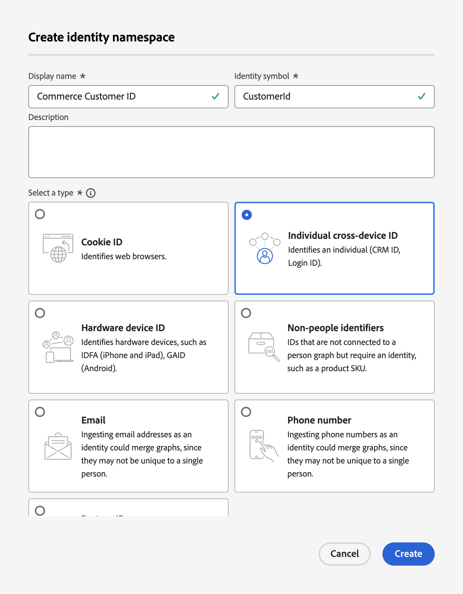

# Aggiornamento dello schema dei record di profilo per l’acquisizione di dati Commerce

Quando gli acquirenti creano un profilo nel sito Commerce, viene creato un record di profilo e i dati vengono acquisiti. È necessario creare uno schema e un set di dati specifici per quel record di profilo prima di poter inviare in streaming i dati di profilo a Experience Platform.

1. [Crea](https://experienceleague.adobe.com/en/docs/experience-platform/xdm/ui/resources/schemas) uno schema e imposta la classe su **Profilo individuale**.

1. [Aggiungi](https://experienceleague.adobe.com/en/docs/experience-platform/xdm/ui/resources/schemas) i seguenti gruppi di campi specifici del profilo:

   - identityMap
   - Dettagli demografici
   - Dettagli di contatto personali
   - Dettagli dell’account utente

1. [Attiva](https://experienceleague.adobe.com/en/docs/experience-platform/xdm/ui/resources/schemas) lo schema per il profilo.

   Quando uno schema è abilitato per il profilo, tutti i set di dati creati da questo schema partecipano a Real-Time CDP, che unisce dati da origini diverse per creare una visualizzazione completa di ciascun cliente.

1. [Crea un set di dati](https://experienceleague.adobe.com/en/docs/platform-learn/implement-mobile-sdk/experience-cloud/platform) in base allo schema creato o aggiornato.

   Un set di dati è un costrutto di archiviazione e gestione per una raccolta di dati, in genere una tabella che contiene uno schema (colonne) e dei campi (righe). I set di dati contengono anche metadati che descrivono vari aspetti dei dati memorizzati.

1. Crea uno [spazio dei nomi personalizzato](https://experienceleague.adobe.com/en/docs/experience-platform/identity/features/namespaces#create-namespaces) in Experience Platform con i seguenti valori:

   - **Nome visualizzato**: _ID cliente Commerce_
   - **Simbolo identità**: _ID cliente_
   - **Tipo**: _ID multi-dispositivo individuale_

   {width="700" zoomable="yes"}

   Fare clic su **[!UICONTROL Create]**. Il servizio Unified Profile utilizza uno spazio dei nomi personalizzato per unire i frammenti di profilo.

Con lo schema, il set di dati e lo spazio dei nomi personalizzato configurati per i dati del record del profilo cliente, puoi [configurare](connect-data.md#data-collection) l&#39;istanza di Commerce per raccogliere e inviare tali dati ad Experience Platform.

Per creare uno schema, un set di dati e uno stream di dati per i dati di eventi comportamentali e di back office, consulta [aggiornare gli schemi di eventi di serie temporali per l&#39;acquisizione dei dati di Commerce](update-xdm.md).
