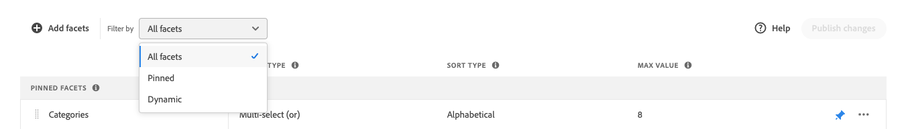

# Gestisci facet

Segui queste istruzioni per aggiornare le proprietà dei facet esistenti o modificarne la presentazione nella vetrina.

## Configura raggruppamenti facet di prezzo

Consulta [Impostazioni](settings.md) per configurare intervalli e raggruppamenti di price faceting.

## Modifica facet

1. Trovare il facet da modificare.
1. Se nell&#39;elenco sono presenti molti facet, impostare *Filtra per* su uno dei seguenti:

   * Bloccato
   * Dinamico

   Per ulteriori informazioni, vai a [Tipi di facet](facets-type.md).

   

1. Per modificare le proprietà del facet, fare clic su **Altro** (...) opzioni.
1. Fai clic su **Modifica**

   

1. Per modificare l&#39;etichetta del facet, effettuate una delle seguenti operazioni:

   * Per una vetrina [!DNL Commerce], modifica l&#39;[etichetta attributo](https://experienceleague.adobe.com/docs/commerce-admin/catalog/product-attributes/product-attributes.html).
   * Per un’implementazione headless, fai clic sul valore nella prima colonna e modifica il testo in base alle esigenze.

   

1. (Solo headless) Per modificare il metodo utilizzato per ordinare i valori dei facet, fare clic sul valore nella colonna *Tipo di ordinamento* e scegliere una delle opzioni seguenti:

   * Alfabetico
   * Conteggio

   

1. Nella colonna **Valore massimo** impostare il numero massimo (da 0 a 10) di valori di filtro facet da visualizzare nella vetrina.
1. Al termine, fare clic su **Salva**.

   Le modifiche verranno visualizzate nella vetrina solo dopo la loro pubblicazione.

## Faccetta pin/spin

Il pin cambia colore quando si fa clic e viene utilizzato per spostare il facet nella sezione *Facet bloccati* o *Facet dinamici*.

1. Per aggiungere un facet all&#39;inizio dell&#39;elenco *Filtri*, individuarlo nell&#39;elenco *Facet dinamici* e fare clic sul pin grigio ().

   Il pin diventa blu e il facet si sposta nella sezione *Facet bloccati*.

1. Per sbloccare un facet, individuarlo nell&#39;elenco *Facet bloccati* e fare clic sul pin blu ().

   Il pin diventa grigio e il facet si sposta nella sezione *Facet dinamici*.

   

>[!NOTE]
>
>L’ordinamento dei facet aggiunti potrebbe non essere coerente se sono presenti due etichette con lo stesso nome.

## Sposta facet fissato

>[!NOTE]
>
>L’ordinamento dei facet bloccati è supportato solo nelle implementazioni headless. Se sono necessari facet ordinati, utilizzare il widget PLP [!DNL Live Search].

L&#39;ordine delle sfaccettature fissate può essere modificato spostando la riga in una posizione diversa. I facet bloccati hanno un&#39;icona *Sposta* () all&#39;inizio della riga. A differenza dei facet bloccati, i facet dinamici non possono essere spostati.

1. Trova il facet nella sezione *Facet bloccati* dell&#39;elenco.
1. Utilizza l&#39;icona **Sposta** () per trascinare la riga in una nuova posizione nella sezione *Facet bloccati*.

   Dopo la pubblicazione delle modifiche, i facet riordinati vengono visualizzati nell&#39;elenco *Filtri* della vetrina.

## Elimina facet

1. Trova il facet nell&#39;elenco e fai clic su **Altro** (...) opzioni.
1. Fare clic su **Elimina**.
1. Quando viene richiesto di confermare, fare clic su **Elimina facet**.
Il facet viene rimosso dalla vetrina dopo la pubblicazione delle modifiche.

## Pubblica modifiche

1. Per aggiornare la vetrina con le modifiche, fai clic su **Pubblica modifiche**.
1. Attendi circa 15 minuti prima che gli aggiornamenti vengano visualizzati nel tuo store.
