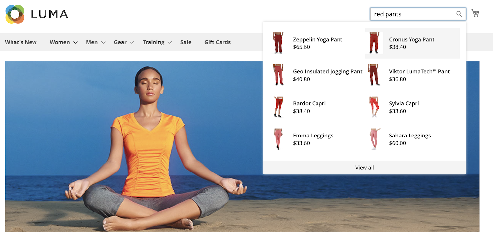

# Cos&#39;è [!DNL Live Search]?

[!DNL Live Search] è una funzionalità che sostituisce le funzionalità di ricerca standard in Adobe Commerce. La funzionalità [!DNL Live Search] è installata con Composer e connette l&#39;archivio [!DNL Commerce] al [Connettore servizi Commerce](../landing/saas.md). Una volta configurato, il campo di testo di ricerca predefinito viene sostituito con il campo di testo [!DNL Live Search]. [!DNL Live Search] installa anche il widget Pagina elenco prodotti (PLP), che fornisce solide funzionalità di filtro durante la visualizzazione dei risultati della ricerca.

Con [!DNL Live Search] è possibile:

- Crea esperienze di ricerca significative per aiutare acquirenti e acquirenti a trovare ciò che desiderano con il minimo sforzo possibile.
- Sfrutta il faceting dinamico basato sull’intelligenza artificiale e la riclassificazione dei risultati di ricerca in risposta ai comportamenti degli acquirenti durante la sessione.
- Utilizza un servizio leggero basato su SaaS che offre aggiornamenti semplici ed è incluso nella licenza, riducendo il costo totale di proprietà.
- Acquisisci competenze tecniche abilitando API GraphQL, flessibilità headless, ambienti sandbox API e SaaS ultra veloci.

>[!IMPORTANT]
>
>Adobe Commerce offre diverse opzioni per la ricerca del sito. Prima dell&#39;implementazione, controlla le informazioni su [Limiti e limiti](boundaries-limits.md) per assicurarti che [!DNL Live Search] sia adatto alle tue esigenze aziendali.

## Architettura

Il lato Adobe Commerce dell&#39;architettura include l&#39;hosting della ricerca *Amministratore*, la sincronizzazione dei dati del catalogo e l&#39;esecuzione del servizio query. Dopo aver installato e configurato [!DNL Live Search], Adobe Commerce inizia a condividere i dati di ricerca e catalogo con i servizi SaaS. A questo punto, gli utenti amministratori possono impostare, personalizzare e gestire le [facet](facets.md), [sinonimi](synonyms.md) e [regole di merchandising](category-merch.md) per la ricerca.

## Presentazione rapida

Con particolare attenzione alla velocità, alla pertinenza e alla facilità d&#39;uso, [!DNL Live Search] è un elemento di cambiamento per gli acquirenti e i commercianti. Guarda il video seguente, quindi fai una breve presentazione di [!DNL Live Search] dalla vetrina.

>[!VIDEO](https://video.tv.adobe.com/v/3452577?learn=on&captions=ita)

Per un video più approfondito sull&#39;utilizzo e la configurazione di Live Search, vedi l&#39;argomento [Dimostrazione completa su [!DNL Live Search]](https://experienceleague.adobe.com/it/docs/commerce-learn/tutorials/getting-started/capabilities/live-search-full-demonstration).

### Cerca durante la digitazione

[!DNL Live Search] risponde con i prodotti suggeriti e un&#39;immagine in miniatura dei risultati principali della ricerca in un [popover](storefront-popover.md) in quanto gli acquirenti digitano query nella casella [Ricerca](https://experienceleague.adobe.com/it/docs/commerce-admin/catalog/catalog/search/search). La pagina [dettagli prodotto](https://experienceleague.adobe.com/it/docs/commerce-admin/start/storefront/storefront) viene visualizzata quando gli acquirenti fanno clic su un prodotto suggerito o presentato. Un collegamento _Visualizza tutto_ nel piè di pagina del popover visualizza la pagina dei risultati della ricerca.

[!DNL Live Search] restituisce i risultati della ricerca durante la digitazione di una query di due o più caratteri. Per una corrispondenza parziale, il numero massimo di caratteri per parola è 20. Il numero di caratteri nella query non è configurabile. Il popover include i campi `name`, `sku` e `category_ids`.

### Visualizza tutti i risultati di ricerca

Per elencare tutti i prodotti restituiti dalla query di ricerca durante la digitazione, fare clic su _Visualizza tutto_ nel piè di pagina della finestra a comparsa.

### Gestione degli errori di battitura da parte di [!DNL Live Search]

Quando viene effettuata una ricerca, [!DNL Live Search] esegue una ricerca non fuzzy che non tiene conto di errori di battitura. Se non viene trovato alcun risultato, [!DNL Live Search] esegue una seconda ricerca fuzzy, che prende in considerazione errori di battitura minori. La ricerca fuzzy viene eseguita con una distanza di modifica massima di 1. Questa distanza di modifica utilizza il concetto di distanza di [Levenshtein](https://en.wikipedia.org/wiki/Levenshtein_distance) e consente tre tipi di operazioni:

| Operazione | Descrizione | Esempio |
|---|---|---|
| Inserimento | Aggiunta di un carattere. | &quot;cat&quot; -> &quot;cart&quot; |
| Eliminazione | Rimozione di un carattere. | &quot;cart&quot; -> &quot;cat&quot; |
| Sostituzione | Sostituzione di un carattere con un altro. | &quot;cart&quot; -> &quot;cast&quot; |

Oltre alla logica di ricerca fuzzy, vengono considerate anche le trasposizioni, ovvero dove vengono scambiati due caratteri adiacenti in una parola, ad esempio &quot;the&quot; invece di &quot;the&quot;. Tieni presente che questi limiti di modifica si riferiscono alla singola parola e non alla frase nel suo insieme.

### Ricerca filtrata con facet

La ricerca filtrata utilizza più dimensioni di valori di attributo, o [facet](facets.md), come criteri di ricerca. La selezione dei filtri è definita dall’esercente e cambia a seconda dei prodotti restituiti, con le sfaccettature più comunemente utilizzate fissate all’inizio dell’elenco.

Utilizza i facet come parametri URL:`http://yourwebsite.com?color=red` e Live Search filtra i risultati in base a questi valori di attributo.

### Sinonimi

[Sinonimi](synonyms.md) espandi la portata e rendi più nitide le query includendo parole che gli acquirenti potrebbero usare diverse da quelle nel catalogo. Puoi regolare il dizionario dei sinonimi per mantenere gli acquirenti coinvolti e sulla strada per l&#39;acquisto.

### Regole di merchandising

Le [regole](rules.md) di merchandising modellano l&#39;esperienza di acquisto con istruzioni if-then che aggiungono logica ed eventi alla ricerca. Puoi facilmente aumentare o seppellire i prodotti per una promozione, una stagione o un altro periodo di tempo.

### Supporto termini di ricerca

[!DNL Live Search] supporta [reindirizzamenti termini di ricerca di Commerce](https://experienceleague.adobe.com/it/docs/commerce-admin/catalog/catalog/search/search-terms). Ad esempio, gli utenti possono cercare un termine come &quot;Tariffe di spedizione&quot; ed essere portati direttamente alla pagina delle tariffe di spedizione.

## Componenti Live Search

- [!DNL Live Search] [widget popover](storefront-popover.md) è la casella che si apre nel campo di ricerca contenente i risultati della ricerca.
- [Il widget Pagina di elenco prodotti](plp-styling.md) (PLP) fornisce una pagina di elenco prodotti ricercabile con facet e supporto sinonimi. Il widget viene installato e abilitato in Live Search 4.0.0+ e sostituisce l&#39;adattatore di ricerca.
- (**Obsoleto**) L&#39;adattatore di ricerca è stato il precursore del widget PLP ed è stato installato con Live Search &lt; 4.0.0. Se utilizzi una versione di Live Search precedente alla 4.0.0, Commerce consiglia di effettuare l&#39;aggiornamento per ricevere i vantaggi delle funzioni del widget PLP e i miglioramenti futuri. In futuro, l&#39;adattatore di ricerca verrà aggiornato solo per risolvere i problemi di sicurezza.

## Area di lavoro [!DNL Live Search]

L&#39;[!DNL Live Search] [area di lavoro](workspace.md) è l&#39;area dell&#39;amministratore in cui configurare le funzionalità di [!DNL Live Search], ad esempio sinonimi, facet e merchandising di categorie.

## Eventi

[!DNL Live Search] utilizza [eventi](events.md) per calcolare [il merchandising intelligente](category-merch.md) e le [dashboard delle prestazioni](performance.md). L’evento viene fornito con le implementazioni predefinite. L’evento per le vetrine headless deve essere abilitato manualmente.

## Criteri di conservazione dei dati del catalogo

Se non si invia una query di ricerca per i dati del catalogo nell&#39;ambiente di test per 90 giorni consecutivi, i dati del catalogo vengono impostati sulla modalità di sospensione e non vengono restituiti dati per alcuna query di ricerca. I dati del catalogo nell’ambiente di produzione non sono interessati da questo criterio.

Per riattivare i dati del catalogo nell&#39;ambiente di test, [invia una richiesta di supporto](https://experienceleague.adobe.com/it/docs/commerce-knowledge-base/kb/help-center-guide/magento-help-center-user-guide#experience-league-start-page) con il titolo: &quot;Riattiva [!DNL Live Search]&quot; e includi gli ID ambiente. I dati del catalogo nell’ambiente di test devono essere ripristinati entro un paio d’ore.
