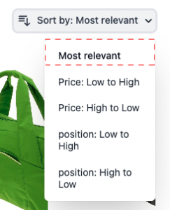
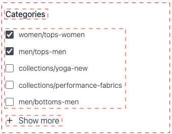
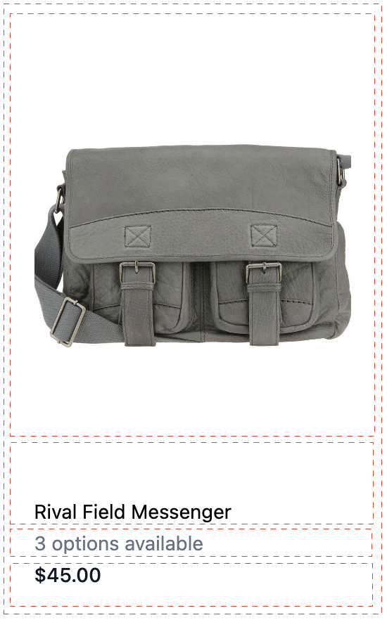

# Widget pagina elenco prodotti

[!DNL Live Search Product Listing Page Widget] (PLP) utilizza la piattaforma Commerce Services per fornire una pagina di elenco di prodotti performante, ricercabile e facet-able. In questo argomento viene descritto come abilitare e assegnare uno stile al widget PLP.

## Abilitazione del widget PLP

Quando il servizio [!DNL Live Search] è installato, la funzionalità di ricerca predefinita viene convertita automaticamente in [!DNL Live Search].

Il widget PLP [!DNL Live Search] è abilitato per impostazione predefinita per le nuove installazioni.

Se si sta aggiornando [!DNL Live Search] e il widget PLP è già stato disattivato, rimarrà tale.

>[!NOTE]
>
>Se stai eseguendo la migrazione da Search Adapter obsoleto, consulta la [guida alla migrazione](migrate-to-plp.md) per informazioni dettagliate su scenari, prerequisiti e istruzioni dettagliate.

Per attivare il widget PLP:

1. Nell’amministratore di Adobe Commerce, vai a Archivi → Impostazioni → Configurazione.
1. Nel menu di navigazione a sinistra, fare clic su **[!UICONTROL Live Search]** > **[!UICONTROL Storefront Features]**.
1. Fare clic sulla sezione [!UICONTROL Storefront Features].
1. Imposta [!UICONTROL Enable Product Listing Widget] = Sì
1. Salva configurazione
1. Se richiesto, svuotare la cache ( vai a Sistema > Strumenti > Gestione cache > [!UICONTROL Flush Magento Cache]).

>[!IMPORTANT]
>
>Quando [!DNL Live Search Product Listing Page Widget] è abilitato, non è possibile modificare la direzione dell&#39;ordinamento in una pagina dell&#39;elenco prodotti.

## Funzioni widget

Il widget PLP fornisce le seguenti funzioni predefinite:

- Pulsanti Aggiungi al carrello - Disponibile solo per prodotti semplici.
- Più immagini per prodotto: l’immagine può cambiare quando si sceglie un colore diverso per un prodotto configurabile.
- Supporto per i campioni di colore: tieni presente che l&#39;attributo di colore deve essere digitato `color` affinché il codice possa essere convalidato correttamente.

### Personalizzazione del widget

Oltre alle funzioni predefinite del widget PLP, potete personalizzare ulteriormente il widget per includere le seguenti funzioni:

- Filtraggio per attributi
- Supporto di più lingue
- Cursori prezzo

Per informazioni su come personalizzare il widget PLP per gestire le funzionalità di cui sopra, vedere il file readme `storefront-product-listing-page` nel seguente [repository](https://github.com/adobe/storefront-product-listing-page/). Il file readme in questo archivio fornisce un esempio per personalizzare il widget PLP e distribuire tali personalizzazioni nel sito.

>[!WARNING]
>
>Se personalizzi il widget PLP utilizzando il codice disponibile nell’archivio, sei responsabile della manutenzione e di tutti gli aggiornamenti necessari. Eventuali nuove funzioni del widget PLP rilasciate da Adobe potrebbero essere incompatibili con l’implementazione personalizzata.

## Esempio di stile

Puoi personalizzare l&#39;aspetto del widget PLP in modo che corrisponda al tuo sito utilizzando [CSS](https://developer.adobe.com/commerce/frontend-core/guide/css/).

>[!NOTE]
>
>Gli elementi con classi personalizzate all’interno di un tema Adobe Commerce non vengono ereditati. Questi elementi devono essere oggetto di targeting da parte della classe specifica per corrispondere alle classi personalizzate; le classi di azione primarie non funzioneranno su un pulsante widget. Gli elementi di destinazione generici all&#39;interno del CSS vengono ereditati; `button` si applica ai pulsanti widget.

Gli elementi div evidenziati contengono la classe di destinazione `ds-sdk-product-item__product-name`.


Personalizza il nome del prodotto aggiungendo una regola per renderli maiuscoli.

```css
.ds-sdk-product-item__product-name {
 text-transform: uppercase;
}
```


## Classi CSS

### Elenco prodotti

- `.ds-sdk-product-list`: div esterno
- `.ds-sdk-product-list__grid`: div interno


#### Paginazione elenco prodotti

- `.ds-plp-pagination`


- `.ds-plp-pagination_item`


- `.ds-plp-pagination_item--current`


### Widget

- `.ds-widgets`: div esterno
- `.ds-widgets__actions`: div interno lato sinistro
- `.ds-widgets__results`: div interno lato destro


### Menu a discesa Ordina

- `.ds-sdk-sort-dropdown`


- `.ds-sdk-sort-dropdown__button`


- `.ds-sdk-sort-dropdown__items`


- `.ds-sdk-sort-dropdown__items--item`


- `.ds-sdk-sort-dropdown__items--item-selected`



- `.ds-sdk-sort-dropdown__items--item-active`


### Facet

- `.ds-plp-facets`
- `.ds-plp-facets__header`
- `.ds-plp-facets__header_title`
- `.ds-plp-facets__header__clear-all`

{width="350"}

- `.ds-plp-facets__pills`
- `.ds-sdk-pill`

{width="350"}

- `.ds-sdk-pill__label`
- `.ds-sdk-pill__cta`

{width="350"}

- `.ds-plp-facets__list`

{width="350"}

- `.ds-sdk-input`
- `.ds-sdk-input__label`
- `.ds-sdk-product-item__product-swatch-group`
- `ds-sdk-product-item__product-swatch-item`
- `.ds-sdk-input_fieldset_show-more`



- `.ds-sdk-labelled-input`


- `.ds-sdk-labelled-input__input`
- `.ds-sdk-labelled-input__label`


### Elemento prodotto

- `.ds-sdk-product-item`
- `.ds-sdk-product-item__image`
- `.ds-sdk-product-item__product-name`
- `.ds-sdk-product-item__product-options`
- `.ds-sdk-product-price`
   - `.ds-sdk-product-price--no-discount`
   - `.ds-sdk-product-price--grouped`
   - `.ds-sdk-product-price--bundle`
   - `.ds-sdk-product-price--discount`



### Caricamento

- `.ds-sdk-loading`
- `.ds-sdk-loading__spinner`
- `.ds-sdk-loading__spinner-label`


## Disattivazione del widget PLP

Per disattivare il widget PLP:

1. Vai a **Archivi** > Impostazioni > **Configurazione** > **[!DNL Live Search]** > **Funzioni vetrina** e imposta **Abilita widget elenco prodotti** su &quot;No&quot;.
1. Seleziona **Salva configurazione** per salvare l&#39;impostazione.
