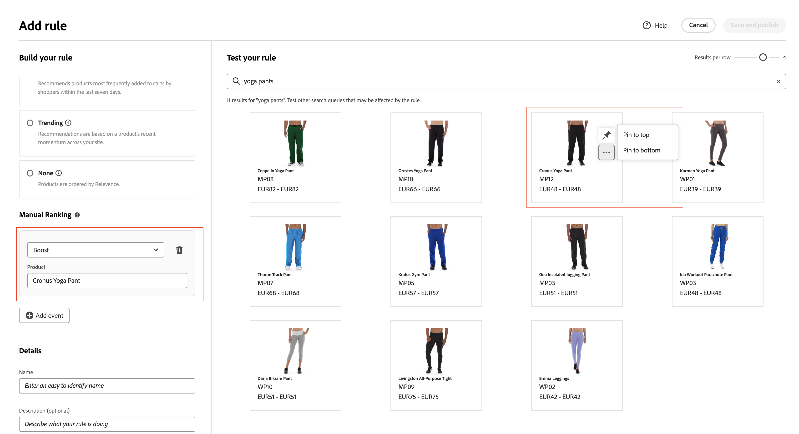

# Aggiungi regole

Per creare una regola, il primo passaggio consiste nell’utilizzare l’editor di regole per definire, nel testo della query dell’acquirente, le condizioni che attivano gli eventi associati. Quindi, completa i dettagli della regola, verifica i risultati e pubblica la regola.

## Aggiungi una regola

1. In Amministrazione, vai a **Marketing** > SEO &amp; Search > **[!DNL Live Search]**.
1. Imposta **Ambito** per identificare la [visualizzazione archivio](https://experienceleague.adobe.com/docs/commerce-admin/start/setup/websites-stores-views.html#scope-settings) in cui si applica la regola.
1. Fare clic sull&#39;area di lavoro **Ricerca merchandising**.
1. Fai clic su **Aggiungi regola** per avviare l&#39;editor di regole.

## Tipo di regola

Una query di ricerca è il luogo in cui si definiscono termini di ricerca, condizioni e tipi di classificazione specifici.

È possibile impostare una regola predefinita che viene applicata a tutte le query, a meno che non venga definita una query di ricerca più specifica. È possibile impostare una sola regola predefinita che non può contenere condizioni. Se si seleziona Default, l&#39;interfaccia Conditions (Condizioni) non viene visualizzata.
Scegli il tipo di classificazione intelligente predefinito ed eventuali classificazioni manuali da applicare a tutte le ricerche predefinite. Le classificazioni manuali vengono sempre applicate.

## Condizioni

Le condizioni sono i requisiti per attivare un evento. Una regola può avere fino a dieci condizioni e 25 eventi. Una regola predefinita non può avere condizioni.

>[!NOTE]
>
>Attualmente, non è possibile eseguire il targeting delle regole per un gruppo di clienti specifico.

### Condizione singola

1. In *Genera la regola*, seleziona la **Condizione** da soddisfare e segui le istruzioni per completare l&#39;istruzione.

   * Query di ricerca contiene: immettere la stringa di testo che deve essere inclusa nella query dell&#39;acquirente. L&#39;impostazione Corrispondenza determina il grado di corrispondenza tra la query dell&#39;acquirente e il catalogo. Opzioni:  Qualsiasi - Qualsiasi parte del testo della query dell&#39;acquirente può corrispondere alla condizione. Tutti - Tutte le query dell&#39;acquirente devono corrispondere alla condizione.
   * Query di ricerca: immetti una stringa di testo che corrisponda esattamente alla query dell’acquirente. Ad esempio: &quot;pantaloni da yoga&quot;. Le regole con `Search query is` e la corrispondenza `All` possono avere una sola condizione.
   * La query di ricerca inizia con - Inserisci un carattere o una stringa di testo che deve trovarsi all’inizio della query dell’acquirente.
   * La query di ricerca termina con - Immetti un carattere o una stringa di testo che deve trovarsi alla fine della query dell’acquirente.

   I risultati vengono visualizzati immediatamente nel riquadro *Verifica regola* e sono numerati per priorità. Puoi utilizzare il cursore *Risultati per riga* nella parte superiore    diritto di modificare il numero di prodotti in ogni riga.

   

1. Per verificare altre query, modifica il testo della query nella casella di ricerca *Verifica la regola* e premi **Invio**.
Inizialmente, il riquadro dei test esegue il rendering della query dalla casella di ricerca Condizioni. Ma ora sta eseguendo il rendering della query dalla casella di query del test. Nel riquadro dei test viene eseguita una sola query alla volta.
1. Se il risultato ti piace, aggiorna il testo nella casella di ricerca *Condizioni*. Quindi, fai clic in un punto qualsiasi della pagina per aggiornare i risultati nel riquadro del test.
1. Per creare una regola semplice con una condizione, passare al passaggio 3: [Aggiungi eventi](#events).

### Condizioni multiple

1. Per creare una regola con più condizioni, fare clic su **Aggiungi condizione**.
Una regola può avere fino a dieci condizioni. L&#39;operatore logico che unisce due condizioni si basa sull&#39;impostazione *Match* corrente. Per impostazione predefinita, *Match* è `All` e l&#39;operatore logico è `AND`.

1. Seleziona la seconda condizione e immetti il testo della query richiesto.

1. Per modificare la logica della regola, modifica l&#39;impostazione **Corrispondenza** per determinare la corrispondenza tra i criteri di ricerca dell&#39;acquirente e la condizione della query. Imposta **Corrispondenza** su uno dei seguenti elementi:

   * Qualsiasi - (impostazione predefinita) Tutti gli operatori logici nella regola sono impostati su `OR` e i risultati vengono visualizzati nel riquadro dei test.
   * Tutti: tutti gli operatori logici nella regola sono impostati su `AND` e i risultati vengono visualizzati nel riquadro dei test.

   Il valore *Match* determina l&#39;operatore logico utilizzato per unire più condizioni. La modifica dell&#39;impostazione *Match* comporta la modifica di tutti gli operatori logici nella regola. Impossibile combinare `AND` e `OR` nella stessa regola.

   In questo esempio, invece di cercare &quot;pantaloni yoga&quot;, ci sono due query separate che cercano &quot;yoga&quot; o &quot;pantaloni&quot;. Questa regola è meno specifica e viene attivata più spesso nella vetrina rispetto alle altre.

   

1. Per aggiungere un&#39;altra condizione, fare clic su **Aggiungi condizione** e ripetere il processo.

## Classificazione intelligente

La classificazione intelligente combina i comportamenti degli utenti e le statistiche del sito per determinare la classificazione del prodotto.
I proprietari dei negozi possono impostare i seguenti tipi di strategie di classificazione:

* Più acquistati: classifica i prodotti in base agli acquisti totali per SKU nei 7 giorni precedenti.
* La maggior parte è stata aggiunta al carrello, in ordine di attività totali &quot;Aggiungi al carrello&quot; nei 7 giorni precedenti.
* Più visualizzati: classifica le visualizzazioni totali per SKU nei 7 giorni precedenti.
* Consigliato per te - Utilizza il punto dati `viewed-viewed` - Gli acquirenti che hanno visualizzato questo SKU hanno esaminato anche questi altri SKU.
* Tendenza: considera gli eventi di visualizzazione della pagina delle ultime 72 ore per gli eventi in background e 24 ore per gli eventi in primo piano.
* Nessuno: i prodotti vengono ordinati in base alla rilevanza.

Selezionare il tipo di strategia per la regola. Nella finestra **Verifica regola** vengono visualizzati i risultati previsti.

### Avvertenze

* Gli apostrofi e le citazioni nelle interrogazioni possono portare ad alcuni problemi minori di classificazione e rilevanza in alcune lingue.
* Per garantire il corretto funzionamento della classificazione intelligente, assicurati che il **Peso di ricerca** per tutti gli attributi di prodotto utilizzati per la ricerca o il filtraggio (facet) sia pari o inferiore a `5`. Per trovare questa impostazione nell&#39;amministratore [!DNL Commerce]:

   1. Seleziona **Archivi** > _Attributi_ > **Prodotto**.
   1. Cerca l’attributo, ad esempio &quot;name&quot;.
   1. Nella pagina **Informazioni attributo** > **Proprietà storefront**, impostare lo spessore della ricerca su minore o uguale a `5`.

      

>[!NOTE]
>
>L’esperienza di ricerca della vetrina è interessata da più configurazioni che lavorano insieme, come facet, sinonimi e regole di merchandising di ricerca/categoria, che possono portare a risultati diversi da quelli visualizzati durante il test di singole configurazioni nell’amministratore. Mentre i test di amministrazione isolano aree di configurazione specifiche, la vetrina applica tutte le configurazioni rilevanti insieme, dando luogo a un output di ricerca più complesso e realistico.

## Classificazione manuale

La Classificazione manuale (precedentemente nota come Eventi) è un’azione che modifica i risultati della ricerca quando vengono soddisfatte determinate condizioni. Una singola regola può avere fino a 25 eventi.

* Incrementa: sposta un prodotto più in alto nei risultati di ricerca.
* Intervallo: sposta una SKU in basso nei risultati di ricerca.
* Fissa un prodotto: il prodotto viene visualizzato nella posizione selezionata sulla pagina.
* Nascondi un prodotto: esclude uno SKU dai risultati della ricerca.

Il modo più semplice per fissare un prodotto è tramite trascinamento.

1. Fai clic su un prodotto e trascinalo nel riquadro Test. Trascinalo e rilascialo nella posizione desiderata. I campi Prodotto e Posizione vengono compilati automaticamente nel riquadro Eventi.

   

Puoi anche fare clic sull’icona a forma di pin per fissare un prodotto alla posizione corrente. Utilizza il menu di scelta rapida con puntini di sospensione per &quot;Fissa in alto&quot; o &quot;Fissa in basso&quot;.

>[!NOTE]
>
>È possibile fissare solo i prodotti restituiti nella query.

Gli eventi OR possono essere impostati manualmente:

1. In *Eventi*, scegli l&#39;**Evento** da eseguire quando vengono soddisfatte le condizioni associate.

   Scegliere ad esempio `Hide a product`. Quindi, inserisci il nome del prodotto che desideri nascondere. I prodotti vengono suggeriti durante la digitazione.

1. Per più eventi, scegli qualsiasi altro evento che desideri attivare quando vengono soddisfatte le condizioni.

## Dettagli aggiuntivi

Le informazioni immesse vengono visualizzate nel pannello [Dettagli regola](rules-workspace.md).

1. In *Dettagli*, immetti un **Nome** per la regola. Tutti i nomi delle regole devono essere univoci.
1. Immetti una breve **Descrizione** della regola.
1. Immetti **Data inizio** e **Data fine** affinché la regola sia attiva oppure scegli le date dal calendario.

   Per selezionare un intervallo di date, fai clic sulla prima data e trascina per selezionare l’intervallo.

   

## Finalizzazione della regola

1. Esaminare i risultati della regola nel riquadro del test.
1. Se la regola dispone di più query, esegui il test di ciascuna che potrebbe essere interessata dalla regola.
1. Al termine, fare clic su **Salva e pubblica**.

   La regola viene aggiunta all&#39;elenco nell&#39;area di lavoro *Rules*.

1. Anche se le regole attive entrano in vigore immediatamente, potrebbe essere necessario attendere fino a 15 minuti prima che i risultati della query memorizzata nella cache vengano aggiornati nella vetrina.

>[!NOTE]
>
>Le regole e i prodotti classificati manualmente vengono applicati ai risultati della ricerca quando viene selezionato il criterio di ordinamento predefinito &quot;Ordina per: Più rilevante&quot;. Se un acquirente modifica il criterio di ordinamento in modo da definirlo in base al nome o al prezzo, le regole e le classificazioni manuali non sono più attive.

## Descrizioni dei campi

### Condizioni (if)

| Condizione | Descrizione |
|--- |--- |
| La query di ricerca contiene | Carattere o stringa di testo inclusa nella query dell&#39;acquirente. Per soddisfare questa condizione, la query dell’acquirente deve corrispondere a un solo carattere. |
| Query di ricerca: | Carattere o stringa di testo che corrisponde esattamente alla query dell&#39;acquirente. Non è possibile comporre query complesse con più condizioni quando si utilizza questa condizione. |
| La query di ricerca inizia con | La query del cliente inizia con questo carattere o stringa di testo. |
| La ricerca termina con | La query del cliente termina con questo carattere o stringa di testo. |

### Operatori logici

| Operatore | Descrizione |
|--- |--- |
| OPPURE | Impostazione predefinita. L&#39;operatore logico `OR` confronta due condizioni e soddisfa i requisiti per attivare un evento se almeno una condizione è vera. |
| E | L&#39;operatore logico `AND` confronta due condizioni e soddisfa i requisiti per attivare un evento se entrambe le condizioni sono vere. |

### Operatori di corrispondenza

| Operatore | Descrizione |
|--- |--- |
| Qualsiasi | Modifica tutti gli operatori logici nella regola in `OR` e restituisce il set di prodotti corrispondenti. |
| Tutti | Modifica tutti gli operatori logici nella regola in `AND` e restituisce il set di prodotti corrispondenti. |

### Classificazione manuale

| Evento | Descrizione |
|--- |--- |
| Incrementa | Sposta uno SKU o un intervallo di SKU più in alto nei risultati di ricerca. Ognuno di essi è contrassegnato da un badge di anteprima &quot;potenziato&quot; nei risultati della ricerca di test. |
| Buio | Sposta uno SKU o un intervallo di SKU in un livello inferiore nei risultati di ricerca. Ognuno di essi è contrassegnato da un badge di anteprima &quot;interrato&quot; nei risultati della ricerca di test. |
| Fissa un prodotto | Associa un singolo SKU a una posizione specifica nei risultati della ricerca. Il prodotto è contrassegnato con un badge di anteprima &quot;fissato&quot; nei risultati della ricerca di test. |
| Nascondere un prodotto | Esclude uno SKU, o intervallo di SKU, dai risultati della ricerca. |

### Dettagli

| Campo | Descrizione |
|--- |--- |
| Nome | Nome della regola. I nomi delle regole devono essere univoci. |
| Tipo di regola | Predefinito o Query. Il valore predefinito viene applicato a tutte le regole, a meno che non sia definita una regola di query più specifica. |
| Data di inizio | Data di inizio della regola, se pianificata. |
| Data di fine | Data di fine della regola, se pianificata. |
| Descrizione | Breve descrizione della regola. |
