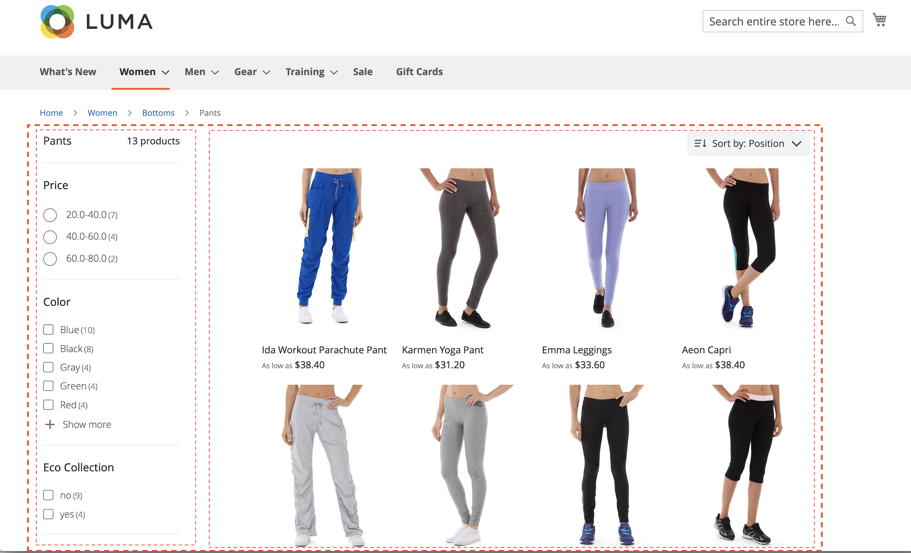

# Widget vetrina

Quando installi [!DNL Live Search], ottieni due nuovi widget sulla vetrina:

- [!DNL Live Search] [widget popover](storefront-popover.md) è la casella che si apre nel campo di ricerca contenente i risultati della ricerca.
- [Il widget Pagina di elenco prodotti](plp-styling.md) (PLP) fornisce una pagina di elenco prodotti ricercabile con facet e supporto sinonimi. Il widget viene installato e abilitato in Live Search 4.0.0+.

Puoi personalizzare l’aspetto di questi widget in base alle linee guida di stile e branding della tua azienda.

## Widget popover Live Search

Quando si inizia a digitare nella casella di ricerca della vetrina di Commerce, [!DNL Live Search] risponde con i prodotti suggeriti e un&#39;immagine in miniatura dei risultati di ricerca principali nel [widget popopover](storefront-popover.md).

![[!DNL Live Search popover]](assets/storefront-search-as-you-type.png)

Per ulteriori informazioni sul widget popover e su come personalizzarlo per la vetrina, vedere [[!DNL Storefront Popover]](storefront-popover.md).

## Widget pagina di elenco prodotti

Quando fai clic su per visualizzare tutti i risultati dal popover vetrina, il widget della pagina di elenco dei prodotti mostra le funzioni che puoi utilizzare per perfezionare continuamente la ricerca.

Per ulteriori informazioni sul widget della pagina di elenco prodotti e su come personalizzare il widget per la vetrina, consulta [widget della pagina di elenco prodotti](plp-styling.md).
