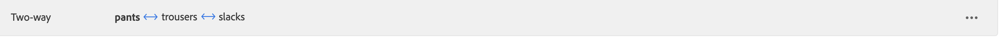

# Aggiungi sinonimi

Aumenta il coinvolgimento dei clienti aggiungendo il tuo elenco curato di [!DNL Live Search] sinonimi. [!DNL Live Search] può gestire fino a 200 sinonimi per `Data Space ID`.

![[!DNL Live Search] sinonimi](assets/synonym-workspace.png)

## Passaggio 1: aggiungere un sinonimo

1. In Amministrazione, vai a **Marketing** > SEO &amp; Search > **[!DNL Live Search]**.
1. Per più archivi, impostare **Ambito** nella [visualizzazione archivio](https://experienceleague.adobe.com/docs/commerce-admin/start/setup/websites-stores-views.html#scope-settings) in cui si applicano le impostazioni dei sinonimi.
1. Fare clic sulla scheda **Sinonimi**.
1. Fare clic sul pulsante **Aggiungi sinonimi**.

## Passaggio 2: definire il sinonimo per tipo

Segui le istruzioni per il [tipo di sinonimo](synonyms-type.md) che desideri creare.

### Sinonimo bidirezionale

1. Accettare l&#39;opzione **bidirezionale** predefinita.

   

1. Immettere il termine o la frase **Parola chiave** da trovare.
1. Immettere i **Espansione** termini che si desidera aggiungere come sinonimi per la parola chiave. Separa più termini con una virgola.
In questo esempio, la parola chiave da associare è &quot;pantaloni&quot; e l&#39;insieme dei termini di espansione sono &quot;pantaloni, slacks&quot;.

   

1. Al termine, fare clic su **Salva**.
Il set di sinonimi viene visualizzato nell&#39;elenco con una freccia bidirezionale tra ciascun termine, il che significa che i termini sono intercambiabili.

   

### Sinonimo unidirezionale

1. Fare clic sul tipo di sinonimo **unidirezionale**.

   

1. Immetti i termini **Parola chiave** e **Espansione**. Separa più termini con una virgola.

   

   In questo esempio, la parola chiave è &quot;pantaloni&quot; e i termini di espansione unidirezionale &quot;capris, peddle-pushers&quot; sono ciascuno un sottoinsieme di &quot;pantaloni&quot;, ma con un significato specifico.

1. Al termine, fare clic su **Salva**.
Il set di sinonimi viene visualizzato nell&#39;elenco con una freccia unidirezionale che punta dai termini di espansione alla parola chiave per indicare che i termini sono sottoinsiemi della parola chiave. Un segno più separa ogni termine di espansione.

   

## Passaggio 3: Pubblicare le modifiche

1. Al termine dei sinonimi, fare clic su **Pubblica modifiche**.
1. Attendi fino a due ore prima che gli aggiornamenti diventino disponibili nella vetrina.

## Descrizioni campi

| Campo | Descrizione |
|--- |--- |
| [Tipo](synonyms.md) | Determina se i sinonimi hanno lo stesso significato della parola chiave o sono un sottoinsieme della parola chiave. Opzioni: Bidirezionale (impostazione predefinita) - Termini che hanno lo stesso significato della parola chiave e restituiscono gli stessi risultati di ricerca Unidirezionale - Termini che sono un sottoinsieme della parola chiave. I sinonimi unidirezionali restituiscono un elenco più ristretto di prodotti specifici. |
| Parola chiave | Parola comunemente associata a una selezione di prodotti nel catalogo. |
| Espansione | Termini aggiuntivi che hanno lo stesso significato o un significato simile della parola chiave. |
