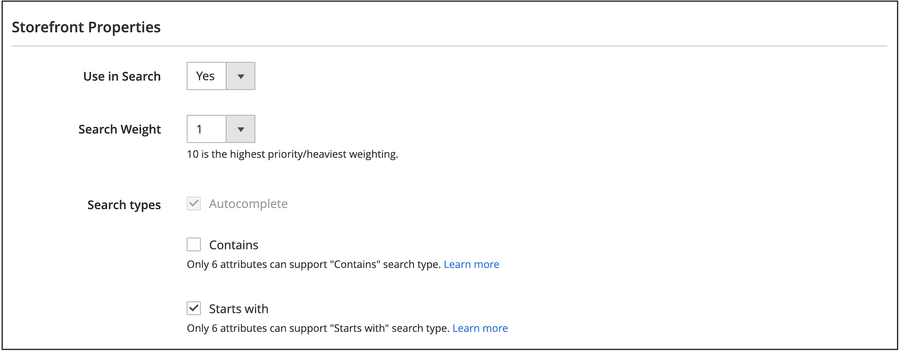

# Configurazione di Live Search

Nell&#39;area di lavoro è possibile configurare, gestire e monitorare le prestazioni di [!DNL Live Search]. Il menu nella parte superiore fornisce l’accesso agli strumenti in ogni area funzionale. Le funzioni disponibili riflettono la selezione del menu corrente.

## Raccolta dati

Per garantire che ogni area funzionale nell’area di lavoro contenga i dati corretti, devi configurare la raccolta dati in base all’implementazione della vetrina selezionata:

1. Luma - La raccolta dei dati è disponibile come strumento pronto all’uso.
1. Headless: la raccolta dei dati deve essere configurata manualmente, a seconda dell’implementazione in vetrina.

Se utilizzi una vetrina headless, consulta la seguente documentazione per ulteriori informazioni sugli eventi richiesti da aggiungere:

- [Eventi richiesti](https://developer.adobe.com/commerce/services/shared-services/storefront-events/#live-search) per il dashboard di Live Search.
- [Agente di raccolta eventi storefront](https://developer.adobe.com/commerce/services/shared-services/storefront-events/collector/) che deve essere aggiunto come prerequisito.
- [Esempi](https://github.com/adobe/commerce-events/tree/main/examples) della struttura degli eventi.

### Clienti del settore sanitario

Se sei un cliente del settore sanitario e hai installato l&#39;estensione [HIPAA Data Services](../data-connection/hipaa-readiness.md#installation), che fa parte dell&#39;estensione [Data Connection](../data-connection/overview.md), i dati dell&#39;evento storefront utilizzati da [!DNL Live Search] non vengono più acquisiti. Questo perché i dati dell’evento storefront vengono generati lato client. Per continuare l&#39;acquisizione e l&#39;invio di dati evento vetrina, riattivare la raccolta eventi per [!DNL Live Search]. Per ulteriori informazioni, consulta la [configurazione generale](https://experienceleague.adobe.com/it/docs/commerce-admin/config/general/general#data-services).

## Impostare l&#39;ambito

Inizialmente l&#39;[ambito](https://experienceleague.adobe.com/docs/commerce-admin/start/setup/websites-stores-views.html?lang=it#scope-settings) di tutte le impostazioni [!DNL Live Search] è impostato su `Default Store View`. Se l&#39;installazione di [!DNL Commerce] include più visualizzazioni dello store, impostare **Ambito** sulla [visualizzazione dello store](https://experienceleague.adobe.com/docs/commerce-admin/start/setup/websites-stores-views.html?lang=it) in cui si applicano le impostazioni del facet.

## Opzioni menu

| Opzione | Descrizione |
|--- |--- |
| [Prestazioni](performance.md) | Dashboard fornisce ad insight informazioni sulle prestazioni di ricerca dei prodotti. |
| [Faceting](facets.md) | Filtraggio ad alte prestazioni che utilizza più dimensioni di valori di attributo per perfezionare i criteri di ricerca. |
| [Sinonimi](synonyms.md) | Estendi la portata della ricerca per includere le parole che gli acquirenti potrebbero usare per trovare prodotti diversi da quelli nel catalogo. |
| [Cerca nel merchandising](rules.md) | Forma l’esperienza di ricerca con regole logiche che attivano le azioni pianificate. Puoi promuovere, seppellire, fissare o nascondere i prodotti per calibrare i risultati della ricerca e supportare gli obiettivi aziendali. |
| [Merchandising categoria](category-merch.md) | Applica regole e merchandising intelligente a livello di categoria. |
| [GraphQL](graphql.md) | Gli sviluppatori che hanno effettuato l’accesso all’amministratore del tuo archivio possono comporre e verificare le query con i dati del catalogo effettivo. Per ulteriori informazioni, vai a [Panoramica di GraphQL](https://developer.adobe.com/commerce/webapi/graphql/schema/live-search/) nella documentazione per gli sviluppatori di [!DNL Live Search]. |
| [Impostazioni](settings.md) | Determina il modo in cui i valori del facet di prezzo vengono raggruppati per intervallo di prezzi nella vetrina e imposta il linguaggio di indicizzazione. |

## Imposta attributi come ricercabili

Per produrre risultati con targeting elevato, controlla il set di attributi di prodotto [ricercabili](https://experienceleague.adobe.com/docs/commerce-admin/catalog/product-attributes/product-attributes.html?lang=it) (`searchable=true`). Per garantire la rilevanza, rendi gli attributi ricercabili solo se contengono contenuto con un significato chiaro e conciso. Evitare di utilizzare attributi contenenti testo meno preciso e lungo, ad esempio `description`, che, sebbene abilitati per impostazione predefinita per la ricerca, possono ridurre la precisione dei risultati della ricerca. Ad esempio, se una persona cerca i &quot;pantaloncini corti&quot; e ci sono camicie con una descrizione che include il termine &quot;maniche corte&quot;, allora le camicie saranno incluse nei risultati della ricerca.

La procedura seguente illustra come consentire la ricerca di attributi:

1. In Amministrazione, vai a **Archivi** > *Attributo* > **Prodotto**.
1. Selezionare l&#39;attributo che si desidera rendere ricercabile, ad esempio `color`.
1. Selezionare **Proprietà storefront** e impostare **Usa nella ricerca** su `yes`.

[!DNL Live Search] rispetta anche il [peso](https://experienceleague.adobe.com/docs/commerce-admin/catalog/catalog/search/search-results.html?lang=it#weighted-search) di un attributo di prodotto, come impostato in Adobe Commerce. Gli attributi con un peso maggiore appariranno più in alto nei risultati di ricerca.

È sempre possibile cercare i seguenti attributi:

- `sku`
- `name`
- `categories`

### Comportamento degli attributi nei prodotti complessi

Per i tipi di prodotto complessi (prodotti configurabili, bundle e raggruppati), [!DNL Live Search] indicizza i valori degli attributi dei prodotti padre e figlio, consentendo l&#39;associazione di un prodotto padre a più valori per lo stesso attributo. Questo consente di applicare filtri basati sulle varianti; ad esempio, quando si filtra per &quot;blu&quot; una camicia configurabile viene visualizzata se una variante è blu, anche se il prodotto principale non ha un set di colori.

Questa funzione è adatta per attributi quali colore e dimensioni, ma può causare risultati imprevisti per attributi quali `new_arrival`, `product_ranking`, `promotion_label` o attributi di prezzo personalizzati. Ad esempio, se un prodotto configurabile (SKU-001) ha `new_arrival = true`, ma la relativa variante figlio (SKU-001-01) ha `new_arrival = false`, il prodotto principale SKU-001 viene indicizzato con entrambi i valori (`true` e `false`), consentendone la visualizzazione nei risultati di ricerca per entrambe le condizioni.

### Ricerca su più livelli ed espansione dei tipi di ricerca

La ricerca a livelli, o ricerca all’interno di una ricerca, è un potente sistema di filtro basato su attributi che estende la funzionalità di ricerca tradizionale per includere parametri di ricerca aggiuntivi. Questi parametri di ricerca aggiuntivi consentono un rilevamento del prodotto più preciso e flessibile.

>[!NOTE]
>
>La ricerca a livelli è disponibile in Live Search 4.6.0.

La ricerca su più livelli consente di:

- Consenti agli acquirenti di eseguire ricerche all&#39;interno dei risultati di ricerca.
- Utilizza l&#39;indicizzazione della ricerca `startsWith` e `contains` nel secondo livello della ricerca a livelli per perfezionare ulteriormente i risultati.

Le funzionalità di ricerca avanzata sono implementate tramite il parametro `filter` nella query [`productSearch`](https://developer.adobe.com/commerce/webapi/graphql/schema/live-search/queries/product-search/) utilizzando operatori specifici:

- **Ricerca a livelli** - Ricerca in un altro contesto di ricerca - Con questa funzionalità è possibile eseguire fino a due livelli di ricerca per le query di ricerca. Ad esempio:

   - **Ricerca livello 1** - Ricerca &quot;motore&quot; in `product_attribute_1`.
   - **Ricerca livello 2** - Ricerca &quot;numero parte 123&quot; in `product_attribute_2`. In questo esempio viene cercata la voce &quot;part number 123&quot; all&#39;interno dei risultati per &quot;motor&quot;.

  La ricerca con livelli è disponibile sia per l&#39;indicizzazione di ricerca `startsWith` che per l&#39;indicizzazione di ricerca `contains` nel secondo livello della ricerca con livelli, come descritto di seguito:

- **startsWith indicizzazione ricerca** - Effettua la ricerca utilizzando l&#39;indicizzazione `startsWith`. Questa nuova funzionalità consente di:

   - Ricerca di prodotti in cui il valore dell&#39;attributo inizia con una stringa specificata.
   - La configurazione di una ricerca &quot;termina con&quot; consente agli acquirenti di cercare prodotti in cui il valore dell’attributo termina con una stringa specifica. Per abilitare una ricerca &quot;termina con&quot;, l’attributo del prodotto deve essere acquisito in ordine inverso e anche la chiamata API deve essere una stringa inversa. Ad esempio, se desideri cercare un nome di prodotto che termina con &quot;pantaloni&quot;, devi inviarlo come &quot;stnap&quot; (bloccaggio).

- **contiene l&#39;indicizzazione della ricerca** - Effettuare la ricerca di un attributo utilizzando l&#39;indicizzazione contains. Questa nuova funzionalità consente di:

   - Ricerca di una query all&#39;interno di una stringa più grande. Ad esempio, se un acquirente cerca il numero di prodotto &quot;PE-123&quot; nella stringa &quot;HAPE-123&quot;.

      - Nota: questo tipo di ricerca è diverso dalla [ricerca frase](https://developer.adobe.com/commerce/webapi/graphql/schema/live-search/queries/product-search/#phrase) esistente, che esegue una ricerca di completamento automatico. Ad esempio, se il valore dell’attributo del prodotto è &quot;pantaloni da esterni&quot;, la ricerca di una frase restituisce una risposta per &quot;out pan&quot;, ma non restituisce una risposta per &quot;o formiche&quot;. Una ricerca contiene, tuttavia, restituisce una risposta per &quot;o formiche&quot;.

Queste nuove condizioni migliorano il meccanismo di filtro delle query di ricerca per perfezionare i risultati della ricerca. Queste nuove condizioni non influiscono sulla query di ricerca principale.

#### Implementazione

1. In Admin, [imposta un attributo di prodotto](https://experienceleague.adobe.com/it/docs/commerce-admin/catalog/product-attributes/product-attributes-add#step-5-describe-the-storefront-properties) affinché sia possibile eseguire ricerche.

   Vedi l&#39;elenco degli [attributi](https://experienceleague.adobe.com/it/docs/commerce-admin/catalog/product-attributes/attributes-input-types) ricercabili.

1. Specificare la funzionalità di ricerca per l&#39;attributo, ad esempio **Contains** (impostazione predefinita) o **Starts with**. È possibile specificare un massimo di sei attributi da abilitare per **Contains** e sei attributi da abilitare per **Starts with**. Inoltre, per l&#39;indicizzazione **Contains**, la lunghezza della stringa non può superare i 50 caratteri.

   

1. Consulta la [documentazione per gli sviluppatori](https://developer.adobe.com/commerce/webapi/graphql/schema/live-search/queries/product-search/#filtering-using-search-capability) per esempi su come aggiornare le chiamate API [!DNL Live Search] utilizzando le nuove funzionalità di ricerca di `contains` e `startsWith`.

   Puoi implementare queste nuove condizioni nella pagina dei risultati della ricerca. Ad esempio, puoi aggiungere una nuova sezione nella pagina in cui l’acquirente può perfezionare ulteriormente i risultati della ricerca. È possibile consentire agli acquirenti di selezionare attributi di prodotto specifici, ad esempio &quot;Produttore&quot;, &quot;Numero parte&quot; e &quot;Descrizione&quot;. Da lì, eseguono ricerche all&#39;interno di tali attributi utilizzando le condizioni `contains` o `startsWith`.

### Quando utilizzare la ricerca a livelli anziché i facet

La ricerca su più livelli e i facet hanno scopi diversi nell’individuazione del prodotto e la scelta tra di essi dipende dal caso d’uso specifico:

**Usa ricerca a livelli quando:**

- È necessario eseguire una ricerca all’interno dei risultati di ricerca utilizzando più criteri.
- Utilizzo di numeri di parte, SKU o specifiche tecniche in cui gli utenti conoscono informazioni parziali.
- Gli acquirenti devono restringere i risultati passo dopo passo con criteri nidificati.
- Desideri ridurre il numero di chiamate API combinando più criteri di ricerca in una singola query.
- Devi implementare modelli di ricerca specifici per l’azienda che vadano oltre la navigazione con facet standard.

**Usa facet quando:**

- Fornire un filtro tipico per categoria, prezzo, marchio e attributi
- Opzioni di filtro intuitive facilmente comprensibili e selezionabili dagli utenti
- Visualizzazione delle opzioni disponibili in base ai risultati di ricerca correnti
- Visualizzazione dei conteggi dei filtri e degli intervalli che consentono agli utenti di comprendere le opzioni disponibili
- Lavorare con caratteristiche comuni del prodotto come colore, dimensioni, materiale e così via.

**Best practice:** utilizza la ricerca su più livelli per ricerche tecniche complesse in cui gli utenti hanno criteri specifici e utilizza facet per il filtro standard dell&#39;e-commerce in cui gli utenti desiderano esplorare e restringere visivamente le opzioni.

## Facet e sinonimi

Facet e sinonimi sono un altro modo per migliorare l&#39;esperienza di ricerca per i vostri acquirenti.

[Facet](facets.md) sono attributi di prodotto definiti in [!DNL Live Search] per essere filtrabili. È possibile impostare qualsiasi attributo filtrabile come facet in [!DNL Live Search], ma sono presenti [limiti](boundaries-limits.md) al numero di facet che è possibile cercare contemporaneamente.

>[!NOTE]
>
>Un attributo di prodotto può essere filtrato solo se la configurazione dell&#39;attributo di prodotto ha le proprietà richieste: *Usa nella ricerca = Sì*, *Usa nei risultati di ricerca Navigazione a livelli=sì* e *Usa nella navigazione a livelli=Filtrabile (con risultati)*. Se queste proprietà mancano o non sono impostate correttamente, l&#39;attributo non è visibile nella configurazione Facet. Per istruzioni di configurazione, vedere [Aggiungere un facet](facets-add.md#add-a-facet).

[I sinonimi](synonyms.md) sono termini che puoi definire per aiutare gli utenti a trovare il prodotto corretto. Gli utenti alla ricerca di pantaloni potrebbero digitare &quot;pantaloni&quot; o &quot;pantaloni&quot;. È possibile impostare sinonimi in modo che questi termini di ricerca portino gli utenti ai risultati &quot;pantaloni&quot;.

## Impostazioni di configurazione Commerce

Nella sezione seguente vengono descritte le impostazioni di configurazione di Commerce supportate e non supportate per [!DNL Live Search].

### Valori di configurazione supportati

>[!IMPORTANT]
>
>Si consiglia vivamente di utilizzare i widget di elenco prodotti, abilitati per impostazione predefinita in Live Search 4.0.0. I widget sono destinati a sostituire completamente l’implementazione dell’adattatore nelle versioni future. Per ulteriori informazioni, consulta [abilitare i widget dell&#39;elenco prodotti](install.md#enable-product-listing-widgets).

| Impostazione configurazione Commerce | Descrizione | Supportato da Popover | Supportato dall&#39;adattatore |
|---|---|---|---|
| Archivi > Configurazione > Catalogo > Catalogo > Ricerca nel catalogo > Consenti tutti i prodotti per pagina | Se è impostato su `Yes`, include l&#39;opzione `ALL` nel controllo &quot;Mostra per pagina&quot;. | Sì. Max. 500 prodotti | Sì. Max. 500 prodotti |
| Archivi > Configurazione > Catalogo > Catalogo > Ricerca nel catalogo > Lunghezza minima query | Numero minimo di caratteri consentito in una ricerca nel catalogo. | Sì | Sì |
| Archivi > Configurazione > Catalogo > Catalogo > Ricerca nel catalogo > Prodotti per pagina sulla griglia Valori consentiti | Determina il numero di prodotti visualizzati in Visualizzazione griglia. | Sì | Sì |
| Archivi > Configurazione > Catalogo > Catalogo > Ricerca nel catalogo > Prodotti per pagina sulla griglia Valore predefinito | Determina il numero di prodotti visualizzati per pagina per impostazione predefinita nella visualizzazione griglia. | Sì. Max. 500 prodotti | Sì. Max. 500 prodotti |
| Negozi > Configurazione > Catalogo > Inventario > Visualizza prodotti esauriti | Visualizza i prodotti esauriti. | Sì | Sì |
| Archivi > Configurazione > Valuta > Valuta di visualizzazione predefinita | Valuta principale utilizzata per visualizzare i prezzi. | Sì | Sì |
| Archivi > Configurazione > Generale > Impostazione divisa > Opzioni divisa > Divisa di base | La valuta principale utilizzata per tutte le transazioni di pagamento online. | Sì | Sì |

I prezzi nella pagina di elenco dei prodotti Widget e nel popover vengono convertiti nella valuta di visualizzazione predefinita utilizzando i tassi di valuta configurati.

### Valori di configurazione non supportati

| Impostazione configurazione Commerce | Descrizione | Note |
|---|---|---|
| Archivi > Configurazione > Catalogo > Storefront > Modalità elenco | Determina il formato dell&#39;elenco dei risultati della ricerca. | Esegue correttamente il rendering, ma per alcune interazioni di pagina gli eventi non vengono inviati |
| Archivi > Configurazione > Catalogo > Catalogo > Ricerca nel catalogo > Lunghezza massima query | Numero massimo di caratteri consentito in una ricerca nel catalogo. | Non implementato; Search Services accetta fino a 255 caratteri |
| Configurazione > Vendite > Imposta > Impostazioni visualizzazione prezzo > Visualizza prezzi prodotto nel catalogo | Determina se i prezzi dei prodotti pubblicati nel catalogo includono o escludono le imposte o mostrano due versioni del prezzo: una con e l&#39;altra senza imposte |  |
| Negozi > Configurazione > Catalogo > Vetrina > Elenco prodotti Ordina per | Determina l&#39;ordinamento dell&#39;elenco dei risultati della ricerca. | Non si applica al [!DNL Live Search] [widget pagina elenco prodotti](plp-styling.md) |

## Valori attributi predefiniti

I seguenti attributi di prodotto hanno [proprietà storefront](https://experienceleague.adobe.com/docs/commerce-admin/catalog/product-attributes/product-attributes.html?lang=it) utilizzate da [!DNL Live Search] e abilitate per impostazione predefinita.

| Proprietà | Storefront, proprietà | Attributo |
|---|---|---|
| Ordinabile | Utilizzato per l’ordinamento nell’elenco prodotti | `price` |
| Ricercabile | Uso nella ricerca | `price`  `sku` `name` |
| FilterableInSearch | Uso in navigazione a livelli - Filtrabile (con risultati) | `price` `visibility` `category_name` |

## Proprietà attributi non di sistema predefinite

La tabella seguente mostra le proprietà predefinite di ricerca e filtrabili degli attributi non di sistema, inclusi quelli specifici dei dati di esempio Luma. Se si imposta la proprietà dell&#39;attributo *Use in Search* su `Yes`, sarà possibile eseguire ricerche sia in [!DNL Live Search] che in Adobe Commerce nativo.

| Codice attributo | Ricercabile | Uso in navigazione a livelli |
|--- |--- |--- |
| attività | Sì | Filtrabile (con risultati) |
| attributes_brand | Sì | No |
| brand | Sì | No |
| clima | Sì | Filtrabile (con risultati) |
| collare | Sì | Filtrabile (con risultati) |
| colore | Sì | Filtrabile (con risultati) |
| costo | Sì | No |
| eco_collection | Sì | Filtrabile (con risultati) |
| genere | Sì | Filtrabile (con risultati) |
| produttore | Sì | Filtrabile (con risultati) |
| materiale | Sì | Filtrabile (con risultati) |
| scopo | Sì | Filtrabile (con risultati) |
| strap_bag | Sì | Filtrabile (con risultati) |
| style_general | Sì | Filtrabile (con risultati) |

## Proprietà attributi di sistema predefiniti

Nella tabella seguente vengono illustrate le proprietà predefinite di ricerca e filtrabili degli attributi di sistema.

| Codice attributo | Ricercabile | Uso in navigazione a livelli |
|--- |--- |--- |
| allow_open_amount | Sì | Filtrabile (con risultati) |
| descrizione | Sì | No |
| name | Sì | No |
| prezzo | Sì | Filtrabile (con risultati) |
| short_description | Sì | No |
| sku | Sì | No |
| stato | Sì | No |
| tax_class_id | Sì | No |
| url_key | Sì | No |
| peso | Sì | No |
