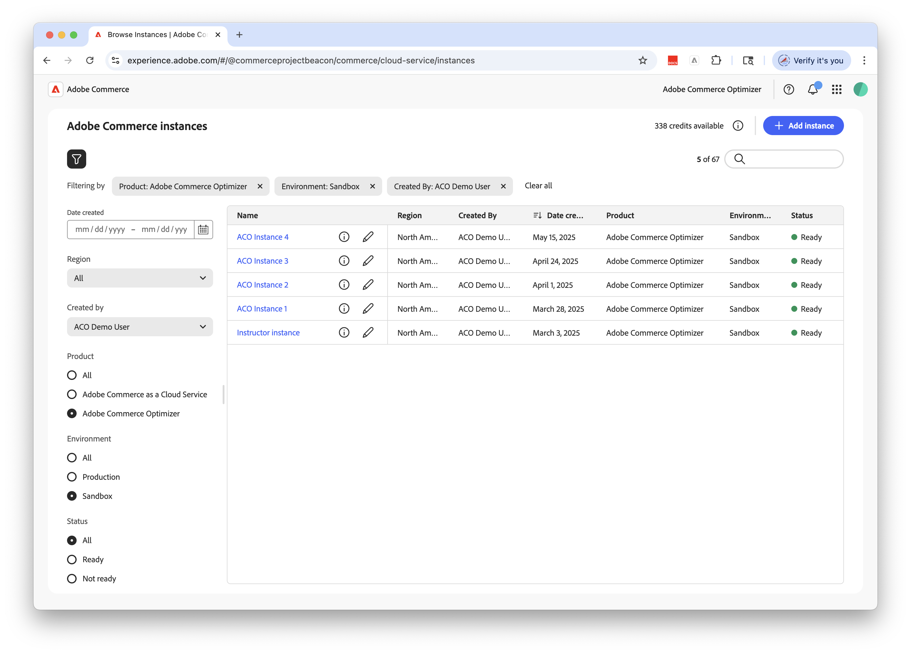

# Introduzione

Questa guida illustra come configurare [!DNL Adobe Commerce Optimizer] dall&#39;inizio alla fine. Questa guida descrive tutti i ruoli. Per informazioni dettagliate sui contenuti specifici per gli sviluppatori, consultare la [documentazione per gli sviluppatori](https://developer.adobe.com/commerce/services/optimizer/).

## Prerequisiti

Prima di iniziare, assicurati di avere:

- **Account Adobe Experience Cloud** con [!DNL Adobe Commerce Optimizer] adesioni
- **Accesso amministratore organizzazione** per creare istanze e gestire utenti
- **Account GitHub** per il caricamento dei dati di esempio e lo sviluppo della vetrina
- **Nozioni di base** sui concetti di e-commerce

## Guida rapida

Segui questi passaggi essenziali per eseguire l&#39;ambiente [!DNL Adobe Commerce Optimizer]:

### Passaggio 1: Creare un’istanza

1. Accedi a [Adobe Experience Cloud](https://experience.adobe.com/).
1. Passa a **Commerce** > **Commerce Cloud Manager**.
1. Fai clic su **Aggiungi istanza** > **Commerce Optimizer**.

   {width="60%" zoomable="yes"}

1. Configurare le impostazioni delle istanze:
   - **Nome istanza**: nome descrittivo (ad esempio, &quot;My Company Sandbox&quot;)
   - **Descrizione**: breve descrizione dello scopo
   - **Tipo di ambiente**: inizia con un ambiente **Sandbox** per il test
   - **Regione**: seleziona l&#39;area geografica preferita

1. Fai clic su **Aggiungi istanza**.

   Cloud Manager viene aggiornato per includere la nuova istanza. Per informazioni dettagliate sull&#39;accesso e la gestione, vedere [Gestire un&#39;istanza](#manage-instances).

>[!NOTE]
>
>Puoi creare ambienti sandbox solo nell’area Nord America. Una volta creata un’istanza, non è possibile modificarla.

### Passaggio 2: Configurare l’ambiente

Dopo aver creato l’istanza:

1. [Gestisci l&#39;istanza](#manage-instances) da Commerce Cloud Manager.
1. Configurare l&#39;accesso utente utilizzando la [Guida alla gestione utente](./user-management.md).

### Passaggio 3: Aggiungi dati di esempio (facoltativo)

Per il test e l&#39;apprendimento, seguire le istruzioni [Load Sample Data](#add-sample-data).

## Flussi di lavoro basati sul ruolo

La configurazione e la gestione di [!DNL Adobe Commerce Optimizer] si basano su tre ruoli chiave. Ciascun ruolo ha compiti e responsabilità specifiche:

{zoomable="yes"}

### Attività di amministratore

Gli amministratori gestiscono istanze, utenti e impostazioni organizzative.

| Attività | Descrizione | Collegamento |
|---|---|---|
| **Gestisci utenti** | Aggiungere utenti, sviluppatori e amministratori | [Gestione utente](./user-management.md) |
| **Crea istanze** | Configurare ambienti sandbox e di produzione | [Crea istanza](#create-an-instance) |
| **Gestisci istanze** | Controlla lo stato, aggiorna il nome e la descrizione dell’istanza e ottieni gli URL chiave per l’accesso all’applicazione e all’API | [Gestisci istanze](#manage-instances) |
| **Configura accesso** | Impostare le visualizzazioni e i criteri del catalogo | [Visualizzazioni catalogo](./setup/catalog-view.md) |

### Attività degli sviluppatori

Gli sviluppatori gestiscono l’implementazione tecnica e l’integrazione dei dati, incluse le attività dell’architettura della piattaforma.

| Attività | Descrizione | Collegamento |
|---|---|---|
| **Accedi a Developer Console** | Creare progetti e generare credenziali | [Developer Console](https://developer.adobe.com/developer-console/docs/guides/getting-started) |
| **Acquisisci dati catalogo** | Importa dati prodotto da sistemi esistenti | [API di acquisizione dati](https://developer.adobe.com/commerce/services/optimizer/data-ingestion/) |
| **Configura la vetrina** | Configurare Edge Delivery Services storefront | [Installazione di Storefront](./storefront.md) |

### Attività merchandiser

I commercianti ottimizzano e personalizzano l’esperienza di acquisto tramite l’individuazione dei prodotti e i consigli. Inoltre, utilizzano i dati e le analisi dei clienti per prendere decisioni strategiche sul posizionamento dei prodotti, sui prezzi e sulle promozioni in vetrina.

| Attività | Descrizione | Collegamento |
|---|---|---|
| **Individuazione prodotto** | Configurare la ricerca e il filtro | [Panoramica sul merchandising](./merchandising/overview.md) |
| **Consigli** | Configurare i consigli di prodotto basati sull’intelligenza artificiale | [Consigli di prodotto](./merchandising/recommendations/overview.md) |
| **Tracciamento delle prestazioni** | Monitorare le metriche di successo | [Metriche di successo](./manage-results/success-metrics.md) |

## Gestire le istanze

Gestisci le istanze da Commerce Cloud Manager.

>[!NOTE]
>
>Non tutti gli utenti di Adobe Commerce Optimizer hanno accesso a Cloud Manager. L’accesso dipende dal ruolo e dalle autorizzazioni assegnati all’account utente.

1. Accedi a [Adobe Experience Cloud](https://experience.adobe.com/).

1. Apri Commerce Cloud Manager:

   - In **Accesso rapido**, fare clic su **Commerce**.
   - Visualizza le istanze disponibili.

### Cerca e filtra istanze

Dopo aver effettuato l’accesso, il dashboard mostra tutte le istanze di prodotto Commerce disponibili nell’organizzazione.
La colonna Prodotto indica per quale applicazione Commerce è stato eseguito il provisioning dell’istanza.

{zoomable="yes"}

Utilizza gli strumenti Filtro e Ricerca per trovare rapidamente istanze specifiche in base alla data di creazione, all’area geografica, al creatore, al tipo di prodotto, all’ambiente o allo stato.

### Accedere all&#39;applicazione [!DNL Adobe Commerce Optimizer]

Una volta aperta l’app, passa facilmente da un ambiente all’altro, come sandbox e produzione, per visualizzare dati e impostazioni per ciascuno di essi senza tornare a Commerce Cloud Manager.

1. In Commerce Cloud Manager fare clic sul nome dell&#39;istanza per aprire l&#39;applicazione [!DNL Adobe Commerce Optimizer].

1. Passa da [!DNL Adobe Commerce Optimizer] istanze all&#39;altra senza uscire dall&#39;applicazione.

   Nell’elenco a discesa delle istanze sono elencate tutte le istanze di Optimizer disponibili nell’organizzazione. Seleziona l’istanza da visualizzare.

   {zoomable="yes"}

### Ottieni dettagli istanza

Per visualizzare i dettagli dell’istanza, fai clic sull’icona delle informazioni accanto al nome dell’istanza.

{width="60%" zoomable="yes"}

Tieni presente le seguenti informazioni chiave:

- **Endpoint GraphQL** per recuperare i dati del catalogo Commerce tramite l&#39;API Merchandising
- **Endpoint Catalog Service** per l&#39;acquisizione dei dati tramite API REST
- **URL Commerce Optimizer** per accedere all&#39;applicazione [!DNL Adobe Commerce Optimizer]
- **ID istanza**: ID tenant univoco che identifica l&#39;istanza

Se si è uno sviluppatore, è necessario disporre di questi dettagli per configurare l&#39;ambiente di sviluppo e connettersi alle API [!DNL Adobe Commerce Optimizer].

>[!NOTE]
>
>Per accedere ai dettagli dell’istanza, devi disporre delle autorizzazioni necessarie nell’organizzazione Adobe IMS. Se non trovi i dettagli dell’istanza o non riesci ad accedere all’applicazione, contatta l’amministratore dell’organizzazione.

### Modifica nome e descrizione istanza

Se necessario, aggiorna il nome e la descrizione dell’istanza.

1. Fai clic sull&#39;icona **Modifica** accanto al nome di un&#39;istanza.
1. Aggiornare **Nome istanza** e **Descrizione** in base alle esigenze.
1. Fai clic su **Salva**.

## Aggiungi dati di esempio

Adobe fornisce un archivio GitHub con dati e strumenti di esempio per aiutarti ad apprendere e testare le funzionalità di [!DNL Adobe Commerce Optimizer].
I dati di esempio si basano sullo [scenario aziendale Carvelo](./use-case/admin-use-case.md) e includono:

- Catalogo dei prodotti con parti per autoveicoli
- Più listini prezzi e scenari di determinazione prezzi
- Visualizzazioni del catalogo e criteri per diversi dealer
- Esempi completi di flusso di lavoro end-to-end

**Caricare i dati di esempio:**

1. Accedi all&#39;archivio GitHub [Esempio di acquisizione dati catalogo](https://github.com/adobe-commerce/aco-sample-catalog-data-ingestion).

1. Seguire le istruzioni di installazione nel file README dell&#39;archivio per completare le operazioni seguenti:

   - Configurare l’ambiente
   - Completa il processo di acquisizione dei dati
   - Creare viste e criteri del catalogo utilizzando i dati di esempio
   - Verifica l&#39;acquisizione dei dati controllando i dati di Catalog Service nella pagina [Sincronizzazione dati](./setup/data-sync.md)

## Passaggi successivi

Dopo aver completato la configurazione:

1. Configura la vetrina:
   - Configura [Edge Delivery Services storefront](./storefront.md)
   - Connetti ai dati del catalogo

1. Esplora il caso di utilizzo di Carvelo:
   - Segui il [flusso di lavoro end-to-end](./use-case/admin-use-case.md)
   - Esercitazione con scenari reali

1. Configurare merchandising:
   - Configura [individuazione prodotto](./merchandising/overview.md)
   - Crea [consigli](./merchandising/recommendations/overview.md)

1. Monitorare le prestazioni:
   - Traccia [metriche di successo](./manage-results/success-metrics.md)
   - Analizza [prestazioni di ricerca](./manage-results/search-performance.md)

## Risoluzione dei problemi

### Problemi comuni

| Problema | Soluzione |
|---|---|
| **Impossibile creare un&#39;istanza** | Verifica di disporre di [!DNL Adobe Commerce Optimizer] diritti e autorizzazioni di amministratore. |
| **Istanza non visualizzata** | Controlla la tua organizzazione Adobe IMS e aggiorna la pagina. |
| **Impossibile accedere all&#39;istanza** | Assicurati di essere aggiunto come utente in Admin Console. |
| **Impossibile caricare i dati di esempio** | Verifica le credenziali dell’istanza e gli endpoint API. |

### Ottieni aiuto

- **Risorse per sviluppatori**: [Documentazione per sviluppatori](https://developer.adobe.com/commerce/services/optimizer/)
- **Risorse storefront**: [Documentazione storefront Commerce](https://experienceleague.adobe.com/developer/commerce/storefront/)
- **Esercitazioni**: [Esercitazioni Commerce Optimizer](https://experienceleague.adobe.com/en/docs/commerce-learn/tutorials/adobe-commerce-optimizer/overview)
- **Supporto**: [Risorse di supporto Adobe Commerce](https://experienceleague.adobe.com/en/docs/commerce-knowledge-base/kb/overview)
