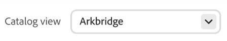

# Prestazioni consigli

Nella pagina Prestazioni dei consigli viene visualizzato un elenco di consigli configurati e le relative metriche chiave, utili per valutarne l’efficacia. Puoi configurare la visualizzazione in modo da visualizzare le metriche relative all’ultimo giorno, settimana o mese. Queste informazioni mostrano la frequenza con cui ogni unità di consigli viene visualizzata o cliccata, consentendoti di valutare le prestazioni e identificare le opportunità di ottimizzazione.

>[!INFO]
>
>Un&#39;unità di consigli è un widget che contiene il prodotto consigliato _elementi_.

{zoomable="yes"}

## Scegli la **visualizzazione catalogo**

Seleziona la [vista catalogo](../setup/catalog-view.md) in cui applicare i consigli.

## Visualizzare un rapporto

Fare clic su **[!UICONTROL Date Range]** e selezionare uno dei seguenti intervalli:

La tabella dei consigli viene aggiornata per visualizzare le metriche per tale intervallo di date.

## Personalizza tabella

1. Nell&#39;angolo superiore sinistro fare clic sull&#39;icona  per personalizzare la tabella.

   Le colonne visibili presentano un segno di spunta.

1. Nel menu, effettuate una delle seguenti operazioni:

   - Per visualizzare una colonna nascosta, fare clic sul nome di una colonna senza segno di spunta.
   - Per nascondere una colonna visibile, fare clic su un nome di colonna con un segno di spunta.

   La tabella viene aggiornata per includere solo le colonne selezionate.

## Impostare i filtri

Fai clic sull’icona del filtro per filtrare le metriche nell’area di lavoro delle prestazioni dei consigli.

Puoi configurare più valori per ciascuno dei filtri. Per le descrizioni di ciascun filtro, consulta la [tabella seguente](#column-descriptions).

## Visualizza dettagli

1. Nella tabella, fai clic sull&#39;icona () accanto al consiglio che desideri esaminare.

1. Per cambiare lo stato del consiglio, fare clic su **Attiva** o **Disattiva**.

## Creare o gestire i consigli

Scopri come [creare un nuovo consiglio o gestirne uno esistente](../merchandising/recommendations/create.md).

## Controlli Workspace

| Controllo | Descrizione |
|---|---|
|  | Determina l’intervallo di tempo utilizzato per i calcoli delle metriche. |
|  | Determina le colonne visualizzate nella tabella Consigli. |
| Crea consiglio | Apre la pagina [Crea nuovo consiglio](../merchandising/recommendations/create.md). |

## Descrizioni colonne

| Colonna | Descrizione |
|---|---|
| Nome | Nome del consiglio. |
| Pagina | Pagina in cui viene visualizzato il consiglio. |
| Tipo | Il tipo di consiglio. |
| Stato | Lo stato del consiglio. Opzioni: Inattivo/Attivo/Bozza |
| Creato | Data di creazione del consiglio. |
| Ultima modifica | Data dell’ultima modifica apportata al consiglio. |
| Impression | Il numero di volte in cui un’unità di consigli viene caricata e sottoposta a rendering su una pagina. Nella pagina viene eseguito il rendering di un’unità di consigli che si trova sotto la piega della finestra della vista del browser, anche se non viene visualizzata dall’acquirente. In questo caso, l’unità sottoposta a rendering viene conteggiata come un’impression, ma una visualizzazione viene conteggiata solo se il cliente fa scorrere l’unità verso la visualizzazione. |
| vImpression | (Impression visualizzabili) Il numero di unità di consigli che registrano almeno una visualizzazione. Ad esempio, se l’unità di consigli ha due righe, ciascuna con due prodotti, e gli ultimi due prodotti non sono visibili dal cliente, ma i primi due lo sono, l’attività verrà comunque conteggiata come un’impression. |
| Visualizzazioni | Il numero di unità di consigli visualizzate nella finestra della vista del browser del cliente. Se il cliente scorre la pagina verso l&#39;alto o verso il basso più volte, l&#39;evento si attiva più volte ogni volta che l&#39;unità è visualizzabile. |
| Clic | Somma del numero di volte in cui un acquirente fa clic su un elemento nell&#39;unità di consigli e del numero di volte in cui fa clic sul pulsante **Aggiungi al carrello** nell&#39;unità di consigli |
| Ricavi | I ricavi determinati dai consigli per l’intervallo di tempo corrente. |
| Ricavi Lt | (Ricavi ciclo di vita) I ricavi del ciclo di vita generati da un consiglio. |
| Visibilità | Percentuale di unità di consigli registrate per la visualizzazione. |
| Tasso di click-through | (Percentuale di click-through) Percentuale di unit impression per il consiglio che registra un clic. CTR conta tutte le impression anche se l&#39;unità non entra nella vista dell&#39;acquirente. Se l’unità di consigli non viene visualizzata, è improbabile che venga cliccata. Tuttavia, quelle impressioni non viste contano per il punteggio CTR e riducono la percentuale complessiva di CTR. |
| vCTR | (Percentuale di click-through visualizzabile) misura i clic solo in base alle impression visualizzabili (consigli effettivamente visualizzati nella parte visibile dello schermo del cliente), fornendo un indicatore più preciso del coinvolgimento del cliente. |
