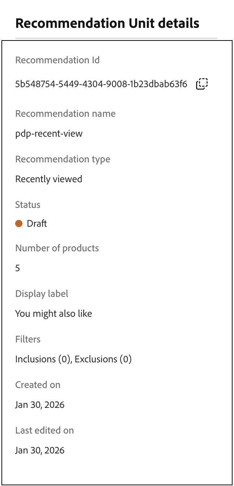

# Creare e gestire i consigli

Quando crei un consiglio, crei una _unità di consigli_, o widget, che contiene il prodotto consigliato _elementi_.

_Unità consigli_

Quando attivi l&#39;unità di consigli, Adobe Commerce inizia a [raccogliere dati](../../manage-results/recommendation-performance.md) per misurare impression, visualizzazioni, clic e così via. Nella tabella Consigli vengono visualizzate le metriche di ogni unità di consigli per consentire di prendere decisioni aziendali informate.

1. Nella barra laterale _[!DNL Adobe Commerce Optimizer]_, vai a_ Merchandising _>**Recommendations**&#x200B;per visualizzare l&#39;area di lavoro_ Recommendations _.

1. Nel campo **Vista catalogo**, seleziona la vista catalogo in cui desideri rendere disponibile il consiglio. Ulteriori informazioni sull&#39;utilizzo di [visualizzazioni catalogo per i consigli](../../manage-results/recommendation-performance.md#select-catalog-view).

   >[!IMPORTANT]
   >
   >Questa funzione è attualmente in versione beta.

1. Fai clic su **Crea consiglio**.

   Il consiglio creato sarà disponibile nella vista catalogo selezionata in precedenza.

1. Nella sezione _Denomina il consiglio_, inserisci un nome descrittivo per il riferimento interno, ad esempio `Home page most popular`.

1. Nella sezione _Seleziona tipo di consiglio_, specifica il [tipo di consiglio](types.md) desiderato in base alla strategia.

1. Nella sezione _Etichetta di visualizzazione vetrina_, immetti la [etichetta](best-practice.md#recommendation-labels) visibile agli acquirenti, ad esempio &quot;Più venduti&quot;.

1. Nella sezione _Scegli il numero di prodotti_, utilizza il cursore per specificare il numero di prodotti da visualizzare nell&#39;unità di consigli.

   Il valore predefinito è `5`, con un massimo di `20`.

1. (Facoltativo) Nella sezione _Filtri_, [applica filtri](filters.md) per controllare quali prodotti vengono visualizzati nell&#39;unità di consigli.

1. Utilizza il pannello _Anteprima prodotti consigliati_ per comprendere meglio in che modo i filtri influiscono sui prodotti visualizzati nell&#39;unità di consigli. Scopri come [visualizzare in anteprima i consigli](#preview-recommendations).

1. Al termine, fare clic su una delle seguenti opzioni:

   - **Salva come bozza** per modificare l&#39;unità di consigli in un secondo momento. Non è possibile modificare il tipo di consiglio per un&#39;unità di consigli in stato Bozza.

   - **Attiva** per abilitare l&#39;unità di consigli nella vetrina.

   Il consiglio viene visualizzato nell’area di lavoro Consigli. Per usare il consiglio nella vetrina, devi trovare il [ID consiglio](#get-recommendation-id).

>[!NOTE]
>
>Puoi creare fino a 50 unità di consigli attive. Per ulteriori informazioni, vedere [Limiti e limiti](../../boundaries-limits.md).

>[!IMPORTANT]
>
>Alcuni browser potrebbero bloccare gli script critici che impediscono a Recommendations di funzionare come previsto.

## Anteprima consigli

Il pannello _Anteprima prodotti consigliati_ è sempre disponibile con una selezione di esempi di prodotti che potrebbero comparire nell&#39;unità consigli quando viene distribuita nella vetrina.

Per testare un consiglio quando si lavora in un ambiente non di produzione, è possibile recuperare i dati dei consigli da un’origine diversa. Questo consente ai commercianti di sperimentare le regole e visualizzare in anteprima i consigli prima di distribuirli in produzione.

| Campo | Descrizione |
|---|---|
| Vista catalogo |
| Nome | Il nome del prodotto. |
| SKU | Unità di stoccaggio assegnata al prodotto |
| Prezzo | Il prezzo del prodotto. |
| Tipo di risultato | Principale: indica che sono stati raccolti dati di formazione sufficienti per visualizzare un consiglio. Backup: indica che non sono stati raccolti dati di formazione sufficienti, quindi viene utilizzato un consiglio di backup per riempire lo slot. Vai a [Dati comportamentali](../../setup/events/overview.md) per ulteriori informazioni sui modelli di apprendimento automatico e sui consigli di backup. |

Quando crei la tua unità di consigli, prova con il tipo di consiglio e i filtri per ottenere un feedback in tempo reale sui prodotti che verranno inclusi. Quando inizi a capire quali prodotti vengono visualizzati, puoi configurare l’unità di consigli in base alle tue esigenze aziendali.

[!DNL Adobe Commerce Optimizer] [filtri](filters.md) consigli per evitare la visualizzazione di prodotti duplicati quando più unità di consigli vengono distribuite in una singola pagina. Di conseguenza, i prodotti visualizzati nel pannello di anteprima potrebbero essere diversi da quelli visualizzati nella vetrina.

Per le impostazioni multi-storefront, multi-lingua o multi-brand, puoi configurare se ogni consiglio si applica a tutte le viste catalogo (globale) o a una singola [vista catalogo](../../setup/catalog-view.md). Ulteriori informazioni su come [impostare la visualizzazione del catalogo](../../manage-results/recommendation-performance.md#select-catalog-view) quando si lavora con i consigli.

## Ottieni ID consiglio

Dopo aver creato un consiglio, devi recuperarne l’ID per implementare l’unità di consigli nella vetrina.

1. Nella pagina **Consigli**, seleziona il consiglio.

1. Fai clic sull&#39;icona delle informazioni () accanto al nome del consiglio.

   Viene visualizzata la pagina **Dettagli unità consigli**.

   

1. Nella sezione **ID consiglio**, copia l&#39;ID.

1. Usa questo ID per configurare il [menu a discesa dei consigli](https://experienceleague.adobe.com/developer/commerce/storefront/merchants/blocks/product-recommendations/) nella vetrina di Edge Delivery Services.

## Gestire i consigli esistenti

Puoi modificare, disattivare o eliminare un consiglio esistente.

1. Nella barra laterale _[!DNL Adobe Commerce Optimizer]_, vai a_ Merchandising _>**Recommendations**.

1. Seleziona il consiglio da modificare.

1. Fai clic sul selettore aggiuntivo ().

1. Nel menu puoi **Disattivare**, **Eliminare** o **Modificare** il consiglio. Se selezioni **Modifica**, puoi regolare le seguenti impostazioni in base alle esigenze:

   - Nome consiglio
   - Etichetta vetrina
   - Numero di prodotti
   - Filtra prodotti

   Non puoi modificare il tipo di consiglio o la vista catalogo. La vista Catalogo viene impostata al momento della creazione del consiglio. Per ulteriori informazioni, vedere [selezionare la visualizzazione del catalogo](../../manage-results/recommendation-performance.md#select-catalog-view).

1. Al termine, fare clic su **Salva modifiche**.

## Indicatori di preparazione

Gli indicatori di preparazione mostrano quali tipi di consigli funzionano meglio in base ai dati di catalogo e comportamentali disponibili. Possono inoltre aiutarti a identificare potenziali problemi con la [raccolta eventi](../../setup/events/overview.md) o a determinare se un tipo di consiglio non riceve abbastanza traffico per generare risultati.

Gli indicatori di preparazione sono classificati in [static-based](#static-based) o [dynamic-based](#dynamic-based). Solo dati del catalogo di utilizzo basati su statici; mentre dati comportamentali di utilizzo basati su dinamiche provenienti dai tuoi acquirenti. Questi dati comportamentali vengono utilizzati per [addestrare modelli di apprendimento automatico](../../setup/events/overview.md) per creare consigli personalizzati e calcolare il loro punteggio di preparazione.

### Calcolo degli indicatori di preparazione

Gli indicatori di preparazione indicano quanto il modello è addestrato. Gli indicatori dipendono dai tipi di eventi raccolti, dall’ampiezza dei prodotti con cui si interagisce e dalle dimensioni del catalogo.

La percentuale dell’indicatore di preparazione è derivata da un calcolo che indica quanti prodotti potrebbero essere consigliati a seconda del tipo di consiglio. Le statistiche vengono applicate ai prodotti in base alle dimensioni complessive del catalogo, al volume di interazioni (come visualizzazioni, clic, aggiunte ai carrelli) e alla percentuale di SKU che registrano tali eventi entro una determinata finestra temporale. Ad esempio, durante il traffico di picco durante le festività, gli indicatori di prontezza potrebbero mostrare valori più elevati rispetto ai tempi del volume normale.

In seguito a queste variabili, la percentuale dell’indicatore di prontezza può oscillare. Questa fluttuazione spiega perché potresti vedere che i tipi di consigli sono &quot;Pronti per la distribuzione&quot;.

Gli indicatori di preparazione sono calcolati in base a due fattori:

- Dimensione sufficiente del set di risultati: nella maggior parte degli scenari sono stati restituiti risultati sufficienti per evitare di utilizzare [consigli di backup](../../setup/events/overview.md#backuprecs)?
- Sufficiente varietà di set di risultati: i prodotti restituiti rappresentano una varietà di prodotti del catalogo? L’obiettivo con questo fattore è evitare di avere una minoranza di prodotti come unici articoli consigliati in tutto il sito.

In base ai fattori di cui sopra, un valore di fattibilità viene calcolato e visualizzato come segue:

- Il 75% o più significa che le raccomandazioni suggerite per quel tipo di raccomandazione sono altamente pertinenti.
- Almeno il 50% significa che le raccomandazioni suggerite per quel tipo di raccomandazione sono meno pertinenti.
- Meno del 50% significa che le raccomandazioni suggerite per quel tipo di raccomandazione potrebbero non essere pertinenti. In questo caso, vengono utilizzati [consigli di backup](../../setup/events/overview.md#backuprecs).

Ulteriori informazioni su [perché gli indicatori di preparazione potrebbero essere bassi](#what-to-do-if-the-readiness-indicator-percent-is-low).

### Basato su statico

I seguenti tipi di consigli sono basati su statico perché richiedono solo dati di catalogo. Non vengono utilizzati dati comportamentali.

- _Altri argomenti correlati_

### Basato su Dynamic

I seguenti tipi di consigli sono basati su dinamiche perché utilizzano dati comportamentali di vetrina.

Ultimi sei mesi di dati comportamentali della vetrina:

- _Ha visualizzato questo, ha visualizzato quello_
- _Ha visualizzato questo/a, ha acquistato quello/a_
- _Ha acquistato questo/a, l&#39;ha acquistato_
- _Consigliato per te_

Ultimi sette giorni di dati comportamentali della vetrina:

- _Più visualizzati_
- _Più acquistati_
- _Più aggiunti al carrello_
- _Di tendenza_
- _Visualizza per conversione acquisto_
- _Conversione da visualizzazione a carrello_

Dati comportamentali più recenti degli acquirenti (solo visualizzazioni):

- _Visualizzato di recente_

### Visualizzare lo stato

Per aiutarti a visualizzare l&#39;avanzamento della formazione di ciascun tipo di consiglio, la sezione _Seleziona tipo di consiglio_ mostra una misura di preparazione per ciascun tipo.

_Tipo di consiglio_

>[!NOTE]
>
>Gli indicatori non possono mai raggiungere il 100%.

L’indicatore di preparazione per i tipi di consigli che dipendono dai dati del catalogo non cambia molto, in quanto il catalogo del commerciante cambia raramente. Tuttavia, l’indicatore di preparazione per i tipi di consigli basati sui dati comportamentali degli acquirenti può cambiare spesso a seconda dell’attività giornaliera degli acquirenti.

#### Cosa fare se l’indicatore di prontezza è basso

Una percentuale di preparazione bassa indica che non vi sono molti prodotti del catalogo che possono essere inclusi nei consigli per questo tipo di consigli. Ciò significa che esiste un&#39;elevata probabilità che vengano restituiti [consigli di backup](../../setup/events/overview.md#backuprecs) se si distribuisce comunque questo tipo di consigli.

>[!IMPORTANT]
>
>_I tipi di prodotto_, _raggruppati_ e personalizzati non sono supportati. Se il catalogo contiene un numero elevato di questi tipi di prodotti, il livello di preparazione sarà basso. Inoltre, qualsiasi SKU con spazi può ridurre la rilevanza dei consigli e deve essere evitata.

Di seguito sono elencati i possibili motivi e soluzioni ai punteggi di bassa prontezza comuni:

- **Basato su statico** - Le percentuali basse per questi indicatori possono essere causate da dati di catalogo mancanti per i prodotti visualizzabili. Se sono inferiori al previsto, il problema può essere risolto con una sincronizzazione completa.
- **Basato su dinamica** - Le percentuali basse per gli indicatori basati su dinamica possono essere causate da:

   - Campi mancanti nei [eventi storefront](../../setup/events/overview.md) richiesti per i rispettivi tipi di consigli (requestId, contesto di prodotto e così via).
   - Traffico ridotto verso l’archivio, pertanto il volume di eventi comportamentali ricevuti è basso.
   - La varietà di eventi comportamentali all&#39;interno dello store tra i diversi prodotti è bassa. Ad esempio, se solo il 10% dei prodotti viene visualizzato o acquistato la maggior parte del tempo, i rispettivi indicatori di disponibilità sono bassi.
