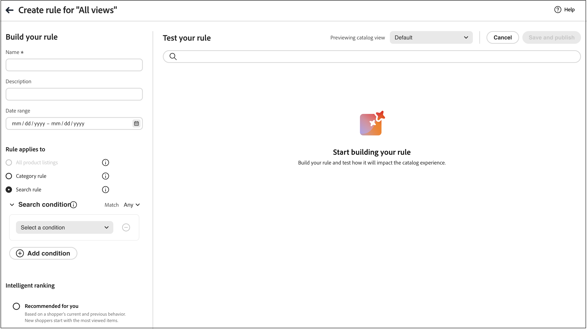
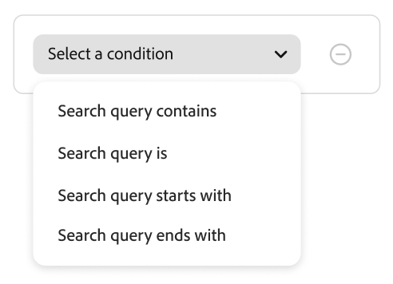
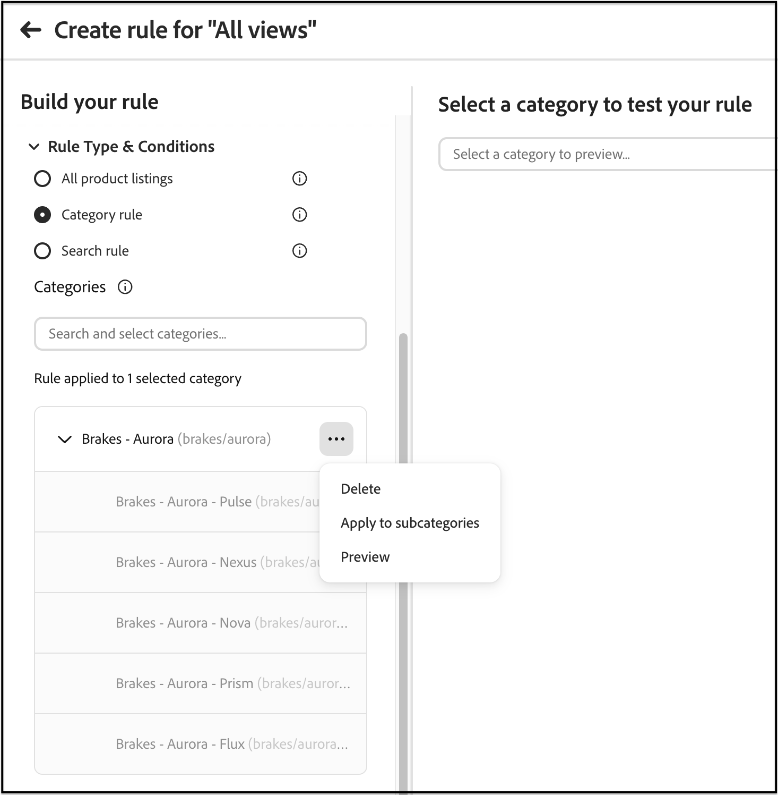

# Creare e gestire le regole

Per generare e pubblicare una regola:

1. In Optimizer Studio, apri l’editor di regole, scegli un **tipo di regola** (condizioni di ricerca, elenco predefinito, pagine di categorie o attributi di prodotto), quindi definisci le condizioni e la classificazione in cui vengono applicate.
1. Verifica i risultati.
1. Pubblica la regola.

## Creare una regola {#create-a-rule}

1. Nella barra a sinistra, passa a _Merchandising_ > **Regole di merchandising**.
1. (Facoltativo) Utilizza il menu a discesa **Vista catalogo** per selezionare la vista catalogo in cui applicare la regola. La regola creata ha l&#39;ambito della vista selezionata (o di tutte le viste catalogo se è selezionato **Tutte le viste**). Per informazioni sul funzionamento dell&#39;ambito della visualizzazione catalogo, vedere [Selezionare la visualizzazione catalogo](workspace.md#select-catalog-view).

1. Fare clic su **[!UICONTROL Create rule]** per avviare l&#39;editor di regole.

### Tipi di regole

Ogni tipo di regola dispone di un’icona di informazioni nell’editor con una breve spiegazione. Utilizza il tipo di corrispondenza in cui gli acquirenti devono visualizzare la logica di merchandising:

| Tipo di regola | Finalità |
| --- | --- |
| **Tutti gli elenchi prodotti** | Classificazione e merchandising predefiniti tra gli elenchi di prodotti quando non si applica alcuna regola di ricerca o categoria più specifica. Puoi creare una sola regola di questo tipo, non può contenere condizioni. |
| **Regola categoria** | Applica il merchandising e la classificazione a una o più categorie selezionate, controllando l’ordine dei prodotti nelle pagine delle categorie. |
| **Regola di ricerca** | Applica il merchandising e la classificazione quando gli acquirenti eseguono una ricerca che corrisponde alle condizioni di query della regola. |

Nella sezione **Genera la regola**, puoi definire il nome della regola, la pianificazione, se la regola si applica a tutte le inserzioni o a condizioni di ricerca specifiche, e i tipi di classificazione.

1. Nel campo **[!UICONTROL Name]** immettere un nome per la regola. Tutti i nomi delle regole devono essere univoci.
1. Nel campo **[!UICONTROL Description]** immettere una descrizione per la regola.
1. Nel campo **[!UICONTROL Date range]** specificare la data o l&#39;intervallo di date in cui si desidera attivare la regola.
1. Nella sezione **[!UICONTROL Rule applies to]** selezionare il [tipo di regola](#rule-types) che si desidera utilizzare.

>[!BEGINTABS]

>[!TAB Regola di ricerca]

Una regola di ricerca applica la logica di merchandising e classificazione quando gli acquirenti eseguono una ricerca che corrisponde alle condizioni definite.

Le condizioni sono i requisiti per attivare un evento. Una regola può avere fino a dieci condizioni e 25 eventi. Una regola predefinita non può avere condizioni.

**Condizione singola**

1. In *Genera la regola*, seleziona la **Condizione** da soddisfare e segui le istruzioni per completare l&#39;istruzione.

   - Query di ricerca contiene: immettere la stringa di testo che deve essere inclusa nella query dell&#39;acquirente. L&#39;impostazione Corrispondenza determina il grado di corrispondenza tra la query dell&#39;acquirente e il catalogo. Opzioni:  Qualsiasi - Qualsiasi parte del testo della query dell&#39;acquirente può corrispondere alla condizione. Tutti - Tutte le query dell&#39;acquirente devono corrispondere alla condizione.
   - Query di ricerca: immetti una stringa di testo che corrisponda esattamente alla query dell’acquirente. Ad esempio: &quot;pantaloni da yoga&quot;. Le regole con `Search query is` e la corrispondenza `All` possono avere una sola condizione.
   - La query di ricerca inizia con - Inserisci un carattere o una stringa di testo che deve trovarsi all’inizio della query dell’acquirente.
   - La query di ricerca termina con - Immetti un carattere o una stringa di testo che deve trovarsi alla fine della query dell’acquirente.

   I risultati vengono visualizzati immediatamente nel riquadro *Verifica regola* e sono numerati per priorità. Puoi utilizzare il cursore *Risultati per riga* in alto a destra per modificare il numero di prodotti in ogni riga.

1. Per verificare altre query, modifica il testo della query nella casella di ricerca *Verifica la regola* e premi **Invio**.
Inizialmente, il riquadro dei test esegue il rendering della query dalla casella di ricerca Condizioni. Ma ora sta eseguendo il rendering della query dalla casella di query del test. Nel riquadro dei test viene eseguita una sola query alla volta.
1. Se il risultato ti piace, aggiorna il testo nella casella di ricerca *Condizioni*. Quindi, fai clic in un punto qualsiasi della pagina per aggiornare i risultati nel riquadro del test.
1. Facoltativamente, impostare [Classificazione intelligente](#intelligent-ranking), [Classificazione manuale](#manual-ranking) o [Classificazione attributi](#attribute-ranking) come descritto nelle sezioni seguenti. Gli stessi controlli si applicano alle pagine delle categorie, con le eventuali differenze indicate.

**Più condizioni**

1. Per creare una regola con più condizioni, fare clic su **Aggiungi condizione**.
Una regola può avere fino a dieci condizioni. L&#39;operatore logico che unisce due condizioni si basa sull&#39;impostazione *Match* corrente. Per impostazione predefinita, *Match* è `All` e l&#39;operatore logico è `AND`.

1. Seleziona la seconda condizione e immetti il testo della query richiesto.

1. Per modificare la logica della regola, modifica l&#39;impostazione **Corrispondenza** per determinare la corrispondenza tra i criteri di ricerca dell&#39;acquirente e la condizione della query. Imposta **Corrispondenza** su uno dei seguenti elementi:

   - Qualsiasi - (impostazione predefinita) Tutti gli operatori logici nella regola sono impostati su `OR` e i risultati vengono visualizzati nel riquadro dei test.
   - Tutti: tutti gli operatori logici nella regola sono impostati su `AND` e i risultati vengono visualizzati nel riquadro dei test.

   Il valore *Match* determina l&#39;operatore logico utilizzato per unire più condizioni. La modifica dell&#39;impostazione *Match* comporta la modifica di tutti gli operatori logici nella regola. Impossibile combinare `AND` e `OR` nella stessa regola.

   In questo esempio, invece di cercare &quot;pantaloni yoga&quot;, ci sono due query separate che cercano &quot;yoga&quot; o &quot;pantaloni&quot;. Questa regola è meno specifica e viene attivata più spesso nella vetrina rispetto alle altre.

1. Per aggiungere un&#39;altra condizione, fare clic su **Aggiungi condizione** e ripetere il processo.
1. Facoltativamente, impostare [Classificazione intelligente](#intelligent-ranking), [Classificazione manuale](#manual-ranking) o [Classificazione attributi](#attribute-ranking) come descritto nelle sezioni seguenti. Gli stessi controlli si applicano alle pagine delle categorie, con le eventuali differenze indicate.

>[!TAB Regola categoria]

Le regole di categoria controllano il modo in cui i prodotti vengono ordinati nelle **pagine di categoria**. È possibile combinare **regole categoria** con **classificazione intelligente** (inclusi i segnali basati sull&#39;intelligenza artificiale) e **azioni manuali** quali pin, boost e bury, in modo da poter curare l&#39;individuazione, eseguire promozioni e allineare le pagine categoria con la strategia senza affidarsi a strumenti esterni.

**Seleziona categorie**

In **Categorie**, seleziona una o più categorie a cui applicare la regola. Le categorie selezionate vengono visualizzate sotto il controllo per consentirti di confermare l’ambito. Selezionare le categorie in uno dei modi seguenti:

- **Sfoglia la struttura delle categorie**. Espandere una categoria per caricare le categorie figlio immediate. Per passare a un livello più profondo, espandi la categoria figlio. L&#39;albero carica un livello alla volta.
- **Cerca per nome categoria** - Immettere un nome categoria nel campo **Cerca e seleziona categorie**. I risultati della ricerca includono nomi di categorie corrispondenti provenienti da tutto il catalogo, incluse categorie al di fuori del ramo attualmente espanso. La ricerca non corrisponde al testo del percorso della categoria.

Se più categorie hanno nomi simili, utilizzare il percorso della categoria visualizzato con ogni risultato (ad esempio, `brakes/aurora`) per selezionare la categoria corretta.

>[!NOTE]
>
>L’espansione di una categoria carica solo le categorie figlie per la navigazione. Non seleziona la categoria né applica la regola alle sue sottocategorie. Seleziona una categoria per aggiungerla alla regola. Per applicare la regola alle sottocategorie di una categoria, utilizzare **Applica alle sottocategorie** dal menu Azioni della categoria, come descritto di seguito.

>[!TIP]
>
>Se una categoria figlio non è visibile, espandere la categoria padre per caricare il livello successivo. Se conosci il nome della categoria, utilizza il campo di ricerca invece di navigare nella struttura. Questa funzione è utile per i cataloghi di grandi dimensioni, in quanto i livelli di categoria vengono caricati su richiesta.

1. Dall’elenco delle categorie selezionate, fai clic sui tre punti accanto a una categoria e seleziona per:

   - **Elimina** - Rimuove la categoria dalla regola.
   - **Applica a sottocategorie** - Applica la regola alle sottocategorie per le quali non è già stata definita una regola di merchandising attiva.
   - **Anteprima** - Visualizza l&#39;aspetto della pagina della categoria nella vetrina.

1. Facoltativamente, impostare [Classificazione intelligente](#intelligent-ranking), [Classificazione manuale](#manual-ranking) o [Classificazione attributi](#attribute-ranking) come descritto nelle sezioni seguenti. Gli stessi controlli si applicano alle regole di ricerca, con eventuali differenze richiamate.

   

>[!ENDTABS]

### Classificazione intelligente {#intelligent-ranking}

Classificazione intelligente ordina i prodotti utilizzando **segnali comportamentali** e, se applicabile, IA. Si applica a **regole di ricerca**, **tutti gli elenchi di prodotti** (regole predefinite) e **regole categoria** (pagine categorie). Per gli acquirenti **ricerche**, la classificazione pesa anche **rilevanza testuale** per la query; **le pagine di categoria** non utilizzano il testo della query allo stesso modo, l&#39;editor si concentra sulle strategie comportamentali.

I proprietari dei negozi possono impostare strategie come le seguenti. Le etichette esatte e le finestre temporali corrispondono all’editor di regole e possono differire leggermente per tipo di regola.

- **Più acquistati** / **Più acquistati** — Classifica per frequenza di acquisto per SKU in una finestra recente (ad esempio, i 7 giorni precedenti per i contesti di ricerca).
- **Più aggiunti al carrello** — Classifica per attività totale aggiunta al carrello in una finestra recente (ad esempio, i 7 giorni precedenti per i contesti di ricerca).
- **Più visualizzati** — classifica per visualizzazioni per SKU in una finestra recente (ad esempio, i 7 giorni precedenti per i contesti di ricerca).
- **Consigliato per te** — Utilizza il segnale `viewed-viewed`: gli acquirenti che hanno visualizzato questo SKU hanno visualizzato anche altri SKU; supporta l&#39;ordinamento personalizzato nelle pagine delle categorie, se disponibile.
- **Di tendenza** — sottolinea la popolarità recente (per la ricerca, visualizzazioni di pagina nelle ultime 72 ore per eventi in background e 24 ore per eventi in primo piano).
- **Nessuno** - Per le ricerche e le inserzioni predefinite, i prodotti sono ordinati per **Rilevanza**. Per **regole categoria**, utilizza l&#39;ordine di merchandising predefinito per la categoria quando non scegli un&#39;altra strategia intelligente.

Seleziona la strategia per la regola. Nel riquadro **[!UICONTROL Test your rule]** sono visualizzati i risultati previsti per le regole orientate alla ricerca; **regole di categoria** utilizzano l&#39;anteprima delle categorie.

#### Segnali comportamentali per prodotti e varianti configurabili {#behavioral-signals-variants}

La classificazione intelligente raccoglie segnali comportamentali, come visualizzazioni, eventi aggiuntivi al carrello e acquisti, in base al prodotto specifico con cui un acquirente interagisce. Per un prodotto configurabile, ciò significa che i segnali vengono registrati a livello di **variante** (prodotto semplice), non rispetto all&#39;elemento padre configurabile.

Quando si classifica un prodotto configurabile, la classificazione intelligente aggrega i segnali comportamentali raccolti da tutte le sue varianti e li aggrega fino al padre configurabile. Il punteggio di classificazione di un prodotto configurabile riflette i segnali combinati di ogni variante, non solo di una.

Questa aggregazione si verifica nell’ambito della categoria visualizzata. Una variante fornisce i propri segnali comportamentali solo al punteggio di classificazione dell&#39;elemento padre configurabile per le categorie a cui è assegnata quella **variante**. Se manca una variante da una categoria, i segnali non vengono conteggiati per la classificazione del padre in quella categoria, anche quando il padre configurabile stesso è assegnato lì.

**Best practice:** rivedi le assegnazioni di categoria per tutte le varianti di prodotto, in particolare nei cataloghi che utilizzano strutture di categoria specifiche per dimensione, colore o altre varianti, per confermare che ogni variante è assegnata a ogni categoria in cui si prevede che appaia e influisce sulla classificazione.

**Esempio:**

Un merchandiser organizza un catalogo in sottocategorie specifiche per le dimensioni, ad esempio **200g** e **500g**. Un prodotto configurabile ha due varianti, una per ogni dimensione. Se solo la variante 200g viene assegnata alla categoria 200g, gli acquisti e le visualizzazioni della variante 500g non contribuiscono al punteggio di classificazione del prodotto configurabile in quella pagina. Questo è vero anche se la variante 500g vende bene altrove. Il prodotto configurabile può quindi essere classificato inferiore al previsto, o non al passo con le prestazioni di vendita effettive, sulla pagina categoria 200g. L’assegnazione di entrambe le varianti alle rispettive categorie risolve la mancata corrispondenza.

#### Miglioramento intelligente della classificazione {#intelligent-ranking-boost}

Per **Consigliato per te**, **Più visualizzato**, **Più acquistato**, **Più aggiunto al carrello** e **Di tendenza**, l&#39;editor mostra **[!UICONTROL Intelligent Ranking Boost]** (il fattore di incremento). Non viene utilizzato quando si seleziona **Nessuno**.

Usare questo controllo per bilanciare l&#39;influenza dei **segnali comportamentali** sull&#39;ordinamento rispetto a **rilevanza testuale** nella ricerca e rispetto ad altri segnali di classificazione nelle **pagine categoria** e nelle **inserzioni predefinite**. L&#39;incremento è disponibile per **regole di ricerca**, **regola Tutti i prodotti** e **regole di categoria**; ogni regola memorizza il proprio valore.

| Comportamento | Dettaglio |
| --- | --- |
| Predefinito | `5` (equivalente al precedente moltiplicatore comportamentale fisso). |
| Intervallo | Da `1` (minore influenza sul comportamento) a `100` (maggiore influenza). Il limite superiore può cambiare in una versione futura. |
| Ambito | Si applica solo alle query o alle inserzioni a cui la regola è destinata. Altre regole mantengono i propri valori di incremento. |
| Anteprima | L’anteprima della regola utilizza lo stesso incremento dei risultati live per quella regola. |
| Indicizzazione | Applicato al **momento della query**. Non è necessaria la risincronizzazione del catalogo o la reindicizzazione completa solo perché è stata modificata questa impostazione. |

**Quando aumentare o diminuire l&#39;incremento**

- **Aumenta** l&#39;incremento quando strategie come **Most viewed** (Più visualizzati) dovrebbero presentare SKU con un coinvolgimento maggiore per query ambigue o ampie, senza dover premere manualmente ogni slot.
- **Diminuisci** l&#39;incremento quando vuoi che la qualità della corrispondenza testuale guidi l&#39;elenco in modo più rigoroso e i dati comportamentali dovrebbero spostare l&#39;ordine solo leggermente.

**Quando utilizzare la classificazione manuale**

Utilizza **pin**, **boost** o **bury** quando hai bisogno di prodotti specifici in posizioni esatte o visibilità garantita indipendentemente dai segnali a livello di catalogo. **[!UICONTROL Intelligent Ranking Boost]** ottimizza un peso comportamentale **globale** per tale regola; non sostituisce il controllo a livello di SKU.

>[!NOTE]
>
> Un **[!UICONTROL Intelligent Ranking Boost]** elevato può superare un **incremento manuale** sullo stesso prodotto. Se una SKU potenziata è inferiore a quanto previsto nell&#39;anteprima della regola o nella vetrina, abbassare **[!UICONTROL Intelligent Ranking Boost]** o **pin** il prodotto in una posizione specifica. In entrambi i casi, il prodotto con classificazione manuale si sposta in alto nell’elenco.

#### Funzionamento del punteggio di classificazione intelligente (ricerca)

Per **risultati di ricerca** (e la query di test nell&#39;editor delle regole), la classificazione intelligente determina l&#39;ordine finale del prodotto combinando due fattori chiave: **rilevanza testuale** e **segnali comportamentali**. Comprendere come questi fattori interagiscono consente di impostare aspettative realistiche per i risultati della ricerca.

**Componenti punteggio:**

- **Rilevanza testuale**: il fattore dominante nel punteggio. Questo misura se il nome, la descrizione e gli attributi di un prodotto corrispondono alla query di ricerca. Il punteggio di rilevanza del testo è illimitato (non ha un limite superiore specifico) ed è influenzato da fattori come:

  - Frequenza di occorrenza delle parole corrispondenti.
  - Lunghezza (in lettere) dei nomi/delle descrizioni dei prodotti.

- **Segnali comportamentali**: aumento limitato applicato al punteggio di rilevanza del testo. Quando selezioni una strategia di classificazione intelligente come &quot;Più visualizzato&quot; o &quot;Più acquistato&quot;, i prodotti con segnali comportamentali più elevati ricevono un peso relativo maggiore. La forza di questo peso è controllata da **[!UICONTROL Intelligent Ranking Boost]** (vedi [Aumento classificazione intelligente](#intelligent-ranking-boost)); l&#39;aumento rimane limitato, ma puoi aumentare quanto sposta l&#39;ordine.

**Perché il prodotto più visualizzato potrebbe non essere visualizzato per primo:**

La rilevanza testuale domina spesso la classificazione perché il suo punteggio è illimitato, mentre l’influenza comportamentale è limitata dal modello di incremento. I prodotti con corrispondenze testuali molto forti possono comunque superare le SKU con un coinvolgimento maggiore a meno che non si sollevino **[!UICONTROL Intelligent Ranking Boost]** per quella regola. Anche con valori di incremento più elevati, un intervallo di rilevanza del testo estremo potrebbe non invertire completamente l’elenco; la qualità della corrispondenza del testo rimane un driver primario. Conferma sempre in **[!UICONTROL Test your rule]** le query che ti interessano.

**Esempio:**

Un commerciante utilizza la strategia di classificazione intelligente &quot;Most viewed&quot; (Più visualizzati) e cerca **candle**. Si aspettano che lo SKU del prodotto YAN-K-E-512 appaia all’inizio dei risultati perché ha il conteggio di visualizzazioni più alto. Tuttavia, altri prodotti sono classificati più in alto:

- **Candela Texas** (prima posizione): ha un nome di prodotto più breve e più chiaro che crea un punteggio di rilevanza del testo molto elevato. Anche se ha meno visualizzazioni di **YAN-K-E-512**, la sua corrispondenza di testo superiore supera l&#39;aumento del comportamento.

- **YAN-K-E-512** (posizione più bassa): nonostante il percentile di visualizzazione più alto nei dati comportamentali &quot;Più visualizzati&quot;, il nome complesso basato su SKU genera un punteggio di rilevanza del testo più basso. Nel **[!UICONTROL Intelligent Ranking Boost]** (`5`) predefinito, l&#39;influenza sul comportamento potrebbe non essere sufficiente per superare tale spazio vuoto di testo. Aumentando l&#39;incremento è possibile spostare **YAN-K-E-512** in alto tra i prodotti che già corrispondono alla query. Anche **YAN-K-E-512** deve corrispondere alla query: almeno un attributo ricercabile per tale SKU deve includere **candle**, altrimenti non verrà visualizzato nei risultati e l&#39;incremento non può essere applicato.

**Esempio (query ampia):**

Per una query come **wood**, diversi prodotti possono condividere una rilevanza testuale simile, mentre i conteggi delle visualizzazioni sono diversi. Con la selezione di **Most viewed** (Più visualizzati), l&#39;aumento di **[!UICONTROL Intelligent Ranking Boost]** rende più probabile che lo SKU rilevante storicamente più visualizzato superi le corrispondenze più leggere. Riducendo la spinta, i risultati si avvicinano all&#39;ordine puramente testuale.

Consulta [regole di ricerca](./best-practice.md#tips-to-optimize-search-rules) per scoprire come migliorare la reperibilità dei prodotti utilizzando le regole.

#### Avvertenze

- Gli apostrofi e le citazioni nelle interrogazioni possono portare ad alcuni problemi minori di classificazione e rilevanza in alcune lingue.
- Se i risultati della classificazione intelligente non sono correlati alle vendite effettive o alle prestazioni di visualizzazione, confermare che tutte le varianti di prodotto pertinenti sono assegnate alla categoria in fase di revisione. Le assegnazioni di categorie di varianti mancanti sono una causa comune e facilmente ignorata di un comportamento di classificazione imprevisto. Consulta [Segnali comportamentali per prodotti e varianti configurabili](#behavioral-signals-variants).
- Per garantire che la classificazione intelligente funzioni correttamente per **ricerca**, assicurati che il **Peso di ricerca** per tutti gli attributi utilizzati per la ricerca o il filtraggio (facet) sia pari o inferiore a `5`. Questa guida si applica all’indicizzazione delle ricerche e non ai flussi di merchandising di sola categoria.

Per informazioni sull&#39;impostazione dei pesi di ricerca, vedere [API metadati](https://developer.adobe.com/commerce/services/reference/rest/).

### Classificazione manuale {#manual-ranking}

**Classificazione manuale** eventi regola l&#39;ordine dei prodotti per **risultati di ricerca** (quando le condizioni della regola sono soddisfatte), per **elenchi di prodotti predefiniti** e per **elenchi di pagine categorie**. Una singola regola può avere fino a 25 eventi.

- **[!UICONTROL Boost]** - Sposta uno SKU più in alto nell&#39;elenco.
- **[!UICONTROL Bury]** - Sposta uno SKU in basso nell&#39;elenco.
- **[!UICONTROL Pin a product]** - Corregge uno SKU nella posizione selezionata nell&#39;elenco.
- **[!UICONTROL Hide a product]** — Esclude uno SKU dai risultati (orientato alla ricerca; comportamento di conferma per le regole di categoria nell&#39;editor).

Il modo più semplice per fissare un prodotto è tramite trascinamento.

1. Fai clic su un prodotto e trascinalo nel riquadro Test. Trascinalo e rilascialo nella posizione desiderata. I campi Prodotto e Posizione vengono compilati automaticamente nel riquadro Eventi.

Puoi anche fare clic sull’icona a forma di pin per fissare un prodotto alla posizione corrente. Utilizza il menu di scelta rapida con puntini di sospensione per &quot;Fissa in alto&quot; o &quot;Fissa in basso&quot;.

>[!NOTE]
>
>**Regole di ricerca** - È possibile fissare solo i prodotti visualizzati nei risultati della ricerca per le condizioni della regola e della query configurate. I prodotti devono essere indicizzati, visibili, in magazzino e soddisfare tutti i filtri delle regole per essere idonei al fissaggio. Se un prodotto non viene visualizzato nell’anteprima o nei risultati per la regola, l’operazione di fissaggio non ha alcun effetto.
>
>**Ordinamento predefinito**: le posizioni manuali vengono applicate quando l&#39;acquirente utilizza l&#39;ordinamento predefinito: **Ordina per: Più rilevante** per la ricerca o **rilevanza** / **posizione** per gli elenchi di categorie. Se l’acquirente cambia l’ordinamento, ad esempio per nome, il comportamento fissato, potenziato, nascosto o nascosto potrebbe non corrispondere più all’anteprima.

Gli eventi OR possono essere impostati manualmente:

1. In *Eventi*, scegli l&#39;**Evento** da eseguire quando vengono soddisfatte le condizioni associate.

   Scegliere ad esempio **[!UICONTROL Hide a product]**. Quindi, inserisci la frase che corrisponde alla parte o all’intero nome o SKU del prodotto che desideri nascondere.

1. Per più eventi, scegli qualsiasi altro evento che desideri attivare quando vengono soddisfatte le condizioni.

### Classificazione attributi {#attribute-ranking}

>[!AVAILABILITY]
>
>Questa funzionalità è in [beta](https://experienceleague.adobe.com/en/docs/commerce-operations/release/beta#attribute-ranking-public-beta).

**La classificazione degli attributi** applica automaticamente un&#39;azione **[!UICONTROL Boost]**, **[!UICONTROL Bury]** o **[!UICONTROL Hide]** a ogni prodotto che corrisponde a una o più condizioni degli attributi, senza che sia necessario selezionare singoli SKU. La classificazione degli attributi viene visualizzata nell&#39;editor delle regole insieme a [Classificazione intelligente](#intelligent-ranking) e [Classificazione manuale](#manual-ranking) ed è disponibile per le **Regola per tutti i prodotti**, **Regole di ricerca** e **Regole per categorie**. Puoi utilizzarlo per ridimensionare il merchandising in cataloghi di grandi dimensioni, ad esempio per promuovere ogni prodotto di un determinato marchio o per seppellire ogni prodotto in un colore discontinuo.

1. Nell&#39;editor delle regole espandere **[!UICONTROL Attribute ranking]**.
1. Fare clic su **[!UICONTROL Add attribute]** per aggiungere una condizione di attributo.
1. Dal menu a discesa nella parte superiore della condizione, selezionare l&#39;azione da applicare ai prodotti corrispondenti: **[!UICONTROL Boost]**, **[!UICONTROL Bury]** o **[!UICONTROL Hide]**.
1. In **[!UICONTROL Attribute]**, selezionare l&#39;attributo del prodotto da trovare, ad esempio **Marchio**, **Categoria**, **Paese**, **Produttore** o **Modello**. Sono disponibili solo attributi filtrabili basati su testo.
1. In **[!UICONTROL Value]**, digita un valore e premi **Invio** per aggiungerlo. Ripeti l’operazione per aggiungere altri valori. Ogni valore viene visualizzato come tag rimovibile in **[!UICONTROL Selected values]**. Un prodotto corrisponde alla condizione se presenta uno qualsiasi dei valori elencati.

   >[!NOTE]
   >
   >Il campo **[!UICONTROL Value]** accetta testo libero e fa distinzione tra maiuscole e minuscole. Dopo aver aggiunto un valore, controlla il riquadro dei test per verificare che corrisponda ai prodotti previsti.

1. Per **[!UICONTROL Boost]** e **[!UICONTROL Bury]**, trascina il cursore **[!UICONTROL Boost strength]** per impostare la forza con cui l&#39;azione sposta i prodotti corrispondenti.
1. Per aggiungere un&#39;altra condizione, fare clic su **[!UICONTROL Add attribute]** e ripetere i passaggi precedenti.

Il fissaggio non è disponibile nella classificazione degli attributi, perché assegna un prodotto a una posizione esatta, mentre una condizione di attributo può corrispondere a più prodotti contemporaneamente. Per fissare un prodotto specifico, utilizzare [Classificazione manuale](#manual-ranking) direttamente sullo SKU.

#### Interazione della classificazione degli attributi con la classificazione intelligente

Quando una regola combina una strategia di classificazione intelligente con una o più condizioni di attributo, l’azione attributo ha priorità per qualsiasi prodotto corrispondente. La classificazione intelligente continua a ordinare i prodotti rimanenti senza corrispondenza.

#### Quando le condizioni dell&#39;attributo sono in conflitto tra loro

Un singolo prodotto può corrispondere a più di una condizione di attributo, sia all’interno della stessa regola che tra regole diverse. Quando le condizioni di corrispondenza specificano azioni in conflitto per lo stesso prodotto, **[!UICONTROL Hide]** ha priorità rispetto a **[!UICONTROL Boost]** e **[!UICONTROL Bury]**.

Ad esempio, una condizione incrementa tutti i prodotti con `season = Christmas` e un&#39;altra nasconde tutti i prodotti con `brand = Nike`. Un prodotto con `season = Christmas` e `brand = Nike` è nascosto, perché **[!UICONTROL Hide]** ha la priorità rispetto a **[!UICONTROL Boost]**.

#### Limiti

Una singola regola può avere fino a 25 condizioni di attributo, lo stesso limite degli eventi di classificazione manuali.

### Finalizzazione della regola {#finalizing-the-rule}

1. Esaminare i risultati della regola nel riquadro del test.
1. Se la regola dispone di più query, esegui il test di ciascuna che potrebbe essere interessata dalla regola.
1. Al termine, fare clic su **Salva e pubblica**.

   La regola viene aggiunta all&#39;elenco nell&#39;area di lavoro *Rules*.

1. Anche se le regole attive entrano in vigore immediatamente, potrebbe essere necessario attendere fino a 15 minuti prima che i risultati della query memorizzata nella cache vengano aggiornati nella vetrina.

>[!NOTE]
>
>Le regole e i prodotti classificati manualmente vengono applicati ai risultati di **ricerca** quando viene selezionato l&#39;ordinamento predefinito &quot;Ordina per: Più rilevante&quot;. Se un acquirente modifica l’ordinamento in modo da ottenere un ordinamento simile a ordinamento per nome, le regole e le classificazioni manuali non sono più in vigore. Per le **inserzioni categoria**, il comportamento predefinito è descritto in [Classificazione manuale](#manual-ranking).

## Modificare, visualizzare ed eliminare le regole {#edit-view-and-delete-rules}

Segui queste istruzioni per aggiornare le proprietà delle regole esistenti. Non è possibile modificare la vista catalogo (ambito) di una regola dopo averla creata; l&#39;ambito viene impostato al momento della creazione della regola. Vedi [Seleziona visualizzazione catalogo](workspace.md#select-catalog-view).

### Modifica regola

1. Nell&#39;area di lavoro *Regole di merchandising*, individua la regola nella griglia da modificare e fai clic su **Altro** (...) opzioni.
1. Fai clic su **Modifica** per accedere all&#39;editor di regole.
1. Aggiorna condizioni, operatori ed eventi in base alle esigenze.
1. Se necessario, aggiorna i campi nome, data di inizio e di fine e descrizione. Tutti i nomi delle regole devono essere univoci.
1. Verifica la regola.
1. Pubblica le modifiche.
La regola viene aggiunta all&#39;elenco nell&#39;area di lavoro *Rules*. Anche se le regole attive entrano in vigore immediatamente, potrebbero essere necessari fino a 15 minuti perché i risultati delle query memorizzate nella cache vengano aggiornati nella vetrina.

### Visualizza dettagli

Questa opzione consente di visualizzare rapidamente tutti i parametri della regola, mantenendo la tabella *Rules*.

1. Nell&#39;area di lavoro *Regole di merchandising*, individua la regola nella griglia da modificare e fai clic su **Altro** (...) opzioni.
1. Fai clic su **Visualizza dettagli** per visualizzare i parametri della regola.
1. Scegliere **Modifica** o **Elimina** oppure fare clic sulla X per chiudere il pannello.

### Elimina regola

1. Nell&#39;area di lavoro *Regole*, individuare la regola nella griglia che si desidera modificare e fare clic su **Altro** (...) opzioni.
1. Fare clic su **Elimina**.

## Descrizioni dei campi {#field-descriptions}

### Condizioni (if)

| Condizione | Descrizione |
| --- | --- |
| La query di ricerca contiene | Carattere o stringa di testo inclusa nella query dell&#39;acquirente. Per soddisfare questa condizione, la query dell’acquirente deve corrispondere a un solo carattere. |
| Query di ricerca: | Carattere o stringa di testo che corrisponde esattamente alla query dell&#39;acquirente. Non è possibile comporre query complesse con più condizioni quando si utilizza questa condizione. |
| La query di ricerca inizia con | La query del cliente inizia con questo carattere o stringa di testo. |
| La ricerca termina con | La query del cliente termina con questo carattere o stringa di testo. |

### Operatori logici

| Operatore | Descrizione |
| --- | --- |
| OPPURE | Impostazione predefinita. L&#39;operatore logico `OR` confronta due condizioni e soddisfa i requisiti per attivare un evento se almeno una condizione è vera. |
| E | L&#39;operatore logico `AND` confronta due condizioni e soddisfa i requisiti per attivare un evento se entrambe le condizioni sono vere. |

### Operatori di corrispondenza

| Operatore | Descrizione |
| --- | --- |
| Qualsiasi | Modifica tutti gli operatori logici nella regola in `OR` e restituisce il set di prodotti corrispondenti. |
| Tutti | Modifica tutti gli operatori logici nella regola in `AND` e restituisce il set di prodotti corrispondenti. |

### Eventi di classificazione manuale

| Evento | Descrizione |
| --- | --- |
| [!UICONTROL Boost] | Sposta uno SKU o un intervallo di SKU più in alto nell’elenco (ricerca o categoria). Ognuno di essi è contrassegnato da un badge di anteprima &quot;potenziato&quot; nei risultati del test. |
| [!UICONTROL Bury] | Sposta uno SKU o un intervallo di SKU più in basso nell&#39;elenco. Ognuno di essi è contrassegnato da un badge di anteprima &quot;interrato&quot; nei risultati del test. |
| [!UICONTROL Pin a product] | Associa un singolo SKU a una posizione specifica nell&#39;elenco. Nei risultati del test, il prodotto è contrassegnato con un badge di anteprima &quot;fissato&quot;. |
| [!UICONTROL Hide a product] | Esclude uno SKU, o un intervallo di SKU, dai risultati (orientato alla ricerca; conferma per regole di categoria nell’editor). |

### Condizioni di classificazione degli attributi

| Campo | Descrizione |
| --- | --- |
| Azione | Azione applicata a ogni prodotto che soddisfa la condizione: **[!UICONTROL Boost]**, **[!UICONTROL Bury]** o **[!UICONTROL Hide]**. |
| [!UICONTROL Attribute] | Attributo del prodotto filtrabile basato su testo per le destinazioni della condizione, ad esempio **Marchio**, **Categoria**, **Paese**, **Produttore** o **Modello**. |
| [!UICONTROL Value] | Uno o più valori di attributo che un prodotto deve corrispondere alla condizione. Digita un valore e premi Invio per aggiungerlo come tag; un prodotto corrisponde se presenta uno qualsiasi dei valori elencati. |
| [!UICONTROL Boost strength] | Per **[!UICONTROL Boost]** e **[!UICONTROL Bury]**, un dispositivo di scorrimento che controlla con quale intensità l&#39;azione sposta i prodotti corrispondenti. Mostrato solo per **[!UICONTROL Boost]** e **[!UICONTROL Bury]**, non per **[!UICONTROL Hide]**. |

### Controlli di classificazione intelligenti

| Campo | Descrizione |
| --- | --- |
| [!UICONTROL Intelligent Ranking Boost] | Quando è selezionata una strategia intelligente diversa da **Nessuno**, questa impostazione controlla il modo in cui i segnali comportamentali influenzano la classificazione per quella regola. `5` predefinito; intervallo consentito `1`-`100`. Applicata al momento della query; l’anteprima della regola corrisponde al comportamento live per la regola configurata. |

### Dettagli

| Campo | Descrizione |
| --- | --- |
| Nome | Nome della regola. I nomi delle regole devono essere univoci. |
| Tipo di regola | **Predefinito** (tutti gli elenchi prodotti), **Query** (condizioni di ricerca specifiche) o **Categoria** (pagine categorie), a seconda di **La regola si applica a**. |
| Data di inizio | Data di inizio della regola, se pianificata. |
| Data di fine | Data di fine della regola, se pianificata. |
| Descrizione | Breve descrizione della regola. |
