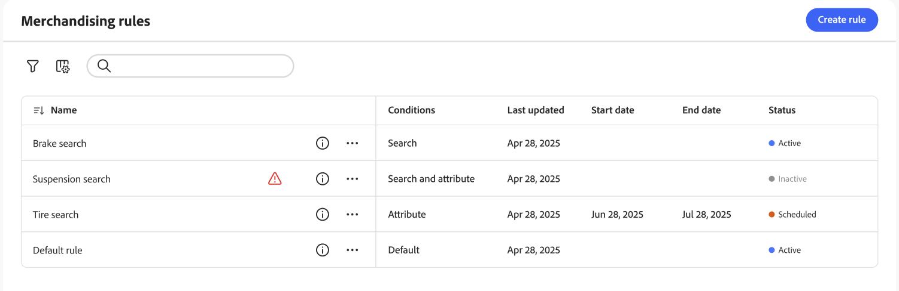

# Workspace delle regole di merchandising

Nell&#39;area di lavoro *Regole di merchandising* sono elencati la selezione corrente delle regole e il relativo stato e sono disponibili gli strumenti necessari per creare e gestire le regole. Dall’area di lavoro puoi:

- Cerca regole
- Visualizza dettagli regola
- Attiva/disattiva regole
- Elimina regole
- Accedere all’editor di regole

## Mostra/nascondi colonne

1. Nell&#39;angolo superiore destro fare clic su **Mostra/nascondi**  colonne.

1. Nel menu, effettuate una delle seguenti operazioni:

   - Per visualizzare una colonna nascosta, fare clic sul nome di una colonna senza segno di spunta.
   - Per nascondere una colonna visibile, fare clic su un nome di colonna con un segno di spunta.

## Filtra regole per stato

1. Se il tuo archivio ha molte regole, puoi filtrarle per stato per ridurre l’elenco. Per impostazione predefinita, nell&#39;elenco Regole vengono visualizzate tutte le regole.

1. Per elencare solo le regole con un&#39;impostazione di stato specifica, impostare **Stato** su una delle seguenti opzioni:

   - Tutti
   - Attivo
   - Inattivo
   - Pianificato
   - Bozza

   Puoi anche filtrare per **Condizioni**, **Data inizio**, **Data fine** e **Ultimo aggiornamento**.

## Visualizza dettagli

Il pannello dei dettagli mostra il nome della regola, lo stato, le condizioni e gli eventi, la data di inizio e di fine, la descrizione e la data dell’ultima modifica. Le regole possono essere abilitate, modificate ed eliminate dal pannello dei dettagli.

1. Nell&#39;area di lavoro *Regole di merchandising*, individua la regola nella griglia che desideri visualizzare e fai clic sull&#39;icona ().

   Puoi effettuare una delle seguenti operazioni dal menu:

   - Modifica regola
   - Elimina regola
   - Attiva/Disattiva regola

## Descrizioni delle colonne

| Colonna | Descrizione |
|--- |--- |
| Nome | Nome della regola. |
| Ultimo aggiornamento | Data dell’ultimo aggiornamento della regola. |
| Data di inizio | Data di inizio di una regola pianificata. |
| Data di fine | Data di fine di una regola pianificata. |
| Stato | Lo stato con codice colore indica lo stato corrente della regola. Utilizzare il controllo Stato sopra la griglia per filtrare le regole per stato. Valori: Tutti gli stati - Visualizza tutte le regole indipendentemente dallo stato. Attivo (blu): visualizza solo le regole attive. Pianificato (arancione): visualizza solo le regole pianificate. Inattivo (grigio): visualizza solo le regole inattive. |

## Controlli

| Controllo | Descrizione |
|--- |--- |
| Aggiungi regola | Apre l&#39;[editor regole](add.md). |
| Stato | Filtra l’elenco delle regole in base allo stato. Opzioni: Tutti, Attivo, Inattivo, Pianificato |
|  | Specifica le colonne visibili nella griglia. Opzioni: Ultimo aggiornamento, Data inizio, Data fine, Stato |
| Ricerca | Cerca una regola per nome completo o per corrispondenza parziale. |
|  | Visualizza un menu di altre azioni che possono essere applicate alla regola selezionata. Opzioni: Modifica, Visualizza dettagli, Elimina |

## Dettagli regola

| Campo | Descrizione |
|--- |--- |
| Stato | Stato corrente della regola. |
| Condizioni | Query di ricerca che descrive le condizioni associate alla regola. |
| Data di inizio | Data in cui la regola entra in vigore, se pianificata. |
| Data di fine | Data di scadenza della regola, se pianificata. |
| Descrizione | Breve descrizione della regola. |
| Ultimo aggiornamento | Data e ora dell’ultimo aggiornamento della regola. |
| Abilitato | Controllo che modifica lo stato della regola. Opzioni: Abilitato / Disabilitato |
