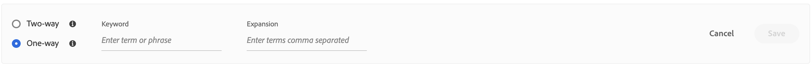

# Crea sinonimi

Aumenta il coinvolgimento dei clienti aggiungendo il tuo elenco curato di [!DNL Adobe Commerce Optimizer] sinonimi. È possibile aggiungere fino a 200 sinonimi per negozio.

## Passaggio 1: aggiungere un sinonimo

1. Dalla barra a sinistra, vai a _Merchandising_ > **Sinonimi**.
1. Fare clic sul pulsante **[!UICONTROL Add synonyms]**.

## Passaggio 2: definire il sinonimo per tipo

Segui le istruzioni per il [tipo di sinonimo](type.md) che desideri creare.

### Sinonimo bidirezionale

1. Accettare l&#39;opzione **bidirezionale** predefinita.

   

1. Immettere il termine o la frase **Parola chiave** da trovare.
1. Immettere i **Espansione** termini che si desidera aggiungere come sinonimi per la parola chiave. Separa più termini con una virgola.
In questo esempio, la parola chiave da associare è &quot;pantaloni&quot; e l&#39;insieme dei termini di espansione sono &quot;pantaloni, slacks&quot;.

   

1. Al termine, fare clic su **Salva**.

   Il set di sinonimi viene visualizzato nell&#39;elenco con una freccia bidirezionale tra ciascun termine, il che significa che i termini sono intercambiabili.

   

### Sinonimo unidirezionale

1. Fare clic sul tipo di sinonimo **unidirezionale**.

   

1. Immetti i termini **Parola chiave** e **Espansione**. Separa più termini con una virgola.

   

   In questo esempio, la parola chiave è &quot;pantaloni&quot; e i termini di espansione unidirezionale &quot;capris, peddle-pushers&quot; sono ciascuno un sottoinsieme di &quot;pantaloni&quot;, ma con un significato specifico.

1. Al termine, fare clic su **Salva**.

   Il set di sinonimi viene visualizzato nell&#39;elenco con una freccia unidirezionale che punta dai termini di espansione alla parola chiave per indicare che i termini sono sottoinsiemi della parola chiave. Un segno più separa ogni termine di espansione.

   

## Passaggio 3: Pubblicare le modifiche

1. Al termine dei sinonimi, fare clic su **Pubblica**.
1. Attendi fino a due ore prima che gli aggiornamenti diventino disponibili nella vetrina.

## Descrizioni campi

| Campo | Descrizione |
|--- |--- |
| [Tipo](type.md) | Determina se i sinonimi hanno lo stesso significato della parola chiave o sono un sottoinsieme della parola chiave. Opzioni: Bidirezionale (impostazione predefinita) - Termini che hanno lo stesso significato della parola chiave e restituiscono gli stessi risultati di ricerca Unidirezionale - Termini che sono un sottoinsieme della parola chiave. I sinonimi unidirezionali restituiscono un elenco più ristretto di prodotti specifici. |
| Parola chiave | Parola comunemente associata a una selezione di prodotti nel catalogo. |
| Espansione | Termini aggiuntivi che hanno lo stesso significato o un significato simile della parola chiave. |

## Gestisci sinonimi

Segui queste istruzioni per gestire [!DNL Adobe Commerce Optimizer] [sinonimi](overview.md) esistenti.

## Trova sinonimo

Per facilitare la ricerca di un sinonimo, è possibile filtrare l&#39;elenco per tipo e cercare per parola chiave o termine di espansione. Questi metodi possono essere utilizzati singolarmente o insieme.

1. Per filtrare l&#39;elenco, impostare **Type** su uno dei seguenti:

   - Tutti
   - Unidirezionale
   - Bidirezionale

1. Per cercare una parola chiave o un termine di espansione, immettere almeno tre caratteri nella casella **[!UICONTROL Search]**.

## Modifica sinonimo

1. Trovare il sinonimo da modificare e fare clic su **Altre** (...) opzioni.

1. Fai clic su **Modifica**.
La parola chiave è il primo termine dell&#39;elenco e ogni termine è separato da una virgola. È possibile aggiornare la parola chiave e i termini di espansione, ma non è possibile modificare il tipo di sinonimo.
1. Fare clic sull&#39;elemento da modificare. Quindi, aggiorna il testo in base alle esigenze.

1. Al termine, fare clic su **Salva**.

## Elimina sinonimo

1. Trovare il sinonimo da eliminare nell&#39;elenco e fare clic su **Altre** (...) opzioni.
1. Fare clic su **Elimina**.
1. Quando richiesto, fare clic su **Elimina sinonimo** per confermare.

## Pubblica modifiche

Per completare il processo, le modifiche salvate devono essere pubblicate nella vetrina. La pubblicazione degli aggiornamenti può richiedere fino a due ore.

1. Fai clic su **Pubblica**.
1. Cerca il messaggio nella parte superiore della pagina che conferma la pubblicazione delle modifiche.
