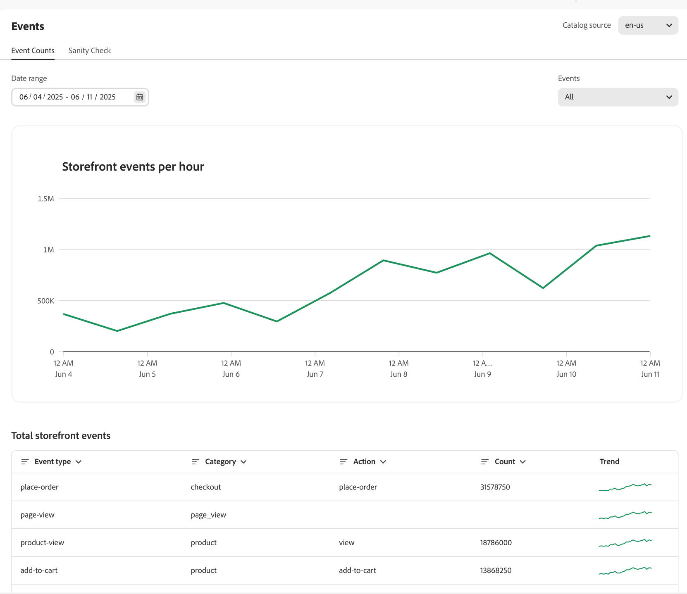

# Eventi

Gli eventi sono uno strumento fondamentale per migliorare l’esperienza di acquisto e favorire le conversioni sfruttando le informazioni sui dati in tempo reale.

[!DNL Adobe Commerce Optimizer] distribuisce automaticamente gli eventi storefront nel sito. Questi eventi acquisiscono dati dalle interazioni degli acquirenti sul tuo sito. Questi dati anonimi sono potenti per [consigli](../../manage-results/recommendation-performance.md), [individuazione prodotto](../../manage-results/search-performance.md) e [metriche di successo](../../manage-results/success-metrics.md).

>[!NOTE]
>
>La raccolta dei dati non include informazioni personali identificabili (PII, personally identifiable information). Tutti gli identificatori utente, come gli ID cookie e gli indirizzi IP, sono rigorosamente anonimi. [Ulteriori informazioni](https://www.adobe.com/privacy/experience-cloud.html).

La pagina **Eventi** consente di osservare i dati dell&#39;evento storefront raccolti. Una visualizzazione della raccolta dati dell’evento consente ai commercianti di verificare che abbiano implementato correttamente gli eventi della vetrina e che gli eventi vengano acquisiti correttamente. I commercianti possono utilizzare questa pagina per identificare potenziali problemi e adottare misure per risolvere eventuali problemi relativi agli eventi.

## Conteggio eventi

La scheda **Conteggi eventi** tiene traccia delle interazioni con gli acquirenti, ad esempio ricerche, clic e acquisti, per aiutarti ad analizzare le tendenze e migliorare l&#39;esperienza di acquisto.

{zoomable="yes"}

| Campo | Descrizione |
|---|---|
| **Intervallo date** | Specifichiamo l’intervallo di date per visualizzare un sottoinsieme di dati specifico. |
| **Eventi vetrina all&#39;ora** | Visualizza un grafico che mostra il numero di eventi attivati nella vetrina. |
| **Totale eventi storefront** | Tabella filtrabile che mostra i dettagli di tutti gli eventi attivati nella vetrina. |

## Verifica integrità

La scheda **Verifica integrità** offre informazioni approfondite sullo stato di ogni evento comportamentale, garantendo una raccolta accurata dei dati e funzionalità precise. &#x200B;

{zoomable="yes"}

| Campo | Descrizione |
|---|---|
| **Intervallo date** | Specifichiamo l’intervallo di date per visualizzare un sottoinsieme di dati specifico. |
| **Individuazione prodotto** | Visualizza gli eventi richiesti per personalizzare i risultati della ricerca dei prodotti. La colonna **Stato** indica se gli eventi sono stati ricevuti. |
| **Consigli** | Visualizza gli eventi richiesti per personalizzare i consigli di prodotto. La colonna **Stato** indica se gli eventi sono stati ricevuti. |

Nelle sezioni seguenti vengono descritti i dettagli dell&#39;evento per [individuazione prodotto](#product-discovery) e [consigli](#recommendations).

### Individuazione prodotto

L’individuazione del prodotto utilizza gli eventi per potenziare gli algoritmi di ricerca come &quot;Più visualizzato&quot; e &quot;Più visualizzato, visualizzato questo&quot;.

Questa tabella descrive gli eventi utilizzati dalle [strategie di classificazione](../../merchandising/rules/add.md#intelligent-ranking) per l&#39;individuazione dei prodotti.

| Strategia di classificazione | Eventi | Pagina |
| --- | --- | --- |
| Articoli più visualizzati | `page-view` `product-view` | Pagina dettagli prodotto |
| Più acquistati | `page-view` `place-order` | Carrello/Pagamento |
| Più aggiunti al carrello | `page-view` `add-to-cart` | Pagina dettagli prodotto Pagina elenco prodotti Carrello Elenco desideri |
| Ha visualizzato questo, ha visualizzato quello | `page-view` `product-view` | Pagina dettagli prodotto |

### Eventi dashboard richiesti

Alcuni eventi sono necessari per popolare il [dashboard delle prestazioni di ricerca](../../manage-results/search-performance.md)

| Area del dashboard | Eventi | Unisci campo |
| ------------------- | ------------- | ---------- |
| Ricerche univoche | `page-view`, `search-request-sent`, `search-response-received` | `searchRequestId` |
| Nessuna ricerca di risultati | `page-view`, `search-request-sent`, `search-response-received` | `searchRequestId` |

### Consigli

Esistono due tipi di dati utilizzati nei consigli:

- **Comportamento**: dati del coinvolgimento di un acquirente sul tuo sito, ad esempio visualizzazioni di prodotti, elementi aggiunti a un carrello e acquisti.
- **Catalogo** - Metadati del prodotto come nome, prezzo, disponibilità e così via.

Adobe Sensei aggrega i dati comportamentali e di catalogo, creando consigli per ogni tipo di consiglio. Il servizio Recommendations distribuisce quindi tali consigli nella vetrina sotto forma di un widget contenente il prodotto consigliato _elementi_.

Alcuni tipi di consigli utilizzano i dati comportamentali dei tuoi acquirenti per addestrare modelli di apprendimento automatico per creare consigli personalizzati. Altri tipi di consigli utilizzano solo i dati di catalogo e non utilizzano dati comportamentali. Se desideri iniziare rapidamente a utilizzare i consigli sul tuo sito, puoi utilizzare il tipo di consiglio `More like this`.

#### Avvio a freddo

Quando puoi iniziare a utilizzare i tipi di consigli che utilizzano dati comportamentali? Dipende. Questo problema è denominato _Avvio a freddo_.

Il problema di _Avvio a freddo_ si riferisce al tempo necessario per l&#39;addestramento e l&#39;efficacia di un modello. Per i consigli, significa attendere che Adobe Sensei raccolga dati sufficienti per addestrare i suoi modelli di apprendimento automatico prima di distribuire unità di consigli sul sito. Maggiore è il numero di dati di cui dispongono i modelli, più accurati e utili sono i consigli. Poiché la raccolta dei dati avviene su un sito live, è meglio avviare questo processo in anticipo.

La tabella seguente fornisce alcune indicazioni generali sul tempo necessario per raccogliere dati sufficienti per ogni tipo di consiglio:

| Tipo di consiglio | Tempo di formazione | Note |
|---|---|---|
| Basato sulla popolarità (`Most viewed`, `Most purchased`, `Most added to cart`) | Varia | Dipende dal volume degli eventi: le visualizzazioni sono più comuni e quindi apprende più rapidamente; quindi aggiunge al carrello, quindi acquista |
| `Viewed this, viewed that` | Richiede più formazione | Il volume delle visualizzazioni dei prodotti è decisamente elevato |
| `Viewed this, bought that`, `Bought this, bought that` | Richiede il massimo della formazione | Gli eventi di acquisto sono gli eventi più rari su un sito di e-commerce, in particolare rispetto alle visualizzazioni di prodotto |
| `Trending` | Richiede tre giorni di dati per stabilire una baseline di popolarità | Il trend è una misura dello slancio recente nella popolarità di un prodotto rispetto alla sua linea di base di popolarità. Il punteggio di tendenza di un prodotto viene calcolato utilizzando un set in primo piano (popolarità recente superiore a 24 ore) e un set in background (linea di base di popolarità superiore a 72 ore). Se la popolarità di un elemento aumenta in modo significativo entro un periodo di 24 ore rispetto alla popolarità al basale, allora riceve un punteggio di tendenza elevato. Ogni prodotto ha questo punteggio e gli elementi con il punteggio più alto in qualsiasi momento comprendono il set di prodotti con tendenze migliori. |

Altre variabili che possono influire sul tempo necessario per la formazione:

- Un volume di traffico più elevato contribuisce a un apprendimento più rapido
- Alcuni tipi di consigli si addestrano più rapidamente di altri
- [!DNL Adobe Commerce Optimizer] ricalcola i dati comportamentali ogni quattro ore. I consigli diventano più precisi quanto più a lungo vengono utilizzati sul sito.

Per aiutarti a visualizzare l&#39;avanzamento della formazione di ciascun tipo di consiglio, la pagina [crea consiglio](../../merchandising/recommendations/create.md#readiness-indicators) visualizza gli indicatori di preparazione.

Durante la raccolta dei dati sul sito live e l’apprendimento dei modelli di apprendimento automatico, puoi completare altre attività di test e configurazione necessarie per impostare i consigli. Al termine di questo lavoro, i modelli avranno a disposizione dati sufficienti per creare consigli utili e distribuirli nella vetrina.

Se il sito non riceve abbastanza traffico (visualizzazioni, acquisti, tendenze) per la maggior parte delle SKU di prodotto, potrebbero non esserci dati sufficienti per completare il processo di apprendimento. In questo modo l’indicatore di preparazione nell’area di lavoro Consigli può sembrare bloccato. Gli indicatori di preparazione hanno lo scopo di fornire agli esercenti un altro punto di dati nella scelta del tipo di consigli migliore per il negozio. I numeri sono una guida e potrebbero non raggiungere mai il 100%. [Ulteriori informazioni](../../merchandising/recommendations/create.md#readiness-indicators) sugli indicatori di preparazione.

#### Raccomandazioni per il backup

Se i dati di input non sono sufficienti per fornire tutti gli elementi di consigli richiesti in un&#39;unità, [!DNL Adobe Commerce Optimizer] fornisce consigli di backup per popolare le unità di consigli. Ad esempio, se distribuisci il tipo di consiglio `Recommended for you` nella tua home page, un acquirente sul tuo sito non ha generato abbastanza dati comportamentali per consigliare accuratamente prodotti personalizzati. In questo caso, [!DNL Adobe Commerce Optimizer] fa emergere gli elementi in base al tipo di consiglio `Most viewed` per questo acquirente.

In caso di raccolta dati di input insufficiente, i seguenti tipi di consigli eseguono il fallback al tipo di consiglio `Most viewed`:

- `Recommended for you`
- `Viewed this, viewed that`
- `Viewed this, bought that`
- `Bought this, bought that`
- `Trending`
- `Conversion (view to purchase)`
- `Conversion (view to cart)`

#### Eventi specifici per consigli

Nella tabella seguente sono elencati gli eventi che vengono attivati quando gli acquirenti interagiscono con le unità di consigli sulla vetrina. I dati dell&#39;evento raccolti consentono alle [metriche](../../manage-results/recommendation-performance.md) di analizzare le prestazioni dei consigli.

| Evento | Descrizione |
| --- | --- |
| `impression-render` | Inviato quando viene eseguito il rendering dell’unità di consigli sulla pagina. Se una pagina ha due unità di consigli (acquistate, visualizzate), vengono inviati due eventi `impression-render`. Questo evento viene utilizzato per tenere traccia della metrica delle impression. |
| `rec-add-to-cart-click` | L&#39;acquirente fa clic sul pulsante **Aggiungi al carrello** per un elemento nell&#39;unità di consigli. |
| `rec-click` | L’acquirente fa clic su un prodotto nell’unità di consigli. |
| `view` | Inviata quando l’unità di consigli diventa visualizzabile per almeno il 50%, ad esempio scorrendo la pagina verso il basso. Ad esempio, se un&#39;unità di consigli ha due righe, viene inviato un evento `view` quando una riga più un pixel della seconda diventa visibile all&#39;acquirente. Se l&#39;acquirente scorre la pagina verso l&#39;alto o verso il basso più volte, l&#39;evento `view` viene inviato tante volte quante volte vede l&#39;intera unità di consigli sulla pagina. |

#### Eventi dashboard richiesti

I seguenti eventi sono necessari per popolare il [dashboard delle prestazioni dei consigli](../../manage-results/recommendation-performance.md)

| Colonna del dashboard | Eventi | Unisci campo |
| ---------------- | --------- | ----------- |
| Impression | `page-view`, `recs-request-sent`, `recs-response-received`, `recs-unit-render` | `unitId` |
| Visualizzazioni | `page-view`, `recs-request-sent`, `recs-response-received`, `recs-unit-render`, `recs-unit-view` | `unitId` |
| Clic | `page-view`, `recs-request-sent`, `recs-response-received`, `recs-item-click`, `recs-add-to-cart-click` | `unitId` |
| Ricavi | `page-view`, `recs-request-sent`, `recs-response-received`, `recs-item-click`, `recs-add-to-cart-click`, `place-order` | `unitId`, `sku`, `parentSku` |
| Retribuzioni LT | `page-view`, `recs-request-sent`, `recs-response-received`, `recs-item-click`, `recs-add-to-cart-click`, `place-order` | `unitId`, `sku`, `parentSku` |
| Tasso di click-through | `page-view`, `recs-request-sent`, `recs-response-received`, `recs-unit-render`, `recs-item-click`, `recs-add-to-cart-click` | `unitId`, `sku`, `parentSku` |
| vCTR | `page-view`, `recs-request-sent`, `recs-response-received`, `recs-unit-render`, `recs-unit-view`, `recs-item-click`, `recs-add-to-cart-click` | `unitId`, `sku`, `parentSku` |

I seguenti eventi non sono specifici per la funzione Consigli, ma sono necessari per consentire ad Adobe Sensei di interpretare correttamente i dati degli acquirenti:

- `view`
- `add-to-cart`
- `place-order`

#### Tipo di consiglio

Questa tabella descrive gli eventi utilizzati da ogni tipo di consiglio.

| Tipo di consiglio | Eventi | Pagina |
| --- | --- | --- |
| Articoli più visualizzati | `page-view` `product-view` | Pagina dettagli prodotto |
| Più acquistati | `page-view` `place-order` | Carrello/Pagamento |
| Più aggiunti al carrello | `page-view` `add-to-cart` | Pagina dettagli prodotto Pagina elenco prodotti Carrello Elenco desideri |
| Ha visualizzato questo, ha visualizzato quello | `page-view` `product-view` | Pagina dettagli prodotto |
| Ho visto questo, ho comprato quello | `page-view` `product-view` | Pagina dettagli prodotto Carrello/Pagamento |
| Ho comprato questo e quello | `page-view` `product-view` | Pagina dettagli prodotto |
| Di tendenza | `page-view` `product-view` | Pagina dettagli prodotto |
| Conversione: Visualizza per acquisto | `page-view` `product-view` | Pagina dettagli prodotto |
| Conversione: Visualizza per acquisto | `page-view` `place-order` | Carrello/Pagamento |
| Conversione: Visualizza in carrello | `page-view` `product-view` | Pagina dettagli prodotto |
| Conversione: Visualizza in carrello | `page-view` `add-to-cart` | Pagina dettagli prodotto Pagina elenco prodotti Carrello Elenco desideri |

## Supporto

Se noti eventuali discrepanze di dati o se i consigli e i risultati della ricerca non funzionano come previsto, [invia un ticket di supporto](https://experienceleague.adobe.com/en/docs/commerce-knowledge-base/kb/help-center-guide/magento-help-center-user-guide).
