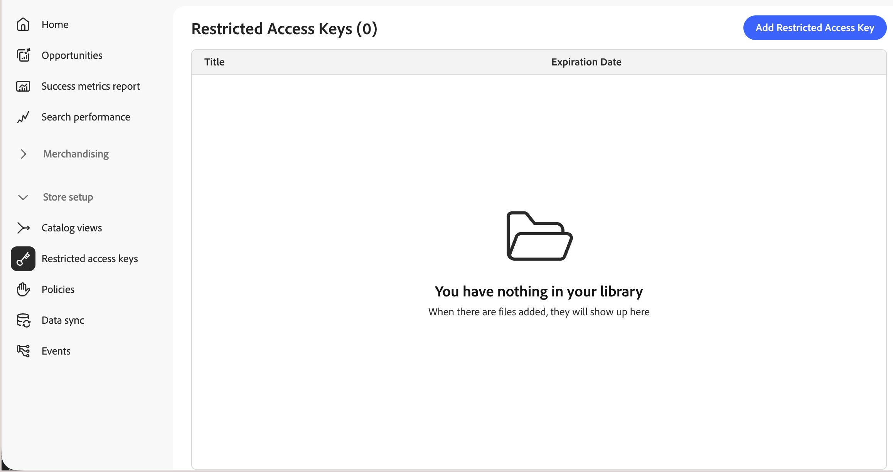

# Chiavi di accesso con restrizioni

Le chiavi di accesso con restrizioni consentono alle applicazioni client autorizzate di accedere a una [vista di catalogo privata](catalog-view.md). Solo le richieste che contengono un token firmato valido da una chiave assegnata possono recuperare i dati del catalogo. Tutte le altre richieste vengono negate, incluse quelle di acquirenti a cui non è stato dato esplicitamente l’accesso a questa vista catalogo e gli script che esaminano l’API.

Il provisioning delle chiavi di accesso con restrizioni può avvenire in uno dei due modi seguenti:

- [!BADGE Private Beta]{type=Caution tooltip="Richiede l’estensione B2B del connettore Adobe Commerce Optimizer, attualmente in versione beta privata."} **Automaticamente, per i cataloghi condivisi B2B**. Per le distribuzioni integrate con [!DNL Adobe Commerce Optimizer Connector for B2B], il connettore esegue il provisioning e assegna la chiave iniziale. Quindi gestisci le chiavi e l’assegnazione delle chiavi dall’amministratore di Commerce. Vedi [Autenticazione della vista catalogo](https://experienceleague.adobe.com/en/docs/commerce-admin/b2b/shared-catalogs/catalog-views-manage) nella *Guida dell&#39;amministratore di Commerce**.

- **Manualmente, per qualsiasi vista catalogo**. Per proteggere autonomamente una vista catalogo, ad esempio per un portale partner o per un&#39;anteprima pre-release, seguire i passaggi descritti in questo argomento a partire da [Creare una chiave di accesso con restrizioni](#create-a-restricted-access-key).

## Casi d’uso chiave di accesso limitati

In [!DNL Adobe Commerce Optimizer], **[!UICONTROL Price Book ID]** determina i prezzi visualizzati da una richiesta, ovvero i prezzi, non chi può effettuare la richiesta. Qualsiasi cliente che conosce l’ID di una vista catalogo e l’ID di un listino prezzi può recuperare tali dati tramite l’API Merchandising. Le chiavi di accesso con restrizioni aggiungono un controllo separato e complementare: definiscono gli utenti che possono accedere a una visualizzazione di catalogo, indipendentemente dal listino prezzi dedicato.

Le chiavi di accesso con restrizioni sono comunemente utilizzate per:

- **Determinazione prezzi B2B basata su contratto**: limitare una visualizzazione di catalogo collegata a un listino prezzi dedicato in modo che solo l&#39;acquirente a cui si applica possa eseguire query. Le altre organizzazioni di acquisto e il pubblico non possono. Per i cataloghi condivisi B2B, viene impostato automaticamente. Consulta [Gestione chiavi e rotazione](#key-management-and-rotation).
- **Portali per partner e rivenditori** - Limita un sottoinsieme del catalogo ai partner approvati che si integrano direttamente con l&#39;API Merchandising.
- **Anteprime pre-release**: consente a un sistema interno o partner attendibile di visualizzare in anteprima i prodotti in arrivo prima che siano visibili pubblicamente.

## Funzionamento delle chiavi di accesso con restrizioni

Una chiave ad accesso limitato è il componente pubblico di una coppia di chiavi RSA. L’applicazione client genera e utilizza questa chiave per dimostrare di essere autorizzata a leggere una vista di catalogo privata. In questo contesto, _l&#39;applicazione client_ fa riferimento al sistema di back-end che autentica gli acquirenti, ad esempio la logica personalizzata su [!DNL Adobe Commerce] o un back-end di terze parti, mai il front-end storefront stesso.

I passaggi seguenti descrivono come una coppia di chiavi e un token firmato passano dalla creazione alla convalida per le viste catalogo che non fanno parte di un catalogo condiviso B2B.

1. L&#39;applicazione client genera una coppia di chiavi RSA e mantiene la chiave privata.
1. La chiave **public** in [!DNL Commerce Optimizer] è stata registrata come chiave ad accesso limitato.
1. L’applicazione client firma un token web JSON (JWT) con la chiave privata e lo include con ogni richiesta a una vista di catalogo privata.
1. [!DNL Commerce Optimizer] convalida la firma del token in base alla chiave pubblica registrata e, se valida, restituisce i dati del catalogo richiesti.

## Creare una chiave di accesso con restrizioni

>[!NOTE]
>
>Questa sezione e le tre seguenti descrivono il flusso manuale di [!DNL Adobe Commerce Optimizer] Studio. Se utilizzi cataloghi condivisi B2B con [!DNL Adobe Commerce Optimizer Connector B2B extension], gestisci le chiavi dall&#39;amministratore Commerce. Consulta [Chiavi di accesso limitate](../../aco-connector/restricted-access-keys.md) nella documentazione di _Adobe Commerce Optimizer Connector_.

Per il test iniziale delle visualizzazioni del catalogo privato, generare una coppia di chiavi utilizzando uno strumento quale [!DNL OpenSSL]. Mantieni segreta la chiave privata. Solo la chiave pubblica è stata caricata in [!DNL Commerce Optimizer].

```bash
openssl genrsa -out private-key.pem 2048
openssl rsa -in private-key.pem -pubout -out public-key.pem
```

La dimensione della chiave deve essere compresa tra 2048 e 8192 bit. `public-key.pem` contiene il valore incollato nel campo **[!UICONTROL Public key]** di seguito.

## Aggiungi una chiave di accesso con restrizioni a [!DNL Commerce Optimizer]

1. Dal menu a sinistra di [!DNL Adobe Commerce Optimizer Studio], vai a **[!UICONTROL Store setup]** e fai clic su **[!UICONTROL Restricted access keys]**.

   {width="70%" zoomable="yes"}

1. Fare clic su **[!UICONTROL Add Restricted Access Key]**.

1. Immetti i dettagli chiave:

   {width="70%" zoomable="yes"}

   - **[!UICONTROL Title]** - Etichetta per identificare la chiave, visualizzata nell&#39;elenco delle chiavi e nel selettore delle chiavi di visualizzazione del catalogo, ad esempio `ACME Corp wholesale portal — Tier 1 pricing`.
   - **[!UICONTROL Expiration date]** - Data e ora (UTC) dopo le quali la chiave non viene più rispettata, anche per un token non ancora scaduto.
   - **[!UICONTROL Public key]**: la chiave pubblica RSA con codifica PEM in formato SPKI (Subject Public Key Info), inclusi i marcatori `-----BEGIN PUBLIC KEY-----` e `-----END PUBLIC KEY-----`. Deve essere univoco in tutto l’ambiente.

1. Fare clic su **[!UICONTROL Save]**.

Le chiavi non sono modificabili dopo la creazione. Per modificare un valore, elimina la chiave e creane una nuova. Vedere [Ruotare una chiave](#rotate-a-key) per eseguire questa operazione senza interrompere l&#39;accesso.

## Assegnare una chiave a una vista catalogo

Una chiave di accesso con restrizioni autentica l&#39;accesso solo dopo che è stato assegnato a una vista catalogo con **[!UICONTROL Catalog Protection]** abilitato. Consulta [Proteggere una vista catalogo](private-catalog-view.md#protect-a-catalog-view) per i passaggi di configurazione.

## Eliminare una chiave

1. Nella pagina **[!UICONTROL Restricted access keys]** trovare la chiave che si desidera rimuovere e fare clic su **[!UICONTROL Delete]**.

   Se la chiave viene assegnata a una o più visualizzazioni catalogo, un avviso spiega che le applicazioni client che si basano su tale chiave perdono l’accesso. Le visualizzazioni del catalogo rimangono protette, non diventano accessibili al pubblico.

1. Conferma l’eliminazione.

## Gestione delle chiavi e rotazione

Le chiavi di accesso con restrizioni vengono gestite in due modi, a seconda di come si utilizza la protezione del catalogo:

- **Automaticamente, per i cataloghi condivisi B2B**—[!BADGE Private Beta]{type=Caution tooltip="Richiede l’estensione B2B del connettore Adobe Commerce Optimizer, attualmente in versione beta privata."} Per le distribuzioni integrate con [!DNL Adobe Commerce Optimizer Connector for B2B], il servizio genera e assegna automaticamente la prima chiave di accesso con restrizioni al momento della creazione di una visualizzazione catalogo. Ogni vista catalogo ha la propria chiave. Successivamente, puoi gestire ogni chiave dalle pagine Catalogo condiviso o Account aziendale. Puoi anche visualizzare e gestire le chiavi dalla pagina Amministratore Commerce **Chiavi di accesso con restrizioni** (**Sistema** > **Trasferimento dati**). Consulta [Gestire la configurazione della visualizzazione del catalogo](https://experienceleague.adobe.com/en/docs/commerce-admin/b2b/shared-catalogs/catalog-views-manage).

  Ogni combinazione di un catalogo condiviso e di una visualizzazione archivio a cui è assegnato viene proiettata come una visualizzazione catalogo separata. Una proiezione è costituita dalla vista catalogo, dai criteri, dal riferimento del listino prezzi e dai dati di configurazione con chiave di accesso limitato che il connettore esporta in [!DNL Adobe Commerce Optimizer] per tale combinazione. Pertanto, un catalogo condiviso assegnato a più visualizzazioni dello store produce più visualizzazioni del catalogo, ciascuna con la propria chiave. Modifica o ruota una chiave per una vista catalogo senza influire sulle altre.

  Le chiavi hanno per impostazione predefinita un periodo di scadenza lungo. Se devi ruotare una chiave, aggiungi il sostituto nell’amministratore e mantieni entrambi attivi fino a quando non rimuovi quello vecchio. Vedi [Modifiche al catalogo condiviso B2B](/help/aco-connector/get-started.md#monitor-b2b-shared-catalog-changes).

- **Manualmente, per qualsiasi vista catalogo**. Per le viste catalogo non associate a un catalogo condiviso B2B nel backend di Adobe Commerce, la generazione di chiavi, la firma dei token e la rotazione sono gestite interamente dall&#39;applicazione client backend che autentica gli acquirenti. [!DNL Adobe Commerce Optimizer] non genera o ruota queste chiavi per tuo conto. Utilizzare i passaggi precedenti in questo argomento per creare, aggiungere ed eliminare chiavi. Per ruotare una chiave, vedere [Ruotare una chiave](#rotate-a-key).

### Ruotare una chiave

Per ruotare una chiave senza interrompere l’accesso, tieni presente che a una vista catalogo possono essere assegnate fino a tre chiavi alla volta:

1. Genera una nuova coppia di chiavi e aggiungi la nuova chiave pubblica come nuova chiave ad accesso limitato.
1. Assegna la nuova chiave alla vista catalogo insieme alla chiave esistente.
1. Inizia a firmare nuovi token con la nuova chiave privata per completare il rollover della chiave.
1. Una volta confermate tutte le applicazioni client sulla nuova chiave, rimuovi ed elimina la chiave precedente.

## Limiti

Vedi [Visualizzazioni catalogo e limiti dei criteri](../boundaries-limits.md#catalog-views-and-policies).

## Altri argomenti correlati

- [Visualizzazioni catalogo privato](private-catalog-view.md)—Scopri come proteggere una visualizzazione catalogo con chiavi di accesso limitato.
- [Modifiche al catalogo condiviso B2B](/help/aco-connector/get-started.md#monitor-b2b-shared-catalog-changes): scopri come [!DNL Adobe Commerce Optimizer Connector] automatizza la gestione delle chiavi per i cataloghi condivisi B2B.

