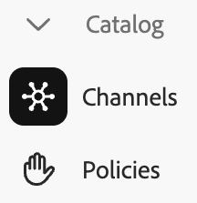

# Caso di utilizzo: Carvelo

>[!NOTE]
>
>Questa documentazione descrive un prodotto in fase di sviluppo con accesso anticipato e non riflette tutte le funzionalità previste per la disponibilità generale.

Il seguente caso d&#39;uso illustra come utilizzare [!DNL Adobe Commerce Optimizer] per organizzare il catalogo in modo che corrisponda alle operazioni di vendita al dettaglio utilizzando un singolo catalogo di base. Viene inoltre illustrato come impostare una vetrina basata su Edge Delivery Services.

## Prerequisito

Prima di esaminare questo caso d&#39;uso, assicurati di avere [configurato la vetrina](../storefront.md).

## Iniziamo

In questo caso d’uso, utilizzerai quanto segue:

1. Interfaccia utente [!DNL Adobe Commerce Optimizer]: configurare i canali e i criteri richiesti per gestire la configurazione operativa complessa del catalogo.

1. Commerce Storefront - Esegui il rendering della vetrina con i dati del catalogo impostati nell&#39;interfaccia utente [!DNL Adobe Commerce Optimizer] e i file di configurazione Commerce Storefront, `fstab.yaml` e `config.json`.

### ‌Soluzioni principali

Entro la fine di questo articolo:

- Scopri le nozioni di base di [!DNL Adobe Commerce Optimizer] con il suo modello dati catalogo scalabile e dalle prestazioni uniche.
- Scopri in che modo il modello dati del catalogo si collega facilmente con i componenti della vetrina indipendenti dalla piattaforma e costruiti da Adobe.
- Scopri come utilizzare i canali e i criteri di Adobe Commerce Optimizer per creare visualizzazioni di catalogo personalizzate e filtri di accesso ai dati e inviare i dati a una vetrina Adobe Commerce con tecnologia Edge Delivery.

## Scenario di business - Carvelo Automobile

Carvelo Automobile è un conglomerato automobilistico fittizio con una configurazione operativa complessa.


In questo grafico vedete che Carvelo vende prodotti automobilistici di tre marche. Ogni marchio è un’azienda figlia diversa:

- Aurora (veicoli elettrici)
- Bullone (SUV)
- Cruz (ibrido)

Vende questi marchi attraverso tre dealer:

- Arkbridge
- Kingsbluff
- Celport

Questi dealer appartengono a due diverse società madri di dealer:

- West Coast Inc. (Arkbridge)
- East Coast Inc. (Kingsbluff, Celport)

Ogni azienda ha due listini prezzi che vengono utilizzati per vendere prodotti a un prezzo specifico per acquirenti diversi (base, VIP).

- `west_coast_inc` e `vip_west_coast_inc`
- `east_coast_inc` e `vip_east_coast_inc`

Come puoi vedere, si tratta di un caso d’uso aziendale molto complesso. Con [!DNL Adobe Commerce Optimizer], un commerciante può supportare una struttura aziendale complessa utilizzando un singolo catalogo di base per diffondere i dati senza duplicazione del catalogo, scalare i listini prezzi (oltre 30.000 listini prezzi) e consegnare tutti questi dati a una vetrina Edge Delivery Services.

Ora che hai una panoramica del caso d’uso aziendale, ecco il tuo obiettivo mentre lavori attraverso questa esercitazione:

>[!BEGINSHADEBOX]

Carvelo vuole vendere parti dei suoi tre marchi (Aurora, Bolt e Cruz) attraverso i diversi concessionari (Akbridge, Kingsbluff e Celport). Carvelo vuole garantire che i concessionari abbiano accesso solo alle parti e ai prezzi corretti secondo i rispettivi accordi di licenza.

In definitiva, Carvelo ha due obiettivi principali:

1. Gestisci un sito web &quot;globale&quot;, che ha tutte le SKU per tutti e tre i marchi.
1. Offrire ai dealer un percorso per creare i propri punti vendita in base alla visibilità SKU e ai prezzi per ogni SKU.

>[!ENDSHADEBOX]

Ora accedi alla tua istanza di [!DNL Adobe Commerce Optimizer].

## 1. Accedere all&#39;istanza [!DNL Adobe Commerce Optimizer]

Dopo aver effettuato l&#39;onboarding al programma di accesso anticipato, Adobe invia un&#39;e-mail che fornisce l&#39;URL per accedere all&#39;istanza l[!DNL Adobe Commerce Optimizer] fornita per te. Questa istanza è preconfigurata con tutto il necessario per completare correttamente i passaggi descritti in questa esercitazione, inclusi i dati del catalogo che supportano il caso di utilizzo di Carvelo Automobile.

All&#39;avvio di [!DNL Adobe Commerce Optimizer], vengono visualizzati i seguenti elementi:

![[!DNL Adobe Commerce Optimizer] UI](../assets/user-interface.png)

>[!NOTE]
>
>Per ulteriori informazioni sulle diverse parti che compongono l&#39;interfaccia utente di [!DNL Adobe Commerce Optimizer], consulta l&#39;articolo [panoramica](../overview.md).

Nel menu di navigazione a sinistra, espandere la sezione **[!UICONTROL Catalog]** e fare clic su **[!UICONTROL Channels]**. Si noti che i concessionari Arkbridge e Kingsbluff dispongono già di canali creati:


>[!NOTE]
>
>Per il momento puoi ignorare il canale **Global**.

Fai clic sull’icona info per esaminare i dettagli del canale.

Arkbridge dispone dei seguenti criteri:

- Marchio
- Modello
- Marchi West Coast Inc
- Categorie di parti di Arkbridge

Kingsbluff dispone dei seguenti criteri:

- Marchio
- Modello
- Marchi East Coast Inc
- Categorie di parti Kingsbluff

Nella prossima sezione verrà creato un canale e le policy per il dealer Celport.

## 2. Creare una policy e un canale

Il responsabile commerciale di Carvelo deve impostare una nuova vetrina per un dealer chiamato *Celport* che appartiene all&#39;azienda *East Coast Inc*. Celport venderà freni e sospensioni per i marchi Bolt e Cruz.


Utilizzando [!DNL Adobe Commerce Optimizer], il responsabile Commerce:

1. Creare un nuovo criterio denominato *Categorie di parti Celport* per consentire a Celport di vendere solo parti di freni e sospensioni.
1. Crea un nuovo canale per la vetrina Celport.

   Questo canale utilizza i criteri appena creati *Categorie di parti Celport* e i *Marchi East Coast Inc* esistenti per garantire che Celport possa vendere solo i marchi Bolt e Cruz come parte dell&#39;accordo con East Coast Inc. Il canale Celport utilizzerà il listino prezzi `east_coast_inc` per supportare i programmi di prezzo dei prodotti in linea con gli accordi di licenza del marchio.
1. Aggiorna la configurazione della vetrina Commerce per utilizzare i dati del canale Celport creato.

Al termine di questa sezione, Celport sarà pronto a vendere i prodotti Carvelo.

### Creare un criterio

Creiamo un nuovo criterio denominato *Categorie di parti Celport* per filtrare gli SKU venduti dal dealer Celport, che includono parti di freni e sospensioni.

1. Nel menu di navigazione a sinistra, espandi la sezione **[!UICONTROL Catalog]** e fai clic su **[!UICONTROL Policies]**.

1. Fare clic su **[!UICONTROL Add Policy]**.

   Viene visualizzata una nuova pagina per aggiungere i dettagli del criterio.

1. Aggiungi i dettagli richiesti:

   **Nome** = *Categorie Di Parti Celport*

1. Fare clic su **[!UICONTROL Add Filter]**.

   Viene visualizzata una finestra di dialogo per aggiungere i dettagli del filtro.

1. Aggiungi i dettagli del filtro:

   - **Attributo** = *categoria_parte*
   - **Operatore** = **IN**
   - **Valore Source** = **STATICO**
   - **Valore** = *freni*, *sospensione*

   >[!IMPORTANT]
   >
   >Assicurati che il nome dell’attributo specificato corrisponda esattamente al nome dell’attributo SKU nel catalogo.

   Per ulteriori informazioni sulla differenza tra un&#39;origine di valore STATIC e TRIGGER, vedere [tipi di origine di valore](../catalog/policies.md#value-source-types).

1. Nella finestra di dialogo **[!UICONTROL Filter details]**, fare clic su **[!UICONTROL Save]**.

1. Per abilitare il filtro appena creato, fare clic sui punti azione (...) e selezionare **Abilita**.

1. Fare clic su **[!UICONTROL Save]**.

   >[!NOTE]
   >
   >Se il pulsante **[!UICONTROL Save]** non è attivo (blu), è possibile che il nome del criterio non sia presente. Fai clic sull&#39;icona a forma di matita accanto a *Nuovo criterio* per aggiungerlo.

1. Torna all’elenco dei criteri facendo clic sulla freccia indietro.

   Il nuovo criterio *Categorie di parti Celport* verrà visualizzato nell&#39;elenco.

### Creare un canale

Crea un nuovo canale per il dealer *Celport* e collega i seguenti criteri: *Marchi East Coast Inc* e *Categorie di parti Celport*.

1. Nel menu di navigazione a sinistra, espandere la sezione **[!UICONTROL Catalog]** e fare clic su **[!UICONTROL Channels]**.

   

   Osserva i canali esistenti: *Arkbridge*, *Kingsbluff* e *Global*.

   

1. Fare clic su **[!UICONTROL Add Channel]**.

1. Inserisci i dettagli del canale:

   - **Nome** = *Celport*
   - **Ambiti** = *en-US* (premere Invio)
   - **Criteri** (usa elenco a discesa) = *Marchi East Coast Inc*; *Categorie parte Celport*; *Marchio*; *Modello*                          

1. Fare clic su **[!UICONTROL Add]** per creare il canale.

   La pagina Canali viene aggiornata per visualizzare il nuovo canale.

   

   >[!NOTE]
   >
   >Se il pulsante **[!UICONTROL Add]** non è blu, assicurarsi che l&#39;ambito sia selezionato posizionando il cursore nella sezione **[!UICONTROL Scopes]** e premendo **Invio**.

1. Ottieni l’ID del canale Celport.

   Fai clic sull&#39;icona delle informazioni per il canale Celport nella pagina **Canali**.

   

   Copia e salva l’ID canale. Questo ID è necessario quando aggiorni la configurazione della vetrina per inviare i dati al nuovo catalogo Celport.

Dopo aver creato il canale Celport e i criteri associati, il passaggio successivo consiste nel configurare la vetrina per creare il nuovo catalogo Celport.

## 3. Aggiorna la vetrina

L&#39;ultima parte di questo tutorial prevede l&#39;aggiornamento della vetrina che [hai già creato](#prerequisite) per inviare dati al nuovo catalogo Celport. In questa sezione, sostituisci l’ID canale nel file di configurazione della vetrina con l’ID canale di Celport.

1. Nell’ambiente di sviluppo locale, apri la cartella in cui hai clonato l’archivio GitHub con i file di configurazione boilerplate della vetrina.

1. Nella directory principale della cartella, aprire il file `config.json`.

   Codice +++config.json

   ```json
   {
    "public": {
      "default": {
      "commerce-core-endpoint": "https://www.aemshop.net/graphql",
      "commerce-endpoint": "https://na1-sandbox.api.commerce.adobe.com/Fwus6kdpvYCmeEdcCX7PZg/graphql",
      "headers": {
         "cs": {
            "ac-channel-id": "9ced53d7-35a6-40c5-830e-8288c00985ad",
            "ac-environment-id": "Fwus6kdpvYCmeEdcCX7PZg",
            "ac-price-book-id": "west_coast_inc",
            "ac-scope-locale": "en-US"
           }
         },
         "analytics": {
            "base-currency-code": "USD",
            "environment": "Production",
            "store-id": 1,
            "store-name": "ACO Demo",
            "store-url": "https://www.aemshop.net",
            "store-view-id": 1,
            "store-view-name": "Default Store View",
            "website-id": 1,
            "website-name": "Main Website"
          }
       }
      }
   }
   ```

   L’intestazione del canale contiene le seguenti righe:

   - `ac-channel-id`:`"9ced53d7-35a6-40c5-830e-8288c00985ad"`
   - `ac-environment-id`: `"Fwus6kdpvYCmeEdcCX7PZg"`
   - `ac-price-book-id`: `"west_coast_inc"`

+++

1. Sostituisci il valore `ac-channel-id` con l&#39;ID canale Celport copiato in precedenza.
1. Se necessario, sostituisci il valore `ac-environment-id` con l&#39;ID tenant per l&#39;istanza [!DNL Adobe Commerce Optimizer]. Puoi trovare l’ID nell’e-mail di onboarding per il programma Early Access o contattando il rappresentante del tuo account Adobe.

   Assicurarsi che il valore `commerce-endpoint` corrisponda all&#39;endpoint GraphQL per l&#39;istanza [!DNL Adobe Commerce Optimizer].

1. Sostituire il valore `ac-price-book-id` con `"east_coast_inc"`.
1. Salva il file.

Quando salvi le modifiche, aggiorni la configurazione del catalogo in modo da utilizzare il canale Carvelo configurato per vendere solo parti del freno e della sospensione.

1. Avvia la vetrina per visualizzare l’esperienza del catalogo specifica per Celport creata dalla configurazione della vetrina.

   1. Dalla finestra del terminale nell’IDE, avvia l’anteprima della vetrina locale.

      ```shell
      npm start
      ```

   Il browser si apre all&#39;anteprima di sviluppo locale in `http://localhost:3000`.

   Se il comando non riesce o se il browser non si apre, esaminare le [istruzioni per lo sviluppo locale](../storefront.md) nell&#39;argomento relativo alla configurazione di Storefront.

   1. Nel browser, cercare `brakes` e premere **Invio**.

      La vetrina si aggiorna per visualizzare la pagina dell&#39;elenco dei prodotti con le parti dei freni.

   

   Fare clic su un&#39;immagine di parte del freno per visualizzare i dettagli del prodotto con le informazioni sul prezzo e prendere nota delle informazioni sul prezzo del prodotto.

1. Cerca `tires`, che è un&#39;altra categoria di parte disponibile nei dati del caso d&#39;uso nella tua istanza di [!DNL Adobe Commerce Optimizer].

   

   Non viene restituito alcun risultato. Questo perché il canale Celport è stato configurato per vendere solo parti di freni e sospensioni.

1. Prova ad aggiornare il file di configurazione della vetrina (`config.json`).

   1. Modificare i valori `ac-channel-id` e `ac-price-book`.

      Ad esempio, puoi cambiare l&#39;ID del canale in canale Kingsbluff e l&#39;ID del listino prezzi in `east_coast_inc`. È possibile visualizzare le categorie di parti disponibili per Kingsbluff consultando il criterio *Categorie di parti Kingsbluff*.

   1. Salva il file.

      Quando si salva il file, l&#39;anteprima della vetrina locale viene aggiornata automaticamente.

   1. Visualizzate l&#39;anteprima delle modifiche nel browser utilizzando la funzione di ricerca per trovare le parti dei pneumatici.

      Osservate i diversi tipi di parti disponibili e i prezzi assegnati al canale Kingsbluff.

      Modificando i valori delle intestazioni nel file di configurazione storefront ed esplorando la vetrina aggiornata, puoi facilmente aggiornare la vista catalogo e i filtri dati per personalizzare l’esperienza della vetrina.

## Tutto qui!

In questo tutorial hai imparato come [!DNL Adobe Commerce Optimizer] può aiutarti a organizzare il catalogo in modo che corrisponda alle tue operazioni di vendita al dettaglio utilizzando un singolo catalogo di base. Hai anche imparato a configurare una vetrina basata su Edge Delivery Services.

## Dove andare da qui

Per scoprire come utilizzare l&#39;individuazione dei prodotti e la funzionalità Consigli per personalizzare l&#39;esperienza di acquisto per i clienti, consulta la [panoramica sul merchandising](../merchandising/overview.md).
