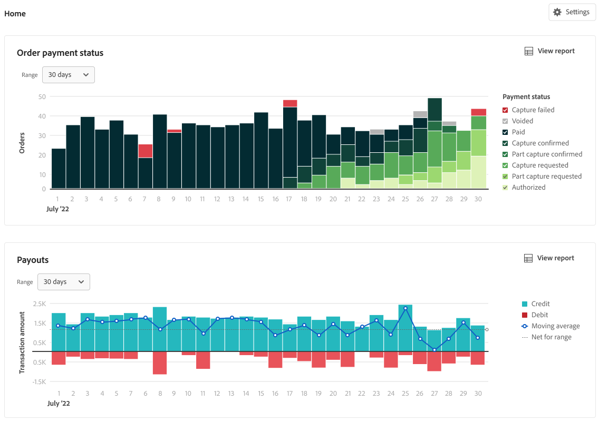

# Reporting finanziario

[!DNL Payment Services] per [!DNL Adobe Commerce] e [!DNL Magento Open Source] offre un report completo che ti permette di ottenere una visione chiara degli ordini e dei pagamenti del tuo negozio.

{width="600" zoomable="yes"}

I rapporti di gestione dei flussi di cassa, ovvero Pagamenti, Transazioni e Stato pagamento ordine, consentono di sincronizzare i dettagli di pagamento con le informazioni sull&#39;ordine in modo da garantire la piena trasparenza del volume elaborato, del saldo del pagamento e dei rapporti dettagliati a livello di transazione per la quadratura finanziaria.

>[!NOTE]
>
>La distribuzione determina quali di questi report visualizzare nel [!DNL Payment Services] **dashboard**. In [!DNL Adobe Commerce as a Cloud Service] e [!DNL Adobe Commerce Optimizer], il dashboard espone **selected** rapporti (incluse [Transazioni](reporting.md) dalla Home). [Stato pagamento ordine](order-payment-status.md) e [Pagamenti](payouts.md) Le visualizzazioni Home e i report collegati sono disponibili su Adobe Commerce nel cloud e on-premise come descritto in questi argomenti. Vedi [[!DNL Payment Services] Home](payments-home.md).
