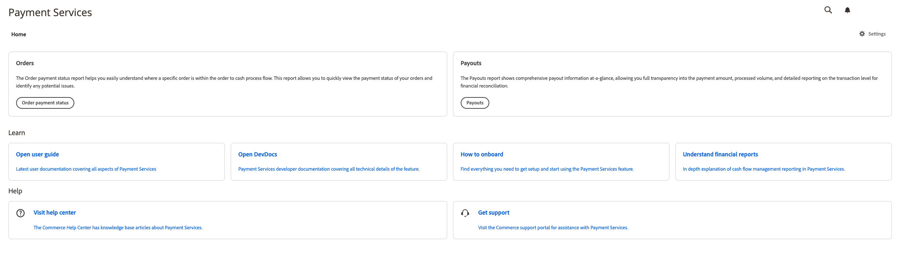

# Home di [!DNL Payment Services]

[!DNL Payment Services] per Adobe Commerce e Magento Open Source fornisce una visualizzazione Home con le informazioni necessarie per configurare e utilizzare l&#39;estensione. Le opzioni nella parte superiore della Home dipendono dalla distribuzione: Adobe Commerce sul cloud o on-premise (PaaS), oppure [!DNL Adobe Commerce as a Cloud Service] o [!DNL Adobe Commerce Optimizer] (SaaS).

Nella barra laterale _Admin_, passa a **[!UICONTROL Sales]** > **[!UICONTROL [!DNL Payment Services]]**:

>[!BEGINTABS]

>[!TAB Adobe Commerce sul cloud e on-premise]

{width="700" zoomable="yes"}

>[!TAB Adobe Commerce as a Cloud Service e Commerce Optimizer]

Fino al completamento dell&#39;onboarding, **[!UICONTROL Home]** visualizzerà **[!UICONTROL ACCS Onboarding Required]**. L&#39;avviso è collegato a [configurare il servizio sandbox](sandbox.md#enable-sandbox-testing) (con un account di elaborazione PayPal di prova) o a [abilitare i pagamenti live](production.md#enable-live-payments) se è già stato testato in un altro ambiente:

{width="700" zoomable="yes"}

Al termine dell&#39;onboarding (o in un&#39;istanza già configurata), **[!UICONTROL Home]** mostra **[!UICONTROL Transactions]** con **[!UICONTROL View Report]** per il rapporto tabulare, più le aree **[!UICONTROL Learn]** e **[!UICONTROL Help]**:

{width="700" zoomable="yes"}

>[!ENDTABS]

In questa visualizzazione Home, puoi accedere alla _Home_, _Scopri_ su [!DNL Payment Services], configurare l&#39;estensione _Impostazioni_ o ottenere _Guida_. Utilizza **[!UICONTROL View Report]** (SaaS) o i punti di ingresso **[!UICONTROL Orders]** e **[!UICONTROL Payouts]** (Adobe Commerce sul cloud e on-premise) per aprire il reporting; vedi [Reporting](reporting.md).

## Home

[!BADGE Solo PaaS]{type=Informative url="https://experienceleague.adobe.com/it/docs/commerce/user-guides/product-solutions" tooltip="Applicabile solo ai progetti Adobe Commerce on Cloud (infrastruttura PaaS gestita da Adobe) e ai progetti on-premise."}

| Campo | Descrizione |
|---|---|
| [!UICONTROL Orders] | Questi rapporti ti consentono di visualizzare rapidamente lo stato dei pagamenti degli ordini e di identificare eventuali problemi. |
| [!UICONTROL Payouts] | I rapporti Pagamenti mostrano immediatamente informazioni complete sui pagamenti, consentendo la completa trasparenza dell&#39;importo del pagamento, del volume elaborato e dei rapporti dettagliati a livello di transazione per la quadratura finanziaria. |

[!BADGE Solo SaaS]{type=Positive url="https://experienceleague.adobe.com/it/docs/commerce/user-guides/product-solutions" tooltip="Applicabile solo ai progetti Adobe Commerce as a Cloud Service e Adobe Commerce Optimizer (infrastruttura SaaS gestita da Adobe)."}

| Campo | Descrizione |
|---|---|
| [!UICONTROL Transactions] | Riepiloga il rapporto Transazioni, che consente di comprendere il risultato di transazioni specifiche. Fare clic su **[!UICONTROL View Report]** per aprire la griglia delle transazioni (ad esempio, ID transazione PayPal e ordine, metodo di pagamento, risultato e codici di risposta). Vedi [Visualizzazione report transazioni](reporting.md#transactions-report-view). |

## Scopri

| Campo | Descrizione |
|---|---|
| [!UICONTROL Read documentation] | Consulta la documentazione più recente per utenti e sviluppatori relativa a [!DNL Payment Services]. |
| [!UICONTROL How to onboard] | Trovare tutto il necessario per configurare e iniziare a utilizzare la funzionalità [!DNL Payment Services]. |
| [!UICONTROL Understand financial reports] | Spiegazione dettagliata dei report di gestione dei flussi di cassa in [!DNL Payment Services]. |

## Aiuto

| Campo | Descrizione |
|---|---|
| [!UICONTROL Visit help center] | Il Centro assistenza [!DNL Adobe Commerce] contiene articoli della knowledge base su [!DNL Payment Services]. |
| [!UICONTROL Get support] | Visitare il portale di supporto di [!DNL Adobe Commerce] per assistenza su [!DNL Payment Services]. |

## Impostazioni

Nella visualizzazione Home, fare clic su **[!UICONTROL Settings]**. Per ulteriori informazioni, vedere [[!DNL Payment Services] configurazione](configure-admin.md).

Nel piè di pagina dell&#39;area Servizi di pagamento verranno visualizzate le etichette di versione **Servizi di pagamento** e **Dashboard servizi di pagamento**, ad esempio quando si raccolgono i dettagli per il supporto.
