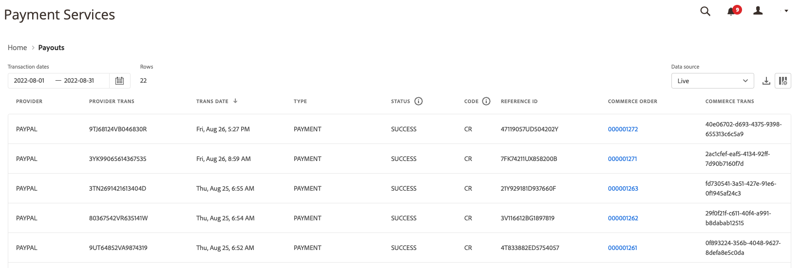

# Rapporto Pagamenti

[!DNL Payment Services] per [!DNL Adobe Commerce] e [!DNL Magento Open Source] offre report completi che consentono di ottenere una chiara visualizzazione delle transazioni, degli ordini e dei pagamenti del tuo Negozio.

Sono disponibili due visualizzazioni di reporting Pagamenti per consentirti di visualizzare informazioni approfondite su tutti i tuoi pagamenti:

* **[Visualizzazione dati pagamenti](#payouts-data-visualization-view)**—Grafico disponibile nella home di Payment Services che rappresenta visivamente gli importi aggregati al giorno dalla visualizzazione del rapporto Pagamenti
* **[Visualizzazione report Pagamenti](#payouts-report-view)**—Report disponibile in Pagamenti che mostra informazioni dettagliate sui pagamenti per tutte le transazioni

Le visualizzazioni Pagamenti mostrano immediatamente informazioni complete sui pagamenti, consentendo la completa trasparenza dell&#39;importo del pagamento, del volume elaborato e dei rapporti dettagliati a livello di transazione per la quadratura finanziaria.

È possibile [scaricare le transazioni di pagamento](#download-transactions) in un formato di file .csv da utilizzare nel software di accounting o di gestione degli ordini esistente.

>[!NOTE]
>
>I report pagamenti mostrano solo gli ordini acquisiti (l&#39;azione di pagamento è impostata su [`Authorize and Capture`](https://experienceleague.adobe.com/docs/commerce-merchant-services/payment-services/get-started/production.html?lang=it#set-payment-services-as-payment-method)) o [contrassegnati come `Invoiced`](https://experienceleague.adobe.com/it/docs/commerce-admin/stores-sales/order-management/invoices#create-an-invoice).

## Visualizzazione dati pagamenti

La visualizzazione dati Pagamenti è disponibile nella Home page di Payment Services. Si tratta di una rappresentazione visiva degli importi aggregati al giorno dalla tabella dettagliata [Visualizzazione report pagamenti](#payouts-report-view).

Nella barra laterale _Amministratore_, passa a **[!UICONTROL Sales]** > **[!UICONTROL Payment Services]** per visualizzare il grafico con la visualizzazione dei dati relativo ai crediti rispetto ai debiti e alle medie mobili nel tempo.

{width="800" zoomable="yes"}

Fare clic su **[!UICONTROL View Report]** per passare alla tabella dettagliata [Visualizzazione report pagamenti](#payouts-report-view).

### Personalizzare l’arco temporale delle transazioni

Per impostazione predefinita, vengono visualizzati 30 giorni di transazioni.

Nella visualizzazione dati Pagamenti è possibile personalizzare l&#39;intervallo di tempo per le transazioni di pagamento che si desidera visualizzare selezionando un intervallo di date:

1. Nella barra laterale _Admin_, passa a **[!UICONTROL Sales]** > **[!UICONTROL Payment Services]**. La visualizzazione dei dati Pagamenti è visibile nella sezione Pagamenti.
1. Fare clic sul filtro del selettore **[!UICONTROL Range]**.
1. Scegliere l&#39;intervallo di date applicabile: 30 giorni, 15 giorni o 7 giorni.
1. Visualizza le informazioni sulle transazioni per le date specificate.

### Informazioni sulle transazioni

Gli importi delle transazioni per un intervallo di date selezionato vengono visualizzati a sinistra della visualizzazione Dati pagamenti. Le date per l’intervallo di date selezionato sono visualizzate nella parte inferiore della visualizzazione. Se non ci sono stati pagamenti in una data particolare, quella data non sarà visualizzata.

La visualizzazione dati Pagamenti include le seguenti informazioni.

| Dati | Descrizione |
| ------------ | -------------------- |
| [!UICONTROL Transaction amount] | Intervallo di importi per le transazioni nell&#39;intervallo di tempo specificato; dati sull&#39;asse Y (a sinistra) |
| Intervallo di date | Intervallo di date per l’intervallo di tempo specificato; dati sull’asse X (in basso) |
| Credito | Pagamenti per l&#39;intervallo di tempo specificato |
| Dare | Debiti (rimborsi) per l&#39;intervallo di tempo specificato |
| Media mobile | Rappresentazione del pagamento medio per ogni data nell&#39;intervallo di tempo specificato |
| Netto per intervallo | Importo del pagamento netto per l’intervallo di tempo specificato |

## Visualizzazione report Pagamenti

La visualizzazione del rapporto Pagamenti è disponibile nella visualizzazione Pagamenti di Servizi di pagamento. Include tutte le informazioni disponibili sui pagamenti per il/i tuo/i negozio/i.

Nella barra laterale _Amministratore_, vai a **[!UICONTROL Sales]** > **[!UICONTROL Payment Services]** > _[!UICONTROL Payouts]_>**[!UICONTROL View Report]**&#x200B;per visualizzare la visualizzazione dettagliata del report Pagamenti nella tabella.

{width="800" zoomable="yes"}

È possibile configurare questa visualizzazione in base alle sezioni di questo argomento per presentare al meglio i dati che si desidera visualizzare.

Vedere gli ID di ordini e transazioni Commerce collegati, gli importi delle transazioni, il metodo di pagamento per transazione e molto altro all&#39;interno di questo report.

È possibile [scaricare le transazioni di pagamento](#download-transactions) in un formato di file .csv da utilizzare nel software di accounting o di gestione degli ordini esistente.

>[!NOTE]
>
>I dati visualizzati in questa tabella sono ordinati in ordine decrescente (`DESC`) per impostazione predefinita utilizzando `TRANS DATE`. `TRANS DATE` è la data e l&#39;ora in cui è stata avviata la transazione.

### Seleziona origine dati

Nella visualizzazione del report Pagamenti è possibile selezionare l&#39;origine dati **[!UICONTROL Live]** o **[!UICONTROL Sandbox]** per la quale si desidera visualizzare i risultati del report.

{width="300" zoomable="yes"}

Se _[!UICONTROL Live]_&#x200B;è l&#39;origine dati selezionata, è possibile visualizzare le informazioni del report per gli archivi in modalità di produzione. Se&#x200B;_[!UICONTROL Sandbox]_ è l&#39;origine dati selezionata, è possibile visualizzare gli archivi di informazioni del report in modalità sandbox.

Le selezioni delle origini dati funzionano come segue:

* Se non si dispone di archivi in modalità Live, la selezione dell&#39;origine dati viene impostata automaticamente su _[!UICONTROL Sandbox]_.
* Se sono presenti uno o più archivi in modalità Live, la selezione dell&#39;origine dati predefinita è _[!UICONTROL Live]_.
* Le esportazioni dei rapporti rispettano sempre la selezione dell’origine dati.

Per selezionare l&#39;origine dati per il rapporto Stato pagamento ordine:

1. Nella barra laterale _Admin_, vai a **[!UICONTROL Sales]** > **[!UICONTROL Payment Services]** > _[!UICONTROL Payouts]_>**[!UICONTROL View Report]**.
1. Fare clic su **[!UICONTROL Data source]** e selezionare **[!UICONTROL Live]** o **[!UICONTROL Sandbox]**.

   I risultati del report vengono rigenerati in base all&#39;origine dati selezionata.

### Visualizza transazioni

Per impostazione predefinita, vengono visualizzati 30 giorni di transazioni.

Il numero di righe restituite in una ricerca o visualizzate nei 30 giorni predefiniti di transazioni viene visualizzato sopra la griglia di visualizzazione Pagamenti insieme al filtro del selettore calendario Date transazione.

Scorri verso sinistra e destra per visualizzare [le informazioni per ogni transazione di pagamento](#column-descriptions) nel report giornaliero, inclusi la data della transazione, l&#39;ID di riferimento, il numero della fattura e i dettagli sul metodo di pagamento.

#### Personalizzare l’arco temporale delle transazioni

Nella visualizzazione del rapporto Pagamenti è possibile personalizzare l&#39;intervallo di tempo per le transazioni di pagamento che si desidera visualizzare inserendo date specifiche o selezionando un intervallo di date dal selettore delle date:

1. Nella barra laterale _Admin_, vai a **[!UICONTROL Sales]** > **[!UICONTROL Payment Services]** > _[!UICONTROL Payouts]_>**[!UICONTROL View Report]**.
1. Fare clic sul filtro del selettore del calendario _[!UICONTROL Transaction dates]_.
1. Scegli l’intervallo di date applicabile.
1. Visualizza gli stati dei pagamenti nella griglia per le date specificate.

### Mostra e nascondi colonne

La visualizzazione del rapporto Pagamenti mostra la maggior parte delle colonne di informazioni disponibili per impostazione predefinita. È tuttavia possibile personalizzare le colonne visualizzate nel rapporto.

1. Nella barra laterale _Admin_, vai a **[!UICONTROL Sales]** > **[!UICONTROL [!DNL Payment Services]]** > _[!UICONTROL Payouts]_>**[!UICONTROL View Report]**.
1. Fare clic sull&#39;icona _Impostazioni colonna_ ({width="20" zoomable="yes"}).
1. Per personalizzare le colonne visualizzate nel report, selezionare o deselezionare le colonne nell&#39;elenco.

   La visualizzazione del rapporto Pagamenti mostra immediatamente le modifiche apportate nel menu delle impostazioni delle colonne. Le preferenze delle colonne verranno salvate e rimarranno attive anche quando ci si allontana dalla vista del rapporto.

### Scarica transazioni

Puoi scaricare un file .csv contenente tutte le transazioni visibili nella griglia di visualizzazione Pagamenti.

1. Nella barra laterale _Admin_, vai a **[!UICONTROL Sales]** > **[!UICONTROL Payment Services]** > _[!UICONTROL Payouts]_>**[!UICONTROL View Report]**.
1. [Personalizza l&#39;intervallo di date per le transazioni](#customize-transactions-timeframe).
1. Fai clic sull&#39;icona _Scarica_ ( {width="20" zoomable="yes"} ).

Le transazioni di pagamento vengono scaricate in formato .csv.

### Descrizioni delle colonne

I rapporti di pagamento includono le seguenti informazioni.

| Colonna | Descrizione |
| ------------ | -------------------- |
| [!UICONTROL Provider] | Fornitore di pagamenti |
| [!UICONTROL Provider trans] | ID transazione |
| [!UICONTROL Trans date] | Data e ora di avvio della transazione |
| [!UICONTROL Type] | Tipo di transazione: *[!UICONTROL PAYMENT]*, *[!UICONTROL BONUS]*, *[!UICONTROL CHARGEBACK]*, *[!UICONTROL CORRECTION]*, *[!UICONTROL CURRENCY_CONVERSATION]*, *[!UICONTROL DEPOSIT]*, *[!UICONTROL DISBURSEMENT]*, *[!UICONTROL DISPUTE]*, *[!UICONTROL FEES]*, *[!UICONTROL HOLD]*, *[!UICONTROL HOLD_RELEASE]*, *[!UICONTROL INCENTIVES]*, *[!UICONTROL OTHERS]*, *[!UICONTROL RECOUP]*, *[!UICONTROL REFUND]*, *[!UICONTROL REVERSAL]*, *[!UICONTROL WITHDRAWAL]*    Per ulteriori informazioni, vedere [Tipi di transazione](#transaction-types). |
| [!UICONTROL Status] | Stato corrente della transazione: *[!UICONTROL SUCCESS]*, *[!UICONTROL DENIED]*, *[!UICONTROL PENDING]* |
| [!UICONTROL Code] | Codice transazione che indica il credito (*CR*) o il debito (*DR*) |
| [!UICONTROL Reference ID] | ID transazione originale per cui è correlato questo evento |
| [!UICONTROL Invoice] | ID fattura (uno per ordine) della transazione |
| [!UICONTROL Commerce order] | ID ordine Commerce    Per visualizzare le [informazioni ordine](https://experienceleague.adobe.com/it/docs/commerce-admin/stores-sales/order-management/orders/orders) correlate, fare clic sull&#39;ID. |
| [!UICONTROL Commerce trans] | ID transazione Commerce |
| [!UICONTROL Pay method] | Tipo di carta di credito—*[!UICONTROL BANK]*, *[!UICONTROL PAYPAL]*, *[!UICONTROL CREDIT_CARD]*—e provider di carta associato (ad esempio *Visa* o *MasterCard*) |
| [!UICONTROL TRANS AMT] | Importo della transazione |
| [!UICONTROL CUR] | Unità di valuta per l’importo della transazione |
| [!UICONTROL PENDING] | Importo ancora da erogare |
| [!UICONTROL CUR] | Unità di valuta per l&#39;importo in sospeso |
| [!UICONTROL SELLER AMT] | Importo dei fondi trasferiti a o da un cliente    I fondi trasferiti dall&#39;account del venditore presentano un prefisso trattino (-). |
| [!UICONTROL CUR] | Unità di valuta per l&#39;importo del venditore |
| [!UICONTROL PARTNER FEE] | Tariffe partner associate alla transazione    I fondi trasferiti dal conto di addebito partner mostrano un prefisso trattino (-). |
| [!UICONTROL CUR] | Unità di valuta per la commissione partner |
| [!UICONTROL PROV FEES] | Tariffe associate alla transazione    I fondi trasferiti dal conto di addebito del provider presentano un prefisso trattino (-). |
| [!UICONTROL CUR] | Unità di valuta per la tariffa del provider |
| [!UICONTROL FEE %] | Percentuale dell&#39;importo della transazione addebitato come commissione |
| [!UICONTROL FIXED FEE] | Importo tariffa provider fisso |
| [!UICONTROL CHBK FEE] | Tariffa di chargeback associata alla transazione    Un trattino (-) prefisso indica che la commissione di rettifica è stata stornata. |
| [!UICONTROL CUR] | Unità di valuta per la commissione di rettifica |
| [!UICONTROL HOLD AMT] | Quantità messa in attesa o rilasciata dal blocco    Un trattino (-) prefisso indica che i fondi in attesa vengono rilasciati. |
| [!UICONTROL CUR] | Unità di valuta per l&#39;importo del blocco |
| [!UICONTROL RECOUP AMT] | Importo recuperato dal conto di recupero    I fondi trasferiti dall&#39;account di recupero presentano un prefisso trattino (-). |
| [!UICONTROL CUR] | Unità di valuta per l&#39;importo da recuperare |

### Tipi di transazione

Questi tipi di operazioni possono essere annotati nelle transazioni di pagamento.

| Report | Descrizione |
| ------------ | -------------------- |
| [!UICONTROL PAYMENT] | Soldi trasferiti tra un acquirente e un venditore per un ordine |
| [!UICONTROL AUTH] | Autorizzazione e autorizzazione di operazioni annullate |
| [!UICONTROL BONUS] | — |
| [!UICONTROL CHARGEBACK] | Transazioni di storno con commissione di rettifica e commissione di rettifica |
| [!UICONTROL CORRECTION] | — |
| [!UICONTROL CURRENCY_CONVERSION] | — |
| [!UICONTROL DEPOSIT] | — |
| [!UICONTROL DISBURSEMENT] | — |
| [!UICONTROL DISPUTE] | — |
| [!UICONTROL FEES] | Tariffe partner, commissioni di pagamento e transazioni di storno delle tariffe |
| [!UICONTROL HOLD] | — |
| [!UICONTROL HOLD_RELEASE] | — |
| [!UICONTROL INCENTIVES] | — |
| [!UICONTROL OTHERS] | — |
| [!UICONTROL RECOUP] | Recuperi da conti bancari o perdite |
| [!UICONTROL REFUND] | — |
| [!UICONTROL REVERSAL] | — |
| [!UICONTROL WITHDRAWAL] | — |
