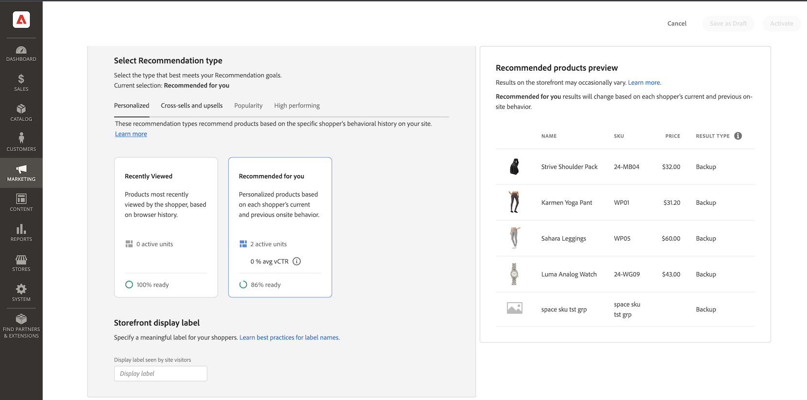

# Crea nuovo consiglio

Quando crei un consiglio, crei una _unità di consigli_, o widget, che contiene il prodotto consigliato _elementi_.

_Unità consigli_

Quando attivi l&#39;unità di consigli, Adobe Commerce inizia a [raccogliere dati](workspace.md) per misurare impression, visualizzazioni, clic e così via. La tabella [!DNL Product Recommendations] visualizza le metriche per ogni unità di consigli per aiutarti a prendere decisioni aziendali informate.

>[!NOTE]
>
>Le metriche di consigli del prodotto sono ottimizzate per le vetrine di Luma. Se la vetrina non è basata su Luma, il modo in cui le metriche tengono traccia dei dati dipende dal modo in cui [implementa la raccolta di eventi](events.md).

1. Nella barra laterale _Amministratore_, vai a **Marketing** > _Promozioni_ > **Consigli di prodotto** per visualizzare l&#39;area di lavoro _Consigli di prodotto_.

1. Specifica la [visualizzazione archivio](https://experienceleague.adobe.com/en/docs/commerce-admin/start/setup/websites-stores-views) in cui desideri visualizzare i consigli.

   >[!NOTE]
   >
   > Le unità di consigli di Page Builder devono essere create nella vista store predefinita, ma possono essere utilizzate ovunque. Per ulteriori informazioni sulla creazione di consigli di prodotto con Page Builder, consulta [Aggiungi contenuto - Consigli di prodotto](https://experienceleague.adobe.com/en/docs/commerce-admin/page-builder/add-content/recommendations).

1. Fai clic su **Crea consiglio**.

1. Nella sezione _Denomina il consiglio_, inserisci un nome descrittivo per il riferimento interno, ad esempio `Home page most popular`.

1. Nella sezione _Seleziona tipo di pagina_, seleziona la pagina in cui desideri visualizzare il consiglio tra le seguenti opzioni:

   >[!NOTE]
   >
   > I consigli di prodotto non sono supportati nella pagina del carrello quando lo store è configurato per [visualizzare la pagina del carrello subito dopo l&#39;aggiunta di un prodotto al carrello](https://experienceleague.adobe.com/en/docs/commerce-admin/stores-sales/point-of-purchase/cart/cart-configuration).

   * Home page
   * Categoria
   * Dettagli prodotto
   * Carrello
   * Conferma
   * [Page Builder](https://experienceleague.adobe.com/en/docs/commerce-admin/page-builder/add-content/recommendations)

   Puoi creare fino a 50 unità di consigli attive per ogni tipo di pagina. Al raggiungimento del limite, il tipo di pagina è disattivato.

   
   _Nome consiglio e posizionamento pagina_

1. Nella sezione _Seleziona tipo di consiglio_, specifica il [tipo di consiglio](type.md) che desideri visualizzare nella pagina selezionata. Per alcune pagine, il [posizionamento](placement.md) dei consigli è limitato a determinati tipi.

1. Nella sezione _Etichetta di visualizzazione vetrina_, immetti la [etichetta](placement.md#recommendation-labels) visibile agli acquirenti, ad esempio &quot;Più venduti&quot;.

1. Nella sezione _Scegli il numero di prodotti_, utilizza il cursore per specificare il numero di prodotti da visualizzare nell&#39;unità di consigli.

   Il valore predefinito è `5`, con un massimo di `20`.

1. Nella sezione _Seleziona posizionamento_, specifica il percorso in cui l&#39;unità di consigli deve essere visualizzata nella pagina.

   * Nella parte inferiore del contenuto principale
   * Nella parte superiore del contenuto principale

1. (Facoltativo) Per modificare l&#39;ordine dei consigli, selezionare e spostare le righe nella tabella _Scegli posizione_.

   Nella sezione _Scegli posizione_ vengono visualizzati tutti i consigli (se presenti) creati per il tipo di pagina selezionato.

   
   _Ordine consigli a pagina_

1. (Facoltativo) Per controllare quali prodotti vengono visualizzati nell&#39;unità di consigli, [applica filtri](filters.md) nella sezione _Filtri_.

   
   _Filtri di prodotto per consigli_

1. Al termine, fare clic su una delle seguenti opzioni:

   * **Salva come bozza** per modificare l&#39;unità di consigli in un secondo momento. Non è possibile modificare il tipo di pagina o il tipo di consiglio per un&#39;unità di consigli in stato bozza.

   * **Attiva** per abilitare l&#39;unità di consigli nella vetrina.

>[!IMPORTANT]
>
>Alcuni browser potrebbero bloccare gli script critici che impediscono al servizio Consigli di prodotto di funzionare come previsto.

## Indicatori di preparazione

Gli indicatori di preparazione mostrano quali tipi di consigli ottengono le prestazioni migliori con i dati di catalogo e comportamentali disponibili. Utilizzali per identificare i problemi relativi agli eventi o traffico insufficiente per popolare un tipo di consiglio.

Gli indicatori di preparazione rientrano in due categorie: [static-based](#static-based) e [dynamic-based](#dynamic-based). I consigli basati su statistiche utilizzano solo dati di catalogo. I consigli basati su dinamiche utilizzano i dati comportamentali degli acquirenti per addestrare modelli di apprendimento automatico, generare consigli personalizzati e calcolare il punteggio di preparazione di ogni consiglio.

### Calcolo degli indicatori di preparazione

Gli indicatori di preparazione indicano quanto il modello è addestrato. Gli indicatori dipendono dai tipi di eventi raccolti, dall’ampiezza dei prodotti con cui si interagisce e dalle dimensioni del catalogo.

La percentuale dell’indicatore di preparazione stima la proporzione di prodotti che potrebbero essere consigliati per un determinato tipo di consiglio. Viene calcolato utilizzando la dimensione del catalogo, il volume di interazione e la percentuale di SKU che registrano gli eventi rilevanti entro un intervallo di tempo definito. Ad esempio, gli indicatori di prontezza possono essere più elevati durante i picchi di traffico festivo rispetto ai periodi di traffico normale.

In seguito a queste variabili, la percentuale dell’indicatore di prontezza può oscillare. Questo spiega perché i tipi di consigli variano tra &quot;Pronto per la distribuzione&quot;.

Gli indicatori di preparazione sono calcolati in base a due fattori:

* Dimensione sufficiente del set di risultati: nella maggior parte degli scenari sono stati restituiti risultati sufficienti per evitare di utilizzare [consigli di backup](events.md#backuprecs)?

* I prodotti restituiti rappresentano una varietà di prodotti del catalogo? Questo fattore garantisce che i consigli nel sito non siano limitati a un piccolo sottoinsieme di prodotti.

In base ai fattori di cui sopra, un valore di fattibilità viene calcolato e visualizzato come segue:

* Il 75% o più significa che le raccomandazioni suggerite per quel tipo di raccomandazione saranno altamente pertinenti.
* Almeno il 50% significa che le raccomandazioni suggerite per quel tipo di raccomandazione saranno meno pertinenti.
* Meno del 50% significa che le raccomandazioni suggerite per quel tipo di raccomandazione potrebbero non essere pertinenti. In questo caso, vengono utilizzati [consigli di backup](events.md#backuprecs).

Ulteriori informazioni su [perché gli indicatori di preparazione potrebbero essere bassi](#what-to-do-if-the-readiness-indicator-percent-is-low).

### Basato su statico

I seguenti tipi di consigli sono basati su statico perché richiedono solo dati di catalogo. Non vengono utilizzati dati comportamentali.

* _Altri argomenti correlati_
* _Somiglianza Visiva_

### Basato su Dynamic

I seguenti tipi di consigli sono basati su dinamiche perché utilizzano dati comportamentali di vetrina.

Ultimi sei mesi di dati comportamentali della vetrina:

* _Ha visualizzato questo, ha visualizzato quello_
* _Ha visualizzato questo/a, ha acquistato quello/a_
* _Ha acquistato questo/a, l&#39;ha acquistato_
* _Consigliato per te_

Ultimi sette giorni di dati comportamentali della vetrina:

* _Più visualizzati_
* _Più acquistati_
* _Più aggiunti al carrello_
* _Di tendenza_
* _Visualizza per conversione acquisto_
* _Conversione da visualizzazione a carrello_

Dati comportamentali più recenti degli acquirenti (solo visualizzazioni):

* _Visualizzato di recente_

### Visualizzare lo stato

Per aiutarti a visualizzare l&#39;avanzamento della formazione di ciascun tipo di consiglio, la sezione _Seleziona tipo di consiglio_ mostra una misura di preparazione per ciascun tipo.

_Tipo di consiglio_

>[!NOTE]
>
>Gli indicatori non possono mai raggiungere il 100%.

La percentuale di preparazione per i tipi di consigli basati su catalogo in genere cambia poco perché i cataloghi sono relativamente stabili. Al contrario, la percentuale di disponibilità per i tipi di consigli basati sui dati comportamentali dei consumatori può cambiare frequentemente con l’attività giornaliera dei consumatori.

#### Cosa fare se la percentuale dell’indicatore di prontezza è bassa

Una percentuale di preparazione bassa indica che non vi sono molti prodotti del catalogo che possono essere inclusi nei consigli per questo tipo di consigli. Ciò significa che esiste un&#39;elevata probabilità che vengano restituiti [consigli di backup](events.md#backup-recommendations) se si distribuisce comunque questo tipo di consigli.

>[!IMPORTANT]
>
>_I tipi di prodotto_, _raggruppati_ e personalizzati non sono supportati. Se il catalogo contiene un numero elevato di questi tipi di prodotti, il livello di preparazione sarà basso. Inoltre, qualsiasi SKU con spazi può ridurre la rilevanza dei consigli e deve essere evitata.

Di seguito sono elencati i possibili motivi e soluzioni ai punteggi di bassa prontezza comuni:

* **Basato su statico** - I dati di catalogo mancanti per i prodotti visualizzabili causano percentuali basse per questi indicatori. Se sono inferiori al previsto, il problema può essere risolto con una sincronizzazione completa.
* **Basato su dinamica** - I seguenti fattori causano percentuali basse per gli indicatori basati su dinamica:

  * Campi mancanti nei [eventi storefront](https://developer.adobe.com/commerce/services/shared-services/storefront-events/#product-recommendations) richiesti per i rispettivi tipi di consigli (requestId, contesto di prodotto e così via).
  * Traffico ridotto nello store, quindi il volume di eventi comportamentali che riceviamo è basso.
  * La varietà di eventi comportamentali all&#39;interno dello store tra i diversi prodotti è bassa. Ad esempio, se solo il 10% dei prodotti viene visualizzato o acquistato la maggior parte del tempo, i rispettivi indicatori di disponibilità saranno bassi.

## Anteprima consigli {#preview}

Il pannello _Anteprima prodotti consigliati_ è sempre disponibile con una selezione di esempi di prodotti visualizzati nell&#39;unità Consigli quando viene distribuita nella vetrina.

Per testare un consiglio quando si lavora in un ambiente non di produzione, è possibile recuperare i dati dei consigli da una [origine diversa](settings.md). Questo consente ai commercianti di sperimentare le regole e visualizzare in anteprima i consigli prima di distribuirli in produzione.

| Campo | Descrizione |
|---|---|
| Nome | Il nome del prodotto. |
| SKU | Unità di stoccaggio assegnata al prodotto |
| Prezzo | Il prezzo del prodotto. |
| Tipo di risultato | Principale: indica che sono stati raccolti dati di formazione sufficienti per visualizzare un consiglio. Backup: indica che i dati di formazione raccolti non sono sufficienti, pertanto per riempire lo slot viene utilizzato un consiglio di backup. Vai a [Dati comportamentali](events.md) per ulteriori informazioni sui modelli di apprendimento automatico e sui consigli di backup. |

Per vedere quali prodotti include in tempo reale un’unità di consigli, prova a usare il tipo di pagina, il tipo di consiglio e i filtri creati. Quindi, configurare l&#39;unità per soddisfare le esigenze aziendali in base ai prodotti restituiti.

Quando più unità di consigli vengono distribuite sulla stessa pagina, Adobe Commerce ha utilizzato [filtri](#filters.md) per rimuovere i prodotti duplicati dai consigli visualizzati. Di conseguenza, il pannello di anteprima potrebbe mostrare un set di prodotti diverso rispetto alla vetrina.

>[!NOTE]
>
> Impossibile visualizzare in anteprima il tipo di consiglio `Recently viewed` perché i dati non sono disponibili nell&#39;amministratore.
