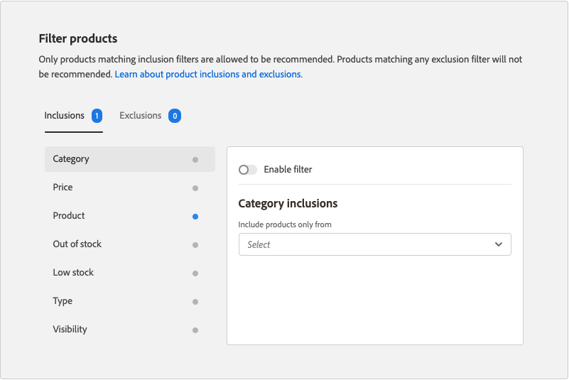

# Modifica consiglio

La pagina Modifica consiglio consente di regolare le singole impostazioni che compongono il consiglio. È possibile modificare tutte le impostazioni tranne il tipo di pagina e il tipo di consiglio. È possibile modificare le seguenti impostazioni:

- [Nome consiglio](#name)
- [Etichetta vetrina](#label)
- [Numero di prodotti](#number)
- [Posizionamento e posizione](#placement)
- [Filtra prodotti](#filters)

L’anteprima a destra della pagina mostra come potrebbe apparire nella vetrina il consiglio con le impostazioni correnti. L&#39;anteprima dei _prodotti consigliati_ rimane visibile per riferimento mentre scorri la pagina verso il basso. L’anteprima mostra una miniatura dell’immagine del prodotto, il nome del prodotto, lo SKU, il prezzo e il tipo di risultato per ciascun prodotto restituito. Il tipo di risultato indica se i dati comportamentali primari sono sufficienti per generare il consiglio o se vengono utilizzati dati comportamentali di backup.

## Modificare un consiglio

1. Nella barra laterale _Amministratore_, vai a **Marketing** > _Promozioni_ > **Consigli di prodotto**.

1. Seleziona il consiglio da modificare.

1. Fai clic su **Modifica**. Quindi, segui le istruzioni riportate di seguito per apportare le modifiche necessarie.

1. Al termine, fare clic su **Salva modifiche**.

### Nome consiglio {#name}

Scegli un nome descrittivo che indichi lo scopo del consiglio. Il nome è un riferimento interno e non viene visualizzato nella vetrina.

### Etichetta vetrina {#label}

Inserisci il testo da utilizzare come etichetta per l’unità Consigli nella vetrina.

### Numero di prodotti {#number}

Regola il cursore per visualizzare fino a 20 prodotti nell’unità di consigli.

### Posizionamento e posizione {#placement}

1. Scegli la posizione della pagina in cui deve apparire l&#39;unità di consigli nella vetrina.

   - Nella parte inferiore del contenuto principale
   - Nella parte superiore del contenuto principale

   

1. Per modificare l&#39;ordine dei consigli inclusi nell&#39;unità, utilizzare il controllo **Sposta**  per trascinare i consigli nella posizione desiderata.

   

### Filtra prodotti {#filters}

Eventuali modifiche apportate ai [filtri](filters.md) del prodotto si riflettono nell&#39;_anteprima prodotti consigliata_. È consentito consigliare solo i prodotti che corrispondono ai filtri di inclusione. Non sono consigliati i prodotti che corrispondono a qualsiasi filtro di esclusione.

Nelle schede _Inclusioni_ e _Esclusioni_ sono elencati i filtri disponibili di ciascun tipo. Nell’elenco, ogni filtro attivo è contrassegnato da un punto blu.

- Per visualizzare i dettagli di ciascun filtro, fai clic sul nome del filtro.
- Per modificare lo stato del filtro, impostare l&#39;opzione **Abilita filtro** su `on` o `off`.

Le impostazioni del filtro descrivono i prodotti da includere o escludere nell’unità di consigli. Ad esempio, le impostazioni di inclusione del filtro _Categoria_ indicano al sistema di includere solo i prodotti delle categorie selezionate.

