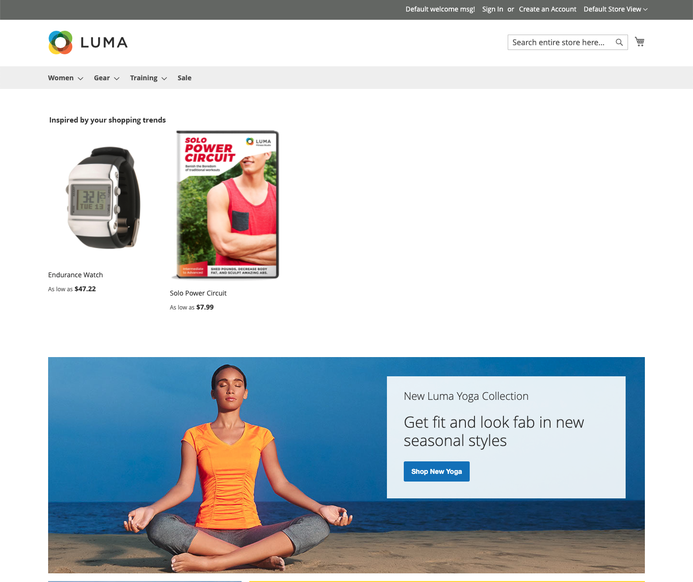

# Posizionamento ed etichette

Con così tanti tipi di consigli tra cui scegliere, quale utilizzare in ogni pagina? Se non si è sicuri della posizione da cui iniziare, provare a eseguire le operazioni seguenti:

| Pagina | Tipo di consiglio |
|---|---|
| Home page | `Recommended for you` |
| Pagina prodotto | `Viewed this, viewed that` |
| Carrello | `Bought this, bought that` |

Puoi tenere traccia delle [metriche](workspace.md) e apportare le modifiche necessarie. Ricordate che la sperimentazione è fondamentale.

Alcune pagine di vetrina limitano la posizione in cui è possibile inserire i consigli. Puoi posizionare i consigli in una delle seguenti posizioni di pagina. Per ulteriori informazioni, consulta la tabella seguente.

- Nella parte superiore del contenuto principale - I consigli vengono visualizzati sopra l’area del contenuto principale, appena sotto la barra di navigazione superiore.
- Nella parte inferiore del contenuto principale (impostazione predefinita): i consigli vengono visualizzati sotto l&#39;area del contenuto principale e prima di qualsiasi altro blocco di contenuto nella pagina, ad esempio _Prodotti correlati_.

_Consiglio nella parte superiore della home page_

## Etichette per consigli

L’etichetta assegnata a un consiglio nella vetrina influisce sul modo in cui i consumatori ne interpretano la rilevanza per gli stessi. Le seguenti etichette vengono spesso utilizzate per ogni tipo di consiglio.

_Consiglio all&#39;inizio dei risultati di ricerca_

| Tipo di consiglio | Etichette consigliate |
|---|---|
| Più visualizzati  Più aggiunti al carrello Più acquistati Conversione (da visualizzare al carrello) Conversione (da visualizzare all&#39;acquisto) | Articoli più popolari Popolari Di tendenza Popolari al momento Recentemente popolari Articoli popolari ispirati a questo elemento (PDP) Più venduti Potresti essere interessato a |
| Consigliato per te | Solo per te Consigliato per te Ispirato dalle tue tendenze di acquisto |
| Ha Visualizzato Questo, Ha Visualizzato Quello | Hanno visto anche i clienti che hanno visto questo oggetto Hanno visto anche i clienti Articoli correlati |
| Ha visualizzato questo, ha acquistato quello | I clienti che hanno visto questo hanno acquistato I clienti hanno acquistato Cosa comprano gli altri dopo aver visto questo oggetto? |
| Ho Comprato Questo E Quello | Ottieni tutto il necessario Non dimenticare questi Comprati di frequente insieme |
| Altri argomenti correlati | Altri elementi come questo simili a questo |
| Generico | Ti potrebbe piacere Agli acquirenti piace anche Opzioni simili Elementi correlati |
| Di tendenza | Di tendenza Di tendenza Di recente Elementi di tendenza Prodotti correlati di tendenza (PDP) |
| Visualizzato di recente | Visualizzato di recente Dai un&#39;altra occhiata |

## Consigli supportati per pagina

Nella tabella seguente sono elencate le pagine iniziali in cui è possibile inserire i consigli e i tipi di consigli consentiti in ogni pagina.

| Pagina | Consigli di posizionamento |
|---|---|
| Home page | Nella parte superiore del contenuto principale Nella parte inferiore del contenuto principale (impostazione predefinita) | Più visualizzati Più acquistati Più aggiunti al carrello Consigliati Di tendenza |
| Categoria | Nella parte superiore del contenuto principale Nella parte inferiore del contenuto principale (impostazione predefinita) | Più visualizzati Più acquistati Più aggiunti al carrello Consigliati Di tendenza |
| Dettagli prodotto | Nella parte inferiore del contenuto principale (impostazione predefinita) | Più visualizzati Più acquistati Più aggiunti al carrello Ha visualizzato questo, ha visualizzato questo Ha visualizzato questo, ha acquistato quello Ha acquistato questo, ha acquistato quello Altri elementi simili a questo Di tendenza Somiglianza visiva |
| Carrello | Nella parte inferiore del contenuto principale (impostazione predefinita) | Più visualizzati Più acquistati Più aggiunti al carrello Ha visualizzato questo, ha visualizzato questo Ha visualizzato questo, ha acquistato quello Ha acquistato questo, ha acquistato quello Altri argomenti simili Di tendenza |
| Conferma | Nella parte inferiore del contenuto principale (impostazione predefinita) | Più visualizzati Più acquistati Più aggiunti al carrello Ha visualizzato questo, ha visualizzato questo Ha visualizzato questo, ha acquistato quello Ha acquistato questo, ha acquistato quello Altri argomenti simili Di tendenza |
| Page Builder | [Trascina](https://experienceleague.adobe.com/docs/commerce-admin/page-builder/add-content/recommendations.html) per posizionare il tipo di contenuto | Più visualizzati Più acquistati Più aggiunti al carrello Consigliati Di tendenza |
